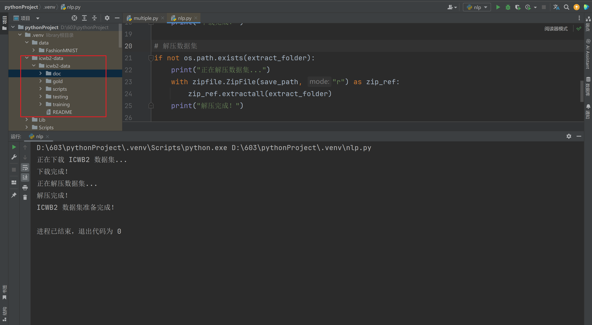

### 下载数据集

```python
import os
import zipfile
import requests

# ICWB2 数据集下载地址
url = "http://sighan.cs.uchicago.edu/bakeoff2005/data/icwb2-data.zip"
save_path = "icwb2-data.zip"
extract_folder = "icwb2-data"

# 下载数据集
if not os.path.exists(save_path):
    print("正在下载 ICWB2 数据集...")
    response = requests.get(url, stream=True)
    with open(save_path, "wb") as f:
        for chunk in response.iter_content(chunk_size=1024):
            if chunk:
                f.write(chunk)
    print("下载完成！")

# 解压数据集
if not os.path.exists(extract_folder):
    print("正在解压数据集...")
    with zipfile.ZipFile(save_path, "r") as zip_ref:
        zip_ref.extractall(extract_folder)
    print("解压完成！")

print("ICWB2 数据集准备完成！")
```

目录下出现了完整的 icwb 数据集：




### 下载 lac 完成中文分词任务

```python
import os
from paddlenlp import Taskflow

# ✅ 1. 确定数据集路径
dataset_path = "icwb2-data/icwb2-data/training/pku_training.utf8"

# ✅ 2. 确保文件存在
if not os.path.exists(dataset_path):
    print("❌ 数据集未找到，请检查路径！")
    exit()

# ✅ 3. 读取数据集
with open(dataset_path, "r", encoding="utf-8") as f:
    lines = f.readlines()

# 取前 5 行数据进行测试
sample_texts = [line.strip().replace(" ", "") for line in lines[:5]]  # 去掉原始空格

# ✅ 4. 使用 PaddleNLP 的 LAC 进行分词
lac = Taskflow("lexical_analysis")

print("\n✅ PaddleNLP（LAC）分词结果：")
segmented_results = []
for text in sample_texts:
    segmented_text = lac(text)  # 进行分词
    words = [item[0] for item in segmented_text]  # 取出分词结果
    segmented_results.append(words)

    print("原文:", text)
    print("分词结果:", "/ ".join(words))
    print("-" * 50)

# ✅ 5. 保存分词结果到文件
output_file = "icwb2_segmented.txt"
with open(output_file, "w", encoding="utf-8") as f:
    for words in segmented_results:
        f.write("/ ".join(words) + "\n")

print("\n✅ 分词结果已保存到:", output_file)
```

