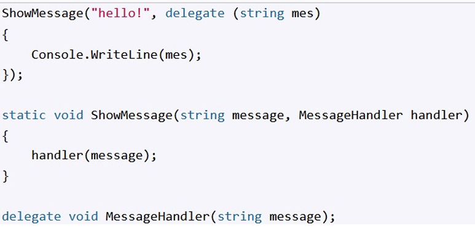

## 1. 匿名方法

- 匿名方法与委托密切相关。 
- 匿名方法用于创建委托的副本 
- 匿名方法不能独立存在 
- 匿名方法的定义以委托关键字开始：

```c#
MessageHandler handler = delegate(string mes)
{
    Console.WriteLine(mes)
}
handler("hello Sherry!")
delegate void MessageHandler(string message)
```


匿名方法的另一个例子是将委托所代表的参数作为参数进行转移



匿名方法 -如果匿名方法使用参数，这些参数必须与委托的参数相匹配。如果匿名方法不需要参数，则带参数的括号会降低：

```c#
 MessageHandler handler = delegate 
 {
      Console.WriteLine("Anonymous method");
 };
 handler("hello world!"); // Anonymous method
 delegate void MessageHandler(string message);
```

与传统方法一样，匿名也可以返回结果：

```c#
Operation operation = delegate(int x, int y)
{
    return x + y;
}
int result = operation(4,5);
Console.WriteLine(result);
delegate int Operation(int x,int y)
```

匿名方法可以访问外部定义的所有变量。

```c#
int z = 8;
Operation operation = delegate(int x, int y)
{
    return x + y + z;
}
int result = operation(4,5);
Console.WriteLine(result);
delegate int Operation(int x,int y)
```


下面这个代码详细展现了使用命名方法调用委托和使用匿名方法调用委托：

```c#
using System;

delegate void NumberChanger(int n);
namespace DelegateAppl
{
    class TestDelegate
    {
        static int num = 10;
        public static void AddNum(int p)
        {
            num += p;
            Console.WriteLine("Named Method: {0}", num);
        }

        public static void MultNum(int q)
        {
            num *= q;
            Console.WriteLine("Named Method: {0}", num);
        }

        static void Main(string[] args)
        {
            // 使用匿名方法创建委托实例
            NumberChanger nc = delegate(int x)
            {
               Console.WriteLine("Anonymous Method: {0}", x);
            };
            
            // 使用匿名方法调用委托
            nc(10);

            // 使用命名方法实例化委托
            nc =  new NumberChanger(AddNum);
            
            // 使用命名方法调用委托
            nc(5);

            // 使用另一个命名方法实例化委托
            nc =  new NumberChanger(MultNum);
            
            // 使用命名方法调用委托
            nc(2);
            Console.ReadKey();
        }
    }
}
```


## 2. Lamda

### 2.1 Lambda 表达式

- Lambda 表达式代表匿名方法的简化记录 
- Lambda 表达式允许创建简洁的简洁方法，这些方法可以返回一些值，并可以作为参数传递给其他方法 
- 要创建一个 lambda 表达式，你需要在 lambda 运算符 => 的左侧指定输入参数（如果有的话），并将表达式或语句块放在另一侧：

```c#
(list_parameters) => expression
```

```c#
Message hello = () => Console.WriteLine("Hello");
 hello();       // Hello
 delegate void Message();
```

### 2.2 参数

#### 2.2.1 参数类型

不需要定义类型：

```c#
 Operation sum = (x, y) => Console.WriteLine($"{x} + {y} = {x + y}");
 sum(22, 14);    // 22 + 14 = 36
 delegate void Operation(int x, int y);
```

**在隐式类型 var 的情况下：**

```c#
var sum = (x, y) => Console.WriteLine($"{x} + {y} = {x + y}");   //Error!
 sum(22, 14);    // 22 + 14 = 36
 delegate void Operation(int x, int y);
```

要明确规定类型：

```c#
var sum = (int x, int y)=>Console.WriteLine($"{x}+{y}={x+y}");
sum(22,14);
delegate void Operation(int x, int y);
```

#### 2.2.2 参数个数和设置默认参数

当 Lambda 是唯一参数时，省略括号：

```c#
printHandler print = message=>Console.WriteLine(message);
print("Hello")
print("sherry")
delegate void printHandler(string message)
```

我们也可以设置一个默认参数值：

```c#
var welcome = (string message = "hello") => Console.WriteLine(message);
welcome("hello world"); // hello world printed 
welcome();              // hello printed
```

#### 2.2.3 Lambda 参数返回

Lambda 表达式可返回结果 -返回的结果可在 lambda 操作符后指定：

```c#
var sum = (int x, int y) => x + y;
int result1 = sum(4, 5);
Console.WriteLine(result1);

Operation muliple = (x , y)=> x * y;
int result2 = muliple(4, 5);
Console.WriteLine(result2);

delegate int Operation(int x, int y);
```

-当 Lambda 有多个表达式或 {} 内有一个表达式时，使用运算符 return：

```c#
var substract = (int x, int y) =>
{
    if (x > y) return x - y;
    else return y - x;
};
int result1 = substract(7, 3);
int result2 = substract(-16, 4);
Console.WriteLine(result1); 
Console.WriteLine(result2);
```


### 2.3 action adding & removing

Lambda 代表一个委托，因此功能与添加/删除操作相同：

```c#
 varhello = () => Console.WriteLine("the CUC");
 varmessage = () => Console.Write("Hello ");
 message += () => Console.WriteLine("World"); //add anonymous 
//lambda expression
 message += hello;   // add lambda expression fromhello
 message += Print;   // add method
 message?.Invoke();// if nothing more to add /remove
```

Lambda代表一个委托，所以参数传递是一致的

```c#
 intSum(int[] numbers, IsEqualfunc) {
 intresult = 0;
 foreach(intiin numbers)     {
 if (func(i))
 result += i;
 }
 return result;
 }
 delegate bool IsEqual(int x);
```

•方法的返回类型是委托
•Lambda表达式对应于该委托：

```c#
Operation SelectOperation(OperationType opType)
{
    switch(opType)
    {
        case OperationType.Add: return(x,y)=> x + y;
        case OperationType.subtract: return(x,y)=> x - y;
        default:return (x, y) => x * y;

    }

        
}
enum OperationType
{
    Add, subtract,multiple
}
delegate int Operation (int x, int y);
```

