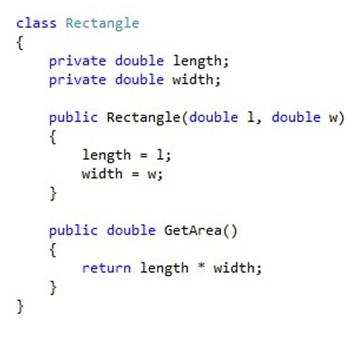

## 1. enum

### 1.1 基本情况介绍

ENUM 是一种 C# 类型，只有一组特定的可能值。这些类型被称为 "枚举类型

创建一个枚举类型：

 默认情况下，枚举中每个元素的基本类型都是 int：

```C#
enum Days
{
    Monday,Tuesday,Wednesday,Thursday,Friday,Satueday,Sunday
}
```

 To specify another integral numeric type -use a colon

指定另一种整数类型 - 使用冒号.

```C#
enum time:byte
{
    morning, afternoon, evening, night
}
```

• Each element allocated a number, starting with “0” 

- 每个元素分配一个数字，从 "0 "开始

    

每当您需要保存的东西只能取有限的可能值或状态时，我们就可以应用枚举。

### 1.2 怎么调用enum里的值？

```C#
Days openday;//Days是变量openday的类型
openday = Days.Monday;//给openday赋上了Days里的值
```


## 2. Structure

• Structure is a **value type** comprising a collection of  C# variables which you want to treat as a single  entity 

• Often we will want to hold a collection of different  things about a particular item.

- 结构是一种**值类型**，由 C# 变量集合组成，您希望将其视为一个单独的实体

- 通常，我们要保存一个特定项目的不同内容的集合。


### 2.1 Creating a Structure

```c#
struct Account
{
    public AccountState State;
    public string Name;
    public string Address;
    public int AccountNumber;
    public int Balance;
    public int Overdraft;
}
```

这就定义了一个包含所有必要客户信息的结构--账户。

结构体还可以包含构造函数、常量、字段、方法、属性、索引器、运算符、事件和嵌套类型，但如果需要所有这些，请考虑将您的类型变成一个类.

结构体和枚举类型在类外声明

结构体一旦创建，其使用方法与 int or float 相同。

```c#
Account RobsAccount;
RobsAccount.State = AccountState.Active;
RobsAccount.Name = "Rob Miles";
RobAccount.Address = "His House"
RobAccount.AccountNumber = 1234;
RobAccount.Balance = 0;
RobAccount.Overdraft = -1000;
Console.WriteLine("Name is:" + RobAccount.Name)
```


### 2.2 Initial Values in structure

 -When a structure is created as a local variable (i.e.  in a block) the values in it are undefined!

–if you try to use them in your program you will get a  compilation error SO...

–...make sure that you always put a value into a variable  before you try to get something out of it !!!

-当结构体作为局部变量创建时（即在程序块中），其中的值是未定义的！

-如果你试图在程序中使用它们，就会出现编译错误，所以...

-......确保总是先向变量中注入一个值，然后再尝试从变量中取出一些东西！-.....！


### 2.3 Using Structure Types in Method Calls 

 A method can have parameters of structure type: 

```c#
public void PrintAccount(Account a)
{
    Console.WriteLine("name:" + a.Name);
}
```

这种方法可以快速打印出账户变量的内容：

```c#
PrintAccount(RobsAccount)
```


### 2.4 Array（数组） of structs and constructor method

• It is acceptable to use an array of struct 

**• Struct could be declared inside the class and inside  the namespace BUT not inside a method** 

• Struct could have a constructor to initialise the  values

- 使用结构数组是可以接受的

- 结构体可以在类和命名空间内声明，但不能在方法内声明

- 结构体可以有一个构造函数来初始化值


### 2.5 使用类型进行设计

• State value to the Account structure makes it easy  for the program to keep track of the particular state  of an account 

•What we have done is created a type which can  hold a number of values (our AccountState  enumerated type) and put it into another type we  have designed which is to hold information about a  bank Account holder. 

--账户结构的状态值可以让程序轻松跟踪账户的特定状态

--我们所做的就是创建一个可以保存多个值的类型（我们的账户状态枚举类型），并将其放入我们设计的另一个类型中，该类型用于保存银行账户持有人的信息。


### 2.6 Objects and Structures

• Structures are useful, but we would like to be able  to solve other problems when we write large  programs :

   –to make sure that a given item in our program cannot be  placed into an invalid state

   –to be able to break a large system down into distinct and  separate components which can be developed  independently and interchanged with others

   –to make sure that the effort involved with making new  types, e.g.  a bank account  is reasonable 

• Consider programs from the point of view of object  based design

- 结构是有用的，但我们希望在编写大型程序时还能解决其他问题：

   -确保程序中的某个项目不会进入无效状态

   -能够将一个大型系统分解成不同的独立组件，这些组件可以独立开发，也可以与其他组件互换

   -确保制作新类型（如银行账户）所需的工作量是合理的

- 从基于对象的设计角度考虑程序

• The following points are important :

​    –Objects don’t add any new behaviours to our programs  we know just about everything we need to know to write  programs      when we have learnt about statements, loops,  conditions and arrays. 

​    –Objects are best regarded as a solution to the problem of  design. They let us talk about systems in general terms.  

•We  “...can write just about every program that has  ever been written just by using the technologies  that we have so far looked at... objects allow us to  work in a much nicer way...”  or ??  

- 以下几点非常重要

    -当我们学习了语句、循环、条件和数组后，我们就知道了编写程序所需的一切。

    -对象最好被视为设计问题的解决方案。通过对象，我们可以笼统地谈论系统。  

- 我们"......只需使用我们迄今为止所了解的技术，就可以编写出几乎所有的程序......对象让我们可以以一种更好的方式工作...... "或  

• C# objects and structures have a lot in common.  They can both hold data and contain methods 

• However, there is a crucial difference in between:

–Structures are managed in terms of value 

–Objects are managed in terms of reference.  

• Variables of reference types store references to  their data (objects), while variables of value types  directly contain their data

- C# 对象和结构有很多共同点。  它们都可以保存数据并包含方法

- 但是，它们之间有一个重要的区别：

-结构以值为单位进行管理

-对象是按引用管理的。  

- 引用类型的变量存储其数据（对象）的引用，而值类型的变量直接包含其数据


## 3. Class



### 3.1 Constructors

• Constructors are special class methods that are executed when a new  instance of a class is created 

• Constructors are used to initialize the data members of the object.  

• Constructors must have exactly the same name as the class and they  do not have a return type 

• Multiple constructors, each with a unique signature, can be defined for a  class

- 构造函数是创建类的新实例时执行的特殊类方法。

- 构造函数用于初始化对象的数据成员。  

- 构造函数的名称必须与类完全相同，并且没有返回类型

- 一个类可以定义多个构造函数，每个构造函数都有独特的签名

```c#
using System;
namespace Program
{
    class Rectangle
    {
        private double length;
        private double width;
        public Rectangle(double l,double w)
        {
            length = l;
            width = w;
        }
    }
}
```

> 这里的Rectangle函数就是Rectangle类的构造函数


### 3.2 Creating and Using an Instance of a Class

• Objects need a template that defines how they should be built 

• All objects created from the same template look and behave in a similar  way

- 对象需要一个模板来定义它们的创建方式
- 根据同一模板创建的所有对象的外观和行为都相似


**类的实例化**：

```c#
    class Program
    {
        static void Main(string[] args)
        {
            Rectangle rect = new Rectangle(10.0, 20.0);//类的实例化
            double area = rect.GetArea();
            Console.WriteLine(area);
        }
    }
```


#### 3.1 3.2 3.3 出现的整个代码：

```c#
using System;
namespace Program
{
    class Rectangle
    {
        private double length;
        private double width;
        public Rectangle(double l, double w)
        {
            length = l;
            width = w;
        }
        public double GetArea()
        { 
            return length* width;
        }
    }
    class Program
    {
        static void Main(string[] args)
        {
            Rectangle rect = new Rectangle(10.0, 20.0);
            double area = rect.GetArea();
            Console.WriteLine(area);
        }
    }
}
```


### 3.3 Reference 引用

如果我们想使用对象，就必须使用引用

当你持有一个引用时，你持有的不是一个实例：--你持有的是一个绑在实例上的标签（想象一下一个带有旅客标签的行李箱）

 **Multiple References to an Instance** 

1. What would the second call of WriteLine print out? 


2. We need to consider what happens if an object has  no references to it: 


### 3.4 Encapsulation

对象内部的成员保护 - 如果要使对象有用，我们就必须有办法保护其中的数据。 
- 理想的情况是，当有人试图更改我的对象中的某个值时，我可以进行控制，如果我不喜欢，可以停止更改。 
- 这就是所谓的封装。 
- 我们希望所有重要的数据都隐藏在对象中，这样我们就能完全控制对这些数据的操作（而不是某个不应该控制的人）

