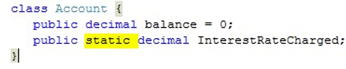
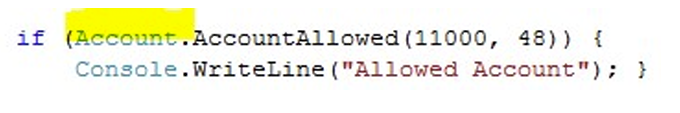

## 1. public Methods  

• This means that code running outside the class  can make calls to that method 

• This has got to be the case, since we want people  to interact with our objects by calling methods in  them.  

• In general the rules are: 

–if it is a data member (i.e. it holds data) of the class,  make it private 

–if it is a method member (i.e. it does something) make it  public 

- 这意味着在类外运行的代码可以调用该方法

- 情况必须如此，因为我们希望人们通过调用对象中的方法来与我们的对象交互。  

- 一般来说，规则如下

-如果它是类的数据成员（即保存数据），则将其私有化

-如果是方法成员（即执行某些操作），则将其设置为公共成员


## 2.  Static Items  

• All the members that we have created in our class  Account have been part of an instance of the class 

• One can create members which are held as part of  the class, i.e. they exist outside of any particular  instance 

• The static keyword lets us create members which  are not held in an instance, but in the class itself

- 我们在类账户中创建的所有成员都是类实例的一部分

- 我们可以创建作为类的一部分的成员，即它们存在于任何特定实例之外。

- 通过 static 关键字，我们可以创建不存在于实例中，而是存在于类本身的成员

### 2.1 Static vs const

• Note that we have made the data member of the  class static, so that it is part of the class and not an  instance of the class.  

• One common programming mistake is to confuse  static with const

–Marking a variable as const means ―the value cannot  be changed

–Marking a variable with static means ―the variable is  part of the class and is always present 

- 请注意，我们将该类的数据成员设置为静态，因此它是该类的一部分，而不是该类的实例。  

- 一个常见的编程错误是混淆 static 和 const

-将变量标记为 const 意味着 - 变量值不可更改

-将变量标记为 static 意味着 - 变量是类的一部分，始终存在

### 2.2 共享Main函数

- AccountTest class 有一个名为 Main() 的静态成员方法 
- 如果我们创建 50 个 AccountTest 实例，它们都将共享相同的 Main() 方法 
- 在 C# 中，关键字 static 将成员标记为类的一部分，而不是类实例的一部分。


•We don't have to make an instance of the  AccountTest class to be able to use the Main()  method 

• Keyword static doesn’t mean “cannot be changed” 

• Members of a class which have been made static can be used just like any other member of a class • Either a data member or a method can be made  static

-我们不必创建 AccountTest 类的实例就能使用 Main() 方法

- 关键字 static 并不意味着 "不能更改"。

- 静态化后的类成员可以像其他成员一样使用 - 数据成员或方法都可以被静态化

### 2.3 Using a static data member of a class 

下面这个关于银行利率的代码：

• The interest rate is held for all the accounts.  • If the interest rate charged it must be charged for all  accounts. 

- 所有账户都有利率。  - 如果收取利率，则必须对所有账户收取。


我们可以这么解决这个问题：




现在，这个利率是类的成员而不是实例的成员。我们要通过调用类的方法调用它。


### 2.4 Using a static method in a class

什么情况下用Static Method？？

Example：

我们可以根据某人的年龄和收入来决定是否允许其拥有银行账户。


 这时我们要有了一个实例（账户）后才能调用该方法。但是我们不想这样。我们想调用这个实例并被允许后，才能激活满足条件的实例（账户）。

> •We can't call the method until we have an Account  instance. •We can solve this by making the method static


现在这个方法是类的一部分，不属于任何实例；



### 2.5 Using member data in static methods 

```c#
using System;
namespace Program
{
    class Account
    {
        private decimal myaccount;
        private int myage;
        public static bool AccountAllow(decimal income,int age)
        {
            if (income >= 10000 && age > 18)
            {
                return true;
            }
            else
                return false;
        }
    }   
}
```

这也就是说，在创建新实例之前，要经过AccountAllow的“考验”。我们称之为“构造函数”。


## 3. Construction of Objects

**什么时候用构造方法？**

当创建一个类的实例时，C# 系统会调用该类的构造方法。

**构造方法的作用是什么？**

构造方法是类的一个成员，它可以让程序员**控制和设置新对象的内容**

**如果没有已定义的构造函数？**

编译器会为我们创建一个默认构造函数并使用它。

### 3.1  Default Constructor 

• A constructor method has the same name as the  class, but it does not return anything:  

• Default constructor is public so that it can be  accessed from external classes who might want to  make instances of the class.  

• It accepts NO parameters. 

- 构造方法与类的名称相同，但不返回任何内容：

- 默认构造函数是公开的，这样外部类就可以访问该构造函数，从而创建该类的实例。  

- 它不接受任何参数。

像这样：

```c#
class Account
{
    public Account()
    {
    }
}
```


### 3.2  Defined constructor 已定义的构造函数

```c#
class Account
{
    private string name;
    private string address;
    private decimal balance;
    public Account(string inname,string inaddress, decimal balance)
    {
        name = inname;
        address = inaddress;
        balance = inbalance;
    }
}
```

只有当程序员没有提供构造函数时，编译器才会提供默认构造函数。


## 4.  Overloading Constructors 

**"A method has the same name as another, but has a  different set of parameters**"

 **Overloading a method name**

我们可以重载类中的任何方法名称。如果您有一个特定的操作可以由多个不同的数据项驱动，例如设置交易日期的多种方法，这将非常有用：


## 5.  access modifiers

–public: type or member can be accessed by any other  code in the same assembly or another assembly that  references it

–private: type or member can be accessed only by code  in the same class or struct

–protected : type or member can be accessed only by  code in the same class or struct, or in a class that is  derived from that class

– private protected: type or member can be accessed by  types derived from the class that are declared within its  containing assembly. 类型或成员可被包含在类的程序集中声明的类派生类型访问。（同程序集）

– internal : type or member can be accessed by any code  in the same assembly, but not from another只能从同一个程序包访问。

– protected internal : type or member can be accessed  by any code in the assembly in which it is declared, or  from within a derived class in another assembly 可被访问该程序包或者别的程序包的派生类访问


