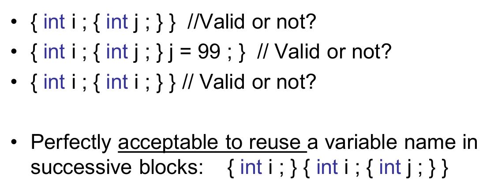

## 1.**What is Method?**

We have already met them:

–Main(), WriteLine() and Read()

–Main is the method we write which is where our program  starts

–WriteLine and ReadLine were provided by C# to give us  a way of displaying text and reading information from a  user


**Method including:**

–the access level such as public or private 访问级别

–optional modifiers such as abstract or sealed 

–the return value

–the name of the method, and any method  parameters 


**怎么样创建一个方法**

• Calling a method on an object is like accessing a  field  调用对象的方法就像访问字段一样

• After the object name, add a period, the name of  the method, and parentheses 

• Arguments are listed within the parentheses, and  are separated by commas 参数列在括号内，用逗号隔开

Example:

```C#
using System;

class Program
{
    static void doit()
    {
        Console.WriteLine("I'm Sherry");
    }
    static void Main()
    {
        doit();
    }
}
```

• Essentially you take a block of code and give it a  name.  给这个代码块一个名字

• Then you can refer to this block of code to do  something every time you need it done! 就可以无限调用它


 **Return values**

 A method can also return a value to the caller, e.g.:– ReadLine method returns parameter from a user

```c#
using System;

class Program
{
    static int MethodDemo(int i )
    {
        i++;
        Console.WriteLine("i is " + i );
        return i;
    }
    static void Main()
    {
        int res;
        res = MethodDemo(6);
        Console.WriteLine( "res is " + res );
    }
}
//output
i is 7
res is 7
```


**异步函数？ Async methods**


 **Short notation**


## 2. Parameter

### 2.1 **Method parameters：**
Methods become more useful if we allow them to  have parameters. Parameter is a means of passing a value into a  method call. The method is given the data to work on 

```C#
using System;

class Program
{
    static void MethodDemo(int i )
    {
        Console.WriteLine("i is: " + i);
    }
    static void Main()
    {
        MethodDemo(101);
    }
}
```


### 2.2 **参数按值传递（passing parameters  By Value）**

```c#
using System;

class Program
{
    static void MethodDemo(int i )
    {
        i++;
        Console.WriteLine("i is " + i );
    }
```

The method MethodDemo adds one to the  parameter; prints the result out and then returns

```c#
    static void Main()
    {
        int test = 20;
        MethodDemo(test);
        Console.WriteLine( "test is " + test );
    }
}
```

The piece of C# up calls the method with the  variable test as the parameter. Pass by value is very safe -nothing the method  does can affect variables in the code which calls it

上面的 C# 代码调用了以变量 test 为参数的方法。按值传递非常安全--该方法的任何操作都不会影响调用它的代码中的变量

```c#
//output
i is 21
test is 20
```


### 2.3 **参数按引用传递（Passing Parameter by reference) **

• Instead of sending the value of a variable into a  method, a reference to that variable is supplied to a  calling method 

- 向调用方法提供变量的引用，而不是向方法发送变量的值

• Pass by reference, changes to the parameter  change the variable whose reference you passed 

- 通过引用传递，参数的改变会改变所传递引用的变量

• The argument passed for a reference parameter  must be a variable with a definite value, and during  execution of the method, the reference parameter  represents the same storage location as the  argument variable

- 为引用参数传递的参数必须是一个具有确定值的变量，并且在方法执行过程中，引用参数与参数变量代表相同的存储位置

### 2.4 ref 关键字

```c#
using System;

class Program
{
    static void MethodDemo( ref int i )
    {
        i++;
        Console.WriteLine("i is " + i );
    }
```

 Keyword ref has been added to the information  about the parameter.

```c#
using System;

class Program
{
    static void MethodDemo( ref int i )
    {
        i++;
        Console.WriteLine("i is " + i );
    }
    static void Main()
    {
        int test = 20;
        MethodDemo( ref test);
        Console.WriteLine( "test is " + test );
    }
}
```

• The code below makes a call to the new method,  and also has the ref in front of the parameter  

• The method call will make changes to the content  of the variable

- 下面的代码调用了新方法，并在参数前加上了 ref

- 方法调用将更改变量的内容

### 2.5 out 关键字

What if we want just the change of the variable?

–original value of the parameters is of no interest to the  method, so no need to initialise the parameter before the  call

–We just want the results


在C#中，`out`关键字与`ref`关键字类似，都用于通过方法参数传递引用。但`out`关键字有一些特殊之处：

1. **用途**：   `out`用于方法参数时，它表明这个参数将在方法内部被初始化或赋予新的值。`out`参数通常用于从方法内返回多个值。
2. . **初始化要求**：   在传递给方法之前，`ref`参数必须被初始化。而`out`参数不需要在传递之前初始化，因为方法保证会在退出前为其赋值。
3. **方法内部的要求**：   使用`out`关键字的方法有责任在方法返回之前为该参数赋值。如果方法执行路径中有任何一个没有为`out`参数赋值，代码将无法编译。
4. **调用处的要求**：   当方法调用使用`out`参数时，必须在参数前加上`out`关键字，以明确表示该参数是用`out`方式传递的。

### 2.6 in 关键字

in parameter modifier  

in keyword causes arguments to be passed by  reference • Similar to ref or out keywords, except that in  arguments cannot be modified by the called  method 

in 关键字会使参数通过引用传递 - 与 ref 或 out 关键字类似，只是 in 参数不能被调用的方法修改

• Note that:–ref arguments may be modified–out arguments must be modified by the called method,  and those modifications are observable in the calling  context.

- 需要注意的是，:-ref 参数可以被修改-out 参数必须由被调用的方法修改，而且这些修改在调用上下文中是可以观察到的。


## 3. Recursion

• Recursion occurs when a method calls itself to  solve another version of the same problem   

• With each recursive call, the problem becomes  simpler and moves toward a base case 

• The base case is reached when no other recursive  call is required 

• A base case is the point when no other recursive  calls are made

- 当一个方法调用自身来解决同一问题的另一个版本时，就会发生递归。

- 每调用一次递归，问题就会变得更简单，并向基本情况发展

- 当不再需要其他递归调用时，就达到了基例

- 当不再进行其他递归调用时，即为基例


```c#
    public int identity(int num)
    {
        if (num < 1) return 10;//base case
        else
            return num + identity(num - 2);//recursive call
    }
```


## 4.  Variables and Scope

### 4.1 For loop local variables

• A special kind of variable can be used when you  create a for loop construction.  

• This allows you to declare a control variable which  exists for the duration of the loop itself: 

- 在创建 for 循环结构时，可以使用一种特殊的变量。  
- 这样就可以声明一个控制变量，该变量在循环过程中一直存在：

### 4.2 Introduce

• Part of a program within which a variable has an  existence is called the scope of a variable.  

• Block is a number of statements which are  enclosed in curly brackets.  

• Any block can contain any number of local  variables, i.e. variables which are local to that block

• you can declare a variable at any point in the  block, but you must declare it before you use it.  

• C# programmer can create blocks inside blocks 

- 变量存在于程序中的部分称为变量的作用域。  

- 程序块（Block）是用大括号括起来的若干语句。  

- 任何代码块都可以包含任意数量的局部变量，即该代码块的局部变量。

- 您可以在代码块中的任何位置声明变量，但必须在使用前声明。  

- C# 程序员可以在代码块内部创建代码块

变量作用域：


### 4.4 Exercise



1. 有效。变量 i 和变量 j 都在它们各自的作用域内被声明，其中 j 的作用域是嵌套在 i 的作用域内部。
2. 尽管变量 j 被声明在一个内部作用域中，但是尝试在其声明作用域之外的代码块中访问它是不允许的。j = 99;这个赋值尝试在 j 的作用域外面，因此会产生编译错误。

3. 这在技术上有效的。内部的作用域声明了一个新的i，它遮蔽了外部作用域中的 i。然而，这可能会导致混淆，代码不够清晰。


### 4.5  **Variables which are Data Members of a Class**

• If we want to allow two methods in a class to share  a variable one will have to make the variable a  member of the class. 

• This means declaring it outside the methods in the  class:

作为类的数据成员的变量 - 如果我们想让类中的两个方法共享一个变量，就必须让该变量成为类的成员。  - 这意味着要在类中的方法之外声明它：


### 4.6  **Static class members**  

• Note that we have made the data member of the  class static, so that it is part of the class and not an  instance of the class.  

• One common programming mistake is to confuse  static with const

–Marking a variable as const means ―the value cannot  be changed

–Marking a variable with static means ―the variable is  part of the class and is always present 

- 请注意，我们将该类的数据成员设置为静态，因此它是该类的一部分，而不是该类的实例。  

- 一个常见的编程错误是混淆 static 和 const

-将变量标记为 const 意味着 - 变量值不可更改

-将变量标记为 static 意味着 - 变量是类的一部分，始终存在


