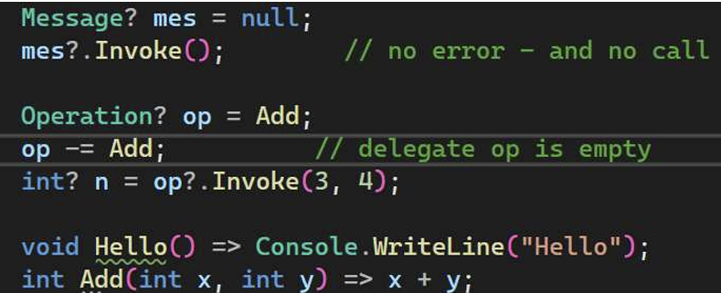
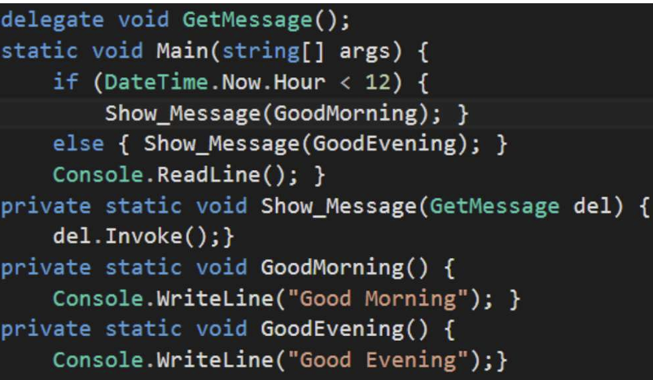
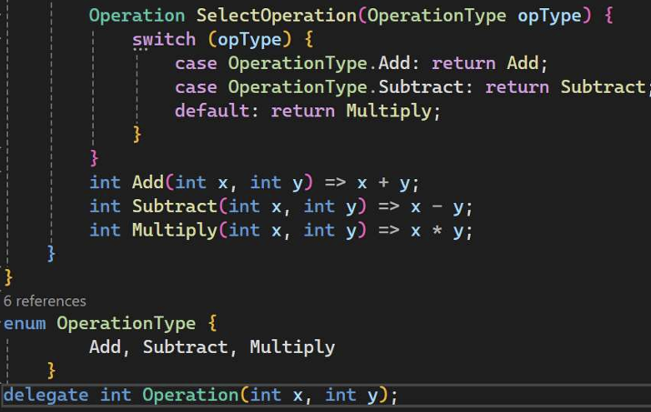

## 1. Delegate 简介

- 回调函数是程序指定并以某种方式 "注册 "的函数，然后被另一个程序调用 -
- C/C++ 我们可以通过函数指针实现回调函数 

- C# -我们可以将方法引用封装在委托中 
- 在 C# 中，委托被视为一种引用类型，与类类型类似 
- 操作符 new 用于创建委托的新实例 
- 委托是对类中方法的安全引用类型

### 1.1 使用委托 

- 委托是 C# 程序中管理事件的重要部分 
- 事件是指发生的、我们的程序可能需要响应的事情 - 例如：人们按下用户界面上的按钮、时钟滴答作响以及信息通过网络到达 
- 在每种情况下，我们都需要告诉系统在事件发生时该怎么做

### 1.2 类型安全的委托 

- 类型安全这一短语在这里的意思是，如果方法接受两个整数参数并返回一个字符串，那么该方法的委托将具有完全相同的外观，并且不能以任何其他方式使用。

- 使用这个词是为了将委托与指针之类的东西区分开来，指针在 C 语言等更原始的语言中使用。

- C/C++ - 可以创建指向方法的指针，但 C 语言环境不知道方法的真实面貌

### 1.3 声明委托 

- 在 C# 中，我们使用关键字 delegate 和封装方法的签名来声明委托 
- 一些命名约定建议使用以 "Callback "结尾的委托名称 -
- 一些书籍没有使用这些约定

```c#
public delegate void NotifyCallback(decimal balance);
```

### 1.4 使用委托（在银行示例中......） 

- 考虑 "银行 "示例中的费用计算 - 银行将有许多不同的方法来进行计算，这取决于客户的类型和客户的状态 

- 它可能希望有一种方法，可以让程序在运行时选择使用哪种费用计算方法 

    ```c#
    public delegate decimal CalculateFee(decimal balance); 
    ```

    

- 这个委托可以代替接受一个十进制参数并返回一个十进制值的方法。

### 1.5 合理使用委托 

- 让程序在运行过程中改变自己的操作是一件相当奇怪的事情 -
- 所介绍的示例演示了委托是如何让程序将方法引用作为对象来操作的，而不是一种编写程序的好方法 -
- 委托经常用于事件处理程序，也用于管理线程

### 1.6 声明位置 

- 调用委托与调用方法类似。
- -但是，委托并不一定只指向与委托变量定义在同一个类中的方法。 它也可以是其他类和结构中的方法

- -如果我们在顶层程序（默认情况下在 Program.cs 中表示）中定义了委托，那么和其他类型一样，委托也是在代码末尾（或顶层之前）定义的。

- 但原则上，委托可以在一个类中定义

### 1.7

-当你实例化一个委托时，你可以将它的实例与任何具有兼容签名和返回类型的方法关联起来 

-委托用于将方法作为参数传递给其他方法 

-委托类型是密封的-不能从它派生出来

## 2. 实现一个委托

### 2.1 代码

```c#
delegate int Operation(int x, int y);
class Progarm
{
    static void Main(string[] args)
    {
        Operation operation = Add;
        int x = operation(4, 5);
        Console.WriteLine(x);

        operation = Multiple;
        int y = operation(4, 5);
        Console.WriteLine(y);

        int Add(int x, int y) => x + y;
        int Multiple(int x, int y) => x * y;

    }
}
```

另一种方法是使用构造函数创建委托对象，并将所需的方法传递给该构造函数.

```c#
delegate int Operation(int x, int y);
class Progarm
{
    static void Main(string[] args)
    {
        Operation operation1 = Add;
        Operation operation2 = new Operation(Add);
      
        int Add(int x, int y) => x + y;
    }
}
```


### 2.2. 将方法签名与委托相匹配

- 如果方法的返回类型和参数集相同，则方法与委托相匹配 

- 请记住，ref、in 和 out 修饰符的作用与往常一样，例如：

delegate void SomeDel(inta, double b); 

Matching method: 

void SomeMethod1(intg, double n) { } 

Not matching :  

double SomeMethod2(int g, double n) { return g + n; }

void SomeMethod3(double n, int g) { } 

void SomeMethod4(ref int g, double n) { } 

void SomeMethod5(out int g, double n) { g = 6; }

### 2.3 Adding methods to a delegate

-委托可以指向具有相同签名和返回类型的多个方法 

-委托中的所有方法都属于一个特殊的列表，称为调用列表 

-当委托被调用时，该列表中的所有方法都会被依次调用。 

-我们可以在该列表中添加多个方法。

- To add methods to a delegate, use the += operation: message += HowAreYou;  

### 2.4 Removing methods from a delegate

•In a similar way, we can remove methods from the delegate using -= operations

```C#
delegate void Message();
class Program
{
    static void Main(string[] args)
    {
        Message message = Hello;
        message += HowAreYou;
        message();//call all methods from message
        message -= HowAreYou;//remove the HowAreYou
        if (message != null) message();//call Hello
        message();

        void Hello() => Console.WriteLine("Hello");
        void HowAreYou() => Console.WriteLine("HowAreYou");
    }
}
//output
Hello
HowAreYou
Hello
Hello
```

### 2.5 Combine delegates (multicast delegates)

Delegates can be combined: 

```c#
delegate void Message();
class Program
{
    static void Main(string[] args)
    {
        Message message1 = Hello;
        Message message2 = HowAreYou;
        Message message3 = message1 + message2;
        message3();
        void Hello() => Console.WriteLine("Hello");
        void HowAreYou() => Console.WriteLine("HowAreYou");
    }
}
//output
Hello
HowAreYou
```


### 2.6 Method Invoke()

Another way of calling a delegate is to use **Invoke()** :

```c#
delegate void Message();
class Program
{
    static void Main(string[] args)
    {
        Message message1 = Hello;
        Message message2 = HowAreYou;
        Message message3 = message1 + message2;
        message3.Invoke();
        void Hello() => Console.WriteLine("Hello");
        void HowAreYou() => Console.WriteLine("HowAreYou");
    }
}
//same output
```

**Method Invoke() and operator null?**



### 2.7  Generic delegates 

•Delegates, like other types, can be generic

```c#
class Program
{
    static void Main(string[] args)
    {
        Operation<decimal, int> squareOperation = Square;
        decimal result1 = squareOperation(5);
        Console.WriteLine(result1);
        Operation<int, int> doubleOperation = Double;
        int result2 = doubleOperation(5);
        Console.WriteLine(result2);

        decimal Square(int n) => n* n;
        int Double(int n) => n + n;
    }
}
delegate T Operation<T, K>(K val);//T是输入参数的类型，K是返回值类型！
```

### 2.8 异步回调

将委托作为参数 

- 由于实例化的委托是一个对象，因此可以将其作为参数传递，或分配给一个属性 
- 这允许方法接受委托作为参数（并在需要时稍后调用） 
- 这被称为异步回调： -当<长>进程完成时通知调用者的常用方法



### 2.9  Return delegates from a method

 •the return type of the method is an Operation delegate




## 3. Event

- 事件使一个类或对象能够在感兴趣的事情发生时通知其他类或对象

- The class that sends (or raises) the event is called the publisher and  the classes that receive (or handle) the event are called subscribers

•事件具有以下属性：
•发布者决定何时引发事件；订阅者确定针对事件采取的操作
•一个活动可以有多个订阅者。一个订阅者可以处理多个来自多个发布者的事件
•从不引发没有订阅者的事件
•事件通常用于指示用户操作，如按钮点击或菜单图形用户界面中的选择

### 3.1 实现代码

```c#
using System;

// 声明一个委托类型，可引用接受字符串参数并返回void的方法
public delegate void Notify(string message);

// 发布者类，负责声明并触发事件
class Publisher
{
    // 使用 Notify 委托类型声明一个事件
    public event Notify OnProcessCompleted;

    // 模拟处理过程的方法
    public void Process()
    {
        Console.WriteLine("Processing started...");

        // 模拟一些工作
        System.Threading.Thread.Sleep(1000);

        // 检查事件是否有订阅者并触发事件，将消息传递给订阅者
        OnProcessCompleted?.Invoke("Processing completed!");
    }
}

// 订阅者类，负责订阅事件并处理事件
class Subscriber
{
    // 订阅事件，将事件与处理方法关联
    public void Subscribe(Publisher pub)
    {
        pub.OnProcessCompleted += HandleProcessCompleted;
    }

    // 与 Notify 委托类型匹配的方法，当事件被触发时会调用这个方法
    void HandleProcessCompleted(string message)
    {
        Console.WriteLine(message);
    }
}

class EventExample
{
    static void Main()
    {
        // 创建发布者和订阅者对象
        Publisher pub = new Publisher();
        Subscriber sub = new Subscriber();

        // 订阅发布者的事件
        sub.Subscribe(pub);

        // 开始处理，触发事件
        pub.Process();
    }
}

```


### 3.2 以编程方式订阅事件

•定义一个事件处理程序方法，其签名与活动的代表签名：

```c#
 void HandleCustomEvent(object sender, CustomEventArgs a)  { // Do something useful here }
```


使用加法赋值运算符（+=）to attach an event handler  to the event:

```c#
 publisher.RaiseCustomEvent+= HandleCustomEvent;
```

- - 


