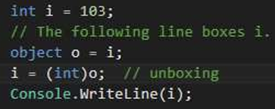
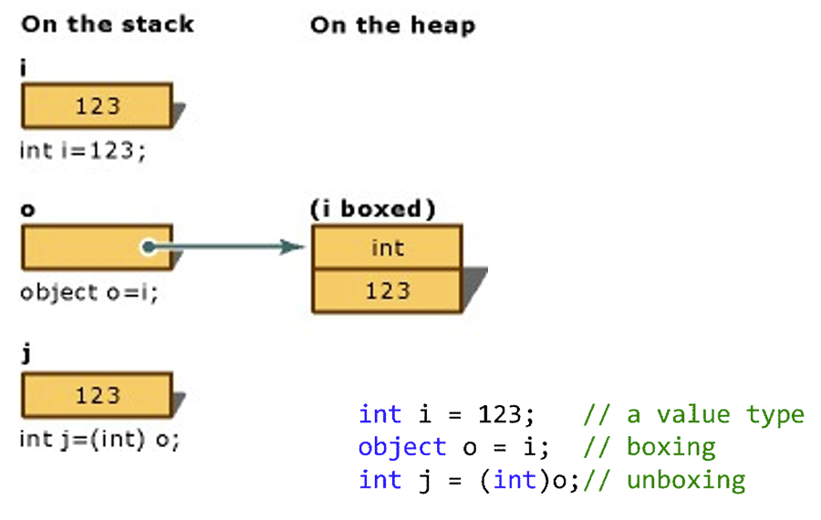
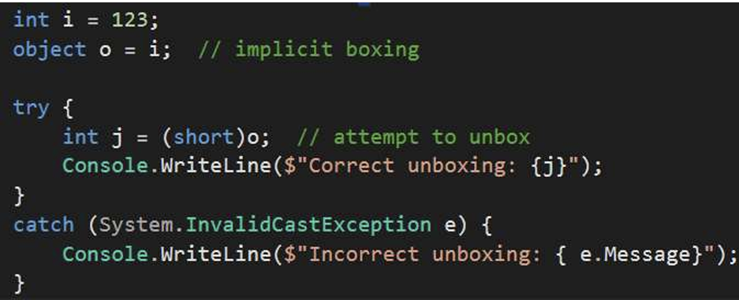
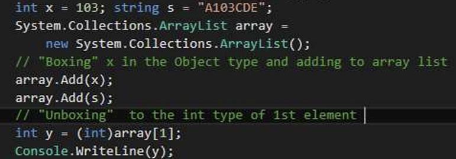
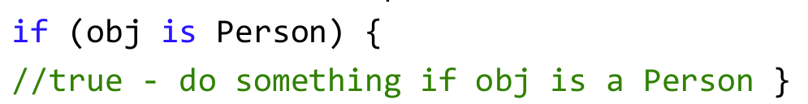
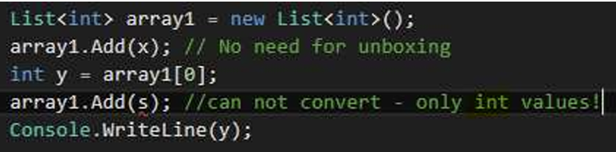
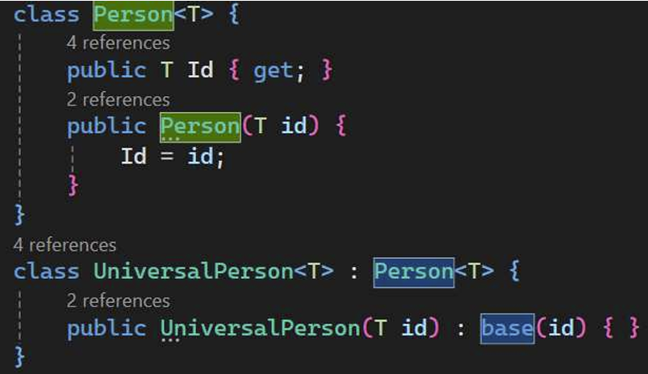

## 1.  Boxing and Unboxing

 Boxing is the process of converting a value type to the type  object. Unboxing extracts（提取） the value type from the object



 Boxing is implicit隐性的; unboxing is explicit显性的

### 1.1 Boxing

```c#
class Program
{
    static void Main(string[] args)
    {
        int i = 0;
        object o = i; // Boxing copies the value of i into object o
        i = 123;// Change the value of i
        Console.WriteLine(i);
        Console.WriteLine(o);
    }
}
//output 
123
0
```

### 1.2 Unboxing

 



？？？？



？？？？？


> boixng 相当于把值类型转换成了引用类型为了方便修改，unboxing相当于把引用类型拿出来使用。


## 2. “Is”&“As”

### 2.1 **is 在运行时评估类型兼容性。**

"is "决定对象实例或表达式的结果是否可以转换为指定类型： *expr is type。*  其中，expr 是求值为某种类型实例的表达式，type 是要将 expr 的结果转换成的类型名称。



### 2.2 as operator

as 在兼容引用(compatible reference)类型或可归零(nullable)类型之间执行某些类型的转换.as operator 就像一个转换操作。不过，**如果转换不成功，as 将返回空值，而不是引发异常**： *expression as type*.

#### 2.2.1 Nullable

可空值类型。可空类型可以表示其基础值类型的正确值范围，外加一个额外的空值：

E.g. Nullable（bool）拥有的值有True False 和null

为数字和布尔类型赋值为空的功能在处理数据库和其他包含可能无法赋值的元素的数据类型时尤其有用


## 3. 一个例子说明generics的作用

```c#
using System;
class Person
{
    public object Id { get; set; }
    public string Name { get; set; }
    public Person(object id, string name)
    {
        Id = id;
        Name = name;
    }
}
class Program
{
    static void Main(string[] args)
    {
        Person tom = new Person(546, "Tom");//boxing!!!
        Person Joh = new Person("xxy777", "John");
        int tomid = (int)tom.Id;//unboxing!!!!
        string Johid = (string)Joh.Id;
        Console.WriteLine(tomid);
        Console.WriteLine(Johid);
    }

}
```

我们注意到这里Id的类型多种多样。我们也可以用泛型解决这个问题！！


## 4. Generics

### 4.1 Use generic class Person

- 类 `Person<T>` 被声明为通用类型 - 类型 `<T>` 是将要使用的类型，可以是对象字符串，也可以是任何其他类或结构体

```c#
using System;
class Person<T>
{
    public T Id { get; set; }
    public string Name { get; set; }
    public Person(T id, string name)
    {
        Id = id;
        Name = name;
    }
}
class Program
{
    static void Main(string[] args)
    {
        Person<int> tom = new Person<int>(546, "Tom");//no boxing!!!
        Person<string> Joh = new Person<string>("xxy777", "John");
        int tomid = (int)tom.Id;//no unboxing!!!!
        string Johid = (string)Joh.Id;
        Console.WriteLine(tomid);
        Console.WriteLine(Johid);
    }

}
```

- 无装箱/拆箱，无类型安全问题

- 通用类是不变的！
- 因为没有unboxing和boxing，这样也是可以的：

```c#
using System;
class Person<T>
{
    public T Id { get; set; }
    public string Name { get; set; }
    public Person(T id, string name)
    {
        Id = id;
        Name = name;
    }
}
class Program
{
    static void Main(string[] args)
    {
        Person<int> tom = new Person<int>(546, "Tom");//no boxing!!!
        Person<string> Joh = new Person<string>("xxy777", "John");
        Console.WriteLine(tom.Id);
        Console.WriteLine(Joh.Id);
    }

}
```


### 4.2  Type can be generic type

```c#
using System;
class Person<T>
{
    public T Id { get; set; }
    public string Name { get; set; }
    public Person(T id, string name)
    {
        Id = id;
        Name = name;
    }
}
class Company<P>
{
    public P CEO { get; set; }
    public Company(P ceo) { CEO = ceo; }
}
class Program
{
    static void Main(string[] args)
    {
        Person<int> tom = new Person<int>(546, "Tom");//boxing!!!
        Company<Person<int>> microsoft= new Company<Person<int>>(tom);
        Console.WriteLine(microsoft.CEO.Id);
        Console.WriteLine(microsoft.CEO.Name);//CEO别忘记写
    }

}
```


### 4.3  Generics and Collections 

 The most common use of generics is to create  collection classes.

- 泛型的概念是指定一种通用操作，然后以适合每种操作的方式将其应用于不同的上下文中--例如：--我们知道，创建数组时，程序员必须准确指定它包含多少个元素--如果我们的数组大小为 10000，并试图添加 10001 个客户....-
- 我们可以声明一个 "oversized "数组，或者...使用泛型。



集合类型为 "int"--添加任何非 "int "类型的内容都会产生错误（例如，添加字符串 s）--不会浪费装箱时间，并保证了类型安全.

#### 4.3.1 在数组中的应用

```c#
class Bank<T>
{
    public T[] client;
    public Bank(T[] _client)
    {
        client = _client;
    }
}
class Program
{
    static void Main(string[] args)
    {
        Bank<int> bank1 = new Bank<int>(new int[] { 1, 2, 3, 4, 5, 6, 7, 8, });
        Bank<string> bank2 = new Bank<string>(new string[] { "Mary", "Jay" });
    }
}
```

怎么打印这两数组????


### 4.4 泛型 - 优点

- 使用泛型可以最大限度地提高代码重用性、类型安全性和性能 
- 泛型最常见的用途是创建集合类 \
- 我们可以创建自己的泛型接口、类、方法、事件和委托 
-  要设置默认值（引用类型为空，值类型为 0），请使用运算符 default(T)

```c#
class Person<T>
{
    T id = default(T);
}
```

默认值是干什么用的？？


### 4.5 Generic classes inheritance 

• One generic class can inherit from another



