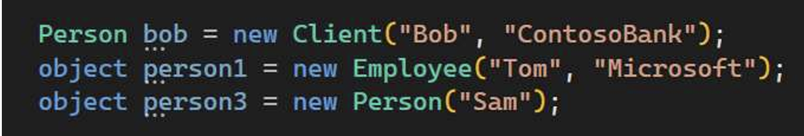
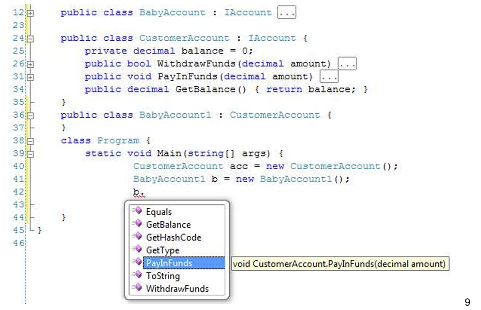
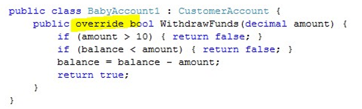
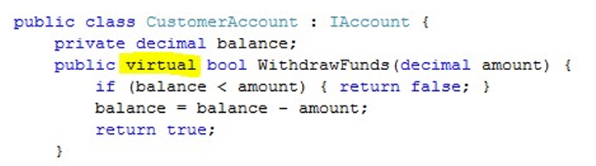
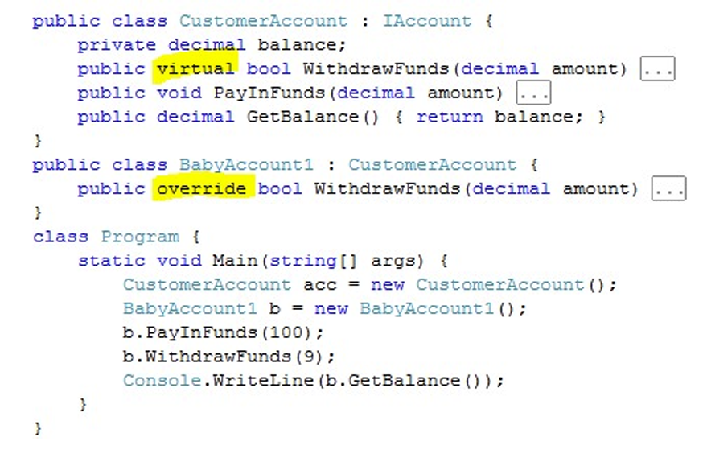
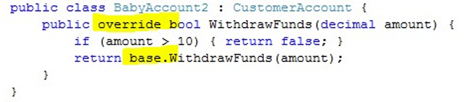
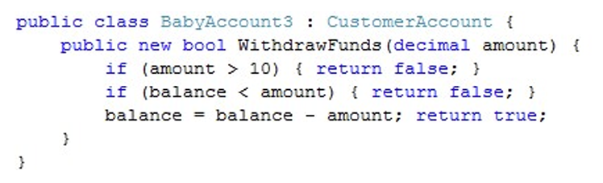
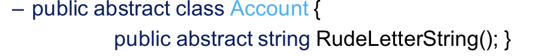
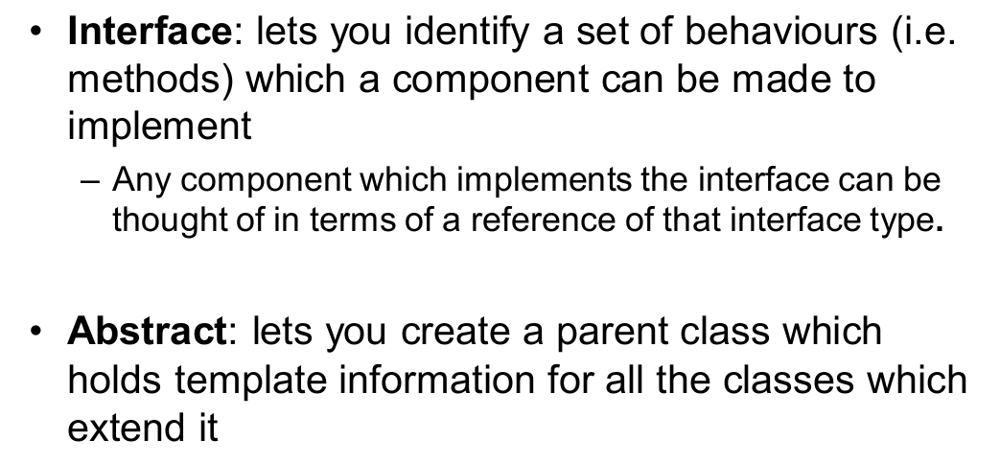

• Inheritance is a way that we can re-use behaviours  from classes and just modify the bits we need to  make new ones 

• Inheritance lets a class pick up behaviours from the  class which is its parent

## 1. 继承的实现代码:

```c#
using System;
class Person
{
    public string Name { get; set; }
    public Person(string name)
    {
        Name = name; 
    }
    public virtual void printname()
    {
        Console.WriteLine(Name);
    }
}
class Employee : Person
{
    public int Id { get; set; }
    public Employee(string name, int employeeId):base(name)
    {
        Id = employeeId;
    }
    public override void printname()
    {
        base.printname();
        Console.WriteLine(Id);
    }
}
class Program
{
    static void Main(string[] args)
    {
        Person person = new Person("John");
        person.printname();
        Employee employee = new Employee("John",12345);
        employee.printname();
    }
}
```


### 1.1 **Object type “Employee” “IS-A” “Person” as well:**

```c#
Person person = new Employee 
```

可以这样记：左边是父右边子。

**这里再引入一个概念：Object -> Person -> Employee/Client**

可以看出，Object是一切的基类。所以下面这样是可以的。（左Object右Person）




### 1.2 **access modifiers between base class and derived class:**

基类的访问修饰符，派生类必须具有相同或更强的访问修饰符：

–E.g. internal for base class 

–derived internal or private

–Different assemblies ,public


## 2. 子类扩展父类代码




### 2.1 通过重载方法 （override & virtual）

关键字 override 表示 "优先使用该版本的方法，而不是父版本的方法"。



为了使重载正常工作，我们必须更改 CustomerAccount 类中方法的声明（如上幻灯片所示）



关键字 virtual 的意思是"我们可能想在一个子类中创建该方法的另一个版本"。  我不一定要重载这个方法，但如果你没有声明 virtual，我肯定不能重载。


## 3.  Protection of data in class hierarchies （protect关键字）



这肯定行不通。balance是private的，意味着这个类的子类不能访问balance。

为了解决这个问题，C# 提供了一种限制性稍弱的访问级别，称为 protected，这样，扩展父类的子类就能看到该成员了。


## 4. 子类调用父类方法

### 4.1 base关键字



**用关键字base.方法名**（这时候调用的是父类的原方法）


> 为啥要调用base关键字？它解决了什么问题？
>
> –we don’t want to have to write the same code twice
>
>  – we don’t want to make the balance value visible outside  the CustomerAccountclass

最好不要这样！：



这种工作方式的问题在于无法使用基类。这使得从父类中获取行为变得更加困难。


### 4.2 sealed 关键字 

如果我们不想父类中的方法被子类重载，我们就需要使用sealed关键字


## 5. Constructors and Hierarchies

### 5.1 Constructor

A constructor is a method which gets control during  the process of object creation.

构造函数是一种在创建对象过程中获取控制权的方法。

In this situation the constructor in the child class will have to  call a particular constructor in the parent to set that up  before it is created 

在这种情况下，子类中的构造函数必须调用父类中的特定构造函数，以便在创建之前进行设置。

The keyword base is used to make a call to the parent  constructor

关键字 base 用于调用父构造函数

### 5.2 层次

When considering constructors and class  hierarchies you must therefore remember

– to create an instance of a child class an instance of the  parent must first be created.

– This means that a constructor in the parent must run  before the constructor in the child.

因此，在考虑构造函数和类的层次结构时，必须记住

- 要创建子类的实例，必须先创建父类的实例。

- 这意味着父类中的构造函数必须先于子类中的构造函数运行。

Example:

首先是父类：

```c#
using System;
class Person
{
    string Name;
    int Age;
    public Person(string name)
    {
        Name = name;
        Console.WriteLine(Name);
    }
    public Person(string name, int age): this(name)
    {
        Age = age;
        Console.WriteLine(Age);
    }
}
```

子类也有构造函数，在父类构造函数被调用之后：

```c#
class Employee:Person
{
    public int Id;
    public Employee(string name,int age, int id):base(name)
    {
        Id = id;
        Console.WriteLine(Id);
    }
}
```


## 6. Abstract methods and classes

C# 提供了一种将方法标记为抽象方法的方法。这意味着该方法的主体不在该类中提供，而将在子类中提供：




只要这个方法包含了抽象函数，这方法就是抽象类哦。抽象类也不可能有实例。

——是不是看起来和借口很像？

的确。区别是，抽象类可以包括抽象方法和已实现的方法。


