## 1. Object -> Person -> Employee/Client

### 1.1 Upcasting

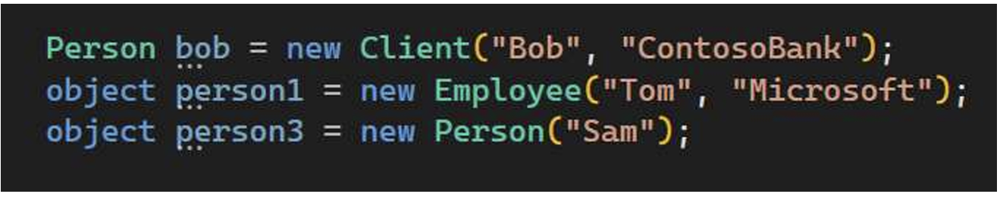

Same upcasting from Employee/Client to Object,  as Object is the base class.

将 Employee/Client 上传到 Object 也是一样，因为 Object 是基类。

### 1.2 Downcasting

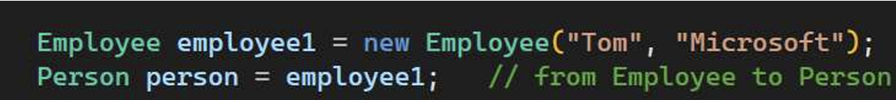

这里把一个Employee类型传成Person类型了。这是行得通的。

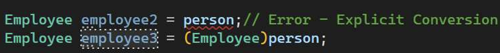

但是一个Person类型不一定是一个Employee类型。以上代码错误！！

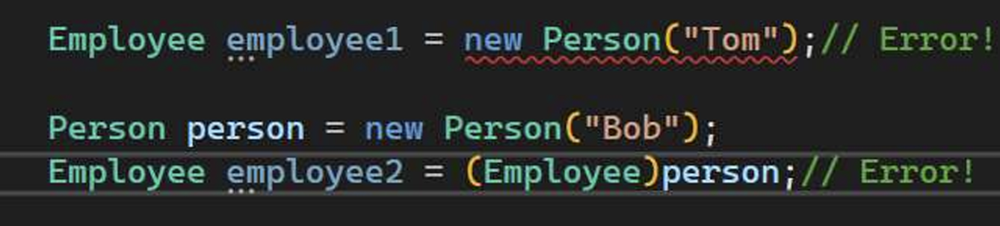

 Object Person is NOT an object Employee! 

Employee2 line is RUN-TIME error!!!

#### 1.2.1 Solution

1.  Keyword as. No exception but attempt. 

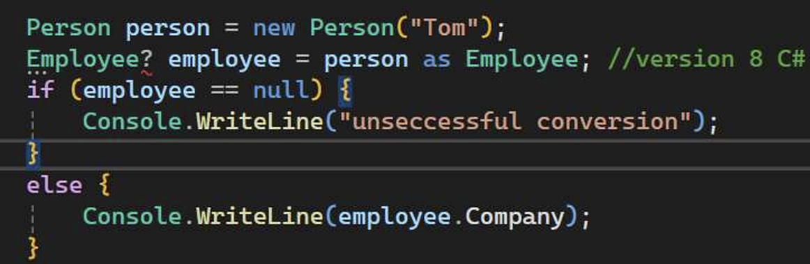

2.  Keyword is. IS it acceptable conversion?

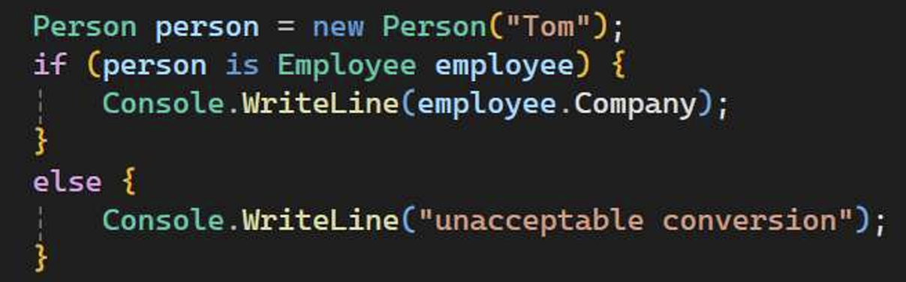

 *checks if person is object type of Employee. If  “yes” –converts to Employee and keep the  result in the variable employee*


## 2.  Constructor Management

### 2.1 创建大量构造方法->目的是overloading？？

如果 Accountclass 要有大量的构造方法：

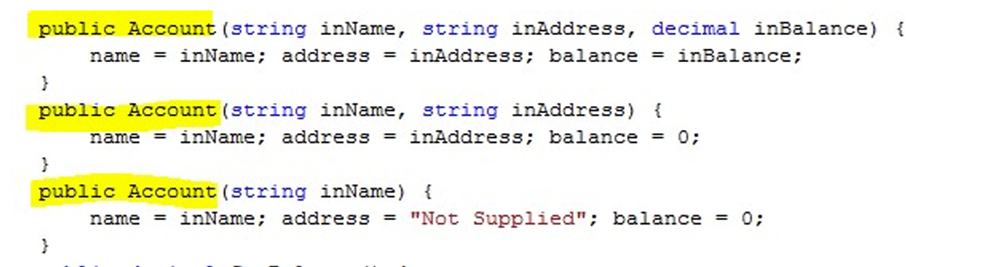

C# 提供了一种从一个构造函数调用另一个构造函数的方法:

```c#
public Account(string inName, string inAddress, decimal inBalance)
{
    Name = inName; Address = inAddress; Balance = inBalance;
}
public Account(string inName, string inAddress):this (inName, inAddress, 0){}//0是默认值
public Account(string inName):this(string inName,"None!",0){}//"None！"和0是默认值
```

关键词 this 意味着 "该类中的另一个构造函数"。这意味着从构造函数到对象本身的值的实际转移只发生在一个方法中，其他构造函数方法只是对它进行调用。对构造函数的调用发生在构造函数方法的主体之前。

• create one "master" constructor which handles  the most comprehensive method of constructing  the object.

• make all the other constructor methods use this.

### 2.2 this.name = name

Consider “this” this:

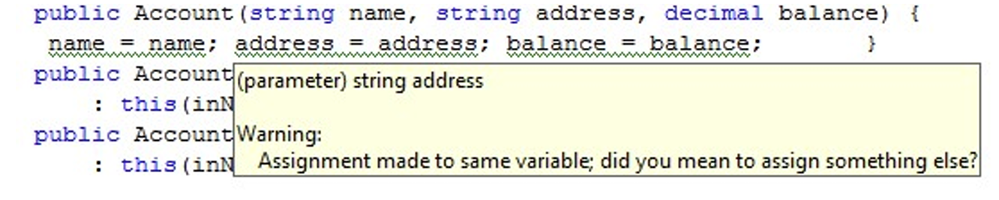

在构造函数里对参数使用相同的名字，构造函数不会太喜欢哦。

We can avoid this by using “this”：

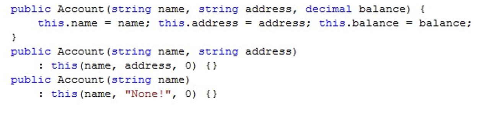

### 2.3  Constructors and Exceptions ??

To stop this to be “constructed” we can throw an  exception:

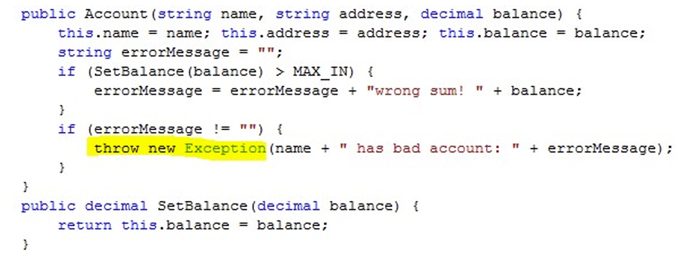


## 3. Interface

1. **以I开头：**

Coding convention -the name of an interface  should start with the letter “I”. 

```c#
public interface IAccount
{
    void PayInFund(decimal amount);
    bool WithdrawFunds(decimal amount);
    decimal GetBalance();
}
```

2. **接口里有什么？**

 • Methods, properties, events, static fields and  constructors, delegates –all that can be defined • They don’t need to have  implementation 

- 方法、属性、事件、静态字段和构造函数、委托--所有这些都可以定义--它们不需要实现

```c#
public interface IMovable
{
    const int minSpeed = 0;
    static int maxSpeed = 100;
    void Move();
    string Name {  get; set; }
    delegate void MoveHandle(string name);
    event MoveHandle OnMove;

}
```

3. **常量变量和静态变量在接口中的默认访问修饰符…**

如果没有指定访问修饰符--**默认为 public**，因为接口定义了类所要实现的功能！**这对常量变量和静态变量都有效**--默认情况下，它们在类和结构体中都是私有的！接口中方法，默认访问权限也是public，并且不能修改。

```c#
static void Main(string[] args)
{
    Console.WriteLine(IMovable.minSpeed)
}
```

因此，这将是对 IMovable 变量的有效调用.


4. **接口本身的访问修饰符？**

public。

如果访问修饰符设置为公共时，所有接口都可访问。

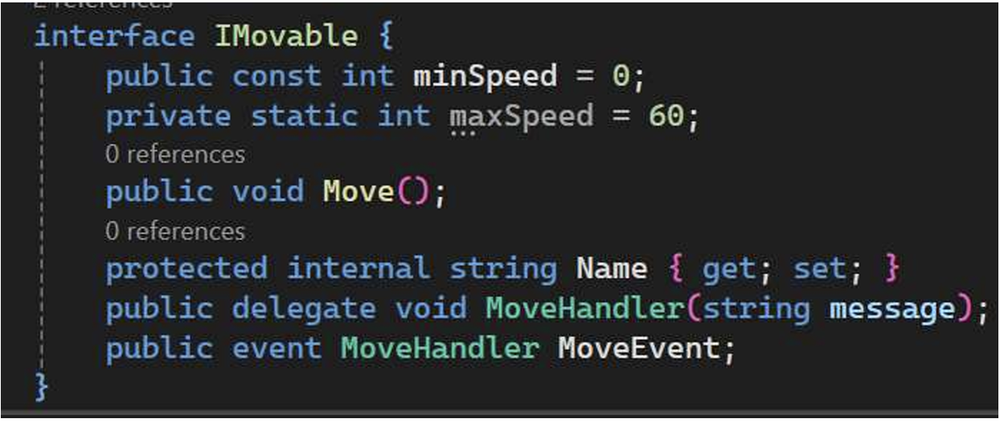


5. Implementation note

- 如果接口有私有方法和属性 , 默认情况下必须有实现 -,接口的静态方法也是如此：

```c#
public interface IMovable
{
    const int minSpeed = 0;
    static int maxSpeed = 100;
    static double GetTime(double distance, double speed)
    {
        return distance/speed;
    }
    static int MaxSpeed
    {
        get=>maxSpeed;
        set
        {
            if (value>0)
                maxSpeed = value;
        }
    }
}
```

6. 接口的实现

如果一个类实现了一个接口，就意味着接口中描述的每个方法都有相应的实现--该类必须包含接口中描述的所有方法的具体版本

```c#
public interface IAccount
{
    bool PayInFund(decimal amount);
    void WithdrawFunds(decimal amount);
    decimal GetBalance();
}

public class CustomerAccount:IAccount
{
    private decimal balance = 0;
    public bool PayImFund(decimal amount)
    {
        if (balance < amount) 
        {
            return false; 
        }
        else
        {
            balance = balance + amount;
            return true;
        }
    }
    public void WithdrawFunds(decimal amount)
    {
        balance += amount;
    }
    public decimal GetBalance()
    {
        return balance;
    }
}
```

如果类中没有实现接口中的所有方法，就会报错。

有了接口，我们就不再从 "类是什么 "的角度来考虑类，而是开始从 "能做什么 "的角度来考虑类。

- 使用接口设计的系统更容易扩展--我们不必更改所有使用接口的类，例如--当我们创建账户对象时，我们只需询问是否需要标准账户或婴儿账户。

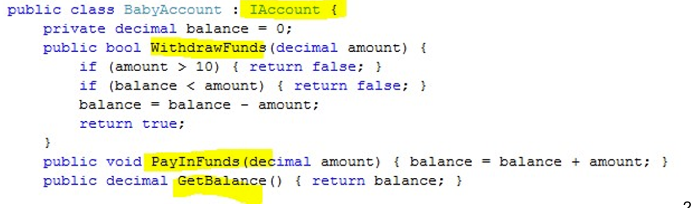

7.  Implementing Multiple Interfaces 

一个类可以根据需要实现尽可能多的接口

```c#
public class BabyAccount:IAccount, IPrintToPaper{ ... 
```

8. Designing with interfaces

a system creation process :

–Collect as much metadata as possible about the problem

–Identify classes that you will have to create to represent  the components in the problem 

–Identify the actions (methods) and the values (properties)  that the components must provide 

–Put these into interfaces for each of the components 

–Decide how these values and actions are to be tested 

–Implement the components and test them as you  develop

系统创建过程：

-尽可能多地收集有关问题的元数据

-确定必须创建的类，以表示问题中的组件

-确定组件必须提供的操作（方法）和值（属性

-将这些内容放入每个组件的接口中

-决定如何测试这些值和操作

-在开发过程中实施组件并对其进行测试