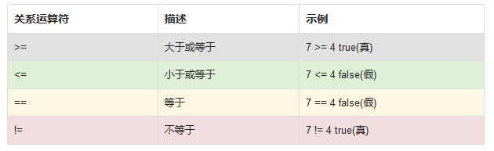

## 1. if-else 语句

### 1.1 if 语句

if 语句是一个条件语句，当条件为真时执行一段代码。

if 语句的一般形式是：

```cs
if (判断条件)
{
    // 当条件为真时，执行该语句
}
```

条件可以是任何返回 true 或 false 的表达式。

例如：

```cs
static void Main(string[] args)
{
   int x = 8;
   int y = 3;
 
   if (x > y)
   { 
      Console.WriteLine("x 的值比 y更大");
   }
}
```

上面的代码将判断条件 `x > y`。 如果这是真的(即 x 比 y 大)，if 块内的代码将被执行。

**当 if 块中只有一行代码时，花括号可以省略。**

例如：

```cs
if（x> y）
Console.WriteLine（“x比y大”）;
```

【填空题】将下面代码补充完整，实现当 age 大于 16 岁时，显示"welcome"

```cs
int age = 24;
__if_(age __>_ 16)   
{
   Console.WriteLine("Welcome");
}
```

### 1.2 关系运算符

使用关系运算符来判断条件。 除（`<`）和大于（`>`）运算符之外，还有以下运算符可用：



例如：

```cs
if (a == b) {
  Console.WriteLine("等于");
}
// 如果a的值等于b的值，则显示等于
```


【单选题】下列哪一个关系运算符是判断相等的？ B.

A. `==`

B. `>=`

C. `<=`

D. `!=`

### 1.3 else 分支

当 if 语句中的条件评估为 false 时，可以指定一个可选的 else 子句来执行一段代码。 

语法：

```cs
if (判断条件) 
{
   //条件为真的时候执行
}
else 
{
   //条件为假的时候执行
}
```

例如：

```javascript
int mark = 85;

if (mark < 60) 
{
   Console.WriteLine("不及格");
}
else 
{
   Console.WriteLine("合格");
}

// 最终将输出 "合格" 
```

【填空题】将下面代码补充完整，输出 a 和 b 中较大的那个数

```cs
int a = 42;
int b = 88;
__if_ (a > b)
{
    Console.WriteLine(a);
} 
__else_
{
   Console.WriteLine(__b_);
}

```

### 1.4 if 嵌套语句

你也可以在 if 语句中嵌套 if 语句

例如：

```cs
int mark = 100;

if (mark >= 50) {
  Console.WriteLine("合格");
  if (mark == 100) {
    Console.WriteLine("满分!");
  }
}
else {
  Console.WriteLine("不及格");
}

/*最终将会输出
及格
满分!
*/
```

你也可以嵌套无限数量的 if-else 语句。

例如：

```cs
int age = 17;
if (age > 14) {
  if(age > 18) {
    Console.WriteLine("成人");
  }
  else {
    Console.WriteLine("青少年");
  }
}
else {
  if (age > 0) {
    Console.WriteLine("儿童");
  }
  else {
    Console.WriteLine("年龄数值错误!");
  }
}
//最终将会输出 "青少年"
```

【填空题】下面程序执行以后将输出什么值？

```cs
int a = 8;
int b = ++a;
if(a > 5)
   b -= 3;
else
   b = 9;
Console.WriteLine(b);
//6
```

### 1.5 if-else if 语句

if-else if 语句可以用来决定三个或更多的动作。

例如：

```cs
int x = 33;

if (x == 8) {
   Console.WriteLine("x 等于 8");
}
else if (x == 18) {
   Console.WriteLine("x 等于 18");
}
else if (x == 33) {
   Console.WriteLine("x 等于 33");
}
else {
   Console.WriteLine("没有找到对应值");
}
//输出 "x 等于 33"
```

> 一个 if 可以有零个或者多个的 else if语句,但是必须在 else 之前
>
> 一旦其中的一个判断条件成功，则不会继续执行判断其他的条件


【单选题】一个 if 语句可以嵌套几个 if 语句?  A.

A. 你想要几个都可以

B. 最多两个

C. 不可以嵌套

## 2. switch 语句

### 2.1 switch

switch 语句提供了一种更简单优雅的方式来判断变量与多个数值的相等情况,

每一个数值称作一个 case，当变量值与 case 相等时，条件为真,执行该 case 里面的方法

例如：

```cs
int num = 3;
switch (num)
{
  case 1:
   Console.WriteLine("one");
   break;
  case 2:
   Console.WriteLine("two");
   break;
  case 3:
   Console.WriteLine("three");
   break;
}
//输出"three"
```

每个 case 代表一个要检查的值，后跟一个冒号，如果这个 case 匹配，那么这个语句会被执行。

switch 语句可以包含任意数量的 case。

> 注意：每个 case 语句执行结束都要使用 break 中止 switch 继续执行,否则，switch 会继续执行下面 case 的判断

在C#编程语言中，`if else`和`switch`都是用来进行条件分支的控制结构，但它们在用法和适用场景上有所不同：

### 2.2 default 语句

在 switch 语句中，可以添加一个 default 语句，他会在上述条件没有任何一个被匹配到的情况下执行

例如：

```cs
int age = 88;
switch (age) {
  case 16:
    Console.WriteLine("小孩");
    break;
  case 42:
    Console.WriteLine("中年人");
    break;
  case 70:
    Console.WriteLine("长辈");
    break;
  default:
    Console.WriteLine("没有找到对应关系");
    break;
}
// Outputs "没有找到对应关系"
```

> default 将会在没有匹配到条件时执行

将代码补充完整，实现输出 X 的值：

```cs
switch (x) {
  case 10:
    Console.WriteLine("Ten");
    _break__;
  case 20:
    Console.WriteLine("Twenty");
    break;
  _default__:
    Console.WriteLine("No match");.
    break;
}
```

### 2.3 break 声明

break 语句的作用是终止 switch 语句。

没有使用 break，即使 case 标签与变量匹配，执行以后仍会继续往下匹配 case 语句，直到结束或者遇到 break 语句。

所有 case 包括 default 都必须以 break 语句结束。

> break 语句也可以用来跳过循环。 你将在后面的课程中学习到循环语句。

【单选题】如果我们忘记在 case 的末尾添加 break 语句，会发生什么？  A.

A. 编译错误

B. 什么都不会发生

C. break 将被输出

## 3. 区别

### `if else` 语句

- **灵活性高**：`if else`语句可以处理更为复杂的逻辑和条件判断，支持各种条件表达式，如比较运算符、逻辑运算符等。
- **结构**：可以有单个`if`，或者`if`后跟多个`else if`和一个`else`块，用于处理多重条件。
- **适用场景**：适用于条件较为复杂或需要进行多个不同逻辑运算的场合。

### `switch` 语句
- **简洁性**：`switch`语句通过一个表达式的不同值进行分支，每个分支用`case`标记，**非常适合处理一个变量有多个具体值的情况。**
- **结构**：包括一个`switch`表达式，多个`case`子句，以及可选的`default`子句。
- **适用场景**：适用于需要根据单一变量的不同值做出决定的情况，特别是当这个变量有多个明确的值需要单独处理时。`switch`常常被用于代替多个`if else`语句，使得代码更为整洁和易于理解。
- **限制**：直到C# 7.0，`switch`语句只支持整数、字符和字符串类型的简单比较。从C# 7.0开始，`switch`支持模式匹配，这使得它可以对类型和更复杂的数据结构进行判断。

### 性能考量

在大多数情况下，两者的性能差异不大，尤其是在现代编译器优化的背景下。对于大量的分支条件，`switch`语句可能会由于其内部优化（如跳转表）而有更好的性能。

### 示例
- 使用`if else`:
  ```csharp
  if (x < 10) {
      Console.WriteLine("小于 10");
  } else if (x < 20) {
      Console.WriteLine("10 到 19");
  } else {
      Console.WriteLine("20 或以上");
  }
  ```

- 使用`switch`:
  ```csharp
  switch (x) {
      case 10:
          Console.WriteLine("等于 10");
          break;
      case 20:
          Console.WriteLine("等于 20");
          break;
      default:
          Console.WriteLine("不是 10 也不是 20");
          break;
  }
  ```

综上，选择`if else`还是`switch`主要取决于具体的应用场景和代码的可读性。**在处理多个具体值的情况下，**`switch`可能是更优的选择；**而在需要复杂条件判断时，**`if else`则更加合适。

## 4. 编程题目

### 4.1 if 语句练习题

1. **基础比较**：编写一个程序，接收两个整数输入，如果第一个数大于第二个数，则打印“第一个数大于第二个数”。

```cs
using System;
class Program
{
    static void Main(string[] args)
    {
        int a = 1;
        int b = 2;
        if (a > b)
        {
            Console.WriteLine("第一个数大于第二个数");
        }
        else
            Console.WriteLine("第二个数大于第一个数");
    }
}
```


2. **温度警告**：编写一个程序，接收温度（摄氏度）作为输入，如果温度高于30度，则打印“今天很热”。如果低于10度，则打印“今天很冷”。

```c#
using System;
class Program
{
    static void Main(string[] args)
    {
        int tem = 25;
        if (tem > 30)
        {
            Console.WriteLine("too hot!");
        }
        else if (tem < 10)
            Console.WriteLine("too cold!");
        else
            Console.WriteLine("good day");
    }
}
```


3. **成绩分类**：编写一个程序，根据输入的分数（0-100）输出学生的成绩等级。90以上为“A”，80-89为“B”，70-79为“C”，60-69为“D”，59以下为“F”。

```c#
using System;
class Program
{
    static void Main()
    {
        int score;
        Console.WriteLine("请输入你的分数");
        score = Convert.ToInt32(Console.ReadLine());
        if (score > 90)
            Console.WriteLine("A");
        else if (score > 80)
            Console.WriteLine("B");
        else if (score > 70)
            Console.WriteLine("C");
        else if(score >60)
            Console.WriteLine("D");
        else
            Console.WriteLine("F");
    }
}
```


4. **登录验证**：编写一个程序，要求用户输入用户名和密码。如果用户名是“admin”且密码是“123456”，则打印“欢迎登录”，否则打印“用户名或密码错误”。？？？？

```c#
using System;
class Program
{
    static void Main()
    {
        string name;
        int key;
        Console.WriteLine("请输入你的用户名：");
        name = Console.ReadLine();
        Console.WriteLine("请输入你的密码：");
        key = Convert.ToInt32(Console.ReadLine());
        if (name == "admin")  //怎么设置两个条件
            Console.WriteLine("欢迎使用！");    
    }
}
```

5. **奇偶数判断**：编写一个程序，输入一个整数，如果是奇数，打印“这是一个奇数”，如果是偶数，则打印“这是一个偶数”。


### 4.2 switch 语句练习题

6. **简单的日程安排**：编写一个程序，根据用户输入的数字（1-7），输出对应的星期几。例如，1输出“星期一”，2输出“星期二”，以此类推。
7. **月份的天数**：编写一个程序，接收月份号（1-12），输出该月的天数（不需要考虑闰年）。
8. **用户角色**：编写一个程序，根据用户输入的角色编码（例如：1代表管理员，2代表用户，3代表访客），打印相应的角色名称。
9. **交通信号灯**：编写一个程序，输入信号灯的颜色（红、黄、绿），输出对应的行动指示（例如红灯停，绿灯行，黄灯请注意）。
10. **快餐菜单**：编写一个程序，模拟快餐店的订单过程。用户输入菜单编号，根据编号显示对应的菜名和价格。


