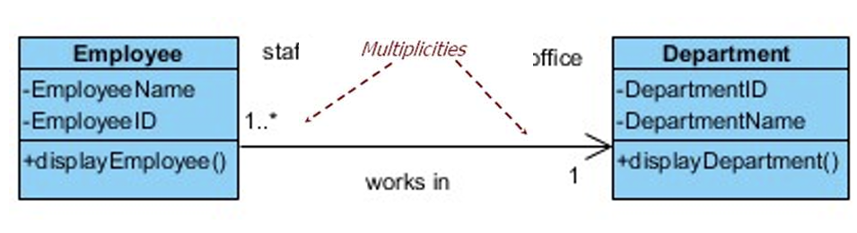

## 1. class and Object

### 1.1 Conception

**class**

`encapsulates(封装)` attributes(Python variables) and operations (Python method) into a single entity,which describes  a set of data and the  operations that will act on  data.


**object**

 is an instance of a  class and has the `properties(属性)` and behaviour of it class.


 **Unified Modelling Language (UML)**

used to model object oriented software  design 

???

### 1.2 图示


第一栏的Employee就是上文介绍的class；

第二栏（Employee Name，Employee ID）是class的attributes——即Python Variables；

- Part of the essential description of  data in a class

- Each object has its own value for  each attribute in its class   

- The visibility of attributes are  private. This means that data is  hidden from other objects, which  have no direct access to the data of an  entity, such as Employee

第三栏是operation——即Python Method。

-  The common behaviour shared by  all instances (objects) of the class  

-  Services that objects of a class can  provide to other objects

- The visibility of operations are  public, if they are designed to be  accessible to other objects.  Operations of an object can be  private  or protected if they are  only to be used by the object itself  or a group of objects, respectively

### 1.3 Create a Class

```python
class Person:
    def __init__(self, fname, lname):   //attribute
        self.fistname = fname
        self.lastname = lname
    def printname   //operation
        print(self.firstname, self lastname)
x = Person('John', 'Doe')   //object
x.printname()   //call operation
```

`__init__()`

- All classes have a  function called  `__init__()`, which is  to assign values to  object properties, or  other operations  when the object is  being created 

有点类似于C#中的构造函数！

`self(or other)`

- The self parameter is a  reference to the current  instance of the class,  and is used to access  variables that belongs  to the class.

- The self  parameter could  be given any  name, e.g.  mysillyobject or  abc, but it has to  be the first  parameter of  any methods in  the class

```python
class Person:
    def __init__(abc, fname, lname):
        abc.fistname = fname
        abc.lastname = lname
    def printname
        print(abc.firstname, abc lastname)
x = Person('John', 'Doe')
x.printname()
```


## 2. Python：Function vs. Methods

### 2.1 Python function

- User-Defined Functions

```python
def add(a,b):
    return a + b
add (3,-3)
```

- Built-in Functions

比如print

### 2.2 Python Methods

- Python method is  a function  attached to an  object.

- Python method is  called on an  object.

```python
class vehicle:
    def __init__(self,color):
        self.color = color
    def showcolor(self):
        print(f"The color is {self.color}")
car = vehicle("red")
car.showcolor()
```

这里面的showcolor就是Method


## 3. Class Diagram

### 3.1 Association


- An abstraction which connects two classes 
- Represents the possibility of a logical relationship or  connection between objects of one class and objects of another

#### 3.1.1 Multiplicity

- Associations have multiplicity 

- Multiplicity is the range of permitted cardinalities of an  association 

    −One to one association  

    −One to many association  

    −Many to one association 

    −Many to many association

- Represent enterprise (or business) rules, for example: −Any bank customer may have one or more accounts 

    −A sole account is for one, and only one, customer 

    −A joint account（共同账户） has two customer holders

Example：Many to one association



### 3.2 Message Passing

:place Department object reference (held in the  attribute, Department) in the Employee class, thus the Employee object can communicate and send message to the Department  object. i.e. calling the Department object’s method,  display Department(), but not vice versa  

−Sending object: Employee object 

−Receiving object: Department object


## 4. Inheritance

- Add inheritance structures when: (什么时候用继承)

    − Two classes are similar in most details (i.e.    generalisation概括化), but differ in some respects (i.e.  specialisation专业化) 

    - In behaviour (operations or methods) 
    - In data (attributes) 
    - In associations with other classes

### 4.1 inheritance relationship`

Apply the `“is-a”` rule, denoted as a hollow triangle.

tips: “is a”就是父类和子类的关系。


 Example scenarios:

- Borrower “is a” Library User 
- Student “is a” Borrower 
-  Film “is a” Recorded Item

### 4.2 父类子类别称

父类：

- Abstract class
- super class
- general class

子类：

- concrete class
- sub-class
- specialised class


### 4.3 Example

 A part-time employee ‘is a’ type of employees  

concrete class (subclass): shared the general features from the  superclass, but individual subclasses have their own specialised  features.


### 4.4 代码实现

#### 4.4.1 Parent class

```python
class Person:
    def __init__(self,fname,lname):
        self.fname=fname
        self.lname=lname
    def printname(self):
        print(self.fname,self.lname)
```


#### 4.4.2 Child class

To keep the inheritance of the parent's __`__init__()`__ function, add a  call to the parent's `__init__()` function.

##### 4.4.2.1 all the methods and properties from its parent

子类调用父类方法：(super class).(Method)

```python
class Student(Person):
    def __init__(self,fname,lname):
        Person.__init__(self,fname,lname)
```

 Use super() function that will make the child class inherit  all the methods and properties from its parent:

```python
class Student(Person):
    def __init__(self,fname,lname):
        super().__init__(fname,lname)//用super，在这的括号就不用self了
```

##### 4.4.2.2 adding additional attributes/methods

 Using self.attribute_name

```python
class Student(Person):
    def __init__(self,fname,lname):
        super().__init__(fname,lname)
        self.graduationyear = 2019
```

pass the new attribute when creating objects

````python
class Student(Person):
    def __init__(self,fname,lname,year):
        super().__init__(fname,lname)
        self.graduationyear = year

x = Student('John','Smith',2020)
````

Using method_name(self) to add a new method

```python
class Student(Person):
    def __init__(self,fname,lname,year):
        super().__init__(fname,lname)
        self.graduationyear = year
    def welcome(self):
        print('welcome to',self.fname,self.lname,"to the class of",self.graduationyear)

x = Student('John','Smith',2020)
x.welcome()
```


##### 4.4.2.3 Method  overriding 

the  child class  implements the  code different  from the parent  class

```python
class Parent:
    def __init__(self):
        self.value = 5
    def get_value(self):
        return self.value
class Child(Parent):
    def get_value(self):
        return self.value + 1
```

##### 4.4.2.4 Method  overloading

the method  name is same  but with  different  number of  parameters

```python
class computer:
    def area(self,x = None,y = None):
        if x != None and y != None:
            return x * y
        elif x != None:
            return x * x
        else:
            return 0
d = computer()
print(d.area(3,4))
print(d.area(3))
print(d.area())
```

the method  name is same  but with the  parameters of  different types


