## 1. Verification & Validation

- Verification: to verify the correct implementation of  source code against the specification.

根据规范验证源代码的正确实现。就是说，代码没有语法错误。

- Validation : to validate major system functions against  customer requirements.

根据客户要求验证主要系统功能。

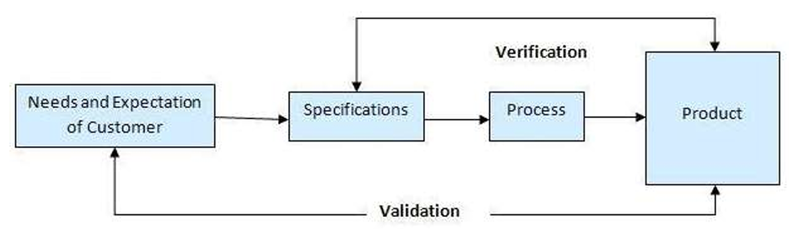

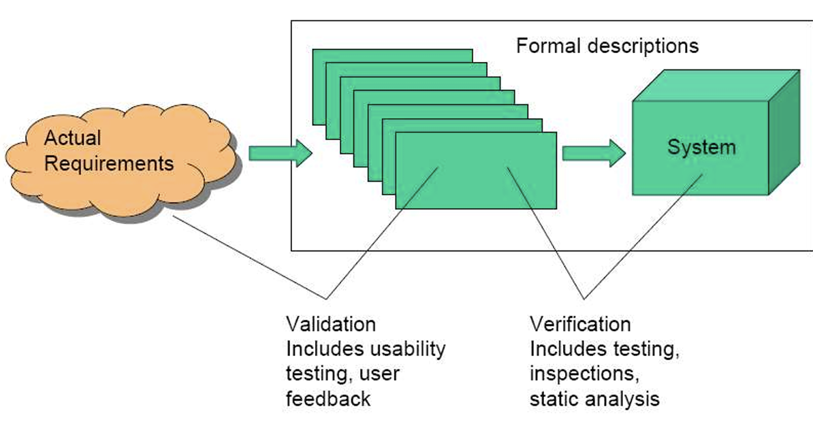

## 2. Three Levels

### 2.1 Level 1

Level 1: 

- Tests individual modules (e.g. functions, classes or  components) 
- Whole programs (e.g. user story, use case) 
- Whole suites of programs (e.g. the application)

### 2.2 Level 2: alpha testing or  verification

-  Executes programs in a  simulated environment.    在模拟环境中执行代码。

-  Test inputs: 

    o Negative values and  positive values.     负值和正值。

    o Out of range or close  to range limits 

    o Invalid(无效的) combinations

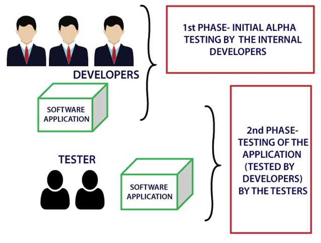

### 2.3  Level 3: beta testing or  validation

 Tests programs in  live user  environment 

o For response and  execution times 

o With large  volumes of data 

o For recovery from  error or failure

## 3. Testing Types

### 3.1  Functional Testing（3 types）

1.  **White box (or Structural testing)**  

    −testing the internal workings of software as  specified

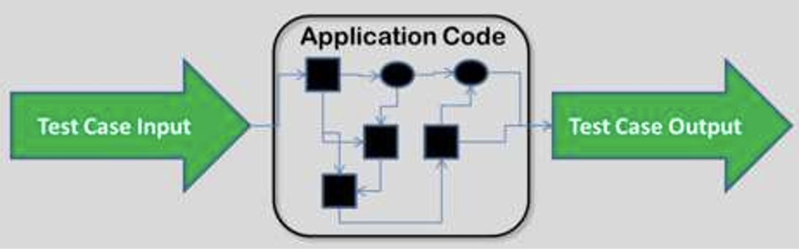

2.  **Black box testing** 

    −treating software as a black box −test data is put into it and produces some output

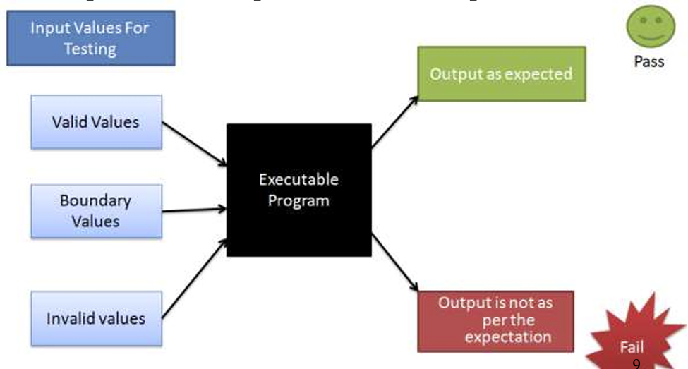

3. **Grey box testing**

--platform and language independent 

−for testing a piece of software against its specifications but  using some knowledge of its internal working (more than  black box testing, but less than clear box testing)

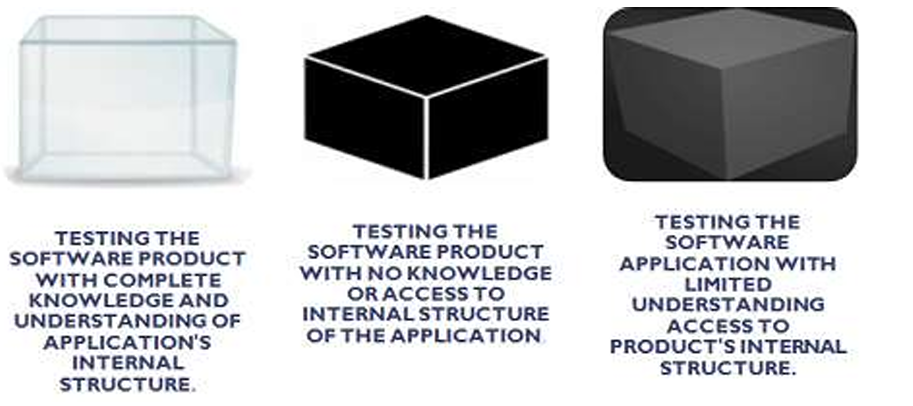

### 3.2 Non-Functional Testing

1. **Performance Testing,** 

    −Load testing: to subject a  computer, peripheral, server,  network or application to a work  level approaching the limits of  its specifications.  

    −Stress testing: to evaluate a  system or component at or  beyond the limits of its specified  requirements to determine the  load under which it fails and  how

    −Volume testing: large number of  data is populated in database and  the overall software system's  behavior is monitored 

    −Endurance testing: regarding  whether the application can  handle the expected load over a  long period of time. 

性能测试，
−负载测试：进行计算机、外围设备、服务器，网络或作品的应用程序水平接近的极限其规格。

−压力测试：评估系统或组件超过或正处于规定的要求，来确定其发生故障的负载以及故障方式。

−批量测试：在数据库中填充大量数据，并监控整个软件系统的行为。

−耐久性测试：关于应用程序是否能够在很长一段时间内处理预期负载。

2. **Security Testing** 

    to verify that  protection mechanisms built into a  system that will protect it from improper  penetration. To make sure that only the  authorised personnel can access the  program and only the authorised personnel can access the functions  available to their security level.

    以验证系统中内置的保护机制是否能保护其免受不当渗透。为了确保只有授权人员可以访问程序，并且只有授权人员才能访问其安全级别可用的功能。

    e.g. Posture Assessment: to determine a  general security posture of an  association

3. **Usability Testing**

    testing the level of ease with which  a system allows a user to achieve that goal. 测试用户使用系统的简便度。

Methods: 

 −1) apply the exploratory method  to build the site and  perform some random tests (by the development/design/QA  or all internal teams) to determine usability factors

 −2) use a tool that would provide statistics based on the input  wireframes (i.e. structure and functionality) and designs  submitted

  −3) employ a set of real-time users to work on the site and  report results, a third-party usability team or external  evaluators to conduct usability testing

方法：

−1）应用探索性方法建立网站，并进行一些随机测试（由开发/设计/QA或所有内部团队进行），以确定可用性因素

−2）使用基于输入线框（即结构和功能）和提交的设计提供统计数据的工具

−3）雇佣一组实时用户在网站上工作并报告结果，第三方可用性团队或外部评估人员进行可用性测试

4. **Compatibility Testing**   

    to check whether your  software is capable of  running on different  hardware, operating  systems, applications,  network environments or  Mobile devices. 

兼容性测试：
检查您的软件能够在不同的平台上运行硬件，操作系统、应用程序，网络环境或移动设备。

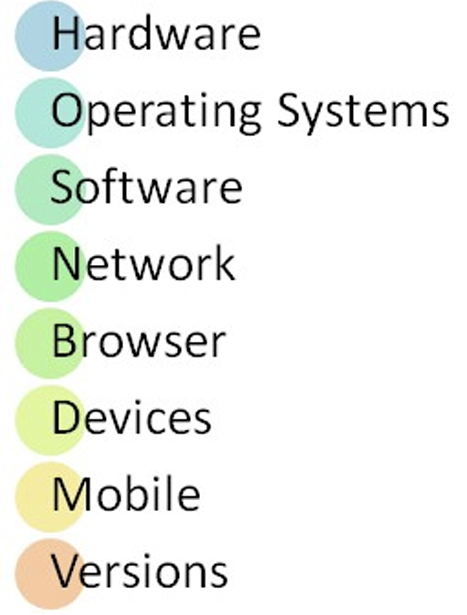

## 4. Strategies

 **−Unit testing**  

**−Integration testing**  

**−System testing** 

**−Regression testing**  

**−User Acceptance  testing** 

### 4.1 Unit Testing

−focuses on a single  “unit of code” ,  usually a function  in an object or  module.  

单元性测试，经常是一个对象里的函数，或一个模块。 

−is generally seen as  a white box test  class 

白盒子性质的测试。

−should be isolated  from dependencies  

隔离依赖。

Python Unit Test Framework API: 

unittest −The unittest unit testing framework, supports test automation,  sharing of setup and shutdown code for tests, and aggregation of  tests into collections, including, e.g. −test case: the individual unit of testing, which checks for a  specific response to a particular set of inputs. It provides a base  class, TestCase, which may be used to create new test cases.

Python单元测试框架API：

unittest−unittest单元测试框架，支持测试自动化、共享测试的设置和关闭代码，以及将测试聚合到集合中，例如，包括−测试用例：单个测试单元，用于检查对特定输入集的特定响应。它提供了一个基类TestCase，可以用来创建新的测试用例。

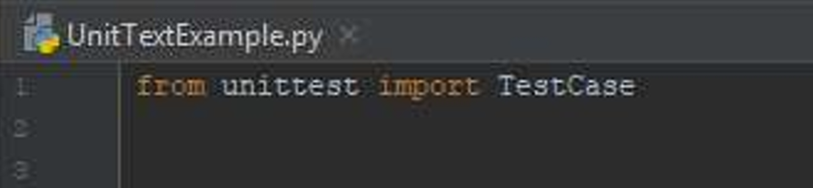

 **Application Programmer Interface（API）：**

−a protocol used as an interface by software components to communicate with each other.

一个协议当做接口使用，用于软件组件之间相互交流 

−a set of functions and procedures that allow the  creation of applications which access the features or  data of an operating system, application, or other service. 

允许创建访问操作系统、应用程序或其他服务的功能或数据的应用程序的一组功能和过程。

−Examples: Python Unit Test Framework API for  unit testing, including: **TestCase Class, Fixtures,  Class Fixture, TestLoader Class, TestResult Class.**

#### 4.1.1 Python unittest: Methods 1

1. Python unittest framework,  TestCase class:   assert methods to  check for and  report failures. 

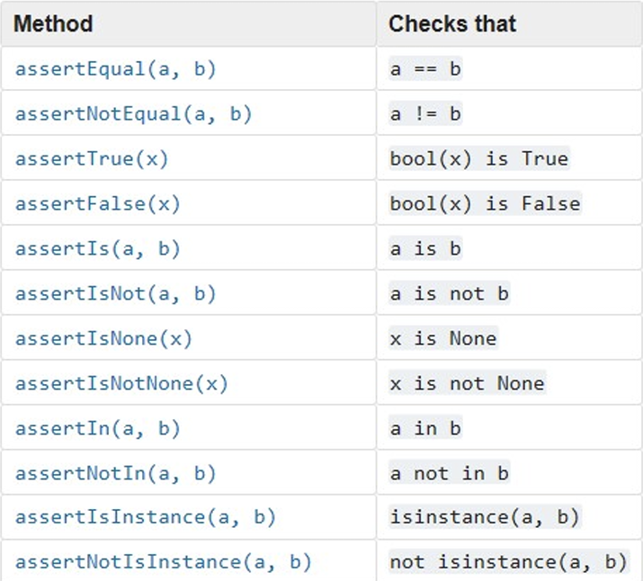

*

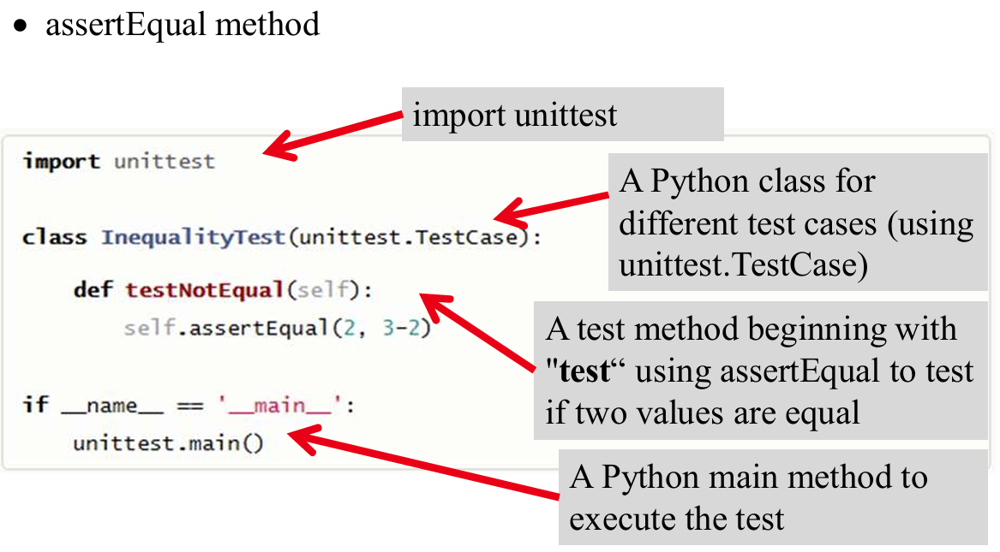run test and failed.

*

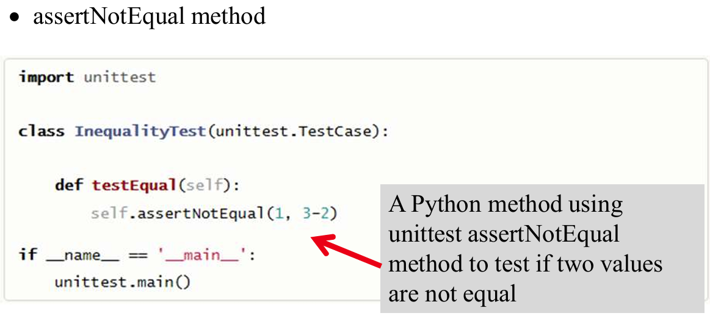

run test and failed

2.  Python unittest framework, TestCase class: assert methods to  perform more specific checks

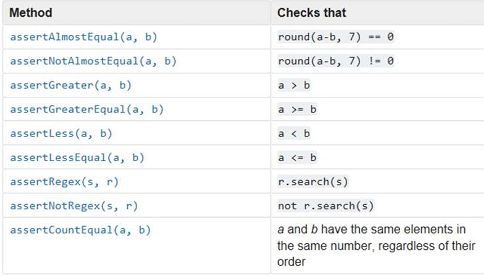

3. Python unittest framework, TestCase class: assert methods to  check the production of exceptions, warnings, and log messages

