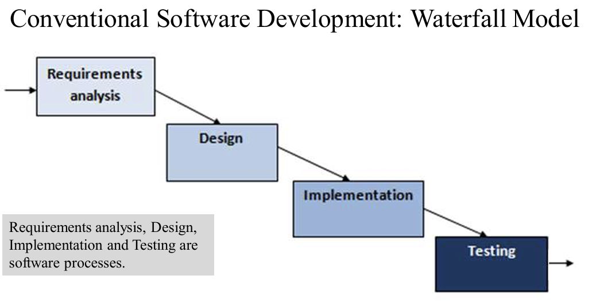
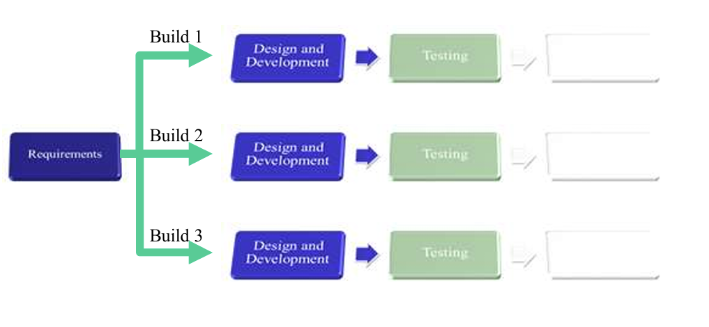
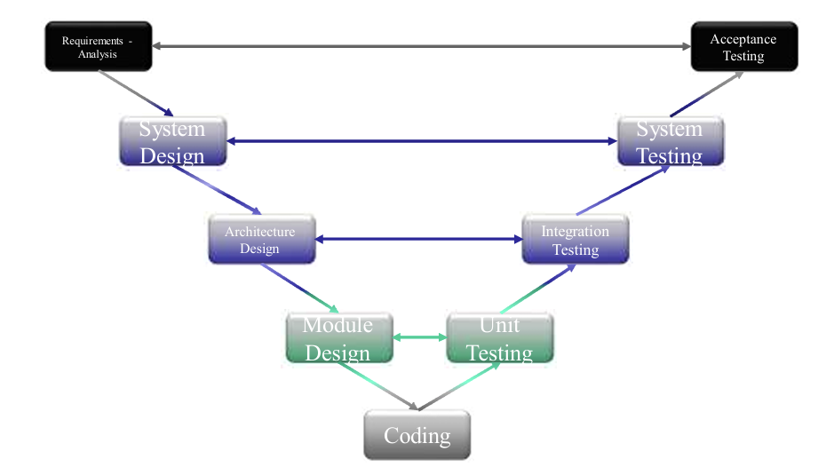

## 1. The Beginning of Software Development

### 1.1 Bad Practices

 • Presence of typos in the code 错字

• No proper structure and formatting of the code 没有正确的代码结构和格式

• No use of comments in the code 注释

• No accurate declaration of values 对值的声明要准确

• Use of magic numbers 魔术数字不能用

• Logic errors in the code 逻辑错误

• Complex and lengthy code 冗余复杂的代码

• Non-modular code 代码没有模块化

### 1.2  key DEVELOPMENT practices

• Validation of input 

• Error Handling and Logging 

• Database security 

• Memory management 

• Data protection 

• Types verification

### 1.3  Life Cycle

 • Planning: Provides a project management plan that works as the basis for acquiring the resources needed to develop the considered system.  获取并规整资源

• Requirements/Analysis: Specifies user requirements describing the detailed functioning of the intended system. 了解用户对于软件的功能需求。

• Design: System features and operations are described in detail(i.e. system requirements) through the use of prototype models like process diagrams,pseudo codes,etc. 通过使用流程图、伪代码等原型模型，详细描述系统功能和操作（即系统需求）。

• Development: the system is constructed involving the actual programming process. 写代码

• Testing: Demonstrates that the system conforms to requirements by applying testing techniques.

• Maintenance: the system is assessed/evaluated to ensure it does not become obsolete. This is also where changes are  made to initial system functioning. 确保系统功能不过时。也包括维护和检修？

### 1.4 一些其他software design Approach

#### 1.4.1 Waterfall

Problems associated with Waterfall model: 

−Allows a sequential flow of activities from completion of a  phase to the next 

−Unable to accommodate the nature of uncertainty of project’s  requirements. It is difficult for customers to identify detailed  criteria at the beginning of the project. Revision of  requirements is difficult. 

−Software development can be a long process which does not  produce a working version of the system until late in the  process. 

−product usually is not available for customer’s feedback until the  end of the development, thus high risk

瀑布模型的相关问题：

-允许从一个阶段完成到下一个阶段的活动顺序流

-无法适应项目要求的不确定性。客户很难在项目开始时确定详细的标准。需求修订困难。

-软件开发可能是一个漫长的过程，直到后期才会产生系统的工作版本。

-产品通常要到开发后期才能得到客户的反馈，因此风险很高。

#### 1.4.2 Iterative Approach

#### 1.4.3 V-model Approach

## 2. Agile

### 2.1 some of the features 

 Proposes incremental and iterative approach to software design 

 Gives less priority on documentation than software development 

 Allows self-organizing teams to respond to change 

 Enables errors to be fixed in the middle of the project. 

 Enables the customer to have early and frequent opportunities to give feedback on  the product and make decision and changes to the project 

 Requires close communication with developers and together analyse requirements and  planning

 Delivers shippable features of the product to the customer at the end of an iteration.  

 Implements small projects very quickly 

 Allows iterative development process to execute a project in short (2-4) weeks  iterations.  

 Allows implementing regression testing every time new functions or logic are  released in each iteration. 

核心特点：

 提出软件设计的增量和迭代方法

 对文档的重视程度低于软件开发

团队应对需求变化简单：

 允许自组织团队应对变化

 可在项目中期修复错误

客户（提出的需求实现）：

 让客户有机会尽早、频繁地对产品提出反馈意见，并对项目做出决策和修改

 需要与开发人员密切沟通，共同分析需求和规划

 在迭代结束时向客户交付可交付的产品功能。

实施项目快速：

 快速实施小型项目

 允许迭代开发流程在短期内（2-4 周）迭代执行项目。  

测试性：

 允许在每次迭代中发布新功能或逻辑时实施回归测试。

  

### 2.2 Scrum

#### 2.2.1 Roles

**Product owner** 

**Scrum master** 

**Developers (Development Team)**

### 2.3 Kanban

−define and visualize policies (process rules or guidelines)  explicit and visualises the flow of work on a Kanban board  that contains the process steps to deliver work 

可视化的工作流程，包含交付工作的流程。

−Applies Limiting **work-in-progress (WIP)**, which to ensure  the work currently in progress to be completed before taking  up new work 

在完成当前工作前不可以进行新工作

−continuous development and delivery, tackling a small  number of tasks concurrently -持续开发和交付，同时处理少量任务

−Suitable for the software team with a continuous stream of  work requests -适用于工作请求源源不断的软件团队

### 2.4 Extreme programming (XP)

1. **−Pair-wise programming:** demands that each and  every line of code is developed by a pair of  programmers. The work in these pairs involves a  division of labour in which one person is actively  involved in the actual generation of code, while  the other takes a supporting and reviewing role.

分工合作工作，一个写代码，一个辅助加审查。

2. −Relies on **constant code improvement**, **user  involvement in the development team** and **pair  wise programming.**

“三大特色”

3. **Feature：**

 −Supports change through small, frequent system releases 

−full-time customer engagement with the team. 用户全程参与

−maintaining simplicity through constant refactoring  of code 不断重构代码

−emphasizes final product −test based approach to requirements and quality 

−lightweight methods suit small-medium size projects 适合小型企业

### 2.5 Test Driven Development (TDD):

**a specific engineering practice from XP**

1. Life Cycle：

- Write the test for a new feature (function or requirement  through user stories)
- Run the test and see if the new test fails
- Write the code that pass the test that fails
- Refactor code: improve code
- Repeat the above process

2. TDD vs. Agile: 

    TDD and agile both adopt an interactive and  incremental process 

    Differences: 

    ​    -TDD focuses on how code is written and tested,  whereas agile focuses on the overall  development process  

    ​    -TDD focuses on how code is written and tested  by a given developer, whereas agile focuses on  groups of developers

## 3. User Story

1. **as a <   Type of user   >,  I want to <   perform some Tasks >, so that <   achieve some goal >** 

​      Examples :

​       As an administrator I want to be able to create a new  user to the team when needed. As a user I want the ability to restore my password. 

​       As a cashier I want to see total amount in cash register  displayed. 

​       As a credit card user I want to be warned if spent more  than a set amount. 

​       As a ticket booker I want to be notified as soon as a  ticket gets available on a full flight.

2. User Story: As a University student, I want to see my  modules for a semester, so that I know what to study. 

    • Acceptance Criteria: e.g.  The modules for each semester is displayed. A different semester can be selected.  The module are not displayed if the student fails to  login.
