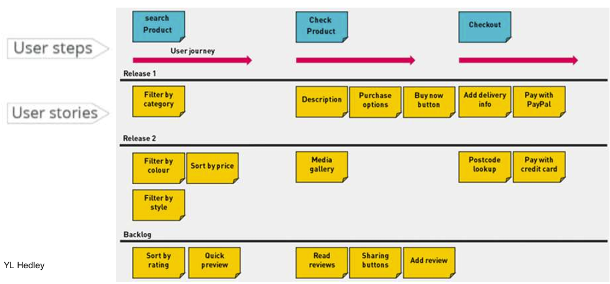
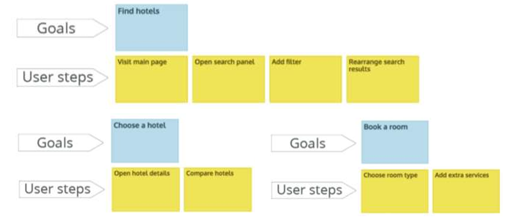
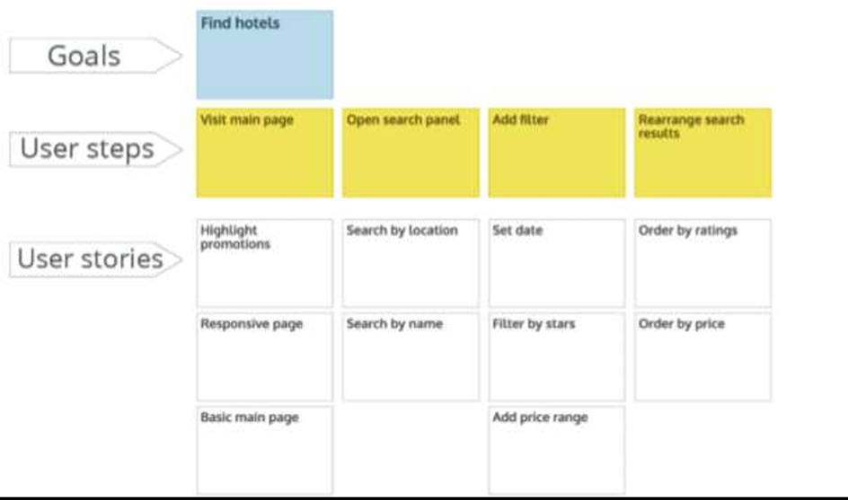
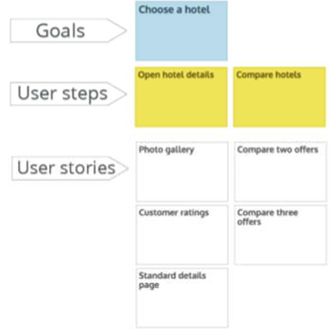
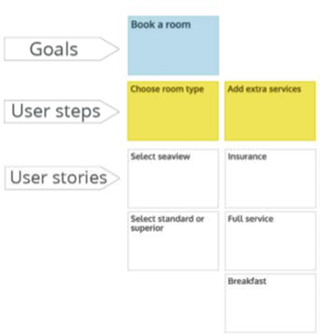
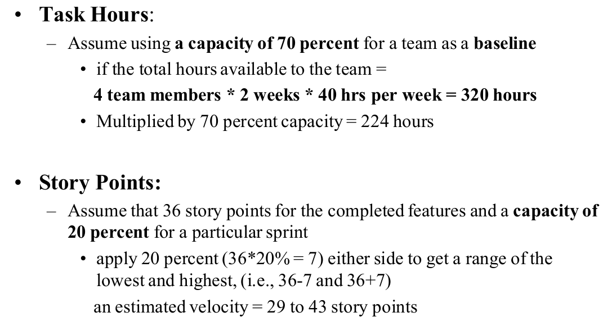
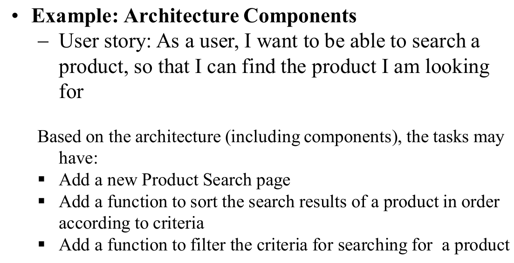
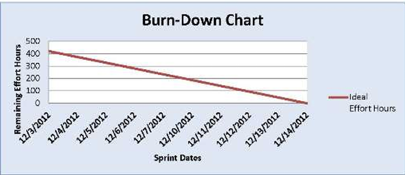
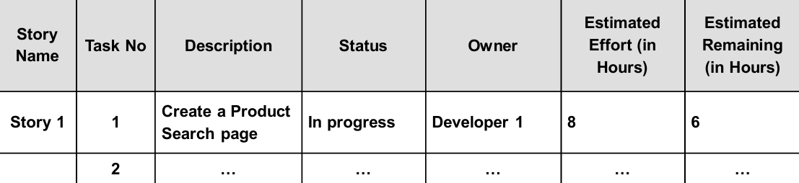

## 1. User Story Mapping

–A technique to envisage the entire software product as  a series of steps in which the user completes tasks to  achieve the goals

一个用户目标需要一系列的步骤去实现。

–involves building a series of user stories as an  iterative process to produce solutions

一系列的用户故事去完成迭代

–enables user stories with solutions to be grouped to  achieve their respective goals 

一起开发的用户故事（实现一个迭代功能）被打包，

### 1.1 Example: Hotel booking website

**Step 1: identify the goals**

**Step 2: mapping the steps to achieve the goal**

 **Step 3: building user stories to produce solutions for ‘Find hotels’, e.g.** 

**Choose a hotel**

**Book a room**

## 2.  Story Points 

A story point is used to measure the amount of effort  required to implement a story, depending on the project,  which may refer to number of units, complexity, technical  risk. 

故事点用于衡量实施一个故事所需的工作量，具体取决于项目，可能指单元数、复杂性、技术风险。

e.g. in a User Interface (UI) centric project, story points  might be the number of widgets on a screen.In a  database-centric project, to number of tables or columns.

例如，在以用户界面 (UI) 为中心的项目中，故事点可能是屏幕上小部件的数量。

a measurement of a feature’s size relative to other  features may be used in estimation (not the time  needed to complete a feature)

估算中可能会使用一个功能相对于其他功能的大小的测量值（而不是完成一个功能所需的时间）

With traditional estimation, the team examines the  major work tasks to derive an estimate. In contrast,  with story points, the agile team instead may  compare the size and complexity of features.

在传统估算中，团队通过检查主要工作任务来得出估算结果。相比之下，使用故事点时，敏捷团队可以比较功能的大小和复杂程度。

###  2.1 Estimation

#### 2.1.1 Numeric estimation: 

•Each team member given a set of cards with numbers on  them, ordered the user stories using the Fibonacci  sequence (0, 1, 2, 3, 5, 8, 13, 21, 34, 55, 89, …) as story  points to do relative estimates. In practice, the numbers 0,  1, 2, 3, 5, 8, 13, 21, 40, 100 are used. 

• The main benefit of the Fibonacci scale is that enough  separation exists between the numbers to prevent the  team from emphasising over slight differences, e.g., using  numbers, 1, 2, 3, 4, 5…, 10

> 运用 0,1,2 3,5,8,13,21,40,100来衡量功能的大小。

#### 2.1.2 Non-numeric estimation:

T-shrit animal or other things…

## 3. Agile Estimation Techniques 

1. **Planning Poker**: to estimate the work to be done 
2. **T-Shirt Sizes**: to estimate the work to be done 
3. **Relative Mass Valuation**: to estimate the work to be done 
4. **Velocity**: to measure a team’s capacity to complete work

注意：前三种方法都是单纯衡量要完成的一项任务的大小（可以看做要跑的路程），最后一种是团队完成这项任务的能力（可以看作人来跑这一段路程的速度）。

### 3.1 Planning Poker

–Played by team members during planning meetings

–Each team member given a set of cards with numbers on  them, ordered from 0 to 21 using the Fibonacci sequence(0,  1, 2, 3, 5, 8, 13, 21, 34, 55, 89, …) as story points to do  relative estimates. In practice, the numbers 0, 1, 2, 3, 5, 8, 13,  21, 40, 100 are used. 

​    • A story estimated as a 2 should be about one fourth as difficult as a  story estimated as an 8.  

​    • Stories estimated at 20 or higher may be so large that they need to  broken up into smaller stories before they can be attempted. Stories  estimated at 0 may not even be worth tracking.

​       - 估计为 2 分的故事难度应为估计为 8 分的故事难度的四分之一。

​       - 估计难度为 20 或更高的故事可能非常庞大，需要分解成更小的故事才能尝试。估计值为 0 的故事可能根本不值得跟踪。

> 用上文提到的斐波那契数列，每个人在不与其他人讨论的情况下估算此次任务量。

### 3.2  T-Shirt Sizes

–Benefits: can be very effective for teams just  starting out with agile  

> 在刚刚开始着手这项敏捷任务时非常便于估算

–Limitations: 

   •**Lack of a mathematical relationship** between different  measurements, such as a medium and an extra-small. 

   •**May still need to be converted to numerical values** at a  later stage for tracking effort over time and charting an  estimated velocity for the team. 

### 3.3 Relative Mass Valuation

–user stories are estimated relative to each other in  size, not on the basis of hourly effort

> 不估算其本身的大小，还是跟其他故事点相比较而言的大小。

–quick way to go through a large backlog of  user stories and estimate them all based on how  they relate to each other. 

> 是一个可以快速浏览全部故事点并对其大小心里有点数的方法

–to reach a rough point estimate, not a precise  order

> 粗略估算！

### 3.4  Velocity 

–a measure of a team’s **capacity** to get work done  in a given iteration (or sprint); 

–expressed as **a range of numbers**, e.g. 23 to 32  story points per sprint, especially early on in a  project’s life 

–used to plan releases and adapt work as  progressing through a project, so as to adjust the  forecast for completion regularly and accurately  through execution

-用于计划发布和调整项目进展中的工作，以便通过执行定期准确地调整完成预测

-breaks down user stories for a sprint into  tasks. **Estimate the number of hours** each  task will take, which includes design,  development, testing, etc. 

-将冲刺阶段的用户故事分解为任务。估算每项任务所需的小时数，包括设计、开发、测试等。

## 4. Task BreakDown

### 4.1

- To use hours to estimate the amount of effort  required to complete a Task; whereas Story Points  to estimate the amount of effort required to complete  a User Story 

    用小时数估算完成任务所需的工作量；用故事点数估算完成用户故事所需的工作量

    

### 4.2

1. **To create meaningful tasks.** For example, instead of having  ‘coding’ as a task, the tasks can be given as  ‘Develop the  login class’ or ‘Create a user table and save the login data to  the database’
2. **To create tasks that are right-sized.** As a general guideline  for the size of the tasks is to have tasks that require less than 8  hours. Avoid to break down the tasks that are very small, to a  minute level such as 10, or 30 minutes etc. 

### 4.3 DOD

To use the Definition of Done (DOD) as a checklist to  produce a list of tasks. The DOD defines the completeness  criteria of a story. For example, DOD may include ‘Coding tasks completed’ or  ‘Unit testing written and passed’. 

**• Example: DOD**

~ User story: As a user, I want to be able to search a product, so that I can  find the product I am looking for

~DOD maybe：

Design for product search is completed ；Code for product search is completed 

Automated UAT (User Acceptance Tests) for product search is passed 

Documentation for product search is updated 产品搜索文档已更新

~根据上面DOD，Tasks或许是以下：

Produce the design model for product search function ；Write code for the product search page 

Write and run UATs for the product filtering feature 

Document the product search features  记录产品搜索功能

## 5.  Sprint Planning and Tracking

### 5.1 Burn-up chart

shows how much work has been  completed, and the total amount of work, which may be  produced when the teams updates their release plan. 

### 5.2 Burn-downs charts

shows how much work is  remaining to be done in the project, different  approaches: e.g. −The effort remaining approach: A task breakdown during  the sprint planning meeting reflects progress assuming that all  tasks will be completed within the sprint at a uniform rate

look like：

Example： if the total estimated effort for Task 1 is 8 hours at the  start of a sprint, after working on the task, if the team member  believes that it requires another six hours to complete, the  "Effort Remaining" should be updated as 6. 

111