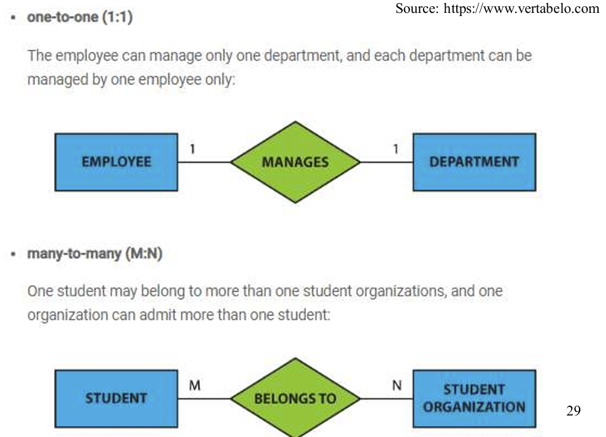

## 1. Overview：Database & DBMS

 −a collection of related data (i.e. facts and figures) that  can be processed to produce information. 

相关数据（即事实和数字）的集合，可通过处理产生信息。

- Example: the average marks can be produced from  data about marks of all students 

    例如：平均分可以从所有学生的分数数据中得出

−A database management system (DBMS) stores data  which can be retrieved, manipulated to produce  information.

数据库管理系统（DBMS）存储的数据可用于检索和操作，以生成信息。

>database首先存储数据，再由Database management system来操作数据。


## 2. DBMS ->database management system

### 2.1 Types：

 −Relational DBMS: holds tables of data 

−Object DBMS: holds objects (containing attributes) 

−Object-Relational DBMS: combines relational databases  (simplicity and efficiency) and ability of object databases to  store complex objects 

−NoSQL: (Not Only SQL) non-relational, distributed, open source and horizontally scalable with characteristics such as:  schema-free, easy replication support, simple API, eventually  consistent, capable of storing a huge amount of data etc.

-Relational DBMS：保存数据表

-Object DBMS：保存对象（包含属性）

-Object-Relational DBMS：结合了关系数据库（简单高效）和对象数据库存储复杂对象的能力

-NoSQL：（不仅是 SQL）非关系型、分布式、开源、可水平扩展，具有无模式、易于支持复制、API 简单、最终一致、可存储海量数据等特点。

### 2.2 Relational DBMS

uses the relational data model for  data storage and processing. Data is stored in tables called relations, e.g. the  Student table. Relations can be normalized. Each row in a relation contains a unique value, e.g.  SID Each column in a relation contains values from a same  domain, e.g. student id, name.

该系统使用关系数据模型进行数据存储和处理。数据存储在称为关系的表中，例如学生表。关系可以规范化。关系中的每一行都包含一个唯一值，如 SID 关系中的每一列都包含同一域中的值，如学生 ID、姓名。

#### 2.2.1 Concepts

 −Relation: also known as a table or file.  

−Tables: in a relation database, relations are saved in  the format of  tables. A table has rows and columns,  where rows represents records and columns  represent the attributes. 

−Tuple:A single row of a table, which contains a  single record for that relation.

−Domain: a set of acceptable values that a column is  allowed to contain, based on various properties and the  data type for the column.  应该是每个属性值的范围？

−Degree (of a relation): is the number of attributes in a  table. 

−structured query language (SQL) is used as the  standard database access language


### 2.3  ACID Properties 


1. Atomicity: this ensures either  all of the transaction succeeds  or none of it does. No part of  it should succeed only. If one  part of the transaction fails,  the whole transaction fails. 

2. Consistency: this ensures  that all data will be  consistent according to  all defined rules,  including constraints  applied on the database.
3. Isolation: this ensures  that all transactionswill  occur in isolation with no  transaction to be affected  by any other transaction.  For example, atransaction  cannot read data from any  othertransaction that  hasnot yet completed.
4. Durability: this  ensures that once a  transaction  iscommitted, it will  remain in the system.  Anychanges from the  transactionmust  bestored permanently.

> 原子性：部分出错，整体都不能运行

> 一致性：一样的数据在系统内保持一致

> 隔离性：数据不受其他数据的影响

> 持久性：这确保了事务一旦提交，就会保留在系统中。  事务的任何更改都必须永久保存。


## 3. Entity Relationship Model (ER)

also called an ER  schema.

### 3.1 Concepts

1. Entities: hold specific information (data). An entity  can be a real-world object, e.g. student, course, tutor 

2. Attributes: represents the properties(属性) of an entity.  Each attribute has a value, e.g., a student entity may  have a  name as an attribute with a value, John.

3.  Relationship: refers to the association or interactions  among entities, e.g. a student enrolls on a course,  enrolls is the relationship between a student and a  course 

4. Cardinality(基数): defines the number of entities, which can  be associated with the number of other entities via a  relationship as below: One-to-one  One-to-many  Many-to-one  Many-to-many

5. Degree of Relationship: the number of participating  entities in a relationship 

    Unary (= degree 1): a relationship exists between  occurrences of the same entity set, representing two entities  withdifferent roles with the same primary and foreign keys  

    同一实体集的出现之间存在关系，代表具有相同主键和外键的两个实体的不同角色

    Binary (= degree 2): a relationship type that involves  between two tables 

    Ternary (= degree 3): a relationship type that involves **many  to many relationships between three tables** 

     n-ary = degree n

> 区别cardinality和degree of relationship:
>
> 前者是指两个实体交互时，这两个实体中的对象的数量；
>
> 后者是指有几个实体参与了交互。


### 3.2 Notation->**−Chen’s notation** （符号）

 **−Crow’s Foot notation** 

**−Chen’s notation** 

​                                                                                                                             Note: This module will introduce **Chen’s notation.**

#### 3.2.1.Entity


1. Entity:

    

2. Weak Entity: an entity’s existence depends on the existence of  other entity type. 

    

3.  Associative entity – used to create **many-to-many**  relationship between different entities. 


#### 3.2.2 Attribute


1. attribute


2. Composite attribute 复合属性: 属性可以进一步被细分为更多属性。


3.  foreign key 就是别的实体中拿过来给这个实体的属性。

    

4.  Key attribute: used for the primary key that is underlined, e.g.  EID 就是有下划线的属性


5.  Derived attribute: calculated from other attributes, indicated  as dashed outline, e.g. Age calculated from Birthdate

可以从别的属性中计算而来的属性。


6.  Multi-valued attributes: attributes that have a set of values for  each entity.  
    - Example:  the degrees of an employee, which may include BSc,  MSc etc.


一个属性里有很多值，比如雇员的学位，包括理学士、硕士等。


#### 3.2.3 Relation


> 这里是说，weak relationship连接的两个实体，有一方是不能独立于另一方存在的。比如下图交易就不能独立于ATM存在。
>
> 而strong relation连接的两个实体，两方都是独立的个体。


#### 3.2.4 Degree of relationship

1.


> 一元关系：一个实体和它的特殊类型（子类）直接的关系，如上图的雇员里有监管层，雇员里也有监管和被监管的关系。


2. 


> 二元关系是一对多的关系哦。


3.


> 三元关系是多对多。


#### 3.2 5 Cardinality




#### 3.2.6  Participation

 −Total participation: every entity in the set is involved in the relationship,  e.g., each student must be guided by a professor (no students who are not  guided by any professor). This is represented by a double line. 

− Partial participation: not all entities in the set are involved in the  relationship, e.g., not every professor guides a student. This is represented by  a single line.

完全参与：集合中的每个实体都参与到关系中，例如，每个学生都必须接受一名教授 的指导（没有不受任何教授指导的学生）。用双线表示。

部分参与：并非集合中的所有实体都参与到关系中，例如，并非每个教授都指导学生。用单线表示。


## 4. Entity Relationship Diagram（ERD）

for modeling data in a domain in three ways, including:  conceptual, logical and physical ERD.

用于以概念、逻辑和物理 ERD 三种方式对域中的数据建模。

- conceptual and logical ERD used by business  analyst to model the data required.
- physical ERD used by database designer to refine (提炼) the design and produce the for presenting physical database structure ready for database construction.

### 4.1 Conceptual ERD

models information gathered from  business requirements, including  entities and its relationships at high level,  without about the detailed structure  such as columns or data types. 从业务需求中收集的信息模型，包括高层次的实体及其关系，而不涉及列或数据类型等详细结构。created by data architect from discussion  with business analysts, product owners  and other take holders. 由数据架构师与业务分析师、产品负责人和其他负责人讨论后创建。

−Conceptual ERD: Example –no columns or data types for entities.


### 4.2 Logical ERD

−also models information gathered from business  requirements, but more complex than conceptual model  with setting of column types 

−defines the detailed structure of the entities and its  relationships 

−forms the basis for the physical model 

−the types are platform independent. For example, the  actual table name and column names are not  necessarily matching the entity name and attributes in  the logical model. 

−Types: refer to the type of data in the corresponding  field in a table. They are optional (to aid business  analysis only).

-也对从业务需求中收集的信息进行建模，但比概念模型更复杂，需要设置列类型

-定义实体的详细结构及其关系

-构成物理模型的基础

-类型与平台无关。例如，实际表名和列名不一定与逻辑模型中的实体名称和属性相匹配。

-类型：指表格中相应字段的数据类型。它们是可选的（仅用于辅助业务分析）。


### 4.3 Physical ERD

−visually represents the actual database schema and it  is platform specific. For example, if a physical model  is designed for SQL Server then it cannot be  implemented into ORACLE simply because the data  structures are database specific and its columns' data  types will work working only on the targeted DB. 

−considers the convention and restriction, ensuring  primary keys, foreign keys and constraints to the  design

-直观地表示实际的数据库模式，并且是特定于平台的。例如，如果一个物理模型是为 SQL Server 设计的，那么它就不能在 ORACLE 中实现，原因很简单，数据结构是特定于数据库的，其列的数据类型只能在目标数据库中使用。

-考虑约定和限制，确保主键、外键和约束与设计一致


#### 4.3.1 KEY

 −Keys: used to link various tables in a database 

−Super keys: superset of a key, a set of one or more  attributes that are taken collectively to identify all  other attributes uniquely 

−Composite key: is composed of two or more  attributes, but it must be minimal 

−Candidate key: a simple or composite key that is  unique and minimal. It is minimal because every  column is necessary in order to attain uniqueness.

 −Primary Keys: an attribute or combination of  attributes that uniquely identifies one and only one  instance of an entity. 

−Foreign Keys: created to enable an attribute to relate  to another entity in a one-to-one or one-to-many  relationship.

**考后回溯：**

```
1.Composite key里的每一个子集都不是唯一的实体的标注，组合在一起也可能不是唯一的标注，就是用组合键可能会查找出来几个实体。composite key的意义就在于查找（或消除）相似的实体。
2.super key要识别出唯一的实体！！！但是子集可以是冗余的。
3.candidate key里每个子集也不能是唯一标注，不然就不是最小的super key了！但是组合在一起后查找的实体必须要有唯一性！！
```


#### 4.3.2 Null

