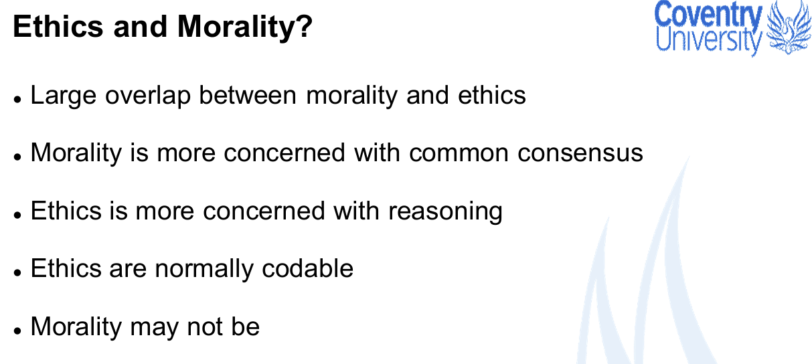
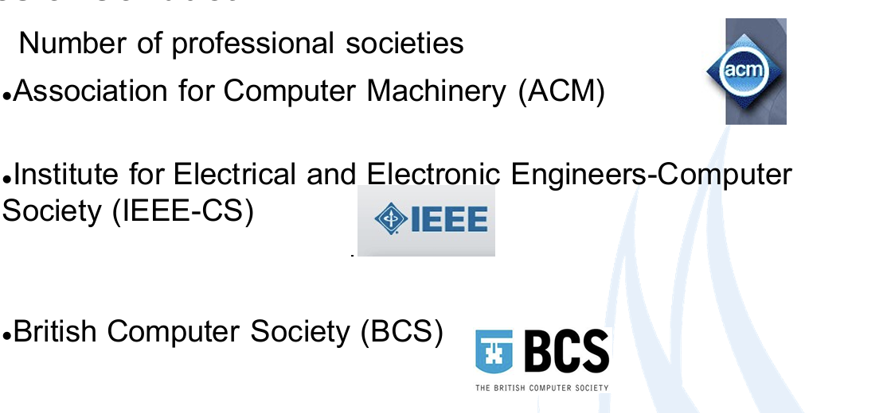

- **Lecture outline and aims** 

​        ~We will be looking at ethics and why they are important to us 

​        ~ We will be looking at the role of ethics in Computer Science 

​        ~ We will be looking at ethical frameworks and how we can use them to help guide us , including software design/development 

- By the end of the lecture you should - 

​        ~ Have an appreciation for **professional** ethics 

​        ~ Have an understanding of why professional ethics are a key part of computer science 

​        ~ Be able to apply an appropriate ethical code to a given situation

​         我们将探讨道德规范及其对我们的重要性

​         我们将探讨伦理在计算机科学中的作用

​         我们将探讨伦理框架，以及如何利用它们来帮助指导我们，包括软件设计/开发。

​         讲座结束时，您应该

​         对职业道德有所了解

​         理解为什么职业道德是计算机科学的重要组成部分

​         能够在特定情况下应用适当的道德规范

## 1. The beginning of Ethics

– Heraclitus (c. 535 – 475 BC) pre-Socratic Greek philosopher considered ethics as to a connection between a habitat and a personality of an individum.

- 赫拉克利特（约公元前 535 - 475 年）前苏格拉底时代的希腊哲学家,认为伦理是栖息地与个体人格之间的联系。

    (也就是个人和群体交互时的行为举止)

– Aristotle (384 – 322 BC) considered ethics to be a practical study, aimed at becoming good and doing good; a person has to poses a collection of ethical virtues or moral virtues (from lat. *moralitas* = manner, character, proper behaviour)

- 亚里士多德（公元前 384 年至公元前 322 年）认为伦理学是一门实践性的学问，旨在成为好人和做好事；一个人必须具备一系列伦理美德或道德美德（源自拉丁语 moralitas = 方式、性格、适当的行为）。

– Cicero (106 – 43 BC) Latin philosopher “On the ends of good and evil” - natural goodness of humanity.

- 西塞罗（公元前 106 年至公元前 43 年） 拉丁哲学家《论善恶之端》--人性本善。

**Kant's Ethics**

• Immanuel Kant (1724 - 1804) prominent figure of Western philosophy 

• “Foundations for the Metaphysics of Morals” (I.Kant, provides a philosophical foundation for what is commonly understood by “morality” and “moral action”

• Three concepts analysed: The Good Will, The Notion of Duty and the Nature of Imperatives

**康德的伦理学**

- 伊曼纽尔-康德（1724 - 1804） 西方哲学的杰出人物西方哲学。

- 《道德形而上学基础》（I.Kant、为人们通常理解的 "道德 "和 "伦理 "提供了“道德 "和 "道德行为 "的哲学基础。

- 分析了三个概念：善意、义务概念和命令的性质。

## 2. **Ethics, Morality and Moral**

### 2.1 Ethics and Morality

• Ethics is the area of human knowledge, philosophy and intellectual tradition which addresses questions about morality

• Morality – subject of study of Ethics

- 伦理学是人类知识、哲学和思想传统的一个领域，涉及道德问题

- 道德--伦理学的研究对象

### 2.2 Morality and Moral

• Georg Hegel (German philosopher, 1770 – 1831) considered differentiation between Morality (germ. Moralität) and Morals (germ. Sittlichkeit) – Sittlichkeit(ethical order) is the concept of "ethical life“

• Often Morality relates to society(s) while Moral relates to a person

- 格奥尔格-黑格尔（德国哲学家，1770 - 1831 年）认为道德（germ. Moralität）和道德（germ. Sittlichkeit）是有区别的，Sittlichkeit（伦理秩序）是 "伦理生活 "的概念。

- 道德通常与社会有关，而道德则与个人有关

## 3. 零碎知识点

### 3.1 How could one establish Morality?

- Descriptive approach (codex of behaviour/believes in a given  time/society, e.g. cultural relativism) 

​       描述性方法（特定时代/社会的行为/信仰法典，如文化相对主义）

- Normative approach 规范性方法

- On relation to Society-Relationship/behaviour within society according to the “Golden  rule” (compare with Lev.19:18 KJV)

    关于与社会的关系--根据 "黄金定律"处理社会关系/社会行为 

- On relation to a person-Independence of person’s own will-Criteria of humanity-True piece of mind (compare with jap. Heijoshin) 

    关于与人的关系--人自身意志的独立性--人性的标准--真正的心灵（与日本的 "平心 "比较）

### 3.2  Paradox of morality 道德悖论

- Deformation of morality: individ/society/state knows what is “good”  

- and what is “bad” and creates a justification to choose “bad”  because that would lead to a well-being of the chooser: 

–Fyodor Dostoyevsky’s “Crime and Punishment”  moral dilemmas of RodionRaskolnikov

–Daniel Defoe’s “Robinson Crusoe”  (the problem of cultural relativism (Friday is a cannibal...) 

Protagonist-centric morality

  道德的变形：个人/社会/国家知道什么是 "好"。

  什么是 "坏"，并为选择 "坏 "创造理由，因为这会给选择者带来福祉：

比如说：  费多尔-陀思妥耶夫斯基的《罪与罚》中罗季昂-拉斯柯尔尼科夫的道德困境

​                  丹尼尔-笛福的《鲁滨逊漂流记》（文化相对主义问题（星期五是个食人族......）

​                  以主角为中心的道德观

### 3.3 Integration ? 东西方，神学和哲学的融合

Philosophical and theological integration Many academics will have had a prior formation in Graeco Roman rather than Oriental philosophies:  Aristotle (384 –322 BC)instead of Confucius (551-479BC) Can “moral wisdom” be taught or transferred across?

3.3 融合？ 
哲学与神学的融合 许多学者之前接受的是格拉科罗马哲学而非东方哲学的熏陶：  亚里士多德（公元前 384-322 年）而不是孔子（公元前 551-479 年）的 "道德智慧 "可以传授或移植吗？

### 3.4   Applied Ethics 道德的应用

• Bioethics, Clinical, Business, Social, Professional and Environmental  ethics 

• Concerned with the following theories: 

–Utilitarianism (practical consequences of any action are  evaluated on the assumption of the “good” outcome) 

–Deontological ethics (obligation to perform the 'right' action)

–Virtue ethic

- 生物伦理、临床伦理、商业伦理、社会伦理、职业伦理和环境伦理

- 关注以下理论：

-功利主义（以 "好 "结果为假设来评估任何行动的实际后果）

-义务论伦理学（采取 "正确 "行动的义务）

-美德伦理

### 3.5  Moral dilemma 道德困境

–what is this?  

• Moral dilemma, is a situation where there is a choice to be  made between two options, neither of which resolves the  situation in an ethically acceptable fashion  
• Therefore societal and personal ethical guidelines can  provide no satisfactory outcome for the chooser 

• Moral dilemma assumes that a person will abide by  societal normative (e.g. codes of law/religious rules) in  order to make the choice

-这是什么？  

- 道德两难，是指在两个选项之间做出选择，而这两个选项都无法以道德上可接受的方式解决这种情况--因此，社会和个人道德准则无法为选择者提供令人满意的结果。

- 道德两难假定一个人会遵守社会规范（如法典/宗教规则）来做出选择

### 3.6 How we treat others

Two “popular” approaches 

1. Treating those as you would want to be treated-Associating your own preferences with that of another person-Encouraging empathy towards another-Requires an understanding of the situation and how it may affect others 
2. Justifying actions based on the consequences-Also referred to as “The ends justify the means”-Assumes the end result is greater than the sum total of negative impact throughout

两种 "流行 "方法

1. 以己度人--将自己的喜好与他人的喜好联系起来--鼓励对他人产生共鸣--要求了解情况及其可能对他人产生的影响

2. 根据后果为行动辩解--也称为 "目的证明手段正当"--假定最终结果大于整个负面影响的总和

## 4. Professional Ethics in IT

### 4.1  **Professional ethics**

Most professional bodies have a statement of professional ethics 

This statement says what is ethical behaviour for a member of that  profession –essentially a code of conduct 

May concern itself with the ethical implications of that discipline

大多数专业机构都有职业道德声明

该声明规定了该专业成员的道德行为--本质上是一种行为准则

可能涉及该学科的道德影响

### 4.2  Professional Ethics in IT

 Professional ethics in context of computing 

 Professional code of ethics and their functionality 

 Professional code of conduct for computing  professionals 

 Moral responsibilities of computing professionals

 计算机领域的职业道德

 职业道德准则及其功能

 计算机专业人员的职业行为准则

 计算机专业人员的道德责任

### 4.3  Who is a Computer Professional?

- According to ECDP（Engineers’ Council for Professional Development） a professional is one who  “**recognises his or her obligation to society by  living up to established and accepted codes of  conduct.**” 

根据 ECDP（工程师职业发展委员会）的定义专业人员是 "认识到自己对社会的义务，遵守既定和公认的行为准则 "的人。

- Broad terms a computer professional is “**any one employed in the  computer. IT or information / communication fields**.” 
- Narrow terms a software engineering team can be thought of those  who contribute by direct participation to the “**analysis,  specification, design, development, certification,  maintenance and testing of software systems**”

广义的计算机专业人员是指 "任何受雇于计算机、信息技术或信息/通信领域的人员"。信息技术或信息/通信领域"。

狭义的软件工程团队是指直接参与 "软件系统的分析、规范、设计、开发、认证、维护和测试 "的人员。

### 4.4 Professional Codes

#### 4.4.1 The purpose

根据功能分为: 

- Code of ethics -serve as mission statements and  provide vision and objectives 
- Codes of conduct -address the professional and  the professionals’ attitude and behaviour
- Codes of practice -relate to operational activities  within a profession

道德准则--作为使命宣言，提供愿景和目标

行为守则--涉及专业人员及专业人员的态度和行为

业务守则--涉及专业内的业务活动

 **According to the ACM**

 “The future of the computing profession depends on both  technical and ethical excellence. Not only is it important for  computing professionals to adhere to the principles expressed in  this Code, each member should encourage and support  adherence by other members.”

"计算机行业的未来取决于卓越的技术和道德。计算机专业人员不仅要遵守本《准则》所表达的原则，每位成员还应鼓励和支持其他成员遵守本《准则》"。

#### 4.4.2  Weakness of Professional Codes 

~Directives included in many codes tend to be too general and  too vague. 

~Codes are not always helpful when two or more directives  conflict. 

~A professional code's directives are never complete or  exhaustive. 

~Codes are ineffective (have no "teeth") in disciplinary matters. 

~Codes do not help us distinguish between microethicsissues  and macroethicsissues. 

~Directives in codes are sometimes inconsistent with one  another. 

~Codes can be self-serving for the profession.

~ 许多守则中的指令往往过于笼统和模糊。

~ 专业守则的指令从来都不完整或详尽。

~ 当两个或多个指令发生冲突时，守则并不总是有用的。

~ 准则中的指令有时相互矛盾。

~ 准则不能帮助我们区分微观伦理问题和宏观伦理问题。

~ 守则在纪律问题上不起作用（没有 "牙齿"）。

~ 准则可能对行业有利。

#### 4.4.3  Strengths of Professional Codes 

 Codes inspire the members of a profession to behave  ethically. 

 Codes guide the members of a profession in ethical choices 

 Codes educate the members of a profession about their  professional obligations. 

 Codes discipline members when they violate one or more of  the code's directives.

 Codes "sensitize" members of a profession to ethical issues  and alert them to ethical aspects they otherwise might  overlook. 

 Codes inform the public about the nature and roles of the  profession. 

 Codes enhance the profession in the eyes of the public.

 准则激励专业人员遵守职业道德。

 准则指导专业成员做出道德选择

 准则教育行业成员了解自己的职业义务。

 当成员违反一项或多项准则指令时，准则会对其进行惩戒。

 准则使行业成员对伦理问题 "敏感"，并提醒他们注意他们可能忽视的伦理方面。

 准则让公众了解行业的性质和作用。

 准则提升了专业在公众心目中的形象。

## 5. 几个协会和其准则

### 5.1  Association for Computer Machinery

- Founded in 1947 
- Over 80,000 members in 100 countries
- Web address https://www.acm.org/code-of-ethics 
- Produced  
    - General moral imptives 一般道德箴言
    -  More specific professional responsibilities   更具体的专业责任
    - Organizational leadership imperatives 组织领导要求
    - Compliance with the code 遵守守则

#### 5.1.1 General moral imptives

1.1 Contribute to society and to human well being,  acknowledging that all people are stakeholders in  computing…; 

1.2 Avoid harm…; 

1.3 Be honest and trustworthy…;  

1.4 Be fair and take action not to discriminate…; 

1.5 Respect the work required to produce new ideas,  inventions, creative works and computing artifacts…; 

1.6 Respect privacy …;  

1.7 Honour confidentiality…;

中文：

1.1 为社会和人类福祉做出贡献，承认所有人都是计算机领域的利益相关者.....；

1.2 避免伤害.....；

1.3 诚实守信.....；

1.4 做到公平，不歧视.....；

1.5 尊重产生新想法、新发明、创造性作品和计算机产品所需的工作.....；

1.6 尊重隐私.....；

1.7 遵守保密规定.....；

#### 5.1.2 More Specific  Professional Responsibilities

2.1 Strive to achieve the high quality in both the processes and products of  professional work….. 

2.2 Maintain high standards of professional competence, conduct and ethical  practice….  

2.3 Know and respect existing laws pertaining to professional work...  

2.4 Accept and provide appropriate professional review...  

2.5 Give comprehensive and thorough evaluations of computer systems and  their impacts, including analysis of possible risks...  

2.6 Perform work only in areas of competence...  

2.7 Foster public awareness and understanding of computing, related  technologies and their consequences...  

2.8 Access computing and communication resources only when authorized  or when compelled by the public good… 

2.9 Design and implement systems that are robustly and usably secure 

中文：

2.1 努力实现专业工作过程和产品的高质量.....

2.2 保持高标准的专业能力、行为和道德操守....  

2.3 了解并尊重与专业工作有关的现行法律...

2.4 接受并提供适当的专业审查...  

2.5 全面彻底地评估计算机系统及其影响，包括分析可能的风险...  

2.6 仅在能力范围内开展工作...  

2.7 促进公众对计算机、相关技术及其后果的认识和了解...  

2.8 只有在获得授权或出于公共利益的需要时，才能使用计算和通信资源...

2.9 设计和实施安全可靠、可用的系统...

#### 5.1.3 Professional Leadership  Principles

3.1 Ensure that the public good is the central concern during all  professional computing work... 

3.2 Articulate, encourage acceptance of, and evaluate fulfillment  of social responsibilities by members of the organizational or  group...  

3.3 Manage personnel and resources to  enhance the quality of  working life...  

3.4 Articulate, apply, and support policies and processes that  reflect the principles of the Code… 

3.5 Create opportunities for members of the organisationor group  to grow as professionals… 

3.6 Use care when modifying or retiring systems… 

3.7 Recongnise and take special care of systems that become  integrated into the infrastructure of society...

3.1 确保在所有专业计算机工作中以公共利益为中心...*

3.2 阐明、鼓励接受并评估组织或团体成员履行社会责任的情况...

3.3 管理人员和资源，提高工作生活质量...

3.4 阐述、应用和支持体现《准则》原则的政策和程序...

3.5 为组织或团体成员创造成长为专业人员的机会...

3.6 在修改或废除制度时要谨慎...

3.7 重新认识并特别关注已融入社会基础设施的系统...*

### 5.2  IEEE Code of Ethics 

 Founded in 1946  

 Nearly 100,000 members 

 Website https://www.computer.org/about 

 Produced：

​               IEEE Code of Ethics containing ten general  directives  

​               IEEE Code of Conduct containing 5 (fairly generic)  statements of behaviour 

#### 5.2.1 IEEE Code of Ethics

- to hold paramount the safety, health, and welfare of the public,  to strive to comply with ethical design and sustainable  development practices, and to disclose promptly factors that  might endanger the public or the environment; 
- to avoid real or perceived conflicts of interest whenever  possible, and to disclose them to affected parties when they do  exist; 
- to be honest and realistic in stating claims or estimates based  on available data;   
- to reject bribery in all its forms;   
- to improve the understanding by individuals and society of the  capabilities and societal implications of conventional and  emerging technologies, including intelligent systems; 

- to maintain and improve our technical competence and to  undertake technological tasks for others only if qualified by  training or experience, or after full disclosure of pertinent  limitations;   
- to seek, accept, and offer honest criticism of technical work, to  acknowledge and correct errors, and to credit properly the  contributions of others;   
- to treat fairly all persons and to not engage in acts of  discrimination based on race, religion, gender, disability, age,  national origin, sexual orientation, gender identity, or gender  expression; 
- to avoid injuring others, their property, reputation, or employment  by false or malicious action;   
- to assist colleagues and co-workers in their professional  development and to support them in following this code of ethics

#### 5.2.2  IEEE Code of Conduct

 General directives (five) instruct members: 

    - Be respectful of others 
    - Treat people fairly 
    - Avoid injuring others, their property, reputation or  employment 
    - Refrain from retaliation 
    - Comply with applicable laws in all countries where  IEEE does business and with the IEEE policies and  procedures

## 6.  Macro ethical issues in IT

- Access to information
- Intellectual property 
- Areas of use 
- Animal experiments 
- Human experiments

### 6.1 Access to information

1. Single, most complex ethical issue in IT 
2. Covers a wide range of areas –e.g. DRM, Privacy & confidentiality 隐私与保密,  information divide信息划分, etc. 
3. Need to strike a balance between protection and openness 信息保护和开放的平衡
4. Extremely polarised positions 两极分化
5. Legislation立法 exists that covers this are

### 6.2 Intellectual Property 知识产权

1. Really a subset of the access issue, but often treated in it's right  其实是6.1的一部分，但是有特殊之处要单独处理
2. What extent do we have a right to protect our own intellectual  property? (Sony rootkit?) 
3. To what extent do we have an ethical obligation to share our  intellectual property?

### 6.3 Areas of use

1. A very personal area –will depend on persons own individual ethics 

2. Most people have their own line, but working for a company it can be  hard to know when the line has been crossed.  

    & Cambridge Analytica–data science vs data privacy 

    &Cisco –great firewall of China 

    &Debian Social Contract

### 6.4  Animal experiments 

1. Not very common in IT, but does occur 
2. Primarily concerned with 
3. Neural networks 
4. Sensory studies 
5. Computers and technology used to support animal experiments

### 6.5  Human experiments 

1. Experiments may involve human subjects –these might  involve the following ethical considerations  

2. Consent –can it be given? 

3. Stress –repetitive testing, sensitive issues 

4. Demographics –are they representative? Is there a  case for using an under representative group 

5. Physical impact –sensory, ergonomics, biometrics 

6. Privacy 

7. Benefit

    

## 7. Ethics in Coventry

1. Coventry, like most Universities, has statements, regulations and  policies on research ethics 

2. All final year projects are subject to approval批准 - Ethical portal 

3. All research at Coventry must go through a research ethics  checklist –this includes undergrad dissertations! 

    考文垂的所有研究都必须通过研究伦理检查表，包括本科生的毕业论文！

4. If appropriate, the research must go through the Universities ethics  panel

    如果合适，研究必须通过大学伦理小组的审查

 **Ethics at Coventry：**

 Other activity is governed by 

   Professional ethics (subject) 

   Professional ethics (academic) 

   University policy and procedures (e.g. Equality and diversity  legislation)
