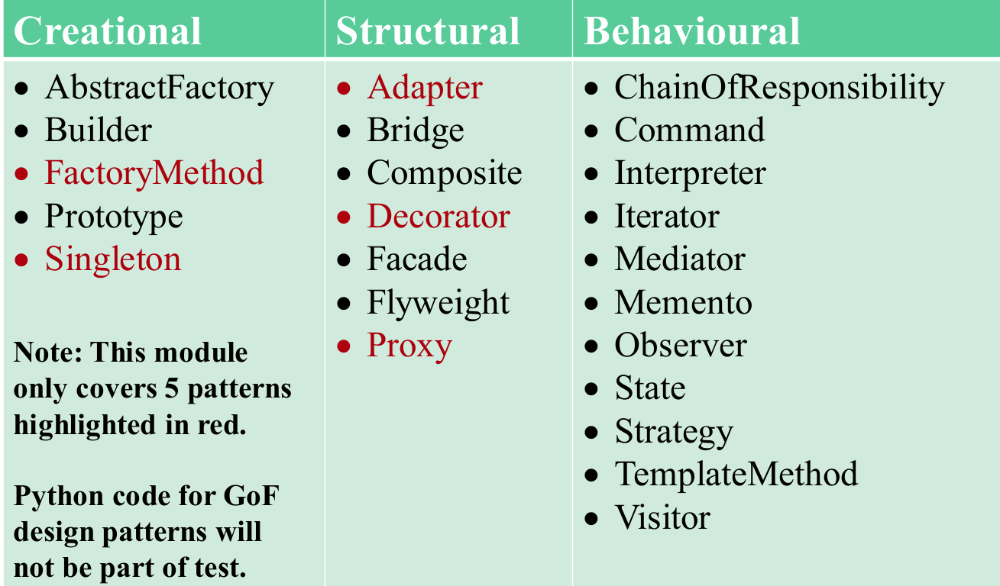

**Creational Patterns**

- separates a system from the  creation, composition and  representation of its objects ,  which increases the system's  flexibility in what, who, how, and  when of object creation.  

    它将系统与其对象的创建、组合和表示分离开来，从而提高了系统在对象创建的内容、对象创建者、创建方式和创建时间方面的灵活性。

- encapsulates the knowledge about  which classes a system uses and  hides the details of how the  instances of these classes are  created and structured. 

    封装了系统使用哪些类的知识，并隐藏了如何创建和构建这些类的实例的细节。

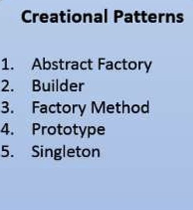

单例（Singleton）模式：类只能产生一个实例，保证全局使用的是同一对象。
原型（Prototype）模式：将一个对象作为原型，通过对其进行复制而克隆出多个和原型类似的新实例。
工厂方法（Factory Method）模式：定义一个用于创建产品的接口，由子类决定生产什么产品。
抽象工厂（Abstract Factory）模式：提供一个创建产品族的接口，其每个子类可以生产一系列相关的产品。
建造者（Builder）模式：将一个复杂对象分解成多个相对简单的部分，然后根据不同需要分别创建它们，最后构建成该复杂对象。

> **创建型模式的关注点是“怎样创建对象”，特点是“将对象的创建与使用分离”，使用者不需要关注对象的创建细节，对象的创建由相关的工厂来完成**

## 1.  Factory Method: UML

### 1.1 图示

An object is created without exposing the creation logic to the  external using a common interface.

使用通用接口创建对象时，无需向外部公开创建逻辑。

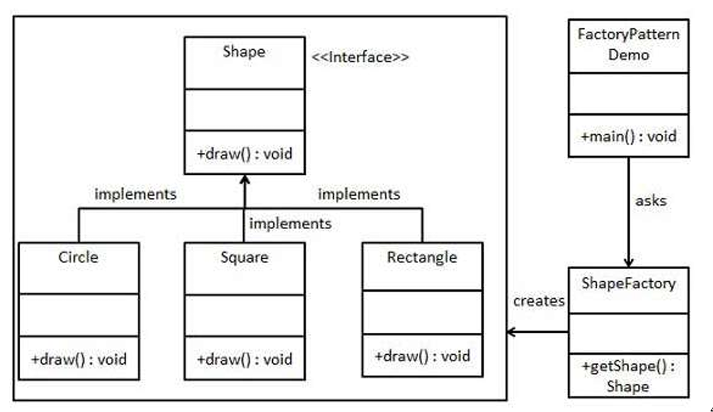

used to create objects, but allow which subclass to  instantiate, with various sub-types implementing the  interface

用于创建对象，允许实例化哪个子类，各种子类都实现了接口

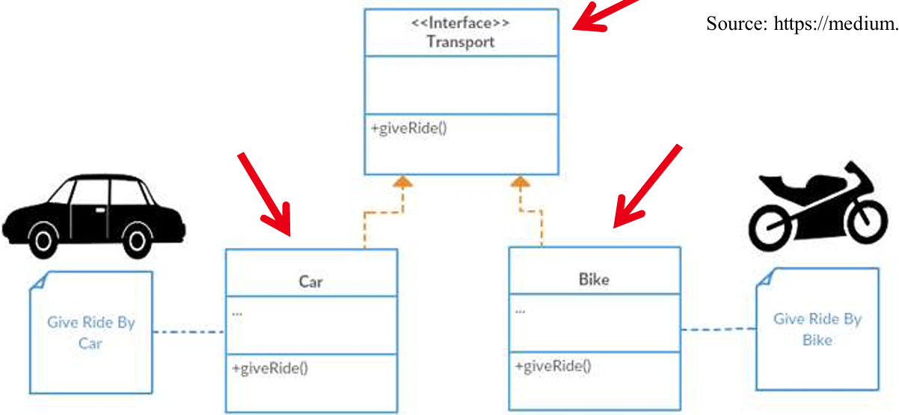

### 1.2 Python Example:

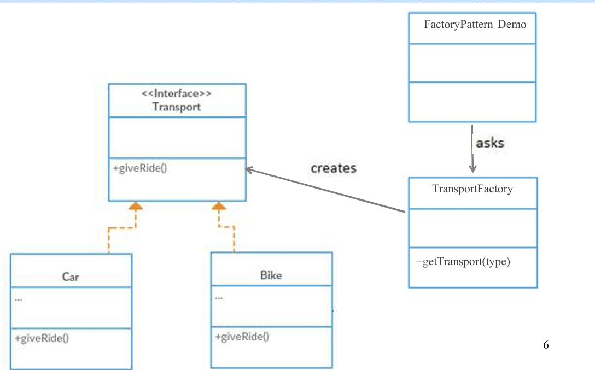

代码实现：

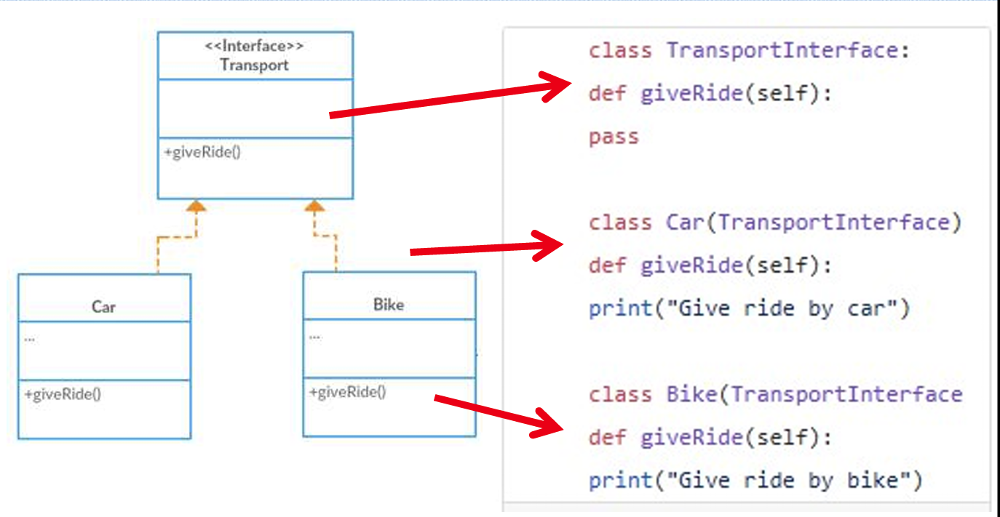

定义了创建对象的类和方法，子类可以覆盖这些类和方法，以指定要创建的派生类型。

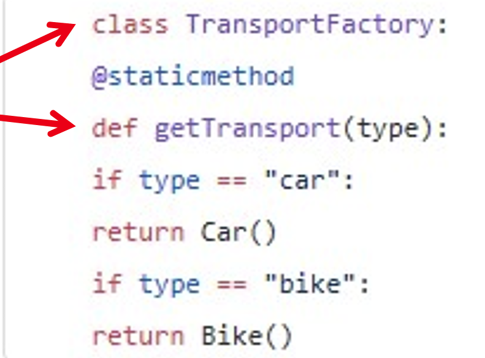

-在运行时，可以传递一个对象的描述，并返回一个指向该对象新实例的基类指针。

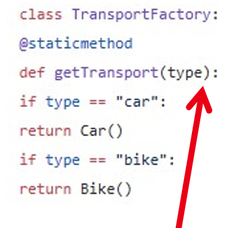

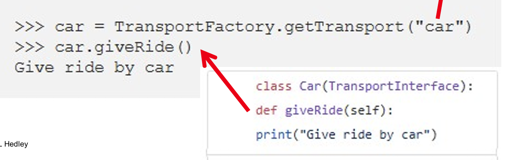

### 1.3 benefits

To support additional object types  

−is useful when requiring the creation of many  different types of objects, all derived from a  common base type. 

−when an additional class is required, and objects are  requested through a user interface, this pattern  would simply pass on the new information to the  factory, which would then handle the new types  entirely.

支持更多对象类型

-当需要创建多种不同类型的对象时，这种模式非常有用。

-当需要创建额外的类，并通过用户界面请求创建对象时，这种模式只需将新信息传递给工厂，工厂就能完全处理新类型。

### 1.4 实例

1. 汽车生产：

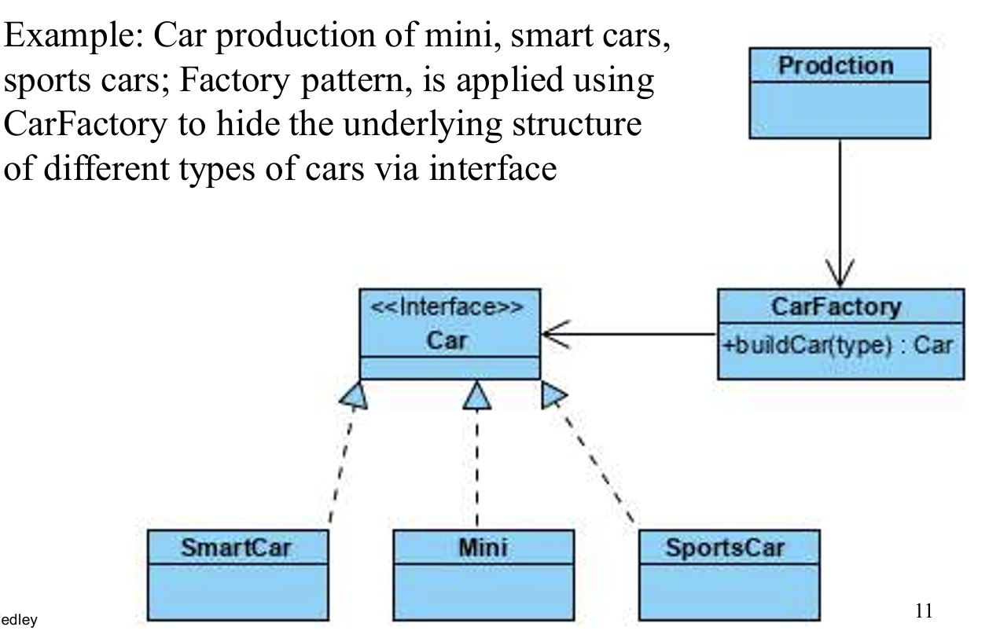

2. 手机生产：

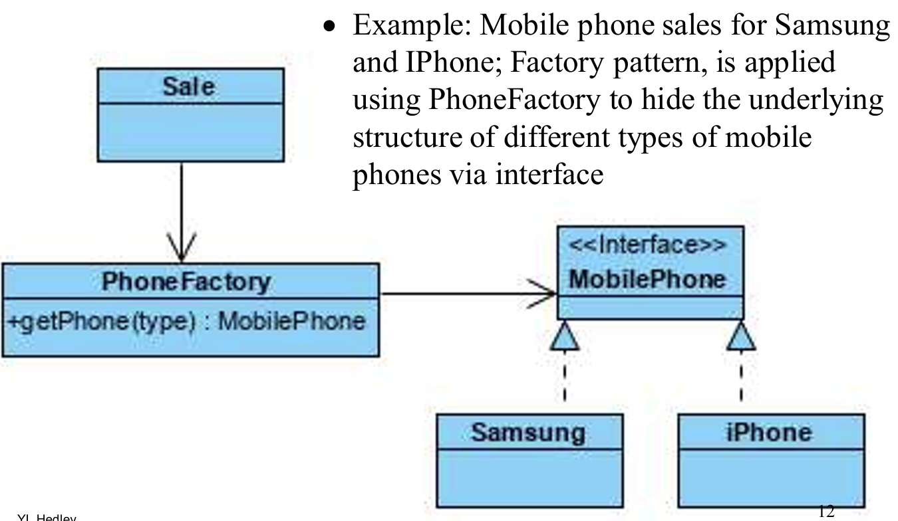

3. 销售订单：

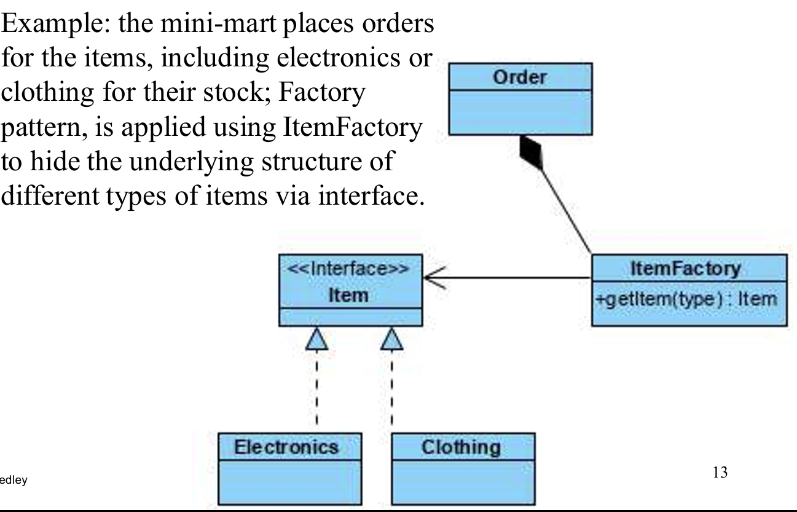

## 2. Singleton Pattern

 −enable a single class responsible to creates own object  while ensuring that only single object get created.  

−provides the access to its only object directly without  need to instantiate the object of the class. 

−useful when exactly one object is needed to  coordinate across the system, which allows the  system to operate more efficiently

-允许一个类负责创建自己的对象，同时确保只创建一个对象。  

-提供直接访问其唯一对象的权限，而无需实例化该类的对象。

-当整个系统只需要一个对象进行协调时，它就能派上用场，从而使系统更有效地运行

### 2.1 图示

- This pattern restricts  the instantiation of a  class to one object  only.  

- It provides a global  point of access to the  instance created.

    这种模式将一个类的实例化限制为只有一个对象。  

    它提供了一个访问所创建实例的全局点。

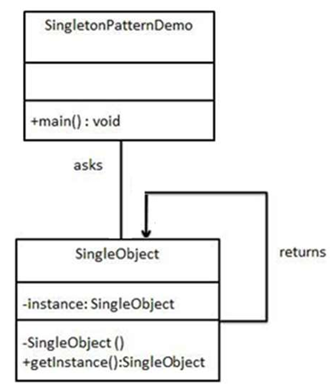

−Usually used for centralized management of internal  or external resources to provide a global point of  access to themselves. −should avoid introducing unnecessary restrictions in  situations where a sole instance of a class is not  actually required, and also introducing global state  into an application

-通常用于集中管理内部或外部资源，为其提供一个全局访问点。

-应避免在实际不需要类的唯一实例的情况下引入不必要的限制，并避免在应用程序中引入全局状态。

### 2.2 Python Example

Define a private static attribute for the single instance.

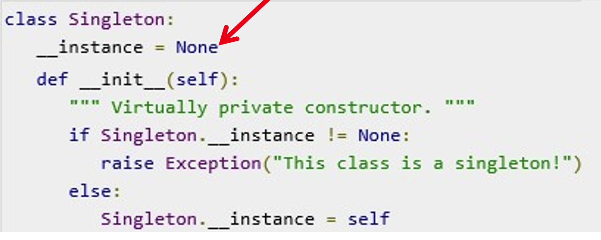

Define all constructors to be protected or private. 

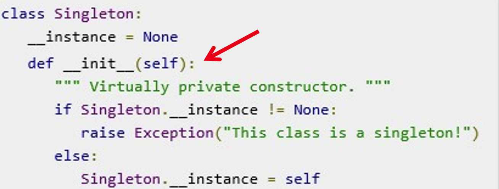

Define a public static accessor method (i.e. get  method, e.g. with no self in the parameter) in the  class; may only use the accessor method to  manipulate the Singleton.

在类中定义一个公共静态访问器方法（即 get 方法，例如参数中不包含 self）；只能使用访问器方法来操作 Singleton。

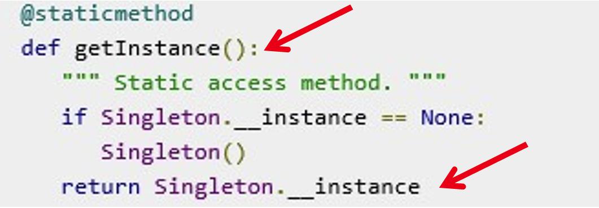

To run: only object is created

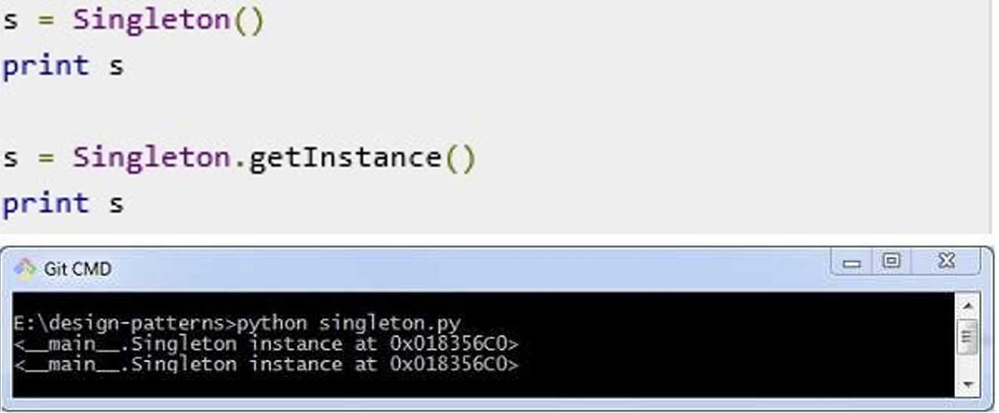

### 2.3 Use ‘lazy initialization’ (creation on first use)

 lazy initialization in programming refers to delaying the  creation of an object, the calculation of a value, or some  other expensive process until the first time it is needed. A  program only creates certain resources until the resource  is first needed thus freeing valuable memory space.

编程中的 "懒初始化 "是指将创建对象、计算数值或其他昂贵的过程推迟到首次需要时进行。程序只在首次需要时才创建某些资源，从而释放了宝贵的内存空间。

### 2.4 Example

1. the singleton  pattern is applied to  allow the clients to  access the database via  a single service point.

应用单例模式是为了让客户通过单个服务点访问数据库。

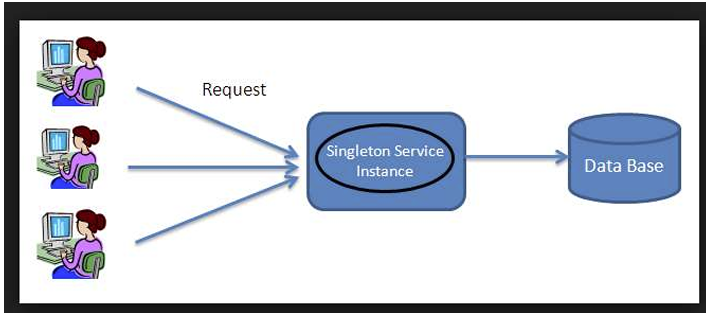

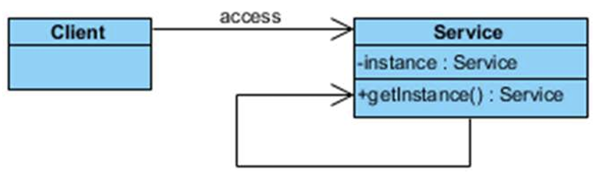

2. the singleton  pattern is applied to provide  the global access to a file  system

应用单例模式来提供文件系统的全局访问权限

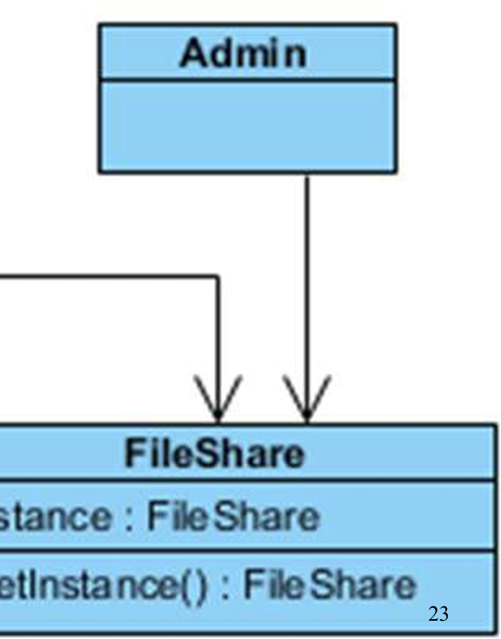

3. A logger  class provides a  global logging  access point in all  the application  components to  carry out a logging  operation.

日志记录器类为所有应用程序组件提供了一个全局日志记录访问点，以便执行日志记录操作。

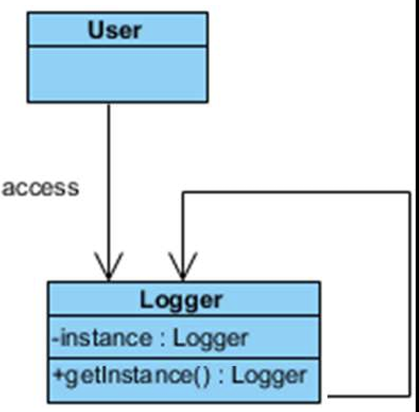

**Structural patterns**

These design patterns  relate to class and object  composition.    这些设计模式与类和对象的组成有关。

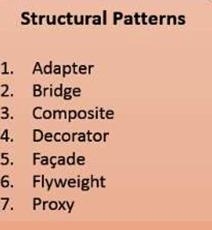

结构型模式描述如何将类或对象按某种布局组成更大的结构。它分为类结构型模式和对象结构型模式，前者采用继承机制来组织接口和类，后者釆用组合或聚合来组合对象。

代理（Proxy）模式：为某对象提供一种代理以控制对该对象的访问。即客户端通过代理间接地访问该对象，从而限制、增强或修改该对象的一些特性。
适配器（Adapter）模式：将一个类的接口转换成客户希望的另外一个接口，使得原本由于接口不兼容而不能一起工作的那些类能一起工作。
桥接（Bridge）模式：将抽象与实现分离，使它们可以独立变化。它是用组合关系代替继承关系来实现的，从而降低了抽象和实现这两个可变维度的耦合度。
装饰（Decorator）模式：动态地给对象增加一些职责，即增加其额外的功能。
外观（Facade）模式：为多个复杂的子系统提供一个一致的接口，使这些子系统更加容易被访问。
享元（Flyweight）模式：运用共享技术来有效地支持大量细粒度对象的复用。
组合（Composite）模式：将对象组合成树状层次结构，使用户对单个对象和组合对象具有一致的访问性。

## 3.  Proxy Pattern

provides an object a placeholder for another object to  control access to it, including:

为一个对象提供了另一个对象的占位符，以控制对该对象的访问，包括

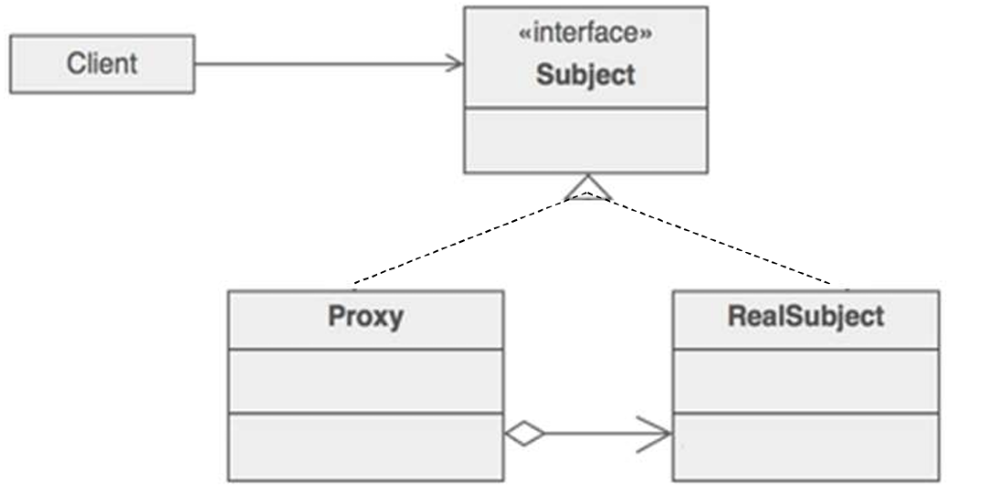

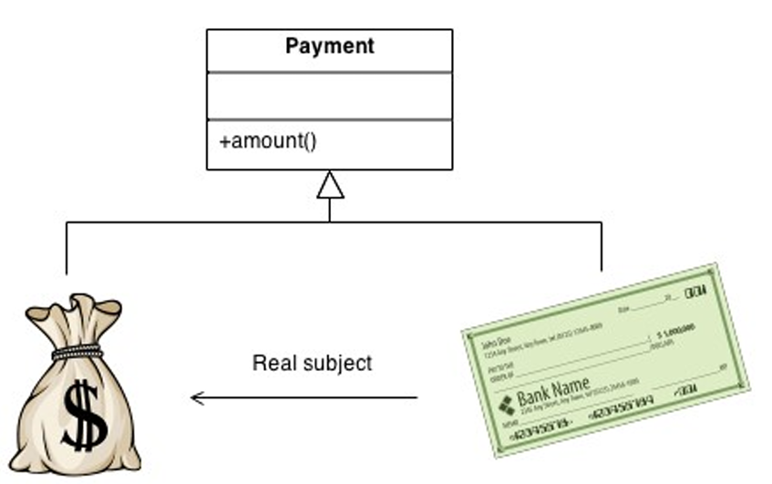

### 3.1 Remote Proxy

- provides a local representation of the object  which is present in the different address location
- provides the interface for remote resources such  as web service resources.

​        为存在于不同地址位置的对象提供本地表示法。

​        为远程资源（如网络服务资源）提供接口。

Example：

 −Example: When an object and its methods is running  on another computer, and cannot be called directly 

−Solution: To open a socket on the remote machine and  pass messages to the remote object via a protocol as if  the object was local. The methods  can be called on a  proxy object that forwards the calls to the real  object on the remote machine, such as in ASP.NET  (Active Server Pages for .NET), and in Java’s Remote  Method Invocation (RMI).

-举例说明当对象及其方法在另一台计算机上运行时，无法直接调用

-解决方法在远程计算机上打开一个套接字，通过协议向远程对象传递信息，就好像该对象是本地的一样。这些方法可以在代理对象上调用，代理对象会将调用转发给远程计算机上的真实对象，如 ASP.NET（.NET 的 Active Server Pages）和 Java 的远程方法调用（RMI）。

### 3.2 Smart Proxy

provides additional layer of security by interposing  some actions when the object is accessed. 

Example: a proxy to check if the real object is  locked before it is accessed to ensure that no other  object can change it. 

通过在访问对象时插入一些操作来提供额外的安全层。

例如：在访问真实对象前，代理会检查该对象是否已锁定，以确保其他对象无法更改该对象。

### 3.3 Protective Proxy

- acts as an authorisation layer to verify if the actual  user has access to appropriate content.  

- the proxy server can be used to provide a  restrictive access to resources. 

作为一个授权层，可验证实际用户是否能访问适当的内容。  

代理服务器可用于提供对资源的限制性访问。

Example：

​     −A company imposes a policy that employees  will now be prohibited internet access based on their  roles. All external emails websites will be blocked. 

−Solution:  

​     InternetAccess interface which consists of operation  grantInternetAccess().

​     RealInternetAccess which allows of internet access for all. 

​     ProxyInternetAccess which restricts the internet access,  which will check user’s role and grant access based on their  roles.

     -某公司实施了一项政策，根据员工的角色禁止他们访问互联网。所有外部电子邮件网站都将被屏蔽。

-解决方案

     InternetAccess 接口包括操作 grantInternetAccess()。
    
     RealInternetAccess 允许所有人访问互联网。
    
     ProxyInternetAccess 限制互联网访问，它将检查用户的角色并根据其角色授予访问权限。

### 3.4 Virtual Proxy

useful to save expensive memory resources when  there is an expensive operation, multiple proxies  can be created and pointed to the huge size memory  consuming object for further processing.  

The real object gets created only when a client  first requests/accesses the object and after that, the  proxy object can be referred and reused. This avoids  duplication of the object and hence saving memory.

当需要进行昂贵的操作时，可以创建多个代理，并将其指向消耗大量内存的对象，以便进一步处理，这对节省昂贵的内存资源非常有用。  

只有当客户端首次请求/访问对象时，才会创建真正的对象，之后就可以引用和重复使用代理对象。这就避免了对象的重复，从而节省了内存。

### 3.5 Python Example

Image loading：

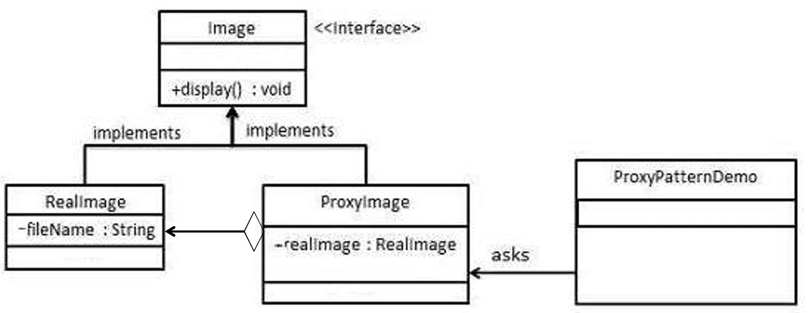-示例：真实图像包含大量数据，客户需要访问这些数据。  

-解决方案

   具有 display() 操作的图像界面。

  RealImager 运行在不同的系统上，包含从数据库访问和加载的图像信息。

  在不同系统上运行的 ProxyImage 可以在新系统中代表 RealImage。使用代理可以避免多次加载图像。

Python：

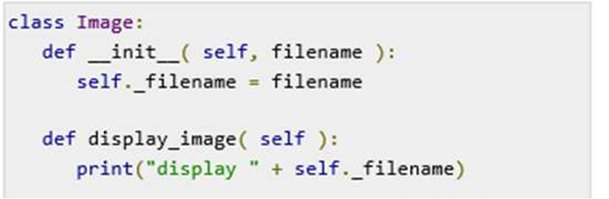

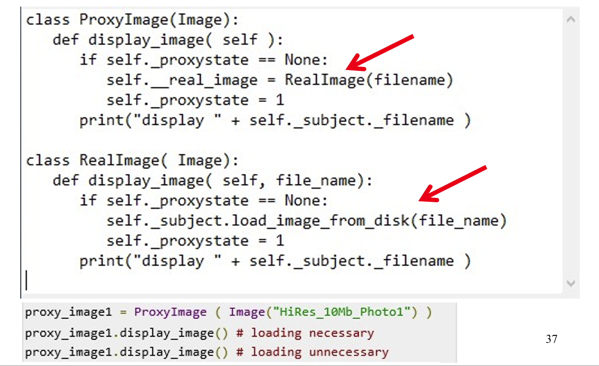

more Example：

the  proxy pattern  provides an proxy  object (i.e. ATM)  to the real object  (i.e. BankBranch)  for the customer  to access

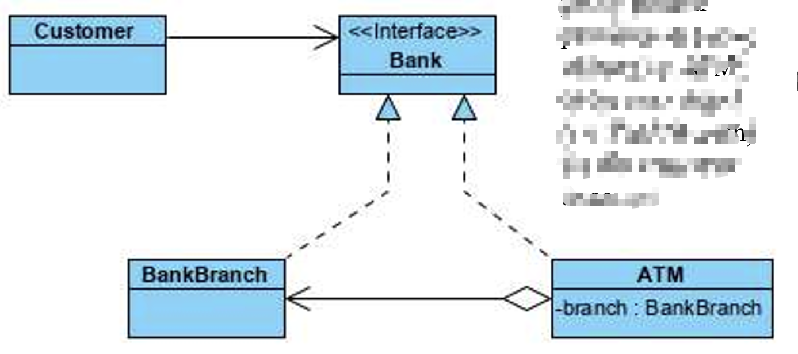

the Processor has RAM with cache memory; the  proxy pattern provides an proxy object (i.e. Cache) to the real  object (i.e. RAM) for the memory access.

处理器有带高速缓冲存储器的 RAM；代理模式为真实对象（即 RAM）提供了一个代理对象（即高速缓冲存储器），用于内存访问。

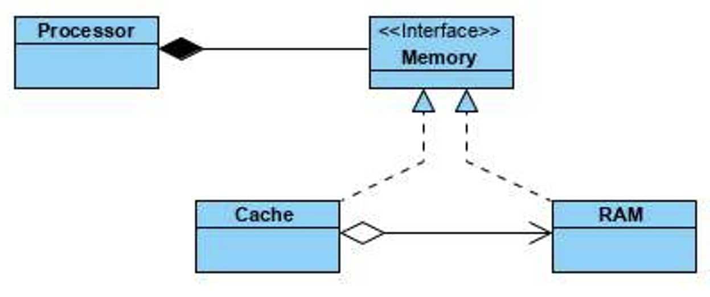

## 4. Adapter Patterns

 −works as a bridge between two incompatible interfaces.  

 −combines the capability of two independent interfaces

-充当两个不兼容接口之间的桥梁。  

 -整合两个独立接口的功能

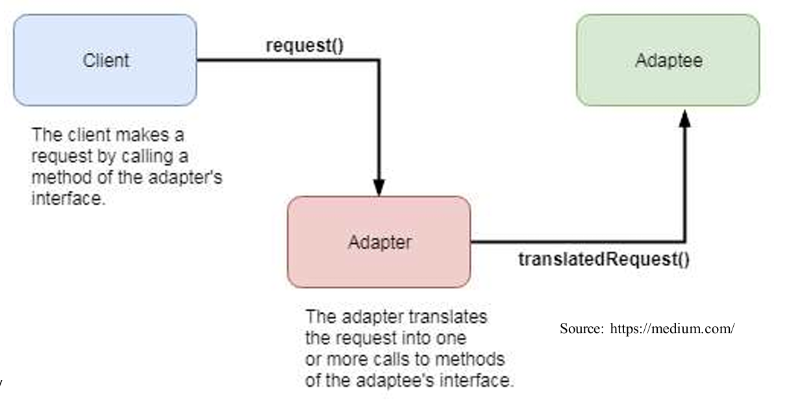

Example:

 card reader which acts as an adapter between  memory card and a laptop. A memory card can be plugged into  card reader and card reader into the laptop so that memory card  can be read via laptop.

读卡器是存储卡和笔记本电脑之间的适配器。将存储卡插入读卡器，再将读卡器插入笔记本电脑，即可通过笔记本电脑读取存储卡。

(移动硬盘)

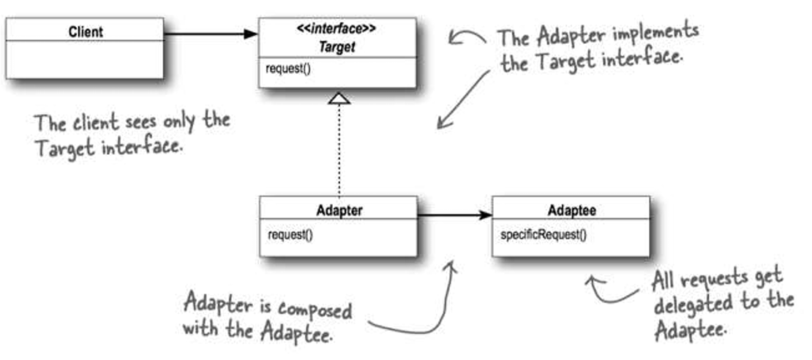

### 4.1 Python Example

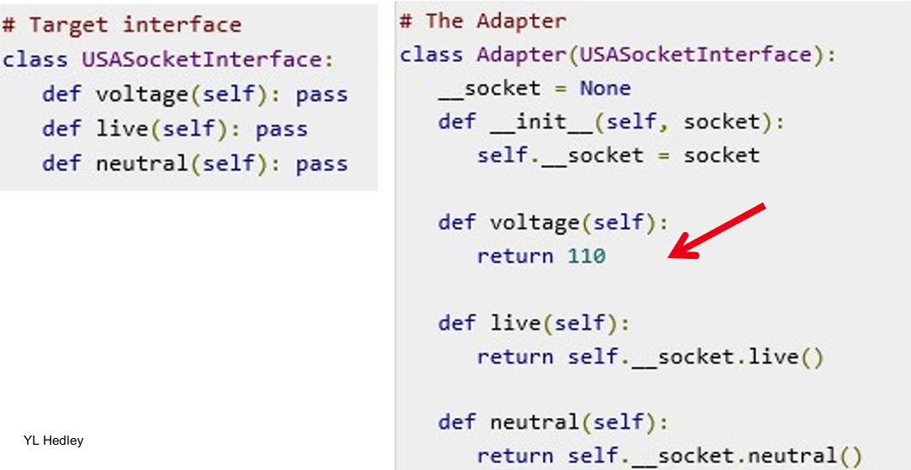

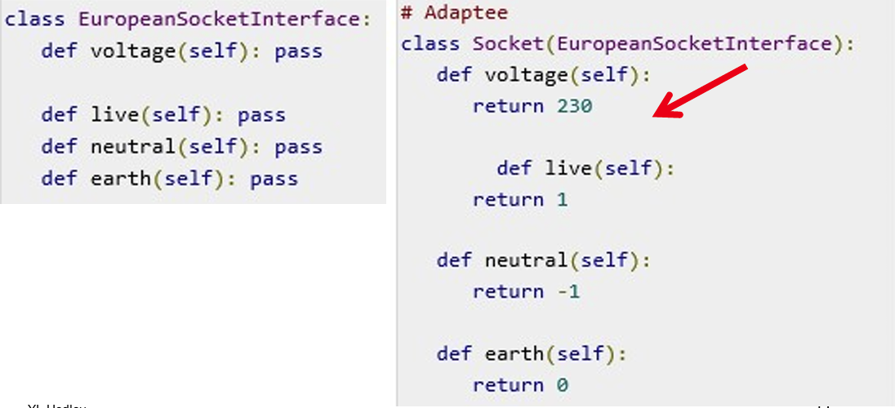

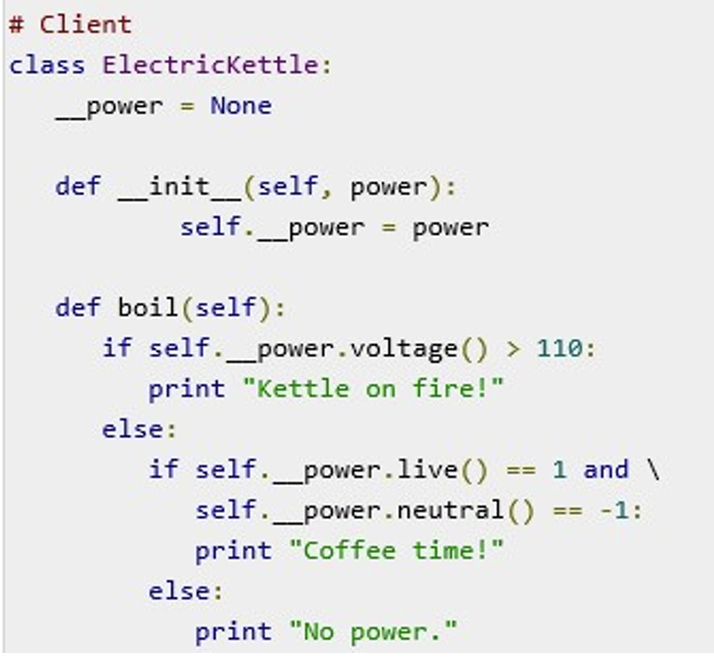

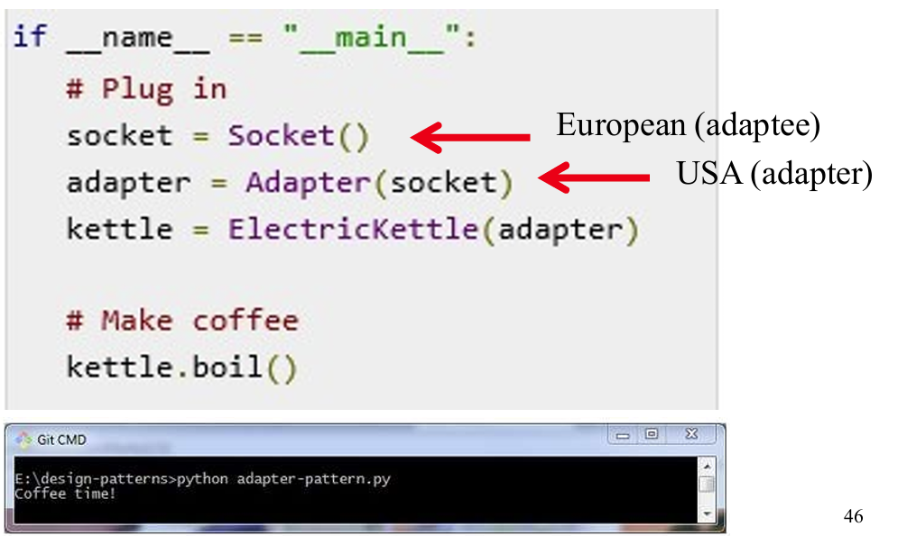

以上代码逻辑是，创建一个需要调用的类，创建一个Adapter有着这个类一部分的功能。创建一个Target调用Adapter里的方法。

一个例子是：调用不同的数据库： the database drivers to different types of databases

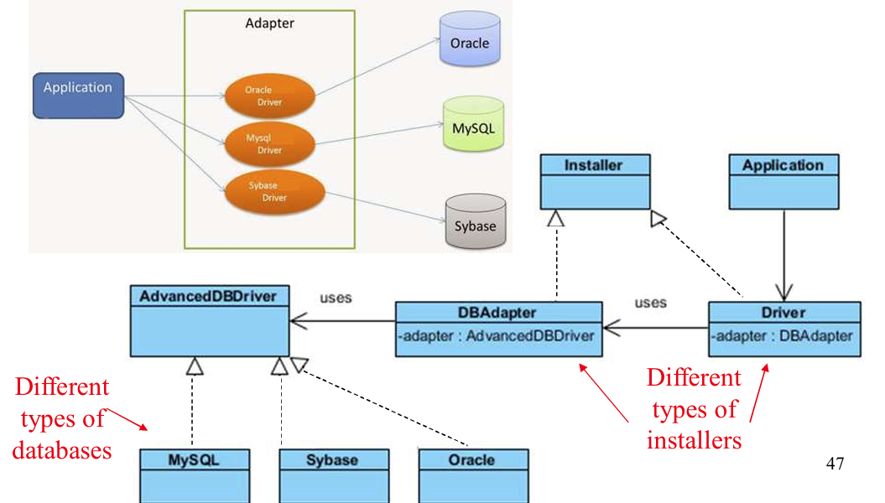

