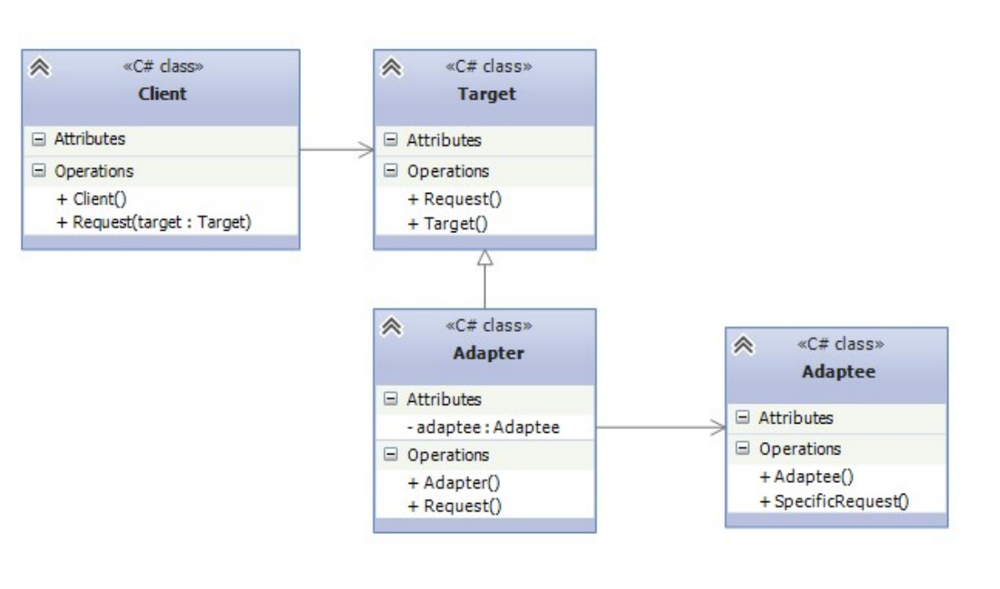
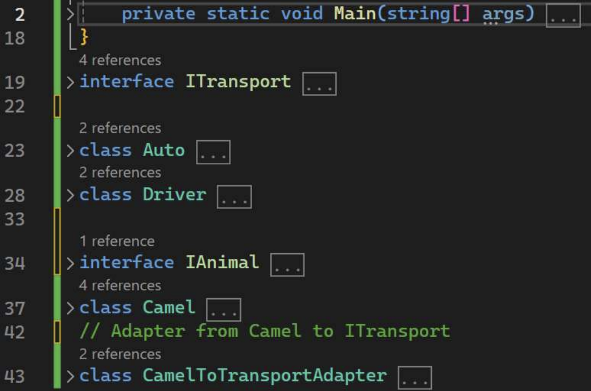
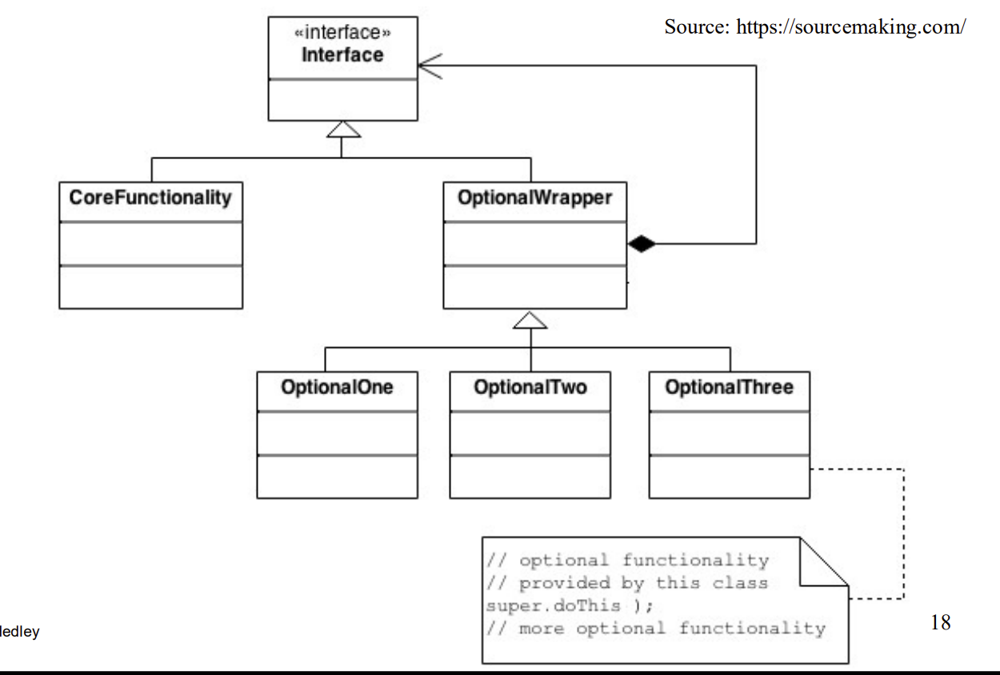
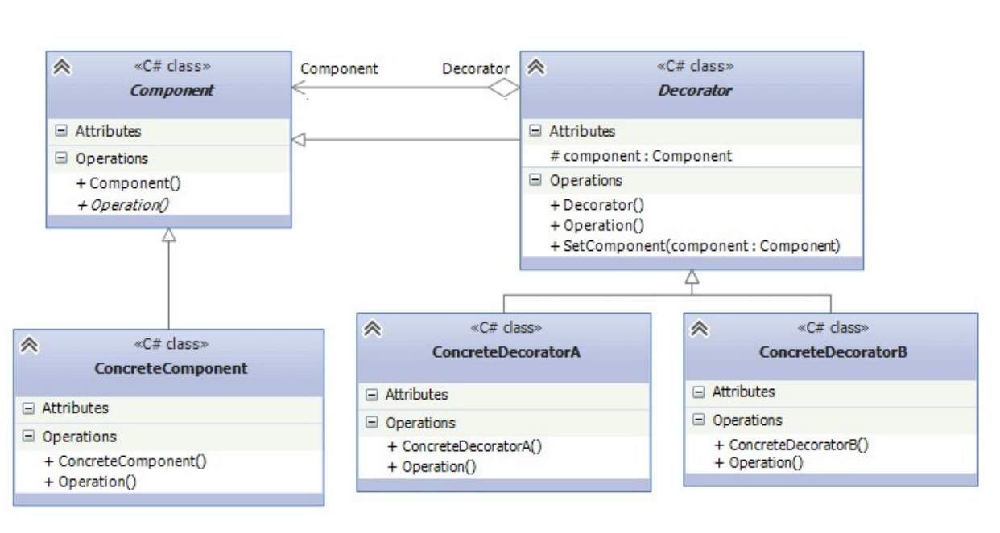
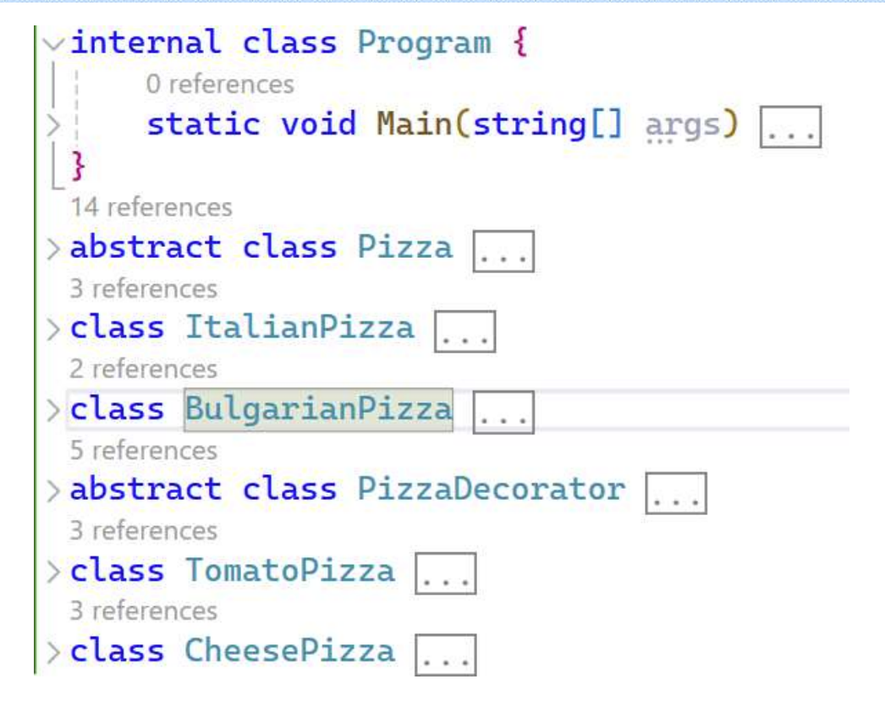
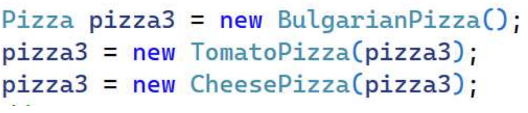
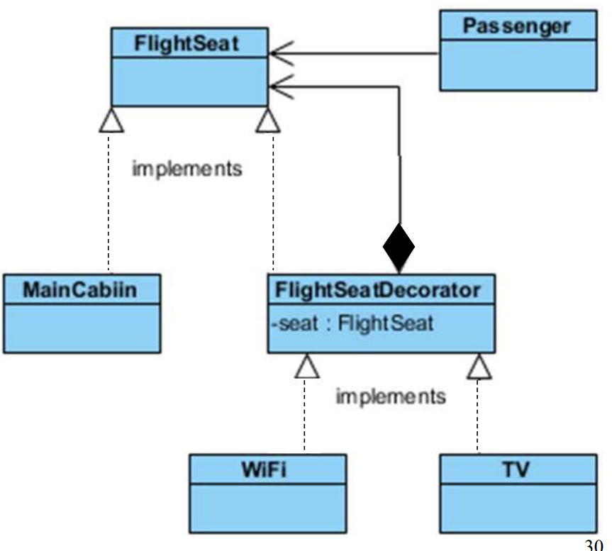
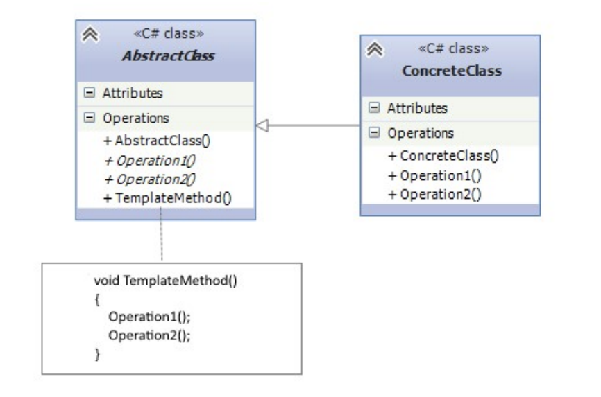

## 4. 接上回的Adapter Pattern


### 4.2 何时使用Adapter Pattern？

When to use? 

- We need to use an existing class BUT it’s interface doesn’t correspond to what needed 
- We need to use an existing class together with other classes but there is no compatible interfaces in between

我们需要使用一个现有的类，但它的接口与所需不符

我们需要使用一个现有类和其他类，但它们之间没有兼容的接口

Example：比方说，我们有一个乘车旅行的旅行者--但在某些时候，我们的旅行者必须穿越沙漠中的沙地，在那里他不能开车--但旅行者可以使用骆驼移动。但在类中，旅行者使用骆驼类的功能没有提供，因此我们需要使用一个适配器。


### 4.3 The participants:



- Target: presents objects that are used by the client  

    呈现客户端使用的对象

- Client: Use Target objects to implement its tasks 

    使用Target对象执行任务

- Adaptee: introduces an adaptable class that we would like to use from the client instead of Target objects

​       引入一个我们希望从客户端使用的可调整类，而不是 Target 对象 

- Adapter: Adapter itself, the adapter that allows you to work with Adaptee objects as with Target objects

​       可让您像使用Target对象一样使用 Adaptee 对象




## 5. Decorator Pattern

− allows a user to add new functionality to an existing object without altering its structure

− acts as a wrapper to existing class 

− creates a decorator class which wraps the original class and provides additional functionality keeping class methods intact 

− delivers more flexibility vs. inheritance

− used when inheritance is not acceptable

5.装饰器模式 - 允许用户在不改变现有对象结构的情况下为其添加新功能

- 充当现有类的包装器

- 创建一个装饰器类，对原类进行包装，并在保持类方法不变的情况下提供额外的功能

- 与继承相比，灵活性更高

- 在不接受继承时使用

### 5.1 图示

1.Decorator原理的示意图：



2. 继承和Decorator Pattern的区别和联系：

    

### 5.2 Participants

• Component: an abstract class that determines the interface for inherited objects 

• ConcreteComponent: a specific implementation of the component to which the decorator adds new functionality 

• Decorator: the decorator itself, implemented in the form of an abstract class and has the same base class, that and the decorated objects. Therefore, the basic Component class should be as easy as possible and determine only the basic interface. 

• ConcreteDecoratorA and ConcreteDecoratorB classes provide additional functionality, which should be expanded the ConcreteComponent object.

- 组件：一个抽象类，它决定了继承对象的接口

- 具体组件（ConcreteComponent）：组件的具体实现，装饰器为其添加新功能

- 装饰器（Decorator）：装饰器本身，以抽象类的形式实现，具有相同的基类、基类和被装饰对象。因此，基本组件类应尽可能简单，只确定基本接口。

- ConcreteDecoratorA 和 ConcreteDecoratorB 类提供了额外的功能，这些功能应扩展到 ConcreteComponent 对象中。


Pizza Example！！！



### 5.3 Pizza Example的C#代码示例

这里的组件是一个抽象类 Pizza，它以名称属性和方法的形式确定了基本功能。GetCost()。

```c#
abstract class Pizza
{
    public Pizza (string name)
    {
        this.Name = name;
    }
    public string Name { get; protected set; }
    public abstract int Getcost();
}
abstract class DecoratorPizza : Pizza
{
    protected Pizza pizaa;
    public DecoratorPizza(string name,Pizza pizza):base(name)
    {
        this.pizaa = pizza;
    }
}
class TomatoPizza : DecoratorPizza
{
    public TomatoPizza(Pizza p):base(p.Name + "with tomatoes" + p) { }
    public override int Getcost()
    {
        return pizza.Getcost() + 3;
    }
}
```



### 5.4 UML




## 6. Template Method Pattern

Template Method pattern determines the general algorithm of subclass behaviour, allowing them to override the individual steps of this algorithm without changing its structure.

模板方法模式决定了子类行为的一般算法，允许子类在不改变其结构的情况下覆盖该算法的各个步骤。



### 6.1 Paticipant

- AbstractClass: Determines a Template Method TemplateMethod() that implements the algorithm. The algorithm may consist of a sequence of calls of other methods, some of which can be abstract and must be override in heir classes 
- The method TemplateMethod() could not not be overrified 
- ConcreteClass: A subclass that can override various parent class methods.

抽象类：确定实现算法的模板方法 TemplateMethod()。该算法可能由一系列其他方法的调用组成，其中一些方法可能是抽象的，必须在继承类中覆盖。

不能覆盖 TemplateMethod() 方法

具体类（ConcreteClass）：子类：可覆盖父类各种方法的子类。


## 7. The principles of SOLID

**• Single Responsibility Principle** 

**• Open/Closed Principle** 

**• Liskov’s the Substitution Principle**

**• Interface Segregation Principle** 

**• Dependency Inversion Principle**

- 单一责任原则

- 开放/封闭原则

- 利斯科夫替代原则

- 接口隔离原则

- 依赖反转原则

### 7.1 Single Responsibility Principle(SRP)

• A module should be responsible to one, and only one, actor 

• Classes should have only one reason to change

• Every module, class, or function in a computer program should have responsibility over a single part of that program's functionality

- 一个模块应该只对一个角色负责 
- 类应该只有一个改变的理由 
- 计算机程序中的每个模块、类或函数都应该只对该程序功能的一个部分负责

### 7.2 Open/Closed Principle (OCP)

• The OCP states that software entities should be open for extension, but closed for modification

• The OCP implies that such entities – classes, functions, and so on – should be created in a way that their core functionalities can be extended to other entities without altering the initial entity's source code

- OCP 规定，软件实体应可扩展，但不可修改。

- OCP 意味着这些实体（类、函数等）的创建方式应使其核心功能可以扩展到其他实体，而无需更改初始实体的源代码

### 7.3 Liskov Substitution Principle (LSP)

• LSP guides how to use inheritance in OOP 

• LSP is about subtyping, and how to correctly derive a type from a base type 

• LSP implies that when an instance of a class is passed/extended to another class, the inheriting class should have a use case for all the properties and behaviour of the inherited class

- LSP 指导如何在 OOP 中使用继承

- LSP 是关于子类型的，以及如何从基本类型正确派生类型

- LSP 意味着，当一个类的实例被传递/扩展到另一个类时，继承类应该对被继承类的所有属性和行为都有一个用例

### 7.4 Interface Segregation Principle (ISP) 

• ISP states that the interface of a program should be split in a way that the user/client would only have access to the necessary methods related to their needs 

• In other words, uesrs/clients should not be forced to depend on methods they do not use

- ISP 规定，程序界面的分割方式应使用户/客户只能访问与其需求相关的必要方法。

- 换言之，用户/客户不应被迫依赖于他们不使用的方法

### 7.5 Dependency Inversion Principle (DIP) 

• The top-level modules should not depend on the lower-level modules. Both of them must depend on abstractions 

• Abstractions should not depend on details. Details (concrete implementation) should depend on abstractions

- 顶级模块不应依赖于低级模块。它们都必须依赖抽象

- 抽象不应依赖于细节。细节（具体实现）应依赖于抽象


## 8. Model-view-Controllor(MVC) pattern

• MVC architectural pattern separates an application into three main groups of components: Models, Views, and Controller

• MVC pattern helps to achieve separation of concerns

- MVC 架构模式将应用程序分为三大类组件：模型、视图和控制器

- MVC 模式有助于实现关注点分离

• Model represents the state of the application and any business logic 

• Views are responsible for presenting content through the user interface 

• Controllers are the components that handle user interaction, work with the model, and ultimately select a view to render 

• MVC most known example : – ASP.NET Core MVC

- 模型代表应用程序的状态和任何业务逻辑

- 视图负责通过用户界面呈现内容

- 控制器是处理用户交互、与模型协同工作并最终选择要呈现的视图的组件

- MVC 最著名的示例：- ASP.NET Core MVC
