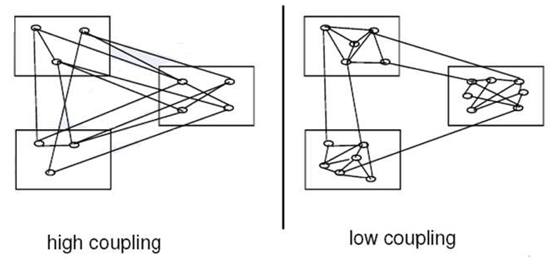

## 1. OO Software Design Concepts

### 1.1 Abstraction

- Data abstraction:  The  developer and other objects in  the system have a high level  summary view (an abstract  view) of what data items are.  It contains the required information  about an object. 
-  Procedure abstraction:  A high level summary view  of the operations provided.   The details and how the  methods are coded are  ignored.

就是变量名称和方法名称要简单直接。比如我们想输出一个人的姓名，方法可以叫printname。

### 1.2 Encapsulation

#### 1.2.1 Class/Object

 The attributes (data) relating to an object and the  operations that act upon them are all encapsulated inside  a single software “capsule”.

变量和操作一起被封装在对象中。

#### 1.2.2 Aggregation/Composition

 via aggregation and composition to encapsulate  components.

encapsulates a group of classes collectively, as a  complex whole is made of similar components  (parts)

把一组类封装起来。

### 1.3 Information Hiding

- Data Hiding:  the developer and  other  objects in the system have no  direct access to the attributes  (which are private) or the detail of  how the attributes are stored.   
- Procedure Hiding:  The  developer and other objects in the  system do not know the detail of  how the methods work. The name  of a method is public, but the code  body of the method is hidden. (内置函数)

> The access to the data via accessor methods (e.g get methods, get_username ();  modification of the data via mutator methods (e.g. set methods, set_username ()

上图是Example of procedure hiding

### 1.4  Separation of Concerns & Modularity

-  Separation of Concerns − Refers to a given problem that involves different areas  of concerns to be identified and separated to deal with  complexity, and to achieve required engineering  quality) 

- For example: The inputs/outputs, logic of a program  are separated from data storage(whose primary  concern is to store data).

Modularity − Relating to separation of concerns 

− separating software into components/modules,  according to functionality and responsibility 

− ignore details of other modules when dealing with a  module 

− **cohesion and coupling** 

- module understandable as a meaningful unit and  components of a module are closely related to one  another 

- modules have interactions with others

#### 1.4.1 Cohesion

 Each module  should be highly  cohesive: module  understandable as  a meaningful unit;  components of a  module are closely  related to one  another. (module内部紧密联系)

1. **Operation cohesion:** the degree of an  operation achieves a  single functional  requirement.

Chinese：操作实现单一功能要求的程度。

> High operation  cohesion = good  design

2. **Class cohesion**: the degree  of a class achieves a single  requirement.

类实现单一功能的程度。 

- A class should only  have attributes and  operations related to its  objects（属性和操作要紧密与对象联系） 

- Data classes should just  handle data. 

    > High class cohesion =  good design

Example：

这是一个好的软件设计吗？不是。course不是直属与student的属性。（Student class should only have  attributes and operations related to its  objects ）

这样才是一个好的软件设计。

3. Specialisation cohesion:  semantic cohesion of  inheritance hierarchies.  Super-class and its  subclasses should be  closely related.

超类和子类要密切关联。

> High specialisation  cohesion = good  design

下面这是一个好的软件设计吗？

不是。Part-time Course与student联系不紧密。（Part time Course is not a type of Student.）

#### 1.4.2 Coupling

 Coupling: degree of  interaction between  objects 

− Interaction coupling 

– the number of  message types an  object sends to other  objects and number of  parameters passed  with the messages 

/一个对象发送给其他对象的信息类型数量，以及与信息一起传递的参数数量/

> Low Interaction  coupling = good  design

1. 直观例子：

 A Student object can interact and send message to a Course object  (e.g. the Course object reference, course, is placed in the attribute of  the Student class), which means a Student object can call on the  methods of a Course object

student 中出现了course 这就是耦合。

2. 图示：

- Modules should exhibit low coupling:  modules have low  interactions with others.(就是模块间的耦合度要小)
- Strong Coupling or High Coupling (except class inheritance)  should be avoided.

3. **Inheritance  Coupling** :

 the features from a  subclass inherited from  its super class  

> High inheritance  coupling  (i.e.  Subclass inherits  more its super class  features) = good  design

Exercise:

A. 因为子类继承了更多父类的feature。

### 1.5  Reusability

#### 1.5.1 Aggregation and composition

encapsulates a group of classes collectively for a reuse subassembly, as a complex whole is made of similar  components (parts); more parts can be added to the whole  component.

这里就是说模块和模块之间Aggregation和composition的关系。

 

#### 1.5.2  Generalisation/Specialisation (Inheritance)

 allows the creation of new specialised classes when needed, as  new specialised subclasses will inherit the characteristics of  existing superclasses; e.g. class, MSc Student, can be added to  the hierarchy

#### 1.5.3 Example

A buyer, seller or an agent in an estate agent  appointment booking system. 

 Question: Is the following via inheritance a good design?

不是。

**WHY？**

1. Criterion for inheritance 1: **when a subclass expresses "is a special  kind/type of" and not "is a role played by a”**

而seller,buyer,agent is a role played by a person.

2. Criterion for inheritance 2: **An instance of a subclass never needs  to become an object of another class:**

而这个例子中，一个person可以从seller变成buyer在变成agent，所以这里最好是用Aggregation&Composition关系。

当然，我们也可以这样表示这个模型：

## 2. Design principle

### 2.1  Open-Closed

summary: Software entities should be  open for extension, whilst keeping closed for  modification.

- Open For Extension -The behaviour of the module  can be extended to meet new requirements.
- Closed For Modification –change to the source  code of the module should be kept to a minimum.

## 3.  Design pattern

上下文−a general reusable solution to a commonly occurring  problem within a given context in software design

> Context helps the understanding the environment of  a problem and reaching an appropriate solution 

设计模版，解决相似问题−is not a finished design to be transformed directly into  code, rather a description or template for how to  solve a problem that can be used in many different  situations.

> A good design pattern captures design knowledge to be  reusedin different settings

Categories：

- Architectural Patterns: presenting a fundamental  structural schema for a software system −e.g. “MVC” patterns 

- Design Patterns: providing a scheme for refining the  subsystems or components of a software system 

    −General Patterns giving fundamental approaches for assigning  responsibilities to objects; basic well-known design guidelines 

    ​    e.g. the “GRASP” set of patterns. 

    −Design Patterns for more specific but common  contexts/problems. 

    ​    e.g. the “Observer” 

    ​    Usually specific enough to include a UML model of the  outline solution.
    
    类别：
    
    -体系结构模式：为软件系统提供基本的结构模式，例如“MVC”模式
    
    -设计模式：提供细化软件系统的子系统或组件的方案
    
    −通用模式，给出了将责任分配给对象的基本方法；众所周知的基本设计准则
    
        例如“GRASP”模式集。
    
    −针对更具体但常见的上下文/问题的设计模式。
    
        例如“观察员”
        
        通常足够具体，以包括大纲解决方案的UML模型。

### 3.1 **GRASP**

General, Responsibility, Assignment, Software,  Patterns

#### 3.1.1 Controller

- Problem: Who should be responsible for handling a  system event or business logic?  

    − System event examples: an external input event, e.g., a cashier  scans an item to register a sale or ‘performing a sell check’,  when pressing the spell check button in a word processor 

- Solution: Assign responsibility for handling a system event message to a class 

专门处理逻辑操作的模块。图示如下：

#### 3.1.2 Polymorphism 多态性

- Problem: How to handle alternative behaviour that  depends on type? How to create pluggable software  components? 
- Solution: Assign responsibility for the alternative  behaviour – using polymorphic operations – to the types  for which the  behaviour varies.

继承？子类和父类

Actual Solution: Make each type  a subclass of Payment. Payment  will have an operation  “calPayment”. 

– In subclass Credit Card, to  override/redefine the above  inherited operation to define how  it is calculated for credit card  payment （这里是Credit Card覆盖了父类的方法，创建了自己独特的方法。）

– In Cash to reflect how it is done  for cash payment. So, there is no  need to check what type of  Payment it is every time.

– if an Credit Card object is  called, then the ‘calPayment’  method will be executed with a  5% charge

– if an Cash object is called, then  the ‘calPayment’ method will  be executed without any charge

### 3.2 GoF Patterns

 ‘Gang of Four’ (GOF, Erich Gamma, Richard Helm,  Ralph Johnson, and John Vlissides) analysed 23 Design  patterns which provide solutions to general problems  faced during software development as follows: 

− Creational patterns - manage the creation of objects 

− Structural patterns - describe how objects are  connected together to form more complex objects 

− Behavioural patterns - describe how code is organized,  to assign responsibility or roles to certain classes, and  to specify the way objects communicate with each  other 

