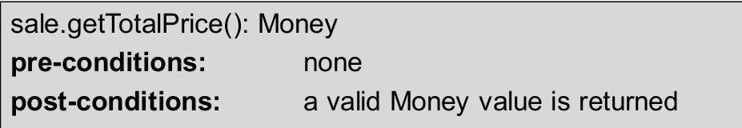

## 1. Methodology

### 1.1 Define

−a paradigm(i.e. approach) to be used 

−a precise lifecycle to be used (and further sub stages) 

−the exact modelling and other proven techniquesto  be used at each lifecycle stage (defining how they  are to be used). 

​    a commercial Computer Aided Software  Engineering (CASE) tool often used (such as  Visual Paradigm for business process modelling  and object oriented design)

方法定义

-要使用的范例（即方法） 

- 要使用的精确生命周期（以及更多的子阶段）

-每个生命周期阶段要使用的精确建模和其他经过验证的技术（定义如何使用这些技术）。

经常使用的商业计算机辅助软件工程（CASE）工具（如用于业务流程建模和面向对象设计的 Visual Paradigm）。

### 1.2 Types

1. Structured (function-oriented): 1970s 
2. Object-oriented (OO):1990s  
    - Unified Process (UP): e.g. IBM Rational Unified  Process (RUP) provides a framework for object oriented software engineering using **Unified  Modelling Language (UML)**: a standard  language for visualising(可视化）, specifying（指定）, constructing（构建） and documenting（记录） software artefacts.

#### 1.2.1 Structured  Methodology

 −Processes manipulate data and show how processes  transform data that flow through the system 

−Considers the processes and data separately 

-流程操作数据，显示流程如何转换流经系统的数据

-将流程和数据分开考虑

> Structured Methodology提供一种操作数据的结构和流程, 数据流经这些结构(流程), 产生结果,像工厂线生产一样.

#### 1.2.2 Object-oriented Methodology

Based on the concept of objects in which data is encapsulated  with the functions that act on the data (opposed to the data  passing through functions, e.g. withdraw, in the function  oriented approach)

基于对象的概念，在对象中，数据与作用于数据的函数封装在一起（与面向函数的方法中数据通过函数传递（如撤回）相反）。

> 操作与数据被封装在相关的对象里,需要该对象时一起调用.

##### 1.2.1.1 Design Techniques

- Structural Design −Focuses on static aspects of the software system  −Techniques: e.g. class diagram, object diagram,  component diagram, etc. 
- Behavioural Design −Focuses on dynamic aspects of the software system  −Techniques: e.g. activity diagram, sequence diagram

结构设计 - 侧重于软件系统的静态方面 - 技术：如类图、对象图、组件图等

行为设计 - 侧重于软件系统的动态方面 - 技术：如活动图、序列图等

##### 1.2.1.2  OO Software Design: UML

分为结构图和行为图

## 2. some principle

### 2.1 Abstraction

### 2.2 Modularity & Separation of Concerns

**Modularity**

> 模块化编程。模块内部成员联系紧密，模块之间关系尽量少。

### 2.2.1 **Separation of Concerns**

 −Refers to a given problem that involves different areas of  concerns to be identified and separated to deal with complexity,  and to achieve required engineering quality) 

−For example: The inputs/outputs, logic of a program are  separated from data/data storage (whose primary concern is to  about the entities, things that system needs to store information  about).

-指一个给定的问题，该问题涉及不同的关注领域，需要加以识别和区分，以处理复杂性，并达到所要求的工程质量。）

-例如程序的输入/输出、逻辑与数据/数据存储（主要关注系统需要存储信息的实体、事物）分离。

Example: 

Building an application in  Python modules for communication  below: 

−Inputs and outputs (interface) 

−Logic (e.g. process,  computation, business or  application logic) 

−Data  (Data storage: for data persistence,  e.g. database

## 3. **Separation of Concerns(Python)**

 **Python modules: Employee application**

### 3.1 input and output

:the submit_details method to take inputs from the  keyboard; the display method to display result to the user.

### 3.2 Logic

 the upload_employee_list and add_employee methods to upload(上传) the employee list and add a new employee to  the list

### 3.3 Data access

the read_employee and write_employee method to read and write  the employee data to a list

 

### 3.4  testing  module

### 3.5  results

## 4.  Interface Design

### 4.1 Prototyping 原型设计

 Prototyping: for inputs and outputs

 **1. Storyboard**

**2. wireframe**

#### 4.1.1 wireframe

- **What is wireframe?**

     basic blueprints that help teams follow the requirements  keeping UX/UI design conversations focused and  constructive

> 帮助团队遵循需求的基本蓝图，保持用户体验/用户界面设计对话的重点和建设性

- **Wireframe includes:** 
    - Screen layouts    屏幕布局
    - Navigation bars   导航栏
    - Components of UX and UI design  用户体验和用户界面设计的组成部分
    -  Interactive elements   互动元素

- **Types：**

     Low-fidelity wireframes 

    Mid-fidelity wireframes 

    High-fidelity wireframes

高中低保真率。

> 根据不同尺寸的屏幕来设置

- **To design the best wireframe**

     • Identify your design goals 明确目标

    •Choose the right size for your wireframe 选择屏幕尺寸

    ​    –e.g. 14” laptop screen 1920 x 1080 resolution–Mobile phone or Tablet 

    •Keep your wireframe design simple 简单设计

    •Maintain design consistency 保持设计一致性

    •Make navigation obvious 使导航一目了然

    •Don’t get too attached to a frame creative design 不要过于执着于框架创意设计

    •Use the tools for wireframing 使用工具进行线框设计

-  **Wireframe design checklist**

• What screens are essential to meet user needs 

• User flow through conversion funnels 

• Usability considerations, including navigation and  organization 

• Main goals and user flows for each screen 

• Key UI design elements, plus content and interactive  features on each screen 

• How design components fit together to form screen  templates

- 哪些屏幕对满足用户需求至关重要

- 用户在转换中的流动

- 可用性考虑因素，包括导航和组织

- 每个屏幕的主要目标和用户流程

- 关键的用户界面设计元素，以及每个屏幕上的内容和互动功能

- 设计组件如何组合成屏幕模板

- **success criteria**

•Can users can get through the UX without  instructions? 

•Creative sessions with stackeholders –are the  wireframes aligned with the needs? 

•Aesthetic considerations VS functionality ?

-用户能否在没有说明的情况下使用用户体验？

-与相关人员举行创意会议 -线框图是否符合需求？

-美学考虑与功能性对比？

## 5. Flowchart for Algorithmic

**Algorithmic Approach**——gives sequence of  the steps; no need to concern about efficiency at analysis stage 无需分析阶段的效率

> 算法就是一个解决问题的模型的步骤

**Flowchart**: to model  program control  structures

> 流程图直观地展示算法的步骤

Example：checking  temperature

 Sale check  out process 

### 5.1 Notation

loop：

### 5.2 Algorithmic Approach

1.  Structured English: programming language  independent

    

2.  Pseudo-code: uses syntax of a specific programming  language  伪代码：使用特定编程语言的语法

### 5.3 Non-Algorithmic Approach

 describes an operation logic as a black box 

- Pre- and post-conditions:  

    What conditions must be satisfied before an  operation can take place? 

    What conditions and states may the system be in  after an operation is completed?

Example: sale.getTotalPrice(): Money

