## 1. Verification & Validation

- Verification: to verify the correct implementation of  source code against the specification.

根据规范验证源代码的正确实现。就是说，代码没有语法错误。

- Validation : to validate major system functions against  customer requirements.

根据客户要求验证主要系统功能。

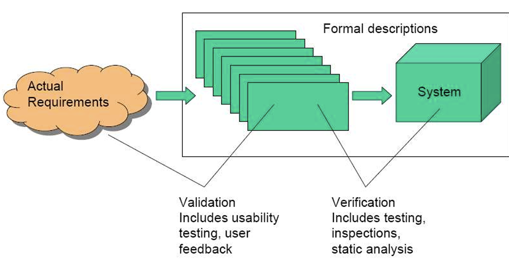

## 2. Three Levels

### 2.1 Level 1

Level 1: 

- Tests individual modules (e.g. functions, classes or  components) 
- Whole programs (e.g. user story, use case) 
- Whole suites of programs (e.g. the application)

### 2.2 Level 2: alpha testing or  verification

-  Executes programs in a  simulated environment.    在模拟环境中执行代码。

-  Test inputs: 

    o Negative values and  positive values.     负值和正值。

    o Out of range or close  to range limits 

    o Invalid(无效的) combinations

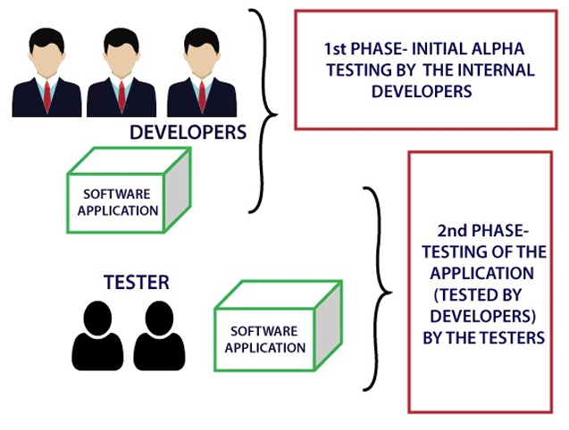

### 2.3  Level 3: beta testing or  validation

 Tests programs in  live user  environment 

o For response and  execution times 

o With large  volumes of data 

o For recovery from  error or failure

## 3. Testing Types

### 3.1  Functional Testing（3 types）

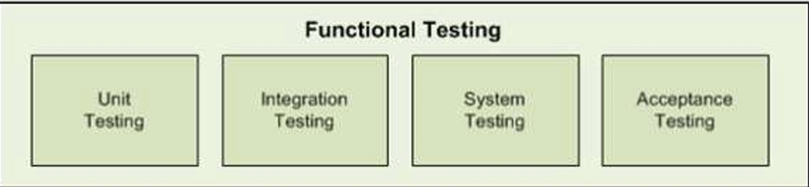

1.  **White box (or Structural testing)**  

    −testing the internal workings of software as  specified

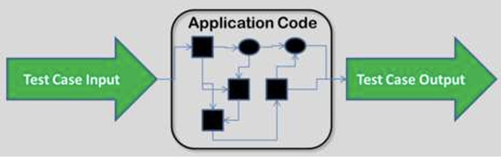

2.  **Black box testing** 

    −treating software as a black box −test data is put into it and produces some output

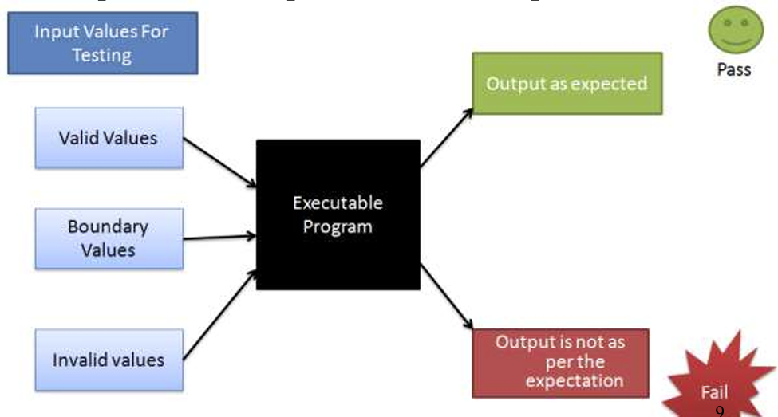

3. **Grey box testing**

--platform and language independent 

−for testing a piece of software against its specifications but  using some knowledge of its internal working (more than  black box testing, but less than clear box testing)

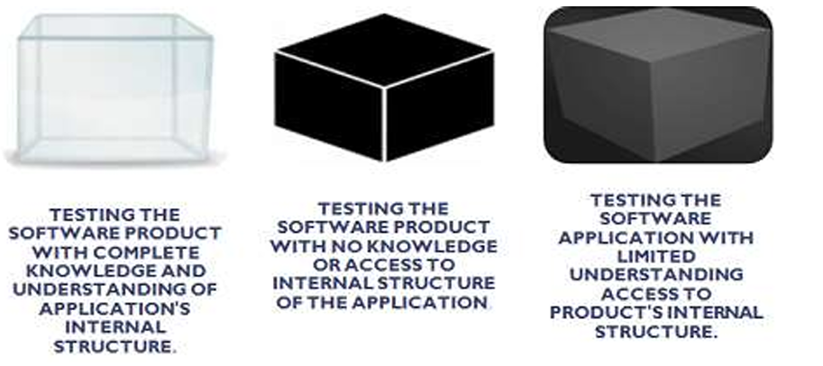

### 3.2 Non-Functional Testing

1. **Performance Testing,** 

    −Load testing: to subject a  computer, peripheral, server,  network or application to a work  level approaching the limits of  its specifications.  

    −Stress testing: to evaluate a  system or component at or  beyond the limits of its specified  requirements to determine the  load under which it fails and  how

    −Volume testing: large number of  data is populated in database and  the overall software system's  behavior is monitored 

    −Endurance testing: regarding  whether the application can  handle the expected load over a  long period of time. 

性能测试，
−负载测试：进行计算机、外围设备、服务器，网络或作品的应用程序水平接近的极限其规格。

−压力测试：评估系统或组件超过或正处于规定的要求，来确定其发生故障的负载以及故障方式。

−批量测试：在数据库中填充大量数据，并监控整个软件系统的行为。

−耐久性测试：关于应用程序是否能够在很长一段时间内处理预期负载。

2. **Security Testing** 

    to verify that  protection mechanisms built into a  system that will protect it from improper  penetration. To make sure that only the  authorised personnel can access the  program and only the authorised personnel can access the functions  available to their security level.

    以验证系统中内置的保护机制是否能保护其免受不当渗透。为了确保只有授权人员可以访问程序，并且只有授权人员才能访问其安全级别可用的功能。

    e.g. Posture Assessment: to determine a  general security posture of an  association

3. **Usability Testing**

    testing the level of ease with which  a system allows a user to achieve that goal. 测试用户使用系统的简便度。

Methods: 

 −1) apply the exploratory method  to build the site and  perform some random tests (by the development/design/QA  or all internal teams) to determine usability factors

 −2) use a tool that would provide statistics based on the input  wireframes (i.e. structure and functionality) and designs  submitted

  −3) employ a set of real-time users to work on the site and  report results, a third-party usability team or external  evaluators to conduct usability testing

方法：

−1）应用探索性方法建立网站，并进行一些随机测试（由开发/设计/QA或所有内部团队进行），以确定可用性因素

−2）使用基于输入线框（即结构和功能）和提交的设计提供统计数据的工具

−3）雇佣一组实时用户在网站上工作并报告结果，第三方可用性团队或外部评估人员进行可用性测试

4. **Compatibility Testing**   

    to check whether your  software is capable of  running on different  hardware, operating  systems, applications,  network environments or  Mobile devices. 

兼容性测试：
检查您的软件能够在不同的平台上运行硬件，操作系统、应用程序，网络环境或移动设备。

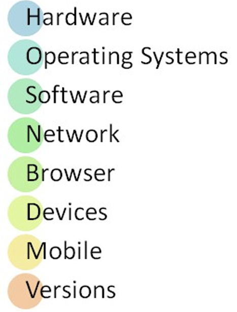

## 4. Strategies（策略）

 **−Unit testing**  

**−Integration testing**  

**−System testing** 

**−Regression testing**  

**−User Acceptance  testing** 

### 4.1 Unit Testing

−focuses on a single  “unit of code” ,  usually a function  in an object or  module.  

单元性测试，经常是一个对象里的函数，或一个模块。 

−is generally seen as  a white box test  class 

白盒子性质的测试。

−should be isolated  from dependencies  

隔离依赖。

Python Unit Test Framework API: 

unittest −The unittest unit testing framework, supports test automation,  sharing of setup and shutdown code for tests, and aggregation of  tests into collections, including, e.g. −test case: the individual unit of testing, which checks for a  specific response to a particular set of inputs. It provides a base  class, TestCase, which may be used to create new test cases.

Python单元测试框架API：

unittest−unittest单元测试框架，支持测试自动化、共享测试的设置和关闭代码，以及将测试聚合到集合中，例如，包括−测试用例：单个测试单元，用于检查对特定输入集的特定响应。它提供了一个基类TestCase，可以用来创建新的测试用例。

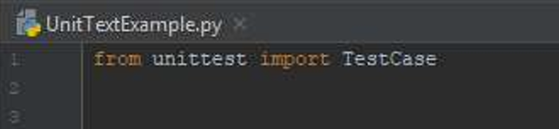

 **Application Programmer Interface（API）：**

−a protocol used as an interface by software components to communicate with each other.

一个协议当做接口使用，用于软件组件之间相互交流 

−a set of functions and procedures that allow the  creation of applications which access the features or  data of an operating system, application, or other service. 

允许创建访问操作系统、应用程序或其他服务的功能或数据的应用程序的一组功能和过程。

−Examples: Python Unit Test Framework API for  unit testing, including: **TestCase Class, Fixtures,  Class Fixture, TestLoader Class, TestResult Class.**

#### 4.1.1 Python unittest: Methods 1

1. Python unittest framework,  TestCase class:   assert methods to  check for and  report failures. 

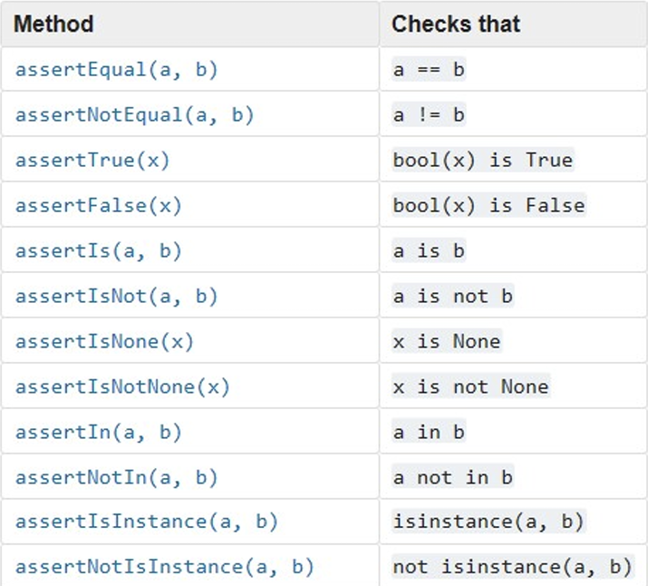

*

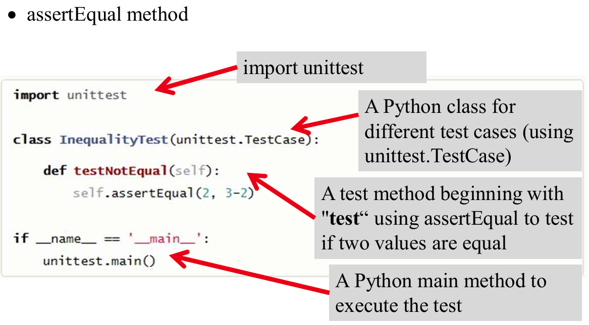

run test and failed.

*

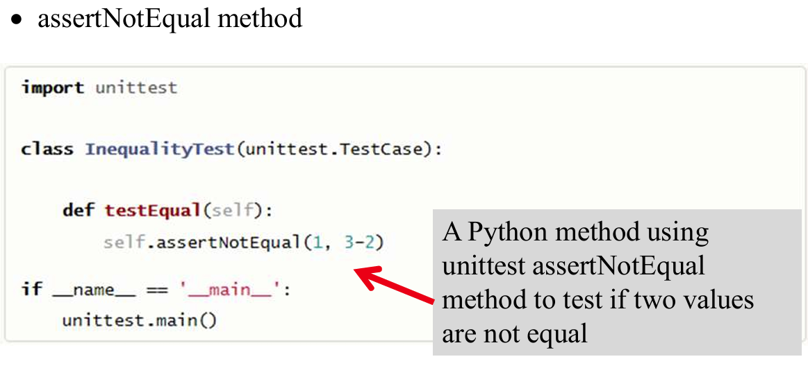

run test and failed

#### 4.1.2  Python unittest: Methods 2

2.  Python unittest framework, TestCase class: assert methods to  perform more specific checks

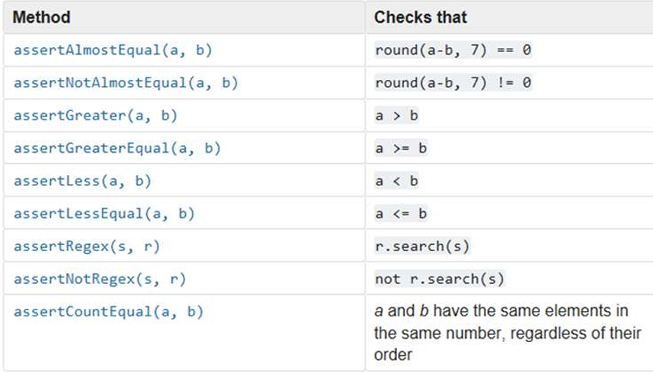

#### 4.1.3 Python unittest: Methods 3

3. Python unittest framework, TestCase class: assert methods to  check the production of exceptions, warnings, and log messages.(用于检查异常、警告和日志消息生成的断言方法)

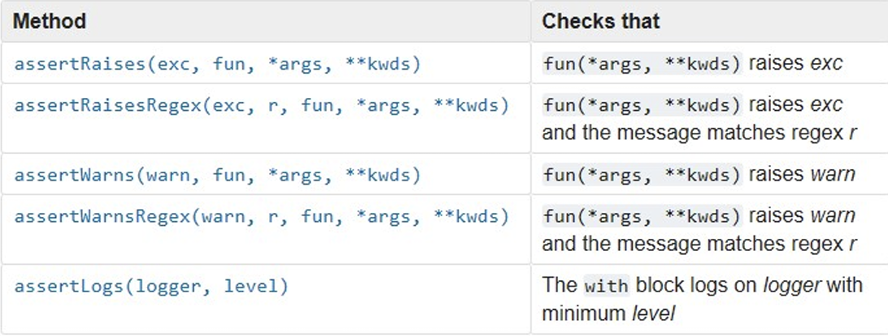

#### 4.1.4

4.  unittest: methods to  organisetest code  −The setUp() method:  defines instructions  that will be executed  before each test  method.  −The tearDown()  method: defines  instructions that will  be executed after  each test method.

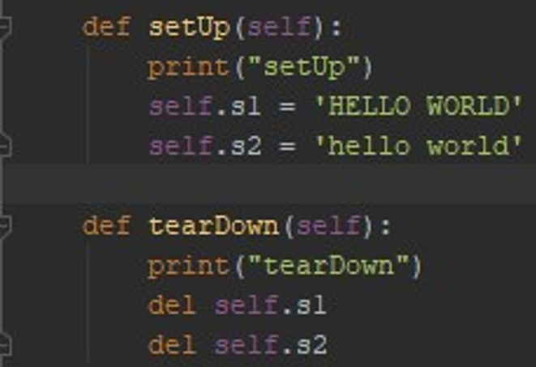

上图就是一个模拟测试步骤，刚开始把数据打印出来，最后把数据删除。

#### 4.1.5 Example

1. assert methods: Which passed? Which failed?

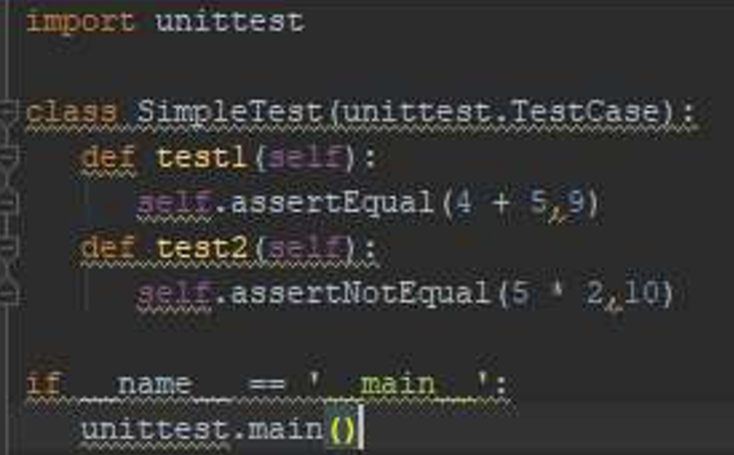

test 1 passed，test 2 failed.

2.  assert methods: Which passed? Which failed?

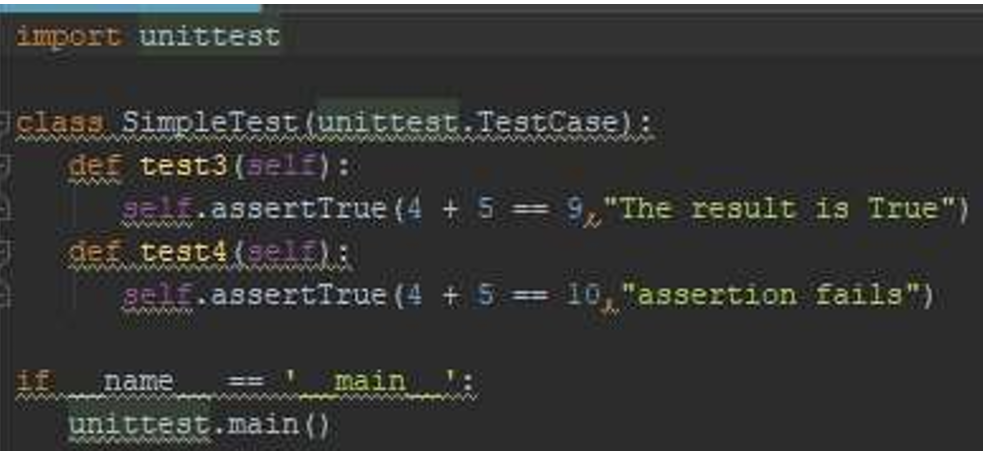

test 3 passed, test 4 failed

3. assert methods: Which passed? Which failed?

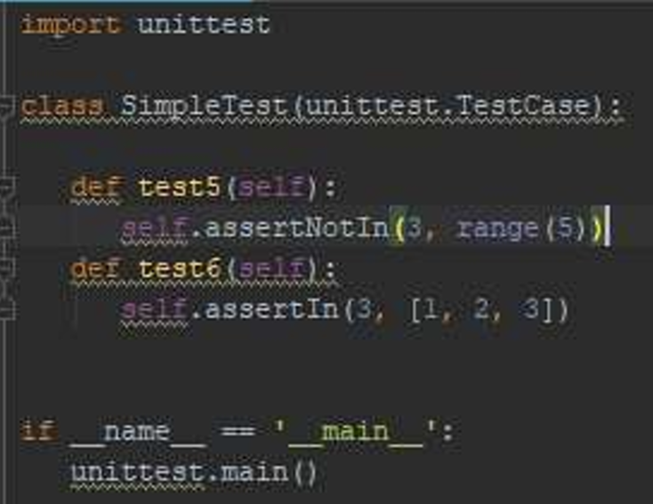

test 6 passed, test 5 failed.

4. assertRaisesmethod: The test passes if the expected exception  is raised, is an error if another exception is raised, or fails if no  exception is raised.  

    - assertRaises 方法：如果出现预期的异常，则测试通过；如果出现其他异常，则测试出错；如果没有出现异常，则测试失败。  

    - Example: zero division Test result, passed or failed?

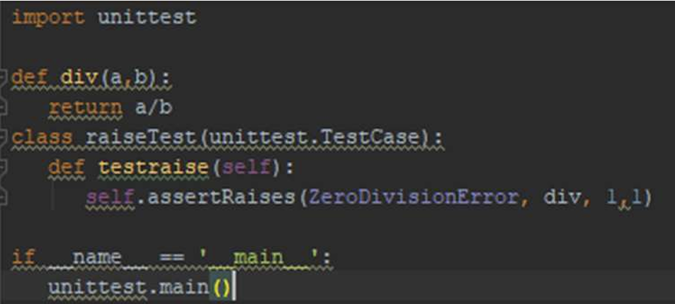

passed

5. Example: zero division Test result, passed or failed?

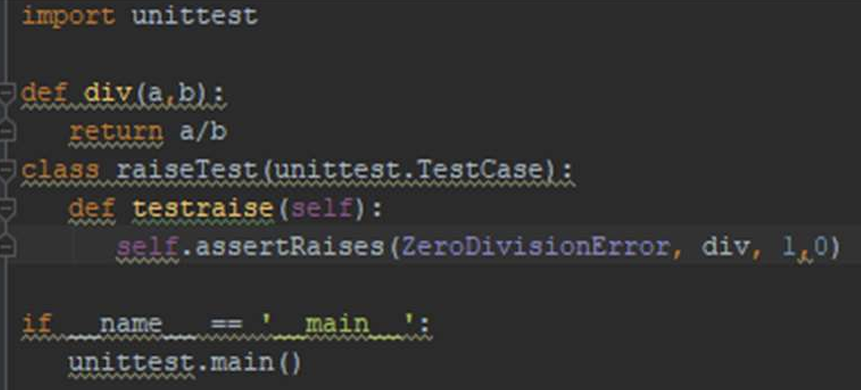

failed?

#### 4.1.6 Test Plan

Example:

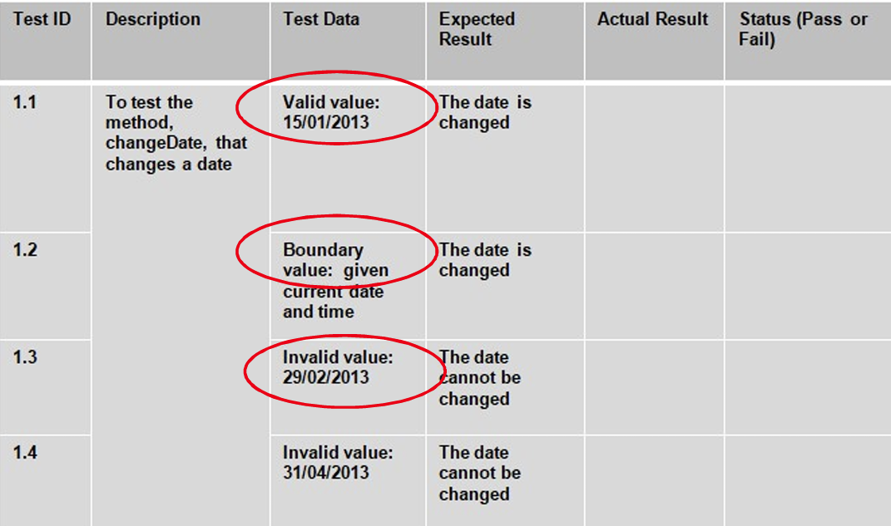

Question: assume(假设) a unit test for the method, changeDate(Date  date) failed when testing an invalid data input, e.g., 29/02/2013.  Which assertion method can be used to pass the test?

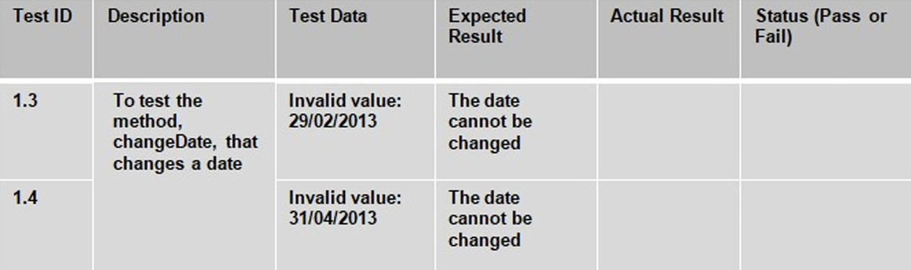

#### 4.1.6 Test Driven Development(TDD)

 −refers to the process of implementing code by  writing your tests first that fail, then writing the  code to make the tests pass 

−builds software through iterations of tests, writing,  and development as necessary, until the features are  finished.  

−allows to consider problem first and code design by  constructing the tests before writing the code

 **Test Driven Development Processes:**

1. Write a unit test  

2. Run the test which should fail

3. Write the minimum amount of code required  to make the test pass  

4. Run the test to check the new test passes  

5. Refactor the code (i.e. restructuring existing code  without changing its external behavior and to improve the  code) 

    Repeat this process for every feature, as is necessary.在不改变外部行为的情况下重组现有代码，并改进代码）。
    
    根据需要，对每个功能重复这一过程。

### 4.2 Integration Testing

**tests complete systems or subsystems  composed of integrated components** 

**测试由集成组件组成的完整系统或子系统**

#### 4.2.1 Top-down testing

Start with high-level system and integrate from the top-down  replacing individual components by stubs where appropriate

从高层系统开始，自上而下进行集成，在适当的地方用存根取代单个组件

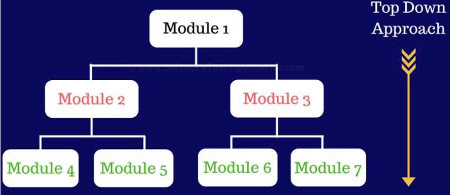

#### 4.2.2 Bottom-up testing  

Integrate individual components in levels until the complete  system is created. In practice, most integration involves a combination of both

逐级整合各个组件，直至形成完整的系统。在实践中，大多数集成都涉及以下两个方面的结合

### 4.3  System Testing

 System testing of software or hardware is  testing conducted on a complete, integrated system to evaluate  the system's compliance with its specified requirements,  which falls within the scope of black box testing, including:  

软件或硬件的系统测试是对一个完整的集成系统进行的测试，目的是评估系统是否符合其指定要求，属于**黑盒测试**的范围，包括  

−recovery testing  恢复测试

−security testing   安全测试

−graphical user interface testing   用户页面图形测试

−compatibility testing  相容性测试

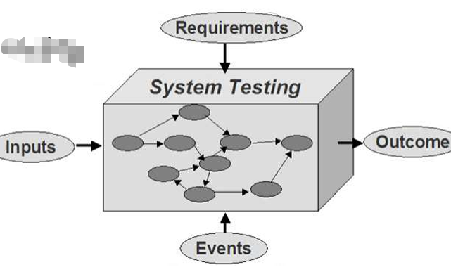

### 4.4 Regression Testing

**Regression Testing: to  verify that the software  still performs correctly  after changes were  introduced to ensure any  enhancements or bug  fixes that have not  adversely affected what  was previously built and  tested.**

**回归测试：验证软件在引入更改后是否仍能正常运行，以确保任何增强功能或错误修复不会对之前构建和测试的功能产生不利影响。**

###  4.5 Acceptance Testing

Acceptance Testing: to verify if the product is  developed as expected in the standards and specified  criteria and meets all the requirements specified by  customers. 

−**falls under black box testing:** evaluates the overall  functioning of the system against the requirements  (rather than internal working/coding of the system)  

−also known as validation testing, quality assurance  (QA) testing, application testing

验收测试：验证产品是否按照预期标准和指定标准开发，是否满足客户指定的所有要求。

-属于黑盒测试：根据要求评估系统的整体功能（而不是系统的内部工作/编码）

-又称验证测试、质量保证（QA）测试、应用测试

#### 4.5.1  Acceptance Testing Types

1.  −User Acceptance Testing:  carried out by the actual user.  
2. −Alpha and Beta Testing:  Alpha testing is a type of  acceptance testing carried  out at developer‟s site by  users, whereas beta testing is carried out at the user’s site. 
3. −Operational Acceptance Testing: a process of ensuring all  the required components (processes and procedures) of the  system are in place in order to allow user or tester to use it.
4. −Contact / Regulation Acceptance Testing: the system is  tested against the specified criteria in the contract document  and also tested to check if it meets all the government and  local authority regulations, laws and standards.  
5. −Business Acceptance Testing: to check whether the system satisfies the business requirements and specifications. 

## 5.  Test Scenario and Test Cases

Test Scenarios:  −the high level concept of what to test, i.e. testing of  the end-to-end functionality of a software  application to ensure the business processes and  flows are functioning as needed. Test cases can be  written for each scenario.

Test Cases: −inputs to test the system and the predicted outputs  from these inputs if the system operates according  to its specification

Example:

- Test Scenario: Validate the login page  

​         −Test Case 1: Enter a valid user name and password 

​         −Test Case 2: Reset your password  

​         −Test Case 3: Enter invalid credentials

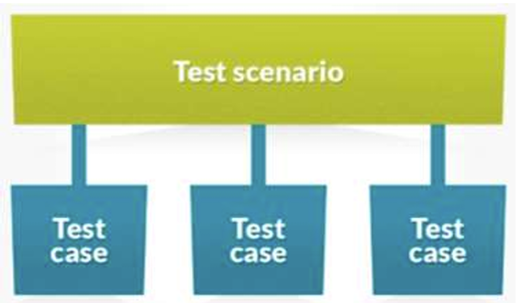

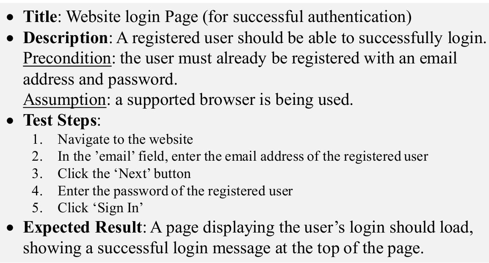

