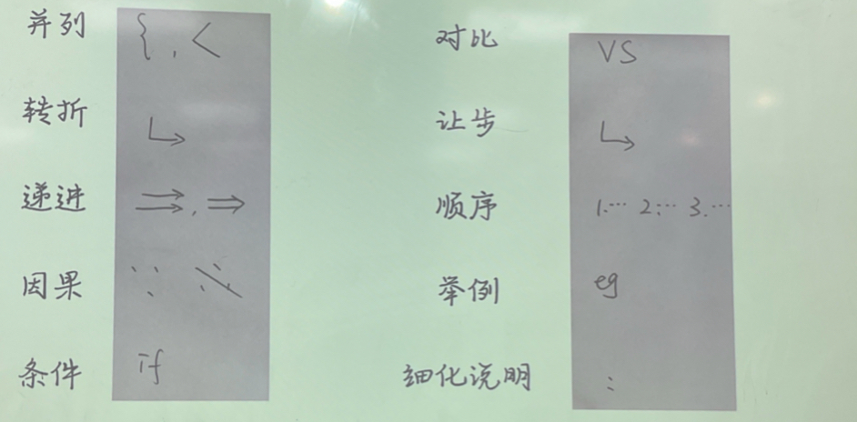
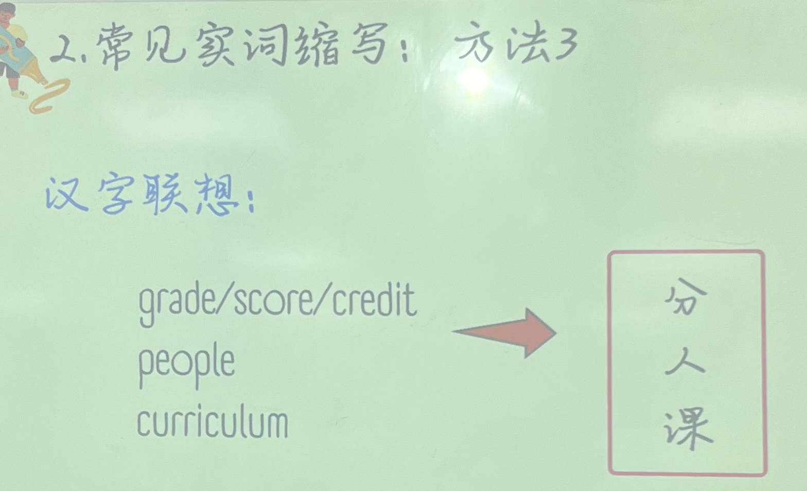
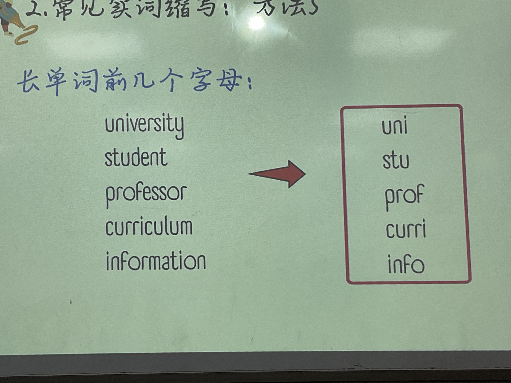
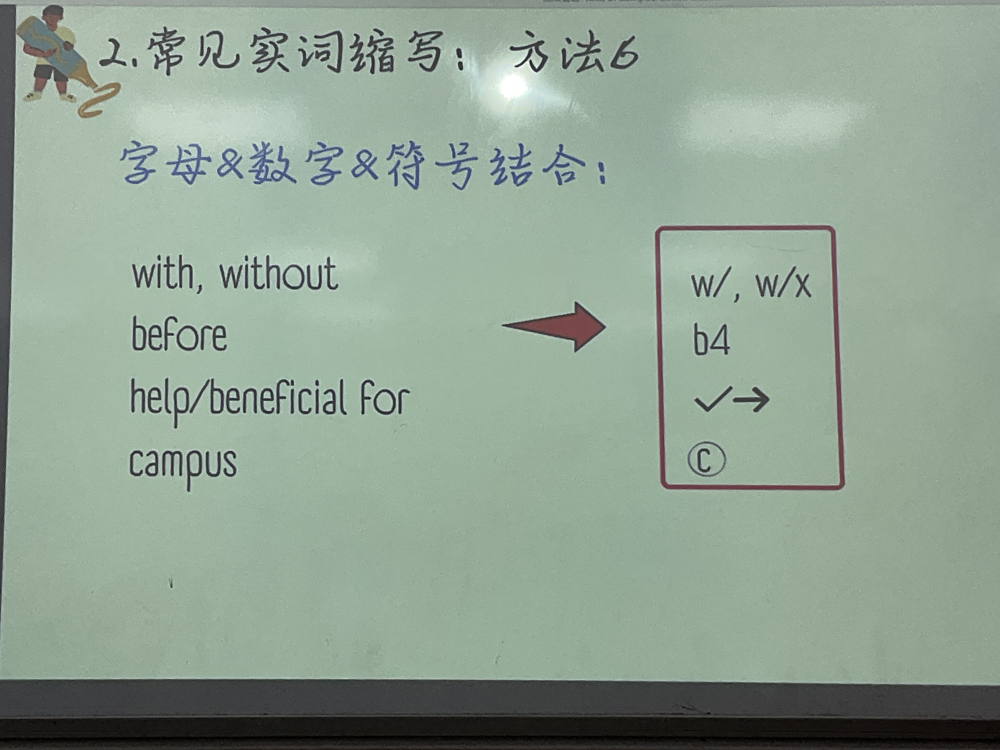

### 1. 校园题构成

### 1.1 Reading

#### 1.1.1 基本信息

- **Time**: 45 s / 50 s

- **Length** ：80-110 words

- **Types:** 

    1. Notice/Announcement
    2. Proposal / letter

- **思考时间：**

    **阅读的思考总结时间只能在听力播放之前，听力播放完的30s都留给听力总结！**

::: warning

阅读材料只出现一遍，不要跟写作搞混了！！！！

:::

#### 1.1.2 材料阅读

- ==**要点1——政策（提议）发出方：**==

    - university, college, school, 
    - department, administration, staff

- ==**要点2——政策（提议）是什么：**==

    - 信号词1：宾语从句。(I propose that university close the campus coffee house)

    - 信号词2：标题即为政策。(Bus service elimination planned)

        ::: important

        尽然这里政策已经出现在标题里，那么文章中的宾语从句或者将来时就是对政策的重复，直接跳过

        :::

    - 信号词3：将来时。(The university will begin switching from traditional-bound textbooks to electronic textbooks)

- ==**要点3——什么信息不用看？（什么样的句子要跳读？）**==

    - 过去时。
        - **一般出现过去时都是讲的过去有哪些哪些的情况，导致了不好的现象，跟将来政策带来的好处和这个政策确立的理由没关系，遂跳过。**

    - 表示现状描述的信号词所在句
        - currently
        - traditionally
        - now/right now
        - at present
        - 跟上面过去时为什么要被跳读一个理由

    - 存在句

        - there be 句型

        - have, has, had 句子（过去完成时）

        - be 动词引导的被动句也不用看

            ::: note

            如果要有 should be done 出现，则要看。为什么？

            因为 should 引导的被动句表将来。比如：学生应该得到更方便的待遇。。。

            :::

        - 跟上面过去时为什么要被跳读一个理由

- ==**阅读材料一般结构：**==

    - 1个政策 + 2个原因
    - 1个政策 + 1个原因 + 1个提议

#### 1.1.3 怎么复述阅读材料？

- 复述政策（提议）模版句：

    In the reading,  …. proposes to ….

    ​                            …. announces that ….

::: tip

如果没有看清政策方：

It is stated in the reading that … + 政策被动句(campus coffee should be closed)

:::

- 复述原因或者理由

    - 原因会有几个结构输出：

        - 递进：

            furthermore, in addition, first, second….

        - 因果:

            since, also, one reason is that, this  would help

::: important

一定要注意看信号词。

:::

### 1.2 Listening

#### 1.2.1 注意

- 考察核心能力：细节还原；逻辑模仿。

- 需具备的核心能力：一心三用

    - 一听内容
    - 二识逻辑
    - 三做笔记（实词缩写；逻辑词符号）

- 总结三忌：

    - 一忌概括总结讲大意
    - 二忌散句多无连接词
    - 三忌第一人称表达

- Time:

    60 s - 80 s

    ::: important

    这题内容很少，基本都要复述出来！（考背诵）

    :::

- 结构:

    一男一女，其中有一人话多的是主角

#### 1.2.2 记笔记

1. **常考逻辑符号。**

    

2. **常考实词笔记法**

#### 1.2.3 常考逻辑段落总结

- 出现人物：———— 加举例逻辑词

    - for instance
    - take sb. as an example

- 两个人物、地点：———— 加对比逻辑词

    - as a comparison
    - as compare to

- 一个观点但是不同的意群 

    意群之间加：

    - besides
    - plus
    - on top of this
    - apart from this
    - since
    - because

    ::: note

    根据意群之间的逻辑加相应的逻辑连接词。

    :::

- mean：———— 根据后文内容判断是*解释*还是*因果*

    - to be more specific
    - specifically speaking

- if : ———— 可以同义替换成：
    - Imaging that…
    - suppose that….
- 列举项目：
    - not only… but also…
    - either…or…
    - neither…nor…

::: info

一些重复的语义内容要注意识别，该丢就丢。校园题通常会有 10s - 20s 来重复一些废话，剩下的作总结是一定要讲完的。

:::

#### 1.2.4 练习听力的步骤 （材料：TPO 30 往后）

1. 边听听力边做笔记
2. 整理笔记
3. 按照笔记复述第一遍
4. 根据听力稿添加细节（为什么没听到？？）
5. 整理语言二次复述

#### 1.2.5 Rare case

1. 有可能男女（听力人物）都是主角。

    - 答题结构：

        Firstly， the woman says … . And the man gives an example that … .

        Secondly, the woman mentions that … . The man states that / According to the man …

        

### 1.3 Task 2 平时练习步骤

1. 45s 计时看阅读
2. 边听听力边做笔记，30s 计时整理笔记，复述
3. 根据听力稿整理语言二次复述，不可添加任何笔记
4. 每一道 Speech Rater 评分

