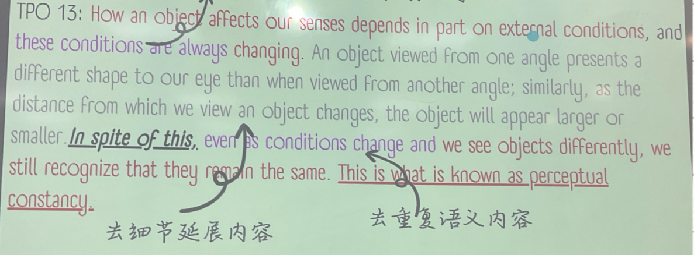
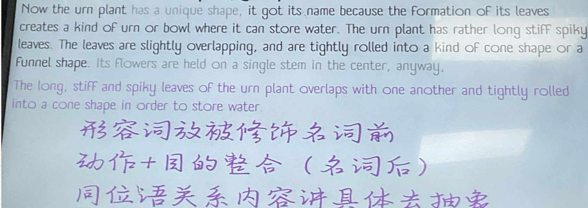

## 1. 阅读

一句话概括总结一下即可。

### 1.1 专业术语总结（一般考法）

#### 1.1.1 出现形势

1. ==术语 + 定义 —— 直给形式==

​	术语+  is … / means that … / refers to … / can be described as

::: note

专业术语所在句

:::

2. ==代词 + （被动语态） + 术语结尾==

    This is called …

    This is known as …

    … referred this as …

::: note

往这句**前**或**中**找术语定义句

:::

3. ==问题/背景 + 术语==

    this problem can be resolved by …

    one problem/solution/process is …

::: note

往信号词/句**中**或者术语**后**找定义句。

:::

#### 1.1.2 总结术语模版句

::: info

术语你有可能不会读，别慌，念口语题目的时候注意听考官怎么念的！！

:::

```
In the reading, ...(术语) + refers to/means that/is ...(定义)
```

e.g.

In the reading, experiment effect is a situation when a researcher’s expectation affect the outcome of an experiment.


### 1.2 特殊考法

#### 1.2.1 行为动作 + 目的型考法

TPO 36:

This ability to temporarily put aside, or suspend, our doubt and believe that the action of a play is real is `called the suspension of disbelief`, suspending disbelief enables viewers to become more and more absorbed in the play as they watch the story develop, and to respond emotionally to the events and characters as if they were real.

::: important 技巧

==看清楚专业术语所在的位置提示的句子（用代码体标出了）==，其结构就是 ：行为/流程/动作/心理  + called 专业术语 + 目的/结果/细节/重复信息。

:::

- 总结：

    ```
    In the reading, suspension of disbelief refers to the ability for the ability for people to set aside their disbelieve for a play and trust what they see is real to help them to get absorbed in the play.
    ```

    


#### 1.2.2 转折型

总结转折词前后各一句，术语在最后一句。



- 总结：

    ```
    In the reading , perceptual constancy refers that even though an object always affect how we see them
    by changing external conditions, we still know them remain the same.
    ```


#### 1.2.3 全文概括型

最难。纯靠语言整合！做笔记很重要！记每一个句子的核心词。


语言整合技巧：

1. 同一名词发出所有动作合并。

2. 语序排列（语序比语法更重要）：结果 > 细节动作 > 背景。


## 2. 听力

::: warning

一定一定要注意时态！！！如果听力原稿是过去时口语也要答过去时。指着 -ed 读！

:::

- 几个考法内容：
    - 动植物学
    - 亲身经历
    - 步骤型
    - 2个例子
    - 经典实验

### 2.1 听力结构

#### 2.1.1 背景交代

背景交代只讲一句话。比如生物学，会交代一大段生物的颜色；大小；外貌特点；国籍/居住地 等等等等。**都不要讲。。。**

- 模版句：（可以自己调整）

```
In the lecture, the professor uses (动物) who (动物特性) as an example to further prove the theory.
```

::: info

动植物的专有名词没听清咋办？说大类！比如一种树，一种鱼，一种猴子…

万不得已的时候用！

:::

#### 2.1.2 核心细节段 1&2

**一个完整的例子，会分为两个核心阶段。听的时候就要想清楚结构，想清楚需要讲的核心意群。**

:::  important

- 核心意群怎么判断？：==动作，行为，目的，结果（找对象，找动词！）==；其他具有总结性的抽象性语言，直接略

- 如果一个东西做了两个动作，尽量不要出现同位语，整合为一个动作。  （同一主语发出的动作的整合）

- 时间不用讲，时态体现。
- 听力中出现的逻辑连接词直接用。

:::

.PNG)


## 3. 例子

### 3.1 生物学

会出现一些介绍植物或动物器官部分的内容。小技巧：形容词放在主语（动植物）前，动作和目的放主语后。同位语关系去抽象，讲实词。  




### 3.2 亲身经历

同上，更简单。


### 3.3 步骤型

最重细节的一题。

::: important 主要技巧

两个步骤合成一句话。

:::

- A comes first while B next.
- After sth./doing sth. , the step of … followed
- 被动句 + with / ,  … (comes) next / afterwards
- Last would be …, which would come after the (第几个）step that previously mentioned above.


### 3.4 两个例子

判断例子的详略程度。（略讲的例子三句话之内结束复述）

::: tip

听力什么时态，复述什么时态

:::

#### 3.4.1 略讲例子

- 散句多
- 重复语义/句式多
- 逻辑词少

```
One example is...
```


#### 3.4.2  详讲的例子

- 注意原文的逻辑结构模仿。
- 相同句式可以整合。


### 3.5 实验

==笔记：画图！==


