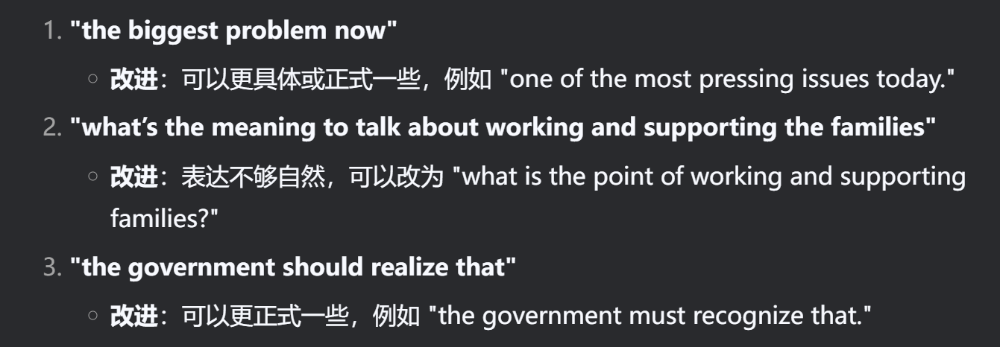

###  28

I personally agree with the Claire==‘s== words. After all, we buy the tech products in order to make our lives more convenien==t==. If the product is useless to our daily needs, purchasing it would be a hug==e== mistake. In addition, it is a waste of money. For instance, I buy a phone with a big mobile storage like 1TB, which could cost thousands of dollars, but I rarely use it. In that case, the extra storage will ==would 条件句中用虚拟语气== be useless. What I mean is, unlike certain small stuff such as a pretty doll or a cute notebook and so forth, you just spend little money on it so it does not matter if you don’t want to play with the doll or write ==in the== dairy on the notebook anymore. You should ensure you really need the function of a tech product before you buy it.

 

### 27

I totally agree with Paul’s words. After all, more and more people will choose to take free public transportation for saving money. That can benefit both the people and the environment. People save money in ==on== buying gas or fuel, and there will be less production of carbon dioxide which is a kind of green ==greenhouse== gas and lead==s== to the global warming. In addition, less ==fewer== cars on the street is also convenient for people to commute. During ==In== the morning, there are always a great number of cars in the center of the large cities, which make people get late to work or school ==to be late for work or school==. If many people chose the public transportation, especially the underground ==subway== which does not even drive on the street==s==, the traffic would be more smooth ==smoother==. That==‘s== a double-win for environment and people live ==living== in cities. 

- 动词第三人称单复数

- 固定搭配 

- 名词后面接修饰短语 动词 -ing 或者 -ed

- 名词单复数

- 介词的使用

    

### 26

I totally agree with Kelly’s words. After all, we do not need a large number of industries to [pop up] the economy. In fact, the pollution that the thriving of those industries caused is the biggest problem now and it will be out of control if just by “monitoring”. The rapid pace of the industry development lead==s== to various pollution nowadays, such as the water pollution which may cause serious infection, the air pollution which might cause some toxic substance breathed inside human’s bodies, the soil pollution which leads to a huge damage to the agriculture. If even the health of people cannot be promised, what’s the meaning to talk about working and supporting the families? From my point of view, it is the most crucial thing for human beings to take care of their mental and physical health. The government should realize that the protecting environment has a far-reaching impact on the harmony of the society.

- pop up 不当，boost 更好
- if just by “monitoring” 这句话没有主语，不完整
    - 改为：if we rely solely on monitoring
- "infection" 通常指疾病感染，与 "water pollution" 搭配不当。
    - 改为：serious health issues
- substance 可数 —— substances
- breathed inside human’s bodies
    - breathed 不自然 改为 inhaled 吸入
- damage 是不可数名词
- If even the health of people cannot be promised
    - promised 不自然 改为 guarantee
- the protecting environment 不恰当
    - the environment protection

表达不当：

### 25

I agree with the statement that being a good communicator is the most important ability of a leader. From my point of view,  working as a team need==s== a lot of communication and meeting==s==. The members of the group ought to exchange ideal==s== and announce the [process]==progress== of their assigned work. In that case, the whole team will be a well-oil==ed== machine, and mistakes can be avoided. However, good and frequent communication need==s== a leader who is willing to contact [with]==及物动词不接介词== the group members and talk with them actively, so the leader needs to be a communicator at the same time. What’s more, [the] another benefit of communication is the leader can know more and get acquainted [about]==with== the group members. In that case, the leader will understand how to assign work to the members and enable every member’s contribution to count. 

### 24

I totally agree with [the] Andrew’s statement that museums can inspire people and allow them to obtain knowledge. From my point of view, people can learn a great number of interesting things by visiting the museum. First, having a visit [in]==to a== museum enables them to broaden their horizon. By appreciating the exhibitions [from]==of== ancient people==,== such as paintings, people can gain a better understanding of the wisdom of their ancestors. They will know the stories behind the paintings, which makes them feel [like]==as if== they are in a completely new world. They will know more about the history of the city.  That help==s== them to gain a strong sense of identity [of]==with== their own city. Second, they [also can]==can also== visit the science museum to appreciate the cutting-edge technology. Some of the techs [are]==were== invented by [the] scientists from their city, which gives them a huge sense of pride.

- 两个观点不并列，是包含关系
- 

### 23

I totally agree with Paul’s statement that the cinemas are about to stay + [Paul 的理由]. [From my point of view,]有点怪 I prefer to share the same atmosphere with a lot of people by watching films at cinemas. For instance, if there is a horrible plot in the movie, I can hear someone’s scream if I am watching the movie in a cinemas. That scream may sounds funny, which can ease my scare. Also, if there is a moving plot in the movie, we can cry together in the cinema, which enables us to share a sense of connection in emotion. However, if I see the movie at home alone, I just cannot calm down or feel lonely. What’s more, the screens in the cinemas are bigger and there are 3D and even 4D movies, which means I can get a better experience and feel like involve in the movie by those technologies, which cannot achieve at home.

- 第二个观点太少了，延展一下，比如家里无法安装4D

### 22

I disagree with Andrew’s statement that engaging in some tasks together is the best way to bond the family members and Claire’s words make sense. Different people have different preference and hobbies. 
