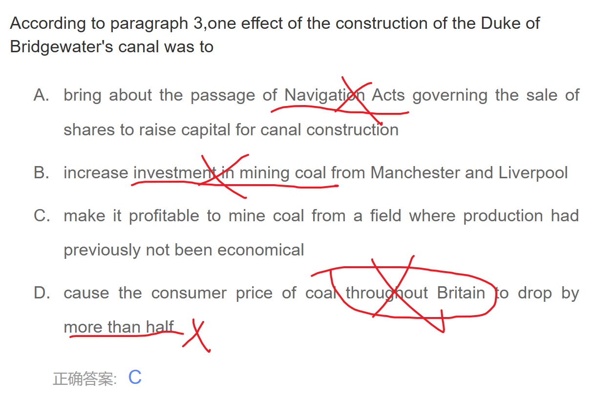
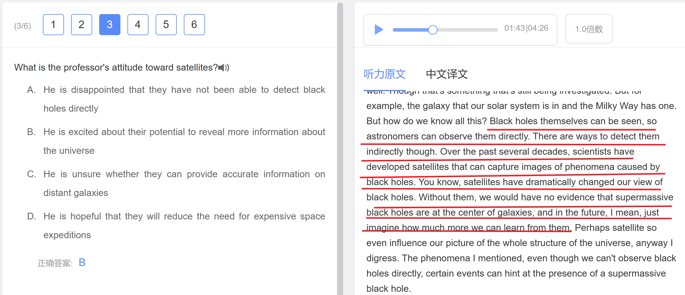
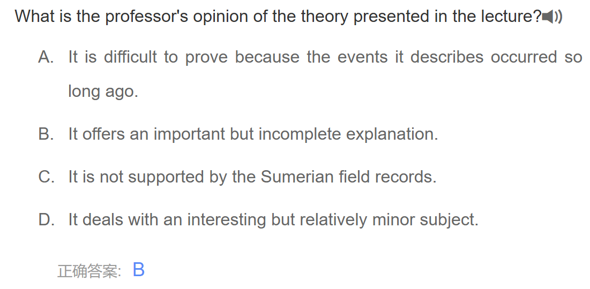

## 5.30

### 阅读 95

阅读：


这题错选了D，属于==因果关系==没搞清楚；

D的因果关系是，欧洲移民是美国家庭变小的原因，当时只注意了这是个因果关系就选了；

而原句的意思是，由于美国家庭变小，欧洲移民开始在美国各个方面崛起发挥更大的作用了；

所以这里的美国家庭变小是原因，不是结果。选A


单词题，profound意思是深刻的，深远的

intense意思是强烈的，紧张的，热情的，非常的


这题选了B，

原文关键句：

> *It was cold enough for hydrogen compounds in the nebula to condense into solid ices only beyond the frost line... Inside the frost line, only metal and rock could condense...*

翻译成中文：

> 只有在“霜线”以外，氢化合物才冷却得足够形成固态冰；在“霜线”以内，只有金属和岩石能够凝结。

所以我们可以**间接推出**，氢化合物在霜线以内**无法凝结为固体**，也就是说它们仍然是**气体**。

**那为什么不选 B 呢？**

因为选项 B 看似正确（逻辑推断合理），**但原文没有直接支持“氢化合物在霜线以内保持为气体”这个说法**。它只说了 **它们在霜线以内不能凝结为固体**，但没有直接说它们是“以气态存在”的。

这在托福阅读中是一个常见的陷阱：**选项看似合理但是“推断”而非“直接信息”**。

==托福阅读考的是同义替换，文中没有给的信息不要选，即使看似正确==


选了D

没有找到定位句就想当然地选择了。这种Except题，段落都会有明显地语义分层的！下面来研究一下：


定位句：

Although the particles were far too small to attract each other gravitationally at this point, they were able to move together through electrostatic forces-the same static electricity that makes hair stick to a comb.

重力太小了是不利于粒子结合的因素，他们靠 electrostatic forces 结合。


### 听力 94


完全把这段话忽略了。可能就没认为这段话是考点

可能是考点的原因：

这里上一句老师问了一句：为啥你喜欢它（长跑）？这是提问考点，要着重注意。并且定位段不断地在车轱辘话来回讲，有可能要掌握他的大致含义，选项会考同义替换。当然，这也属于与主题不相干的内容插了一嘴，但是这里我们还不知道主题是啥，所以这个方法很难预测到考点。


你看，==一到学生提问必有考点==

stumble upon 偶然发现，偶然遇到


也是提问中的要点


### 口语 6

#### Task 02

The students should be allowed to park in the faculty parking lot for two reasons. First, students need to drive around to look for a place because spaces are difficult to find, so they often late to class. Second, the faculty parking lot is not fully used. There is a lot of empty space in there in the morning. In the lecture, the girl disagreed with the idea. First, there is a special parking lot for off-campus students. There is plenty of space and just 10 minutes to walk to the classroom. Second, the faculty parking lot is empty during the early morning because a lot of professors have not arrived at school. But in the middle of the day, the parking lot is full and there is not much empty space.

First, students need to drive around to look for a place because spaces are difficult to find, so they often late to class.

❌ 存在两个小错误：

1. “so they often late to class.”
     应该改成：**so they are often late to class.** （需要加 “are”）
2. “to look for a place”
     稍微有点不够清晰，可以改成：**to look for a parking space**（更具体）

✔️ 改正后：
 **First, students need to drive around to look for a parking space because parking spaces are difficult to find, so they are often late to class.**


没空间：fills up

#### Task 03

Children are mature enough to control themselves and continue to work toward completing tasks. In the lecture, the professor used his sounds to illustrate the set. The sound tried to stack the tower with wooden blocks, but the tower just fell over. So the professor came over to help his sound, but right away. But every day, the professor will wait a few minutes longer, and day after day, the waiting time continues to increase. So his sound finally tried to stack the tower by himself. And as a result, his sound finally managed to build up a tower without any help. That's the meaning of the concept, frustration tolerance.

son读成sound

#### Task 04

Professor introduced two kinds of animal social groups. The first one has strong bonds among each other. For example, the elephant. When one elephant gets sick or injured, the other elephants will take care of it and nurse it. The second kind of group has relatively simple social interaction, such as fishes. They spend a lot of time together, but they do not interact with each other. For example, some individuals probably do not know and recognize each other. They cannot distinguish one fish from another. They do not know the fishes they live around and surround them.

❌ “among each other” 是多余的，通常直接说 “strong bonds among individuals”。

听力中，没有听出来这句：

nurse it back to health.

form any real attachments with each ot


## 5.31

### 阅读 93

原文：

In 1760,the Duke of Bridgewater completed the first great canal. It brought coal to Manchester and ultimately to Liverpool. It cost more than ￡250,000 and took 14 years of labor to build, but it repaid the duke and his investors many times over by bringing an uneconomical coal field into production. Not the least of the beneficiaries were the people of Manchester, where the price of coal was halved.

两个错题都是围绕着这一段展开的


这题选了C。把 True Except 看错了，应该是三个对的一个错的，看成三个错的一个对的。

A，没说。 It brought coal to Manchester and ultimately to Liverpool.动词是bring 不是originate

B, 是 In 1760,the Duke of Bridgewater completed the first great canal. 这句话的同义替换。

C，是 the Duke of Bridgewater completed the first great canal. 的同义替换。这个啥公爵肯定代表私人啦。

D，是 but it repaid the duke and his investors many times over by bringing an uneconomical coal field into production. 的同义替换。



这题选了D。文中只是说 Not the least of the beneficiaries were the people of Manchester, where the price of coal was halved. 曼切斯特的价格对半折了，不是 throughout Britain 也不是 more than half

C选项，当时觉得没有说到profitable，其实是这句话没理解意思：

but it ==repaid== the duke and his investors many times over by bringing an uneconomical coal field into production.

repay的过去式形式repaid，看成rapid了。它偿还了公爵和设计者很多，形象说明了利润很大。

还有economical是经济的意思，ecological是生态的意思！！！

#### 六选三题

Among Britains blessings,water was foremost. Water was its best defense, protecting the island from foreign invasion and making it unnecessary to invest in a costly standing army. Rather, Britain invested heavily in its navy to maintain its commercial preeminence around the globe.The navy protected British interests in times of war and transported British goods in times of peace. Britain's position in the Asian trade made it the leading importer of cottons,ceramics,and teas.Its colonies,especially in North America,not only provided sugar and tobacco but also formed a rich market for British manufactured goods.

But the commercial advantages that water brought were not confined to oceanic trade.Britain was favored by an internal water system that tied inland communities together.Water transport was far cheaper than transporting goods overland.A packhorse could carry 250 pounds of goods on its back but could move 100,000 pounds by walking alongside a river and pulling a barge. Small wonder that river transport was one of the principal interests of merchants and traders. Beginning in the 1760s,private concerns began to invest in the construction of canals, first to move coal from inland locations to major arteries and then to connect the great rivers themselves. Over the next 50 years several hundred miles of canals were built by authority of the Navigation Acts,which allowed for the sale of shares to raise capital (money). In 1760,the Duke of Bridgewater completed the first great canal. It brought coal to Manchester and ultimately to Liverpool. It cost more than ￡250,000 and took 14 years of labor to build, but it repaid the duke and his investors many times over by bringing an uneconomical coal field into production. Not the least of the beneficiaries were the people of Manchester, where the price of coal was halved.

选项B：


选成了ACF。

A确实文中有但是是节选内容，总结性不强；

B,先分析选项这句话：

Britain benefited from its navy,which secured its leading commerce around the globe,==/==and from its water system,which connected communities and made transportation of goods more economical.

不是海军保护这个水运系统，看成了海军保护国际贸易和水运系统，而是英国benefited from海军和水利系统，刚好对应上面文章的2,3段落。

### 听力 95


选成了C，又是否定考点！

==not just a matter of== …


map out

from objects in the sky

distorted

属于答案句没听懂


这题虽然是从后面的内容推断的，但是也是否定考点没注意


强调考点。还有young galaxy是第二个例子，注意审题。


### 口语 66

#### Task 01

First of all, during the class, students need to organize a lot of things and receive plenty of knowledge. So, typing is a more quick way for students to take their notes rather than writing. It is important for students to take notes efficiently. After class, they need to organize their notes. In the computer, the notes can be easily organized using some special software. But in the notebook, it doesn't work out.

**原文中的问题说明：**

1. **“students need to organize a lot of things and receive plenty of knowledge.”**
    - 这句话语气有点笨拙，"organize a lot of things"太口语化，容易让人疑惑具体指什么。"receive plenty of knowledge"也稍显生硬，建议改成“absorb a significant amount of knowledge”。
2. **“typing is a more quick way”**
    - “more quick”语法错误，应该用“quicker”，或者直接说“a faster way”。
3. **“it doesn't work out”**
    - 这个表达偏口语化，且比较模糊。建议改为“this is not as convenient”或者“this is not feasible”。

First of all, during class, students need to manage a substantial amount of information and absorb a significant amount of knowledge. Therefore, typing is a faster and more efficient way for students to take notes compared to writing by hand. Efficient note-taking is crucial, as it helps students better understand and review the material. After class, students often need to revisit and organize their notes to reinforce their learning. On a computer, notes can be easily categorized, edited, and stored using specialized software, making the review process more convenient and systematic. In contrast, handwritten notes in a notebook can be disorganized and difficult to rearrange, especially when students need to make changes or add additional information. Thus, using a computer for note-taking not only saves time but also enhances the overall learning experience.

#### Task 02

As you may know, the summer student abroad in Peru has been cancelled because of the low enrollment, and students who are interested in Spanish language can have another activity to choose. In The lectured boy has a different idea. First, he points out there are still a few months left until the summer, and the requirement of the summer student abroad activity is very strict. Students should get high grades and at least have three recommendations from their professor. The program should be open to more people and the requirements should be less strict. Second, some students may be interested in Peru's culture and history, and that they cannot experience in Mexico or Spain. 

==choose读得特像choice==

**“the summer student abroad in Peru has been cancelled”**

- 建议改为“the summer study abroad program in Peru has been canceled”，更符合表达习惯。

**“students who are interested in Spanish language can have another activity to choose”**

- 建议改为“students who are interested in Spanish language studies now have an alternative activity to consider”，更自然流畅。

**“and that they cannot experience in Mexico or Spain.”**

- 结构不完整，应该改为“which cannot be fully experienced in Mexico or Spain”。

As you may know, the summer study abroad program in Peru has been canceled due to low enrollment. However, students who are interested in Spanish language studies now ==have an alternative activity to consider==. In the lecture, the boy expresses a different opinion. First, he argues that there are still a few months ==remaining before summer==, and the current ==requirements== for the study abroad program are too strict. Students need to maintain high grades and obtain at least three recommendations from their professors. He believes the program should be more ==accessible==. Second, he points out that some students are particularly interested in Peru’s unique culture and history, ==which cannot be fully experienced in Mexico or Spain==. 

#### Task 03

学表达！！！

读错的：

- effort

听力原文：

```
Now, listen to part of a lecture on this topic from a psychology class. Okay, so researchers did an experiment that demonstrated how this works. They recruited a bunch of volunteers and had everyone look at two different paintings by the same artist. All of these volunteers were people who knew something about art. They had some background or training in art history, but none of them had seen these particular paintings before. Now, the researchers divided the volunteers into two groups, and they showed both groups the same two paintings. One group was told that the first painting had taken the artist several months to paint, while the other painting had taken her only a couple of days. And the researchers told the other group the opposite, that the second painting was the one that had required more effort, that it took much longer to paint than the first one. And then both groups were asked to rate the two paintings, to say which painting they thought would sell for a higher price. Now, of course, there's a lot to consider when you're thinking about how good a painting is, and how much money it could sell for, right? Like, how interesting the subject is, how the artist uses color, the technique. But what happened was kind of interesting, and demonstrates how these mental shortcuts can affect our judgment. You see, most people in the first group, the one that had been told the first painting had taken months to paint, they said that the first painting would sell for a higher price. And then, as you can probably guess, the group that had been told that the second painting had taken longer, they thought the second painting would sell for more. But you can see how this is flawed, right? I mean, these two groups of people couldn't both be right. Explain the effort heuristic, and how it is illustrated in the professor's example of the two paintings.
```

总结：

In the psychology lecture, the professor explains the effort heuristic using an experiment with two paintings. ==Volunteers with some art background were divided into two groups==. Each group was shown the same two paintings by the same artist. ==One group was told the first painting took months while the second took days, and for the other group, this information was reversed.== Both groups then rated which painting would sell for a higher price. Interestingly, the group that believed the first painting took longer rated it as more ==valuable==, and ==the other group did the same with the second painting==. 


#### Task 04


叽里咕噜说啥呢…先赔我两万

The biology lecture focuses on how scientists study extinct animals' diets using their bones, particularly through two approaches: examining fossilized teeth and bone structure. By analyzing tooth marks or changes, scientists can infer the type of food consumed; for instance, ancient apes' teeth showed scratches indicating a diet of hard foods like seeds, ==contradicting== the soft food diet of modern apes. Additionally, the structure of bones reveals dietary habits. An example given is an extinct bear with powerful jaw bones but thin leg bones, leading scientists to conclude it was a scavenger rather than a hunter, as its leg structure was unsuited for hunting live prey. These methods enable researchers to make accurate assumptions about ancient animals' eating habits.


### 口语 67*

#### Task 01

Nowadays, some people use extreme methods, including surgery, to change their appearance-usually because they are trying to look more attractive in some way. Do you think this is a good idea? Explain why you agree or disagree with people using such methods to change how they look. Support your opinion with details.

1. 有害健康——健康更重要
2. 不够自信——内在——不然空虚

I think it is a bad idea for people to use extreme methods, including surgery, to change their appearance. First of all, such surgeries can be really harmful to one's health and may lead to serious complications. From my point of view, a healthy body is far more valuable than just having a pretty face. Second, people who choose to undergo these surgeries often lack self-confidence. The real solution to this problem is to cultivate inner qualities. No matter how pretty a person appears on the outside, they will still feel empty rather than truly at peace inside.

、


#### Task 02*

The campus tours is not allowed to enter the library, because with the tour passing through the library, the students can be distracted, and there are going to be a video tour on the university website for the tour to experience the view of the library. In the lecture, the boy has a different idea. First, she mentions that the building is very beautiful and online video cannot bring the tourists into the atmosphere of the library. In fact, he is one of the students that was attracted by the beauty of the library. Second, there is a way to address the noise question. The tour guide should make sure all the tours should be quiet and no more questions and talking during the way of the library.

- tourist 不是 tours

- 又he变成she了哈

You know, the CAPTOR is not allowed to enter the library because the tour passing through the library might distract the students. Also, there will be a video tour on the university website to allow tourists to ==experience the library virtually==. In the lecture, the boy has a different idea. First, he mentions that the building is very beautiful and that an online video cannot truly ==capture the atmosphere of the library==. In fact, ==he himself== was attracted to the university because of the library’s beauty. Second, he suggests that the noise issue can be addressed by ==having the tour guide ensure that all tours remain quiet== and that visitors refrain from asking questions or talking ==while in the library==.


#### Task 03

- dull 没听出来

We know that dimorphism refers to the difference within one same species. In a lecture, the professor used an example about paradisal birds to illustrate the concept. The male birds have large feathers with bright colors because they need to draw the female's attention. But the female bird has smaller feathers with brown color, such as green or brown. The reason that the male birds have bright colors is because they need to attract a lot of mates. The reason of the color of the female birds is because they need to take care of their young. So the brown color helps them to mix with the surrounding, making them unnoticeable to some dangerous predators.

**原句 1：**
 We know that dimorphism refers to the difference within one same species.
 【问题分析】：

1. “the difference”最好改为“the differences”，因为是泛指同一物种内部的不同。
2. “within one same species”语法有问题，应该用“==within a single species==”更地道。
     【修正后】：
     We know that dimorphism refers to the differences within a single species.

------

**原句 2：**
 In a lecture, the professor used an example about paradisal birds to illustrate the concept.
 【问题分析】：

1. “paradisal birds”不太常见，更标准的说法是“paradise birds”。
2. “an example about”不太地道，建议用“==an example of==”。
     【修正后】：
     In a lecture, the professor used an example of paradise birds to illustrate the concept.

------

**原句 3：**
 The male birds have large feathers with bright colors because they need to draw the female's attention.
 【问题分析】：

1. “draw the female’s attention”可以，但更自然的说法是“attract the attention of female birds”。
     【修正后】：
     The male birds have large, brightly colored feathers because they need to attract the attention of female birds.

------

**原句 4：**
 But the female bird has smaller feathers with brown color, such as green or brown.
 【问题分析】：

1. “brown color, such as green or brown”自相矛盾，颜色的例子表达不准确。
2. 句子重复颜色表达不清晰，逻辑有问题。
     【修正后】：
     The female birds, on the other hand, have smaller feathers in duller colors like green or brown.

------

**原句 5：**
 The reason that the male birds have bright colors is because they need to attract a lot of mates.
 【问题分析】：

1. “the reason that... is because”结构可以简化为“the reason... is that...”。
2. “a lot of mates”过于口语化，更学术的说法可以是“potential mates”。
     【修正后】：
     The reason male birds have bright colors is that they need to attract potential mates.

------

**原句 6：**
 The reason of the color of the female birds is because they need to take care of their young.
 【问题分析】：

1. “The reason of the color”应为“the reason for the dull colors”。
2. ==“is because”也是多余重复==，==“is that”更简洁==。
     【修正后】：
     The reason for the dull colors of the female birds is that they need to care for their young.

------

**原句 7：**
 So the brown color helps them to mix with the surrounding, making them unnoticeable to some dangerous predators.
 【问题分析】：

1. ==“mix with the surrounding”应该是“blend in with their surroundings”==。
2. “some dangerous predators”前面“some”是多余的。
     【修正后】：
     The brown color helps them blend in with their surroundings, making them less noticeable to predators.


#### Task 04

The professor introduced two ways to keep the employees happy. The first way is mentoring. That means new employees can ask help for older employees to handle their issues. In that case, the new employee will not feel frustrated. For example, the professor working as a university mentor at first, she said it is comfortable and make them stay at the university to ask questions, to ask older employees some questions. And second is about controlling, letting the employee control their choice and hour of their work. The employee has different responsibilities. For example, they need to take care of small children. So they can start to work early and leave to work early to pick up their children.

**原句 3：**
 That means new employees can ask help for older employees to handle their issues.
 【问题分析】：

1. ==“ask help for older employees” → 应该是“ask older employees for help”==。
2. “to handle their issues” → 可以更自然地说成“to help them handle their issues”。
     【修正后】：
     This means new employees can ask older employees for help in handling their issues.

------

**原句 5：**
 For example, the professor working as a university mentor at first, she said it is comfortable and make them stay at the university to ask questions, to ask older employees some questions.
 【问题分析】：

1. “the professor working as a university mentor at first, she said...”结构混乱。
2. ==“comfortable”后面缺主语==。
3. “make them stay at the university to ask questions”逻辑不清。
     【修正后】：
     For example, when the professor first worked as a university mentor, she said it was comfortable and encouraged new employees to stay at the university and ask questions of older employees.

------

**原句 6：**
 And second is about controlling, letting the employee control their choice and hour of their work.
 【问题分析】：

1. ==“And second is about controlling” → 直接说“The second method is...”更自然==。
2. ==“hour of their work” → “working hours”==。
     【修正后】：
     The second method is giving employees control over their choices and working hours.

------

**原句 9：**
 So they can start to work early and leave to work early to pick up their children.
 【问题分析】：

1. ==“leave to work early” 应改为“leave work early”==。
2. “start to work early and leave work early”可简化为“start work early and leave early”。
     【修正后】：
     So they can start work early and leave early to pick up their children.


## 6.1 

### 阅读 104


The same cant be said about the players of the game. 这句话的意思是：“同样的话不能用来形容这款游戏的玩家。”

这里的结构是 “the same can’t be said about...” 意思是“不能说...也是如此”。所以整句话的意思是：尽管前面提到的（某种情况或特点）可以用于别的事物，但对游戏的玩家来说并不适用。


这种问目的题，最好是要在==前后两句内==寻找答案！！别跑远了！！

而且D对于原文的同义改写也不对，不是 BAF **cause** an asteroid shower 的概率，是这个“shower”来自BAF的概率


这题选了BCD


下次看到这种谁发现/发明什么东西一定要仔细看看==选项中的发明/发现跟原文中是否匹配==。

括号里的东西也要看呀！E选项就是在说括号里的东西。

### 听力 96

单词： preparation

rigid 的中文意思是：僵硬的，死板的**，**严格的

symmetrical dismiss

extra rain falls …


### 口语68

#### Task 01

First, it is very convenient for me and my family and friends who live in a very distant place from my IMEI. I can chat with them on the apps such as WeChat and Instagram. Second, the social media allows us to give opportunities to make a variety of friends. Everyone has their own value and personality. We can engage with various standpoints, which help us to think critically.

这句话说的很不流利：

It is very convenient for me to contact my families and friends who live far away from me.

Social media gives us chances to make various friends. 

逻辑链：

1. 在不同的app上交到不同的朋友——与他们交谈，可以开阔视野
2. 用手机聊天更方便——可以在工作学习的间隙保持联系——线下见面太费时间

I completely agree with that statement. First, social media enables us to make many different friends through various platforms and apps. Talking with them helps expose us to different perspectives and broaden our horizons. Meanwhile, our critical thinking skills can also be improved. Second, people can chat with their friends ==during short breaks from work or study==. On the other hand, by comparison, meeting in person is very time-consuming. For example, people need to do a lot of preparation before meeting, such as making plans or restaurant reservations. They may seem small, but when they add up, they can take hours to complete.

#### Task 02

Now the university is going to open a device repairing center to solve problems for students. Electricity is diverse, and volunteers will help them learn the process, learn something during the process. Also, it can be cut down the waste on electronic devices. In the lecture, the girl agrees with the idea. He mentioned that once his phone cannot charge, he found that just a little dust avoid the phone to be charged. So with the repair center, the student can know what to do. And the problem must be very small, such as a broken screen. Second, she pointed out that her roommate just threw away his electronic device to the trash. With the repair center, it can be fixed.

问题：阅读没读好，忙着抄标题。标题以后==抄个名词就好了==

两点原因只许记1~2处笔记，记多了说不完！

听力cord没听懂，好吧不怪你。以后没听到的画个圈，整理的时候着重组一下句。

丢掉坏电器，坏没说哈，语法错误更是一坨。“to the trash” 应简化为“in the trash”。

such a center could change the ==current throwaway culture==, highlighted by her roommate discarding multiple devices in a year.

#### Task 03

The first consensus is that students will think they are similar to the other people surrounding them. In the lecture, the professor used an experiment to illustrate the concept. The student was asked if they want to do something like this, something that sounds embarrassing, such as talk loudly at a quiet library. Some of the students are willing to do this, but others refuse to do such things. So all the students who ask the second question, what do they think, whether other students are willing to do such embarrassing things. Interestingly, the students are willing to do those things, and others are willing to do those things, too. And the students refuse to do those embarrassing things, and others are not willing to do those embarrassing things. So they cannot be all correct.

==思路一，两个问题的结果可以整合在一起说==。

==-ed又没注意！！！请把大大的ed写旁边==。。

Obviously, they cannot all be correct.

#### Task 04


I will first introduce two effects that urban environment will affect plant growth. The first way is the warmer temperature. In the city, the temperature is often higher than the countryside. So there is a longer growing season for the plants to grow. For example, the trees in the city are 25% larger than the trees which are the same type and age as them in the countryside. The second effect is there is less soil in the city. So the seed has the adaption to spread out and burst easily. For example, a flowering plant has a heavy seed. The heavy seeds are not likely to be blown off by wind and can be streaked into the soil and burst out.

- “the temperature is often higher than the countryside”需要补充“the temperature in the countryside”。

- “which are the same type and age as them”可以更简洁自然地表达为“of the same type and age”。

- blow过去式blown

### 写作 112

From my point of view, those money-management classes are significantly for students. First of all, it is an essential skill to help students manage their money. I have seen people who do not save money cannot face certain unexpected situation. For instance, one of my friends changed her job suddenly and the new office was far away from her home. Since she did not own a car and have no extra money to buy one, she had to squeeze in subway every morning and spent hours commuting. The classes in high school should cultivate the realization of students to save and manage their money. Second, students especially teenagers do not take their parents' words seriously. In that case, teaching them valuable skills in classes can be more attractive to them. This kind of class is more relaxing compared to chemistry or math classes, which means students will more likely be interested in them.

- 原句 "those money-management classes are significantly for students" 不符合地道表达，应当说 "are very important for students" 或者 "are highly beneficial for students"。==这里打完 significantly 忘记加形容词了==
- money做存款的意思时候，可以换成finances
- 面对困难：==often struggle when facing unexpected situations==
- 上班地点：workplace

- Since she did not own a car and have no extra money to buy one, she had to squeeze in subway every morning and spent hours commuting.这句话，主谓一致 "did not own" 和 "had no extra money"；=="squeeze in subway" 改为 "squeeze into the subway"==；"spent" 改为 "spend" 因为与 "had to" 平行。
- ==cultivate awareness of the importance of==

- In that case, teaching them valuable skills in classes can be more attractive to them.这句话，用 =="In this context" 替换 "In that case" 以避免重复==；补充 "financial skills" 更具体；=="more attractive" 改为 "more engaging" 更正式==。

- students will more likely be interested in them. 大姐你在咋想，==be more likely to== 固定搭配哈，，


## 6.2 

### 阅读 111


capacity 能力，生产力

不是capital，首都，资金


C是对的，但不是文章的主要思想。

### 听力 46

意识流小说那篇：

innovation  不熟悉

philosopher 哲学家

fragmented 碎片化的

private 私人的

**文章结构：**

1. 背景：介绍早期小说特点
2. 主题： Modernist 对小说的影响
3. 核心1：意识流，起源和特点介绍
4. 核心2：语言的使用（自说自话）
5. 核心三：时间


### 口语 69

#### Task 01

1. I prefer the latter one.
2. First, the air pollution in the city is already very serious, so a community garden can help to turn the situation better and make sure people in the city can breathe some fresh air.
3. Second, some of the people want to do some outdoor activities, but they do not have time to go out of the city, so this kind of park gives them a place to appreciate the good land view and do some outdoor sports.

==improve the situation==

=="some of the people" → “some people” 更自然。==

==landscape说成land view啦==

==participate in outdoor sports，such as frisbee==

==leave the city== 

扩展：

The area is covered with **dense vegetation**.

“改善健康状况”可以用以下几种表达： ✅ **improve health**✅ **enhance health**

第二点加一个在工作学习的间隙，逻辑更通畅

#### Task 02

**原句：**
 ❌ From the reading window, there should be a sign-up system for students of labs computers for students to reverse one-hour computer time in advance.

**分析：**

1. **From the reading window** 这个短语用法不对，语义不清（reading window 并没有解释或上下文）。应该是“According to the reading passage”或者“Based on the reading”。
2. **students of labs computers** 语序混乱，应该是“students of the lab’s computers”或者更自然地说“students who use the lab’s computers”。
3. **reverse one-hour computer time** 这里“reverse”拼写错了，应该是“reserve”。
4. 句子整体冗长，逻辑混乱。

**修改建议：**
 ✅ **According to the reading passage, there should be a sign-up system for students to reserve one hour of computer time in the lab in advance.**


**原句：**
 ❌ In that case, this system can improve the efficiency and reduce the noise from the waiting people.

**分析：**

1. **improve the efficiency** 这里的“the”显得累赘，一般用“improve efficiency”更自然。
2. **from the waiting people** 不太自然，应该是“caused by people waiting”。

**修改建议：**
 ✅ **In that case, this system could improve efficiency and reduce noise caused by people waiting.**


**原句：**
 ❌ First, the student cannot complete their test within one hour.

**分析：**

1. 这里“the student”用得不自然，应该泛指“students”。
2. **their test** 不够清晰，可以说“their tests”或者“his/her test”（不过一般倾向于用“students”加“their tests”）。

**修改建议：**
 ✅ **First, she argues that students might not be able to complete their tests within just one hour.**


**原句：**
 ❌ Imagine that if they work, they will be interrupted.

**分析：**

1. 句子结构比较口语化，也有点模糊。
2. **Imagine that if...** 太啰嗦，直接写“if”条件句就好。

**修改建议：**
 ✅ **She points out that if students are working and their time is up, they will be forced to leave.**


**原句：**
 ❌ So the student will come back later to the lab, which can be less efficient for their work.

**分析：**

1. 同样，应该用复数“students”。
2. **which can be less efficient for their work** 语气不太流畅，可以更自然地写成“which could be inefficient for their workflow”。

**修改建议：**
 ✅ As a result, students would have to return to the lab later, which could be inefficient for their workflow


**原句：**
 ❌ For example, some students may argue that who should entitle the computer and things like that.

**分析：**

1. **argue that who should entitle the computer** 语法错误：
    - **that who** 错误，直接用“over who should get the computer”。
    - **entitle the computer** 用法错误，“entitle”不是“占用电脑”的意思，应该用“get the computer”或者“use the computer”。

**修改建议：**

✅ **For example, some students might argue over who should get the computer, leading to disputes.**

#### Task 03

说的太乱了！！

整理信息不够精简；刚开始意思就是教授要女儿对所有礼物都表现出开心，不只是娃娃dolls

当看到祖母送的衣物，开始有点失望，经过父母提醒，拥抱谢谢了祖母。

==一定要用中文过一遍逻辑意思！！！==

==自己整理逻辑，不要照搬听力材料的，说不完的！==

范文：

The professor uses his daughter Ella's birthday experience to explain display rules—societal codes that dictate how we should express emotions. To prevent potential discomfort at Ella's party, her parents taught her to ==show appreciation== for all gifts, anticipating she might not receive ==her preferred dolls==. When Ella opened clothes from her grandmother, ==showing initial disappointment==, her parents quickly showcased the clothes positively. ==Inspired by their guidance==, Ella hugged her grandmother and thanked her, displaying a ==socially appropriate response== instead of her true feelings. This incident highlights how children are taught display rules to manage their reactions to fit social expectations, aiding in maintaining harmonious interactions.

#### Task 04

In the last lecture, the professor introduced two ways the birds keep their young safe. The first kind of way is using the location. They will build the birds with some natural barrier. For example, the magpie will build their nest into the trees and brush. The strong of the trees and brush will prevent the nest from some predators, such as cats, to get through it. Second, they will hide their nest. For example, a kind of bird called African homebird will build their nest inside of some hollow trees. So they will close the open of the tree with mud until it's small enough. And just allow the male birds to get in. In that case, the predator will not know there is a nest inside of the tree.

**the birds keep** → “birds”是泛指，不用加“the”。

**two ways the birds keep** → “two ways that birds keep…”或“two ways in which birds keep…”更完整自然。

**with some natural barrier** → 可以更明确，比如“near natural barriers”或“within natural barriers”。

**a kind of bird called African homebird** → 建议改为“a type of bird called the African homebird”。

**inside of some hollow trees** → “inside some hollow trees”更简洁。


## 6.3 

### 听力 47


这题也是神经中的神经了，听不出 field notes 这个词的就凉凉，前后文没有重点。

不过也可以用排除法。ACD材料中没有提到过。选了A可能是把loan那一段理解错了，学生请老师帮忙申请loan，没有提到承诺。


选成了CD，其实有两个提示词，cool 和 low temperature


直接没听懂画红圈的句子，多读两遍


选了B，听到了heavy lumber没听到ring2，dairy product，奶制品！！！


文章结构：

- 背景：每个planet都有大气层 ——注意，只有背景部分说了大气，重点不在这里哈
- 主题：问答引出：为啥月亮亮水星不亮？？——对应主旨题的Appearance
- 核心1：为啥不亮？铁和碳。铁没测到，碳不好测，
    - 第二题，答对了，
    - 第三题，听到了但忘记了，没做好分层听取
- 核心2：用流星撞击理论估算水星大气应该有碳
    - 第四题，为啥要说流星轨道？答对了
- 核心3：验证，两个实验，一个有碳一个没有
    - 第五题答对了


第六题，给他想的太复杂了，就是纠正自己错误的意思。前面也没有说月亮和水星大气的区别

前面这段说的是月亮和水星都有rudimentary大气


红圈只是一个地名当时把它想成了那个洞穴的复制版的名字


没听到A，关键就在最后一句话没听懂，多读两遍！！


### 口语 71

#### Task 04

==几个容易犯的口误==：

1. animal who … 不是who是==that==不要顺嘴就说了who！！
2. population前面加上their逻辑就通了，还是光顾着说笔记没注意自己说了啥
3. inhabit不知道怎么组词就不要说了啊啊啊！==有时候你记在笔记上的一两个词，但是那不是你的口语常用词，你就赶快想能表达这个词意思的替换，不然说不流利了！！！！==
4. ==a type of bird==要更好

#### Task 03

==问题==：

1. there were sb ==doing== 
2. ==特定的说成certain啦==！多练几遍particular
3. 做测试：complete quizzes

4. 志愿者回答的很好可以说：they all perform very well

5. sth. consist of sth.
6. sb. were informed about this.

7. when it came to doing
8. ed还是没注意，说了一堆
9. geography，estimate，particular读不熟


#### Task 01

孩子们没有独立思考——不懂新闻——没有世界观道德观——不能批判思考

孩童时期应该无忧无虑——孩子总是好奇有精神的——家长应该鼓励孩子户外运动，交朋友——而不是看无聊的新闻


### 口语 72

#### Task 04

有问题的地方：

- ==ancient读成了Asian==
- tomb坟墓没听出来
- clay pot(黏土罐子)，impression(印记印刷),wheat(小麦)

#### Task 03

有问题的地方：

- there are … grows ==growing==！！
- 单复数没用对，young cactus are….不是is
- weak这个词想半天，，，… lack of …

- vulnerable
- “by growing next to the tree, the tree can create”逻辑有误，应该是“the cactus can ==benefit from==…”。
- “falling leaves of the trees can add some nutrients for the cactus”→“fallen leaves can add some nutrients to the soil”

#### Task 02

- research paper 不是 paper research

- uninterrupted不被打断的

- **原文：**

    > Second, doing purple things is unrealistic.

    **修改：**

    > Second, ==working on== personal research and big assignments during the break is unrealistic.

    **原因：**

    - “purple things” → “personal research and big assignments”。
    - “doing… is unrealistic”补充完整。

- **原文：**

    > Most students cannot control themselves.

    **修改：**

    > Most students cannot discipline themselves.

    **原因：**

    - “control themselves” → “discipline themselves”更正式。

### 听力 48



==satellite==

虽然没听出这个词，但是根据这段强调语气猜到了答案


==dormant== 休眠的 没有听出来，但是猜对了…


其实这句话也没听出来，着重读两遍！


这题也蒙对了，但是其实没咋听懂画圈的话

==alternative==

==substitute==


其实听出来了，但没听出来是要求寺庙建学校。本质上是churches和monasteries两个单词不熟。


选成了B，因为好像听到了这个大小写。

这是一个很好==预测的考点==，出现了一个新名词，有可能==texts==文本这个词不熟没听出来？？


## 6.4

### 口语73

#### Task 02

- lock, locks 没加复数

- on the top floor of the building 不是 at top

- ==carry those books between their home and library 更自然==
- rule说成room了
-  “to write and read something”太模糊，可以改为“to write and read without disturbance”
- “talking loud”应改为“==talking loudly==”
- ==is located==,当主语是一个事物时，要用被动


#### Task 03

- It refers to early species that can inhabit a damaged area and enabling arrival of other species. ==错误！你说enabling就不要说and==

- > There are plants living on the surface of the rock and water, but when some damage caused that the plants cannot attach to the rock, such as waves or storms.
    >  ❌ **问题：**

    - “such as waves or storms”应该提前到“damage occurs”处修饰damage。

- ==“also can”顺序有点啰嗦，应该是“can also”==

- ==slippery说成sleepy==了

- After…，可以换一个高级表达==Once…== : Once they covered the rock, it was no longer slippery.

#### Task 04

- “control on” 应该改成==“control over”==
- For example, a foreign shoe company might use cheaper materials to make the home company’s shoes. 这句话表述不熟
- “the one should be blamed”缺少关系代词，“the one ==who== should be blamed”
- 名声受损：reputation suffered


### 阅读 58


选成了D

C逻辑有点绕，注意Florence有一个转折，它说虽然Florence起步晚因为它离海远，说明V和G离海近所以比Florence先发展。

rode the wave of… 理解成了掀起浪花，其实是乘着浪花，并没有表示与其他城市紧密关联的意思。


选成了B，看到后面那段两个家族在各个城市开银行，误选了，属于没找到答案定位句

==while==这个词要注意了！：

- 在英语中，**while** 主要有两种常见的连接词用法：
    1. 表示时间（“当……时候”）。
    2. 表示对比或补充（“而……；与此同时……”）。

这句话逻辑关系没捋清楚。

括号里的话没读懂：

- 一个潜在的交易壁垒：（什么壁垒？）每个城邦都铸造自己的钱币


选成了A，其实后面吃草没有引出跟ruminants的对比

前面说了ruminants有一个（前胃）叫rumen

后面说马和大象不是在rumen里面消化，是在肠子和结肠之间，胃后面。

==主要是前面那段那句话没看到==

段落结构：

1. 跟反刍动物消化的位置不一样
2. 策略不一样，可以吸收完整蛋白，使他们可以吃草，大象和马不是需要纤维素


==注意审题注意审题注意审题==！！！！！！！！

问的是植被率变化的原因！！！不是结果

### 听力 52


选成了BD，本质是最后一句话没听懂。

核心没听懂：==grant== 授权

还有这里的缩写不是被动！！是：she had granted.

**a grand(宏伟的，伟大的) total of**：讽刺地表达“总共只有……”


==mild，intense==没听出来，但是蒙对了这题


这一段大量同义替换，愣是一句也没听懂吗小姐姐

==led to==  ==drift== 漂移


==space flight==  


==general== ==specific==

两次机会能听出来这话，没听出来

结构：


选成 ADE 了，本质上是==pottery==这个词不熟


## 6.5

### 阅读 74


选的B。==注意审题==！！！

==说的是asteroid，小行星==，前面说的是meteorites陨石！！！！！所以B错。


细节没注意；；；F说的是一个星系之间的星星膨胀，文中说的是星系之间


==注意因果逻辑关系，tidal forces是地球自转变慢的原因==


主要是两个词：==identical==一样的

选A，不选B

==descend== 后代，文中说动物已经灭绝了


==审题==！！！！！！

说的是 fractured grains，不是 small,spherical grains！！！！！！


## 6.6

### 口语 75

#### Task 02

- practice 读成 protect
- available ==to== sb. 不是==for==
- ==opening hour==  不是 open hour
- require不要用被动

#### Task 03

- 遇到不会的专业名词，==记得看题干呀==！！！！！！！！！！
- compete，不是complete
- ==competition== 不是 computation
- ==decompose== 读成==depose==

#### Task 04

- 被嘲笑：==be laughed at==
- ==笔记记得不连贯的时候一定要想中文意思然后用自己的话表达==


### 听力 54

ideological，distinguish，conscious， investment，submerge，retain，initiate，drilling，intrude（干扰，打扰），conceptual，sketches，miniature（微型的），condemn（谴责），spot（地点），solely（单独的），official/record（这两词读音）


### 写作 80

From my point of view, more new kinds of courses should be taught in high school. In the first place, high school teach various basic knowledge to students, but few of them are good at all kind of subjects. For example, some students are not good at math but have an incredible talent on literary. High school students have definitely realized what aspects they are interested in. To motivate students, they should have ability to avoid studying subjects they do not like. In that case, students have less basic classed and have opportunities to access new knowledge. Second, with the rapid pace of modern society, plenty of industry pay more attention to the practice ability of employees. For instance, programmer need to spend a large amount of time repeating to practice coding. If coding or computer was taught in high school, students can start to prepare for their career earlier.

- ❌ *"students have less basic classed"*
     ✅ **修改**：*"students have fewer basic classes"*
     （“less”用于不可数名词，“classes”是可数名词，用“fewer”。）
- ❌ *"an incredible talent on literary"*
     ✅ **修改**："==an incredible talent in literature=="
     （“talent”后面用“in”+学科。）
- ❌ *"programmer need to spend"*
     ✅ **修改**：*"programmers need to spend"*
     （主语需要加复数s。）
- **"To motivate students, they should have ability to avoid studying subjects they do not like."**
    - 修正建议：==逻辑主语不清==，改为：
        *"To motivate students, schools should allow them to avoid subjects they dislike."*
- **"plenty of industry pay more attention to the practice ability of employees."**
    - 修正建议：主谓一致问题，改为：
        *"==many industries== pay more attention to the ==practical skills== of employees."*
- **"If coding or computer was taught in high school, students can start to prepare for their career earlier."**
    - 修正建议：时态和用词问题，改为：
        *"If coding or computer science ==were== taught in high school, students ==could== start preparing for their careers earlier."*

### 口语 76

#### Task04

- think sth negative about… 不太自然，==form a negative impression of the product== 比较好
- ==use dark color in its color== 比 to make their color 好一点
- seem to contradict with 不熟练
- 跟不上潮流：==keep up with current trends==

#### task 02

- 老把 other 说成another


## 6.9

### 听力 56


选了C，C在原文中并没有==原句==提到，属于==过度臆想==，托福考试的本质是==复读机，同义替换==

还有一个原因，==triumph==，胜利没看懂


这句完全没注意到！！==ears==没听懂


这个题一个是没按照顺序出题，选了A。其实原文听到了，但是又==过度臆想==了

原文说电影变成有声，英文的了，不那么accessible了，B的意思最符合原文；

当时==过度推断==，觉得英文做电影有利于外来者学英文，确实==逻辑说得通==，但是==原文没提==！！！！！


第一没注意==recreation==这个词，出现了一个==与主题无关的奇怪的词并且大量篇幅解释它==很可能是考点；C也属于==过度推断==

### 阅读 129


### 口语 91

#### Task 04

- guide 读成 guard

- alternately 轮流的
- divide…into
- assign each plot to one household
- own resources

#### Task 02

- ==paper, no purple!!!!!==

- visit the websites 地道

### 听力 105


==basement==地下室，底部 ==facility== 设施


这句话有明显的强调语气，但是完全没注意到，注意两个强调词

==exactly==在口语中有 相反的；其实不然的 的意思


#### 口语 62

#### Task 01

- mirror 读不清
- X study all the time, already spend a lot of time studying.
- ==frustrated 读成了 fluctuate==
- have a better state to…


#### Task 02

- haven‘t be sure 可以直接说 are unsure about…
- enter the event 是什么鬼，==attend the event==
- throughout the summer
- all these things


#### Task 03

- smile back at him


#### Task 04

- born 读成 burned
- using their sense of sight/smell
-  the smell comes from specific chemicals in soil


## 6.11

### 阅读 113


是为什么要提工业资本主义的萌芽？只看到了一个二十世纪早期，属于审题不慎

选成了B


最后一句话说的是植被种类的转化。选成了D


穷波斯人来表示一种内在的矛盾，proverbial 谚语的，选成了C


## 6.12

### 听力 63




选了D，原文说只是几个原因中的一个，所以是“不完整的”解释，没有说它不重要


第一句没听懂后面都蒙了，选了AD，注意不要因为前面的内容忽略后面能听懂


也是没听到，要对学生的话后面的老师的话==极度敏感==，不管有没有回答学生的问题，或者突然说了一个不相关的内容，都是考点
