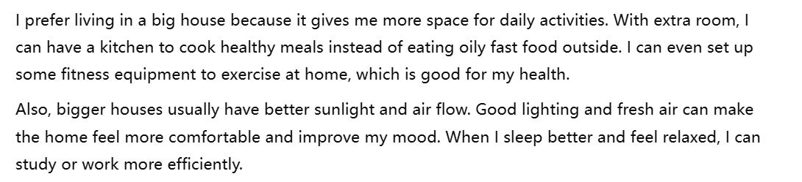
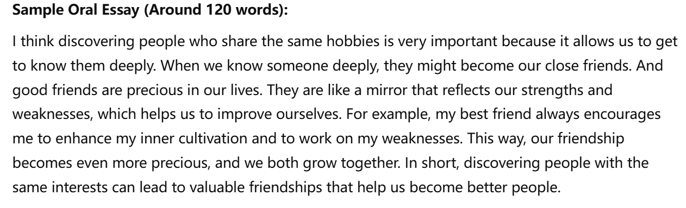
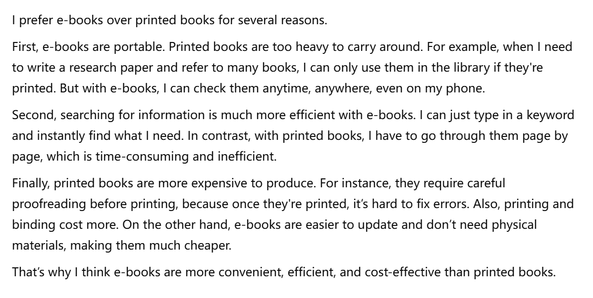
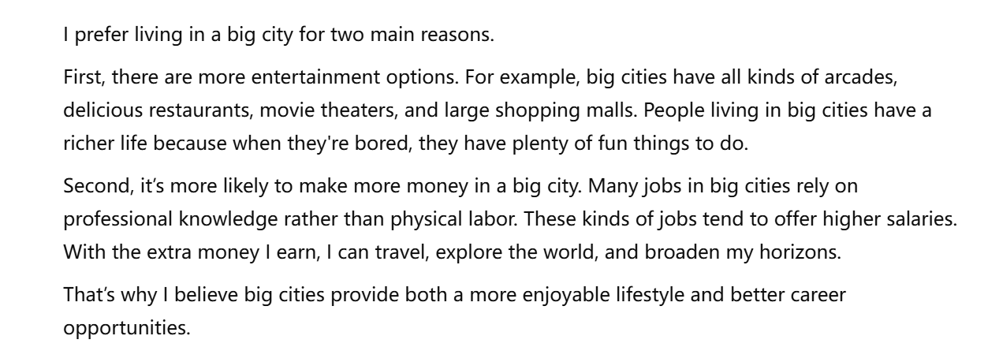
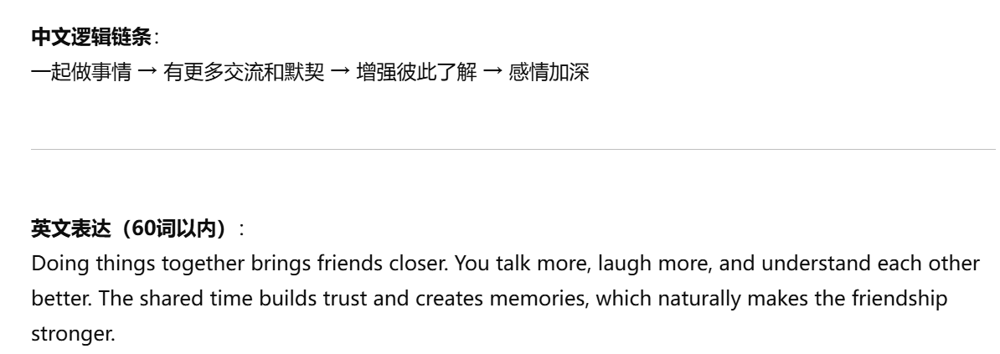
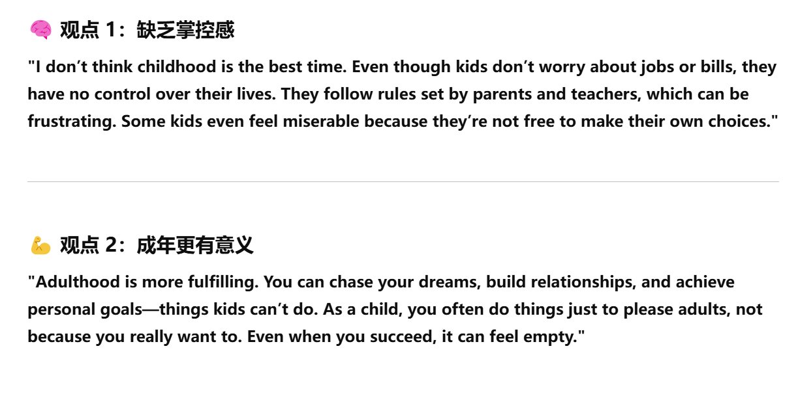
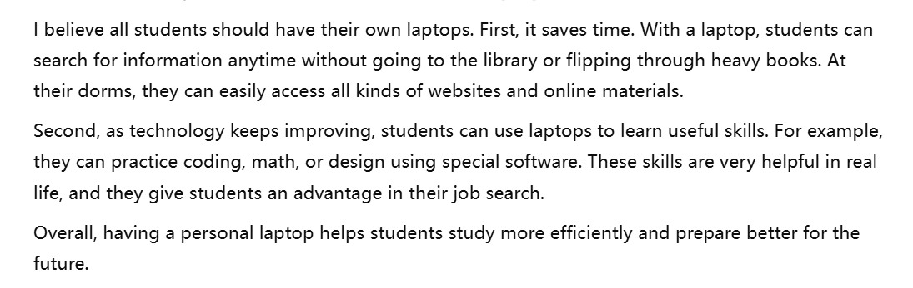
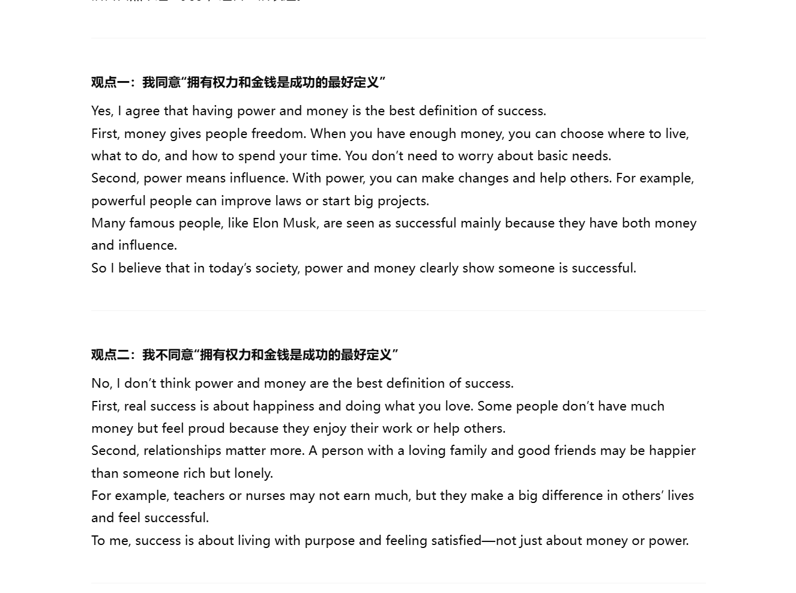
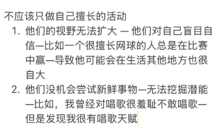

>  大学生要学习，没空做别的事情

- 很多事做 —— 作为一个大学生，被 schoolwork 充满 [overwhelmed] —— 写论文，做研究，参加社团活动 —— 没时间做其他事情

- 对大学生来说，最重要的就是 to do well academically —— 学业成功和好成绩 really matter —— 进入社会后，他们在大学优异的反映了他们的努力，也可能会给 on 他们面试 apply to的公司带来 leave 好印象 —— 【认真学习到的知识也对以后的事业有帮助 —— 这意味他们完成工作得更好】

> 如果强迫他们做其他除了学习以外的事呢
>
> 这点也可以用在父母，老师，朋友强迫对方做啥做啥

- 他们只会严肃对待对 academic work 有好处的事情 —— 别的事：chore nuisance —— 不会投入精力 —— 产生不好情绪 [frustrated,experience negative emotions]—— 争执，outright rebellion

> 观点不同

- 不同的 world views/ outlooks on life / moral values ——engaging in various standpoints ——  让我们批判性思考、不同 perspective 看世界 —— 加强我们的理解力包容力 reasoning and tolerance —— 让友谊变得更有价值

> 这点也可以用在父母，老师，朋友强迫对方做啥做啥

- 朋友是独立的个体 —— 他们有自己的想法和价值 —— 我们应该承认对方的自主权（Autonomy)，鼓励独立思考 —— 建立健康平衡的关系

> 住大房子

- 我有更多日常活动空间 —— 我还有额外的空间 —— 我可能有一个小房子没有的厨房 —— 不然我只能出去吃油腻不健康的食物  —— fitness equipment
- 房子更大通常采光和通风更好 —— 空气流通、阳光充足 —— 居住环境更健康 —— 有利于提高睡眠质量和情绪状态 —— 这会让我在学习和工作时表现更好 —— natural light & fresh air

> 体育运动，健身

- 做一些体育运动， 如 … —— 来保持身体活跃 —— focused motivated —— 提升concentration 学习效率 —— 提升能量水平

- 养成好习惯 —— doing exercise on a regular basis 成为日常 —— 自律 —— willpower stick to 学习目标

> 学画画[艺术]的好处

1. 培养创造力 —— 通过观察学习他人的作品 —— 对一些细节，情感能更敏感 —— 提升观察力和想象力 —— 激发创造力
2. 对精神健康有好处 —— 情绪释放 —— 内心更加丰盈平静 feel lighter and more at peace inside —— 没有糟糕的情绪干扰 not constantly bothered by bad emotions —— 有助于好性格的形成

>  教学方面

1. 请教问题 consult with the teacher—— 问题一出，就立马解决 —— 对于完成难的作业有好处；对于加深课程材料的理解 —— 学业成功；在考试中取得好成绩 —— 对于老师，effective feedback about how… —— whether…；
2. 上课更认真；学习更有热情 —— 跟上老师的步伐在课堂上 —eg— 抓住grasp每个知识点；与老师互动 —— 在课堂上及时消化知识点 —— 提升学习效率

> 消解压力

1. 做。。。让人置身于新世界 —— 逃避现实，忘记烦恼 —— immerse in doing… ; 心情好calm peaceful —— 放松 能量

> 大学交朋友的好处

1. 结交同专业朋友 —— exchange / motivate each other —— difficult assignments/study for exams —— academic success/good grades —— 还可以一起成立公司，在事业上互帮互助 —— 更有可能获得事业成功
2. 一起上课 —— 更有可能 get acquainted with —— feel connected to academic community

> 讲座

1. 大学要想学术氛围好 ——拓宽学生视野，使他们有机会能吸收各方面的知识 ——  开设讲座 —— 教授或者名人 —— 前沿知识或珍贵意见 ——
2. 为了让学生全方位发展—— 邀请演讲者 —— 给出政治经济方面观点 —— 批判性思考 

​                                                                           ——  Social responsibility and global issues —— 让学生understand世界正在发生什么事情 —— 让他们better consider 毕业后该为社会贡献什么

> 参加活动

1. 发现有共同兴趣爱好的人 —— 深入了解 —— 可能会成为好朋友 —— 好朋友是珍贵的 —— 朋友像一面镜子 —— 发现优缺点 —— enhance inner cultivation —— 让友谊更珍贵 precious

> 老年人参加工作

1. 对钱：一些人缺钱 —— 他们还具有持续工作的能力 —— 工作的收入减轻家庭金融压力

2. 对公司：老年人更有工作经验 —— 可以培训管理年轻人 —— 有助于公司的发展 —— 这样的工作也不怎么消耗体力，老年人可以 handle

3. 对人：为社会继续做贡献 —— 成就感 ——有一些事情做；有一些人聊天 — 没事做的话 —— 感觉被社会抛弃 —— 心情低落，抑郁 

> 拍照

1. 减少当下沟通交流的机会 —— 因为大家都忙着拍照，没有更多的时间深入了解彼此 —— 错失了加强关系的机会

2. 虽然照片也很有意义 照片不能使我们完全想起来细节 —— 拍了照也不会一起看 —— 对加强关系没有好处

3. 拍照不一定会每个人表现出最好的状态 —— 不会让每个人满意 —— 失去了拍照的意义

> 现在比过去更难吃到健康食物

1. 快餐 processed food 泛滥 —— 忙碌的人们会选择这种简单快捷的食物 —— 这些食物高热量，高糖，高盐 ——过去人们在家做饭 —— 食材在市场和农场中购买，更健康

2. 环境污染 —— 污染在空气，水，soil 影响我们的吃食 —— heavy metals 和 chemicals 在我们吃的蔬菜和肉里 —— 现在很难找到有机地，干净的食物 —— 过去，食物更新鲜干净

> 在家做饭还是吃外面的食物？

可以参照上面第一条

2. 家里用的食材更干净 —— 我可以在 farmers‘ markets 或者 local store 中挑选新鲜的食材【from】—— 但在外面，没 guarantee 外面的食材是有机新鲜的

> 大学管理部门来设置大学生课程体系

1. 能做出更合理的的决定 —— 他们有更多经验设计syllabus —— 知道学生改上什么课，其他是不必要的 —— 提供系统的课程表 
2. 无法满足所有学生需求 —— conflict rebellion —— 如果一个学生被迫遵守其他学生的想法，他会不高兴resentful

> 演说还是论文

1. 演说 —— 更考验综合能力 —— 网上研究；读学术期刊；讲话演练 —— well-prepared confident
2. 更多人参与到我的研究 —— 提出不同观点 —— 发现我的错误 —— 这是我自己无法发现的

> 纸质书还是电子书

1. 电子书 —— 电子书容易携带 portable —— 纸质书拿着太重了 —— 比如我要写论文，需要参考很多很多书 —— 我只能在图书馆用这些书 —— 书搬回宿舍不方便 —— 如果使用电子书 —— 我可以任何时间任何地点在手机上查看 
2. 纸质书的造价成本更高 —— 比如，第一，纸质书需要编辑认真审阅，因为一经发布无法修改，第二，纸质书需要精细的把文字打印在纸上再装订，而有些在线电子书发现错误是是可以随时修改的，也不需要装订这一个过程，电子书比纸质书便宜的多。

> 可以使用在用电子设备搜索信息的场景的

1. 搜索信息更高效 —— 只用把关键字输入 —— 各种各样的信息 —— 相反，纸质书需要一章一章寻找 —— 效率不高

in contrast

> 大城市还是乡村？

1. 大城市 —— 娱乐设施更多  —— 比如说，大城市有各种各样的游戏厅，好吃的餐厅，电影院，大商场。在大城市的人们生活更加丰富，因为他们无聊的时候有很多娱乐可以选择。
2. 在大城市有可能挣更多的钱 —— 在大城市的很多工作需要专业知识而不依靠体力劳动 —— 这样的工作更有可能得到更高的工资 —— 这些攒下来的钱我可以拿去旅游 —— 看世界，开阔眼界。

1. 乡村 —— 城市有更多污染像水，空气，土壤污染 —— 在乡村，可以吃到不含重金属和化学物的食物，呼吸新鲜空气喝干净水 —— 对身体好，活更久
2. 快餐 processed food 泛滥 —— 忙碌的人们会选择这种简单快捷的食物 —— 这些食物高热量，高糖，高盐 ——过去人们在家做饭 —— 食材在市场和农场中购买，更健康

> 周末户外 or 家里

户外：

1. 长时间的工作学习，精神不好 feel mentally exhausted —— 呼吸新鲜空气，欣赏美景让我们放松，释放压力 —— 沉浸在自然中 —— 忘却烦恼
2. 适当的锻炼对身体健康有益 —— 也让我们更 focus motivated —— 有一个更好的 state 面对 coming 工作或学习和更productive

> 现在的人们有更健康的生活方式吗

1. 吃的没那么有机新鲜 —— 过去人们更多的是在家做饭，食材大多都是从农贸市场买的 —— 更健康的食谱 —— 现在生活 modern life 快节奏 —— 人们习惯在快餐店吃油腻的食物 —— 可能会得一些疾病
2. 现在的在大城市的工作需要专业知识而非劳动 —— 很多人在电脑前一坐一天 —— 缺乏锻炼

- meals were home-maked with ingredient from … making diets healthier

> 你觉得未来人们会读更少的书吗？

1. 会 ——看书有时候需要用理解书中的抽象内容 —— 对于有些人来说，读书还不如叫学习  ——但是随着生活节奏的加快，人们有压力 —— 所以在经过忙碌的一天后 —— 大部分人可能只想做一些轻松的事 
2. 各种各样的娱乐活动分散人们的注意力 —— 有些人可能希望通过休息时间户外锻炼而不是读书 —— 有些待在家里的人会打游戏，看肥皂剧 ——除非爱看书，不然想不起来

- Unless they are big fans of reading, books probably won’t even cross their mind.

> 你觉得学生会需要一直坐在一个座位上吗

可以用1. 学校强迫大学生做什么事情那一条，和2. 交朋友以促进学习那一条。

> 交很多朋友或者小范围交朋友

1. 朋友像镜子那一条
2. 不同的人有不同的世界观那一条

> 跟朋友一起看电影更好吗？

第二条就是不同的人有不同的世界观那一条

> 存钱还是花掉？

- 额外的钱可以应急 —— 比如说，如果突然换了工作，工作的地方离家很远，这些攒下来的钱可以买辆车 —— 不用每天花很多时间挤地铁 —— 方便了出行
- 攒钱的时间让我想清楚我真正想要的东西 —— 比如我很想去环游世界 —— 我就要慢慢攒钱 —— 如果我提前花掉了钱做了一些没那么让我快乐的事情 —— 我会后悔

Extra money can really help in unexpected situations. Say I suddenly switch jobs and the new office is far from home — with the money I’ve saved, I could buy a scooter or something. That way, I won’t have to squeeze into the subway every day and waste time commuting.

Saving money also gives me time to think about what I really want. Like if I dream of traveling the world, I’ll know I need to save up slowly. But if I blow my money too soon on things that don’t truly matter, I might regret it later.

> 孩童时期是最好的吗？

1. 不是 —— 尽管他们不用担心工作和账单 —— 他们不能控制自己的生活 —— 不能有自己的决定，总是按照家长老师说的去做 —— 这会让有些小孩有时候很痛苦 —— 可能会有争执和反抗。
2. 成年更fulfilling —— 可以追逐自己的梦想，建立关系，实现个人目标 —— 这种成就感和满足感是童年没有的 —— 相反，孩子只能活在家长和老师对他们的评价体系当中 —— 他们有可能做着自己不想做的事情来获得表扬 —— 即使成功了也会觉得空虚

**That sense of accomplishment and independence is something you just can’t experience as a child.**

> 计划休息时间

休息时间是提升自己的重要机会  —— 安排休息时间去听讲座，看美术馆，户外运动 —— 如果把休息时间浪费在耍手机和睡觉上，我会后悔

> 快速做决定吗？

- 不——快速决定会忽略一些因素而导致错误——没有考虑到做决定的后果——可能会后悔做这个决定
- 深思熟虑让人考虑到每个细节——在决定时更有信心——知道自己在干嘛——如挑一个好大学。。。

> 有自己电脑的好处

1. 随时随地查资料——不用去图书馆找书搬书——在宿舍就能查到各种各样信息在网站上——节省时间
2. 科技进步——学生可以利用电脑学一些有用的技能—— 写比如电脑里一些代码，数学，设计软件等等——在他们求职过程中更有优势

digital material 

> 学生应该每学期额外上课来更快修完学分吗？

不同意

1. 大学的知识较多较难 —— 需要学生花时间吸收 —— 如果知识太多可能导致学生学得不太好 —— 可能不能完成难的作业和考到好成绩 —— 学生感到沮丧受挫
2. 学生需要休息时间 —— 一直上课导致疲劳 —— 劳逸结合使学生可以有一个好的状态去面对接下来的学习

范文：

**First**, university courses already bring a lot of knowledge, and the content is usually quite difficult.
 Students need time to understand and absorb it properly.
 If they take too many courses at once, they might not be able to keep up, and their grades could suffer.
 Also, they may feel overwhelmed and stressed out.

**Second**, students need time to rest.
 Taking classes non-stop can lead to burnout.
 A good balance between study and rest helps students stay in a better state, both mentally and physically, to handle future learning.

> 孩子应该在早年学会独立吗？

1. 应该 —— 对于他们好的性格和习惯的形成有帮助 —— 让他们意识到什么事都要靠自己（relay on) 和更有主见（ becoming more independent-minded） —— 免受周围人坏习惯和行为的影响
2. 能更好的照顾自己 —— 当他们进入社会，离家上学 —— 他们知道怎么洗衣服怎么做饭 —— 有更好的生活质量 (and make their daily life easier)

> 打字做笔记还是手写

打字：

1. 学生上课有很多知识要学 —— 打字更快更方便 —— 学生能更好的理解和复习知识
2. 课后，电子版的笔记能分类，编辑，存储在电脑软件上 —— 更好的组织知识结构 —— handwritten notes不好修改添加知识点

> 人们应该只参加他们擅长的活动和爱好吗？

不应该

 tap one’s potential

> 学知识需要一个好老师吗？

需要

1. 老师可以高效传授知识——学生不需要花很多时间查阅资料/收集(searching for)信息，老师直接教授给他们，更节省时间
2. 好的授课方式激发学生的兴趣——只要有了兴趣，学生会积极地学习，比如一出现问题立马找老师互动讨论——提高学习效率

不需要

1. 现代社会资源丰富，有很多网络课程、书籍、视频，学生可以自主学习 —— 他们自己(by themselves/on their own)收集整理的知识，会给他们留下更深刻的印象——对知识有更深的理解
2. 培养自己学习的能力——比如独立思考，解决问题(problem-solving skills)——很多人没有主动学习的习惯(habit of studying actively)——所以拥有这种能力让他们在工作中也会脱颖而出(stand out)

build the habit

> Some people prefer to work in a company where they have the independence to complete tasks and work out solutions to problems on their own. Others prefer to work in an environment where they are told exactly what they need to do. Which work situation would you prefer? Explain why, using details and examples.

1. 帮助人们提升解决问题的能力——任务有难度——激发创造性(inspire creativities)——积累经验——磨炼心态(strong mindset)——从容熟练的面对困难
2. 我可以更好的展现出自己的做事方法和风格(my own working method)——更容易得到赏识——更容易升职(promotion)————得到成就感、高薪

- Problem-solving stills
- challenging 

> Some people prefer to take time to work through everyday tasks slowly and carefully Others think it's best to finish their tasks as quickly as possible. Which approach do you think is better? Use details and examples to explain your opinion.

1. 培养做事高效的习惯(habit of being efficient)——现代社会的节奏快——很多时候要求效率——比如大学生要写论文上课参加社团活动——想要全面发展(comprehensive development)必须快速做事
2. 快速完成任务有时间休息——空闲时间做自己喜欢的事情——户外活动/陪伴家人/读书

> Do you agree or disagree with the following statement? People from simple, ordinary backgrounds often make the best government leaders. Use specific reasons and details in your response.

1. 同意——一个人想要从普通人变成leader——必须付出比常人更多的努力——说明他们会很有经验和解决问题的能力
2. 他们知道普通人的困境在哪里——因为他们经历过普通人会遇到的问题——他们会对人们的困难更感同身受(truly understand)，着手于解决这些问题(willing to find the solution)

what ordinary people’s struggle are
