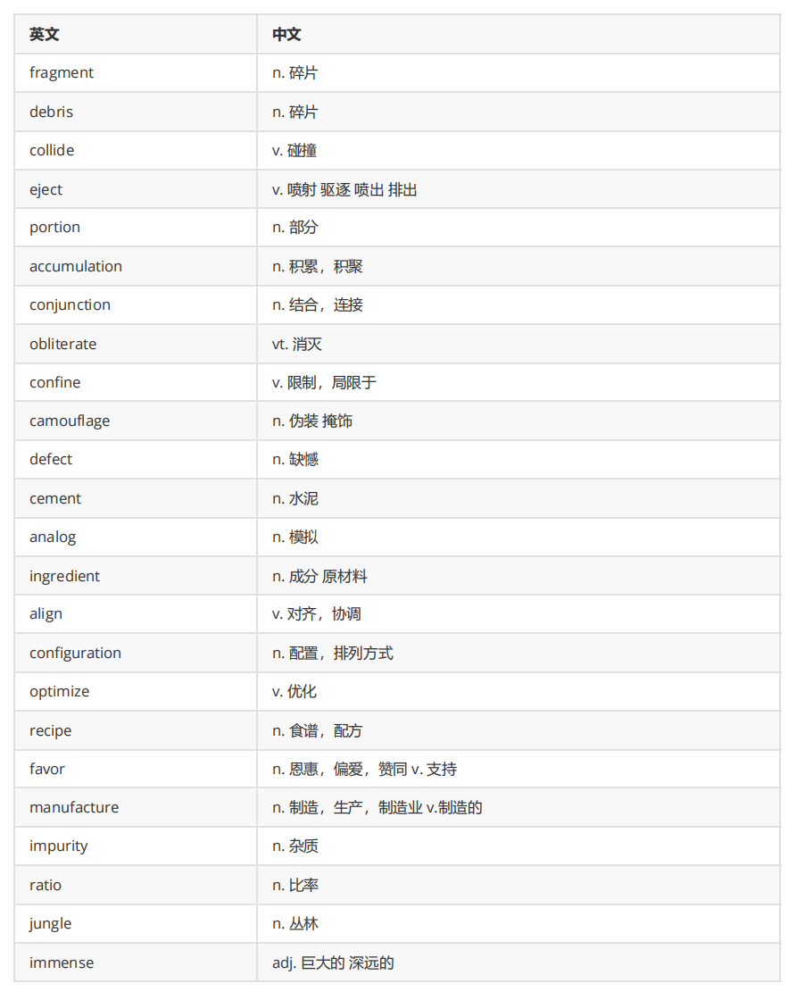
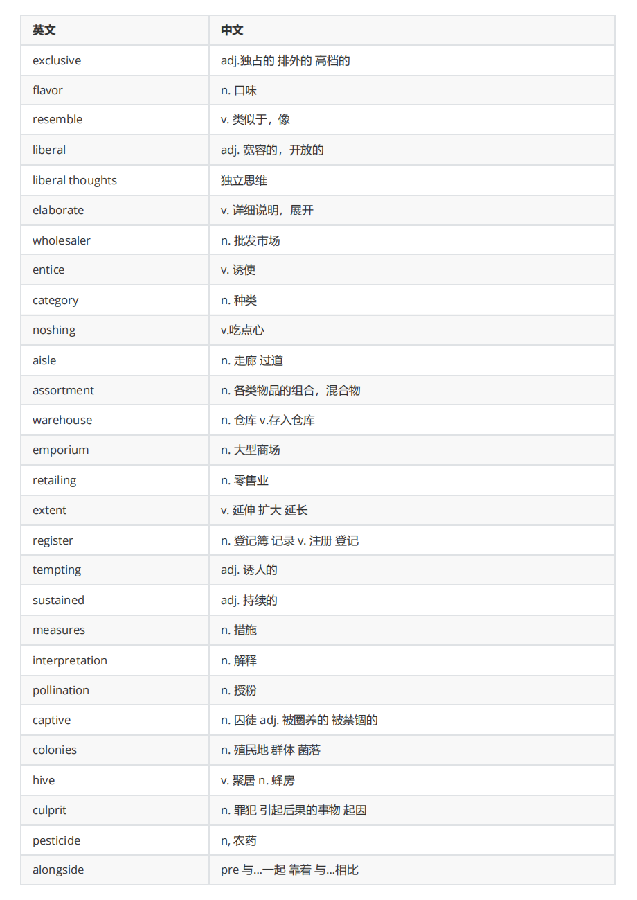
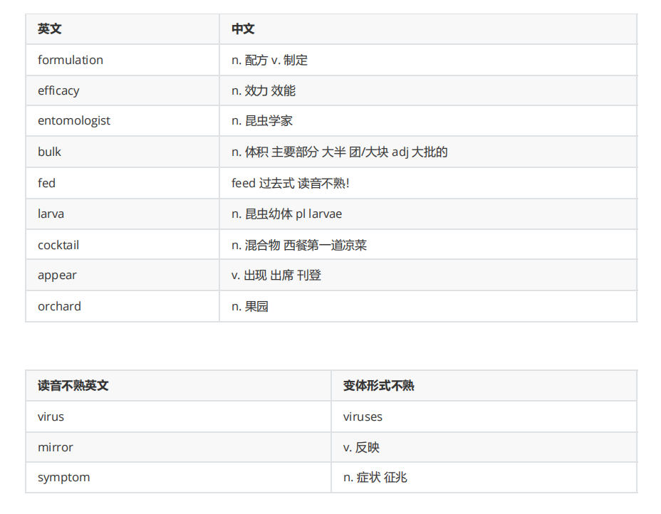

### 听力不熟单词/词组

| 重要单词          | 中文                 |
| ----------------- | -------------------- |
| topography        | 地形（学）           |
| precipitation     | 降水                 |
| arctic            | 北极的；北极         |
| layer             | 层                   |
| pile              | 堆                   |
| vapor             | 蒸汽                 |
| fascinate *       | 使着迷               |
| module *          | 单元；宇宙飞船       |
| satellite *       | 卫星                 |
| lava              | 熔岩 岩浆            |
| formation         | 形成 构成            |
| magma             | 岩浆                 |
| in the same spot  | 在同一处             |
| sloping           | 有坡度的             |
| tectonic plate    | 构造的 plate读音！   |
| discrete          | 独立的，不连续的     |
| scatter           | 分散                 |
| sulfur            | 硫                   |
| fluctuation       | 波动                 |
| blood             | 血                   |
| make up           | 组成                 |
| dives             | 不是die啊            |
| organ             | 器官                 |
| mystify           | 迷惑住               |
| arguably          | 可论证的；可以说     |
| administrative    | 行政的               |
| linguistic        | 语言上的             |
| essentially       | 基本上               |
| interpret         | 理解                 |
| equip             | 读音！               |
| astronaut         | 宇航员               |
| expand shrink     | 扩大 收缩            |
| rupture *         | 破裂                 |
| manufacture       | 制造                 |
| rhythm            | 节奏                 |
| coral             | 珊瑚                 |
| in essence        | 本质上               |
| monument          | 纪念碑               |
| display           | 展示                 |
| be concerned with | 关心                 |
| impressed         | 印象深刻的           |
| for that matter   | 甚至，就此方面而言   |
| bring an end      | 有连读               |
| inspiration       | 灵感                 |
| skeptics          | 怀疑者 （skeptical） |
| sharpen           | 清晰                 |
| assertiveness     | 自信，魄力           |
| poetry            | 诗歌                 |
| innovative        | 创新                 |
| heritage          | 遗产                 |
| incorporate       | 合并，包含，吸收     |
|                   |                      |
|                   |                      |
|                   |                      |
|                   |                      |
|                   |                      |

阅读：

- 短句可以直接看
- 长难句看主角们，主角做了什么，结果是
- 每看一句找跟上一句的衔接关系，争取不回看
- 每段找主旨句，牢记于心后看细节

| 英文          | 中文                 |
| ------------- | -------------------- |
| bold          | adj. 大胆的          |
| timid         | adj. 胆小的          |
| trios         | n. 三足鼎立          |
| at one end    | 在…的一头            |
| sally forth   | 突然出发 勇敢出发    |
| emerge        | v. 兴起 出现 显露    |
| retiring      | adj 害羞的 退休的    |
| expedition    | n. 冒险 探险         |
| tail          | 尾巴 尾随            |
| initiate      | 发起 开始 新加入的   |
| regardless of | 不管 不顾            |
| fishy         | 可疑的               |
| invoke        | 调用 引发 引用       |
| wrinkle       | 皱纹                 |
| extensive     | 广泛的 大量的 全面的 |
| teeming with  | 充满                 |
| convention    | 公约                 |
| assumption    | 前提，假设           |
| violate       | 违反                 |
| philosopher   | 哲学家               |
| retreat       | 消退                 |
| periodic      | 周期性的             |
| default       | 默认的 拖欠          |
| beneficiary   | 受益者               |
| fortuitous    | 偶然的               |
| drastically   | 显著地，大大地       |
| thaw          | 解冻                 |
| candidate     | 候选人               |
| monetary      | 货币的               |
| grant         | 授予/承认 补助金     |
| allot         | 分配                 |
| fragment      | 碎片                 |
| debris        | 碎片                 |
| revolve       | 旋转                 |
| stationary    | 固定的，静止的       |
| secrete       | 分泌                 |
| descend       | 遗传，下降           |
| apparatus     | 器械 设备            |
| trait         | 特性；属性           |
| membrane      | 膜                   |
| receptacle    | 容器                 |

