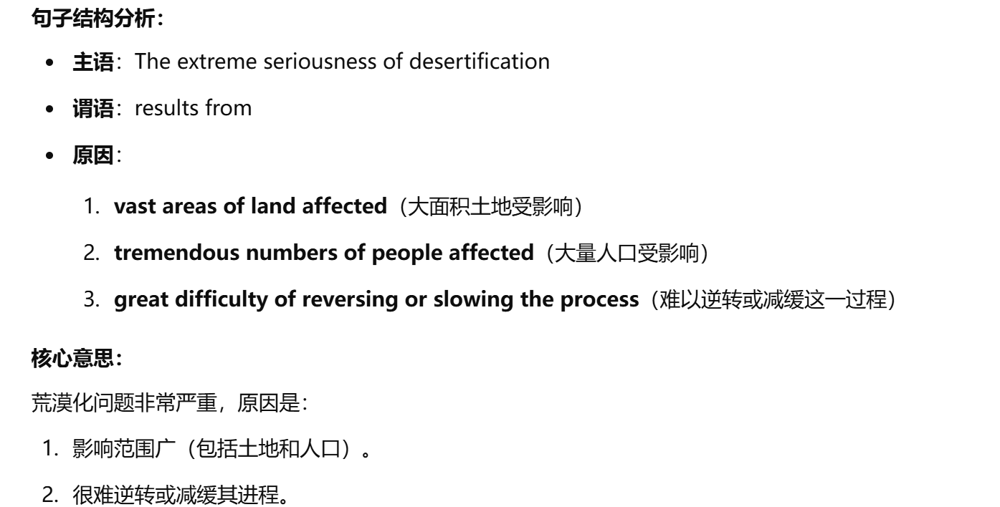
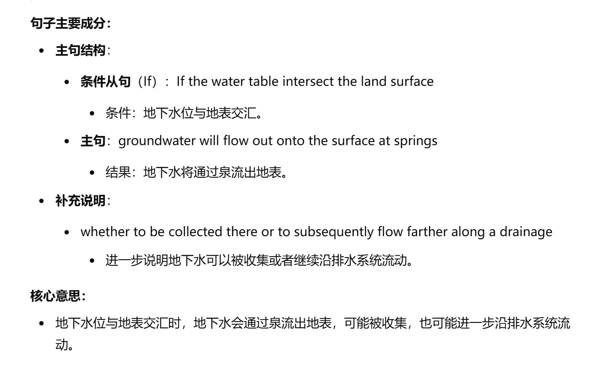
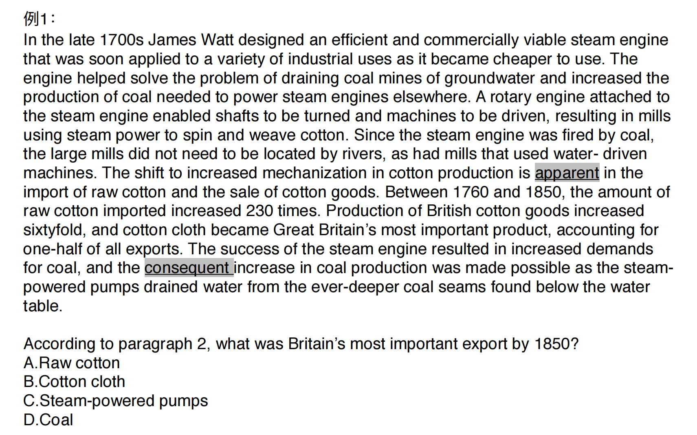

## 1. 句子简化题

### 1.1 例题

#### Question 1

In addition to finding an increase of suitable browse, like huckleberry and vine maple, Arthur Einarsen, longtime game biologist in the Pacific Northwest, found quality of browse in the open areas to be substantially more nutritive.

A. Arthur Einarsen’s longtime family with the Pacific Northwest helped him discover areas where deer had an increase in suitable browse. 

B. Arthur Einarsen found that deforested feeding grounds provided deer with more and better food. 

C. Biologist like Einarsen believe it is important to find additional open areas with suitable browse for deer to inhabit. 

D. According to Einarsen, huckleberry and vine maple are examples of vegetation that may someday improve the nutrition of deer in the open areas of the Pacific Northwest.

::: info 解题

1. **抓住题干的核心信息**

题干的核心信息是：

- **发现开阔区域的植被（如越橘和藤枫）更有营养**。
- 主语是**Arthur Einarsen**，背景是**太平洋西北地区的长期野生生物学家**。

关键动词是“发现”（found），宾语是“开阔区域的植被更有营养”（the quality of browse in open areas to be substantially more nutritive）。

2. **排除无关选项**

- **A**：提到他的家庭帮助发现适合鹿的区域，但与题干无关，因为题干没有提到“家庭”。
- **B**：提到砍伐的区域为鹿提供更好食物，这是对题干内容的过度引申，原文未提到“砍伐区域”。
- **C**：提到找到更多开阔区域的重要性，但题干没有讨论行动的重要性或目标。
- **D**：准确提到越橘和藤枫是开阔区域营养植被的例子，与题干内容一致。

3. **选出与题干同义改写最接近的选项**

**D选项**直接提到“越橘和藤枫可能改善鹿的营养”，这与原文信息一致。

4. **总结解题技巧**

- **第一步：抓住句子核心（主语+动词+宾语）**。
- **第二步：分析选项的关键信息是否与题干匹配**，去掉偏离或引申过多的选项。
- **第三步：优先选择简洁直接的表达**，避免过度解释。

:::

选 D

#### Question 2

These have changed constantly through time, even in relatively recent periods, as can be seen from the Neolithic stone circle of Er Lannic, in Brittany, France (once inland but now half submerged on an island) or medieval villages in east Yorkshire, England, that have tumbled into the sea in the last few centuries as the North Sea gnaws its way westward and erodes the cliffs.

A. In the last few centuries, the erosion of coastline created the Neolithic stone circle in Brittany, France, at the same time that it destroyed the medieval villages in Yorkshire, England.

B. Coastlines have changed even in recent times as shown by the current locations of certain Neolithic monuments and medieval villages.

C. Recent changes in the coastlines near the Neolithic stone circle of Er Lannic in Brittany, France, and the medieval villages in Yorkshire, England, suggest that ancient coastlines changed in similar ways.

D. Changes in coastlines can lead to the creation of islands such as Er Lannic in France or the total erosion of the cliffs as in Yorkshire in England, though no considerable changes have occurred in recent periods.

::: tips

**（1）抓住主谓宾结构**

- 主语：**These**（代指“海岸线的变化”）
- 谓语：**have changed constantly**
- 宾语：句子没有直接宾语，后文通过具体例子来说明主谓部分。

**（2）理解修饰成分的作用**

- 时间状语：“through time, even in relatively recent periods” 描述变化的时间范围。
- 例子部分：“as can be seen from...” 提供具体的证据支持主句观点。

:::

选 B

#### Question 3

这题主要在于排除干扰项。

Historian Frederic Lane observes that after the loss of ships in battle in the late sixteenth century, the shipbuilding industry no longer had the capacity to recover that it had displayed at the start of the century.

A.The loss of ships in battle at the end of the sixteenth century showed that Venetian shipbuilders lacked the skills they had possessed at the beginning of the century.

B.Venetian shipbuilding failed to quickly replace the ships lost in battle at the end of the sixteenth century as it would have done earlier in the century.

C.Frederic Lane noted that Venice lost ships in battle at the end of the sixteenth century, showing that Venetian shipbuilding was not longer known for its reliability.

D.Venetian shipbuilding had been known for its high quality of work at the beginning of the sixteenth century, but toward the end of the century Venetian ships were poorer in quality

**A.**

> The loss of ships in battle at the end of the sixteenth century showed that Venetian shipbuilders lacked the skills they had possessed at the beginning of the century.

- 这里提到“失去了技术”，但题干并没有明确提到“技能缺失”，而是更笼统地提到“复原能力”的丧失。
- **偏离题干意思**，排除。

**B.**

> Venetian shipbuilding failed to quickly replace the ships lost in battle at the end of the sixteenth century as it would have done earlier in the century.

- 准确提到了船舶制造业在16世纪末无法快速恢复损失，而16世纪初具备快速恢复能力。
- **完全符合题干核心意思**。

**C.**

> Frederic Lane noted that Venice lost ships in battle at the end of the sixteenth century, showing that Venetian shipbuilding was not longer known for its reliability.

- 提到“可靠性下降”，但题干讨论的是“复原能力”，而非“可靠性”，存在偏差。
- **不完全贴合题干内容**，排除。

**D.**

> Venetian shipbuilding had been known for its high quality of work at the beginning of the sixteenth century, but toward the end of the century Venetian ships were poorer in quality.

- 这里强调的是船只质量的变化，而题干讨论的是船舶制造业复原能力的变化。
- **不符合题干核心意思**，排除。

选 B

### 1.2 句间关系

#### A. 因果

1. **Because the medium was so prolific（多产的）, in the sense that it was possible to produce a multitude of images very cheaply, it was soon treated as the poor relation of fine art, rather than its destined successor（继承者）**.

    A. Photography did not replace other fine arts because people felt the image looked cheap in relation to the other arts.

    B. Photography was not considered a true art because people could use it to create many images cheaply. 

    C. Photography was so cheap and readily available that it could be purchased by people who were too poor to purchase fine     art.

    D. Photography not only spread quickly but also was a cheap art form and so became true successor of fine arts rather than its poor relation.

::: info

摄影被认为是“贫穷的艺术亲戚”（poor relation of fine art），而不是“真正的继任者”（destined successor）。—— 果

主要原因是：摄影可以廉价地大量生产图像（prolific and cheaply）。—— 因

**选 B**

:::

2. **The extreme seriousness of desertification results from the vast areas of land and the tremendous numbers of people affected, as well as from the great difficulty of reversing or even slowing the process.**

    A. Desertification is a significant problem because it is so hard to reverse and affects large areas of land and great numbers of people. 

    B. Slowing down the process of desertification is difficult because of population growth that has spread over large areas of land. 

    C. The spread of deserts is considered a very serious problem that can be solved only if large numbers of people in various countries are involved in the effort. 

    D. Desertification is extremely hard to reverse unless the population is reduced in the vast areas affected.

**选 A**

3. **If the water table intersect the land surface, groundwater will flow out onto the surface at springs, whether to be collected there or to subsequently flow farther along a drainage**.

    A. Groundwater only flows out of the ground if the water table intersects the land surface.

    B. If the land surface and the water table intersect, groundwater can flow underground.

    C. Groundwater may be drained if springs occur where the water table intersects the land surface.

    D. Where the water table meets the land surface, groundwater flows out through surface springs.

**A.**

> Groundwater only flows out of the ground if the water table intersects the land surface.

- 使用了“only”，暗示“这是唯一的条件”，但题干中没有强调“唯一性”，表述过于绝对。
- **与题干不完全吻合**，排除。

**B.**

> If the land surface and the water table intersect, groundwater can flow underground.

- 错误理解题干。题干说的是地下水会流到**地表**，而非继续在地下流动。
- **与题干意思相反**，排除。

**C.**

> Groundwater may be drained if springs occur where the water table intersects the land surface.

- 提到“may be drained”（可能被排出），但题干强调的是“地下水流出地表”，而不是“排出”的概念，偏离题干核心。
- **不符合题干主旨**，排除。

**D.**

> Where the water table meets the land surface, groundwater flows out through surface springs.

- 准确概括了题干内容：
    - 条件是地下水位与地表相交。
    - 结果是地下水通过泉流到地表。
- **完全符合题干核心意思**，正确答案。

选 D

#### B. 转折

**Inequalities of gender have also existed in pastoralist societies, but they seem to have been softened by the absence of steep hierarchies （陡峭的阶级/层次） of wealth in most communities, and also by the requirement that women acquire most of the skills of men, including, often, their military skills.**

A. Despite the fact that wealth is relatively evenly distributed in pastoral societies, gender inequality still exists because only men can acquire military skills and social status.

B. Inequalities of gender existed in pastoralist societies until most communities began to require women to possess the same skills as men and take part in the military.

C. Inequalities of gender in pastoralist societies were caused by steep hierarchies of wealth and differences in military training between men and women.

D. In pastoral societies, gender inequality is comparatively mild because wealth is relatively evenly distributed and women have to learn most of the same skills that men do.

选 D

**In order for the structure to achieve the size and strength necessary to meet its purpose, architecture employs methods of support that, because they are based on physical laws, have changed little since people first discovered them—even while building materials have changed dramatically.**

A. Unchanging physical laws have limited the size and strength of buildings that can be made with materials discovered long ago.

B. Building materials have changed in order to increase architectural size and strength, but physical laws of structure have not changed.

C. When people first started to build, the structural methods used to provide strength and size were inadequate because they were not based on physical laws.

D. Unlike building materials, the methods of support used in architecture have not changed over time because they are based on physical laws.

**句子结构**

1. **主句**：
    - 主语：architecture
    - 谓语：employs methods of support
    - 修饰语：to achieve the size and strength necessary to meet its purpose（描述目标）。
2. **从句（修饰 methods of support）**：
    - 内容：because they are based on physical laws（说明原因）。
    - 结论：这些方法（methods of support）“have changed little”（几乎没有变化）。
3. **对比关系**：
    - **对比对象**：structural methods（结构支撑方法）与 building materials（建筑材料）。
    - **对比内容**：支撑方法几乎没变（因物理规律），而建筑材料发生了显著变化。

**核心意思**

- 建筑中为了达到所需的强度和规模，使用基于物理规律的支撑方法。
- 这些方法几乎没有改变，即使建筑材料已经发生了很大变化。

选 D

**But as more and more accumulations（积累，堆积） of strata（地层） were cataloged（编目） in more and more places, it became clear that the sequences of rocks sometimes differed from region to region and that no rock type was ever going to become a reliable time marker throughout the world.**

A. The discovery of regional differences in the sequences of rocks led geologists to believe that rock types could someday become reliable time markers.

B. Careful analysis of strata revealed that rocks cannot establish geological time because the pattern of rock layers varies from place to place.

C. Smith's catalogs of rock strata indicated that the sequences of rocks are different from place to place and from region to region.

D. Because people did not catalog regional differences in sequences of rocks, it was believed that rocks could never be reliable time markers.

#### C. 并列

**By the end of the century, the time was ripe for more change: the tyrants==暴君== were driven out, and in 508 B.C. a new reformer, Cleisthenes, gave final form to the developments reducing aristocratic==贵族的== control already under way.**

A. Cleisthenes, a reformer who recognized that aristocratic control had been decreasing since the end of the previous century, finally drove the tyrants out of Athens in 508 B.C.

B. The tyrants were driven out, and in 508 B.C. Cleisthenes put in place the structures that completed the weakening of the aristocracy.

C. By driving out the tyrants, Cleisthenes enabled the reforms that had been under way since the end of the century to reach their final form in 508 B.C.

D. Toward the end of the century, the tyrants were driven out, and in 508 B.C. Cleisthenes saw that it was time to change the structures that had reduced aristocratic control.

选 B

::: important 错误选项分析

A. 强行添加了太多多余注解，比如 Cleisthenes 分析了贵族制的减少（人家只是制定了一套制度阻止贵族制）。

C. 赶走暴君 和 制定规则 之间是并列关系，并不存在借助赶走暴君来制定规则。

D. 文中并没有体现 saw that it was time to change 这一动作，信息冗余。

:::

Only the last of these was suited at all to the continuous operating of machines, and although waterpower abounded==丰富的== in Lancashire and Scotland and ran grain mills==谷物磨坊== as well as textile==织品== mills, it had one great disadvantage: streams flowed where nature intended them to, and water-driven factories had to be located on their banks whether or not the location was desirable for other reasons.

A. Running water was the best power source for factories since it could keep machines operating continuously, but since it was abundant only in Lancashire and Scotland, most mills and factories that were located elsewhere could not be water driven.

B. The disadvantage of using waterpower is that streams do not necessarily flow in places that are the most suitable for factories, which explains why so many water-powered grain and textile mills were located in undesirable places.

C. Since machines could be operated continuously only where running water was abundant, grain and textile mills, as well as other factories, tended to be located only in Lancashire and Scotland.

D. Running water was the only source of power that was suitable for the continuous operation of machines, but to make use of it, factories had to be located where the water was, regardless of whether such locations made sense otherwise.

A选项：

> **Running water was the best power source for factories since it could keep machines operating continuously, but since it was abundant only in Lancashire and Scotland, most mills and factories that were located elsewhere could not be water driven.**

**错误点**：

- 强调水力发电仅限于 Lancashire 和 Scotland，但题干没有提到“其他地方的工厂无法使用水力”的限制，而是讨论了“水力工厂必须建在不理想的地方”这一点。
- 偏离了题干对水力“缺陷”的具体讨论。

------

C选项：

> **Since machines could be operated continuously only where running water was abundant, grain and textile mills, as well as other factories, tended to be located only in Lancashire and Scotland.**

**错误点**：

- 将“工厂集中在 Lancashire 和 Scotland”作为主要结果，而题干并未如此限定。题干关注的是水力工厂选址受限于水流位置（自然决定），并未强调地理区域的集中性。
- 逻辑推断偏离了题干的核心讨论。

------

D选项：

> **Running water was the only source of power that was suitable for the continuous operation of machines, but to make use of it, factories had to be located where the water was, regardless of whether such locations made sense otherwise.**

**错误点**：

- 强调“水力是唯一适合的动力来源”（the only source of power），与题干逻辑不符。题干只是指出“水力存在缺陷”，而非说明它是唯一可行的能源。
- 包含事实偏离，题干并未否认其他动力来源的存在。

## 2. 细节题

> **常见定位词：**
>
> 1. **数字词**
>     如年份（1760、1850），百分比（230 times, one-half of all exports）等。
> 2. **标点**
>     如引号、括号或其他特殊符号，用于标注专有名词、定义或特别强调的内容。
> 3. **核心名词**
>     如专有名词（James Watt, cotton cloth），主题词（steam engine, export）。
> 4. **转折词**
>     如 however, but, consequently，这些词通常提示重要信息或核心内容的变化。

### 2.1 例题

#### a. 数字定位词

::: tip

很明显，1850 是定位词，可以快速定位到倒数第七行

:::

#### b. 核心名词定位

One of the most important changes in Greece during the period from 800 B.C. to 500 B.C. was the rise of the polis, or city-state, and each polis developed a system of government that was appropriate to its circumstances. The problems that were faced and solved in Athens were the sharing of political power between the established aristocracy and the emerging other classes, and the adjustment of aristocratic ways of life to the ways of life of the new polis. It was the harmonious blending of all of these elements that was to produce the classical culture of Athens

Paragraph 1 supports which of the following statements about the Greek city-states?

A. Most city-states followed the model provided by Athens.

B. Most city-states were based on aristocratic rule.

C. Different types of government and organization were used by different city-states.

D. By 500 B.C. the city-states were no longer powerful.

**Greek city-states** 快速定位到第一排最后一个词。‘polis, or city-state, and each polis developed a system of government that was appropriate to its circumstances.’ polis 就是 city-states 的意思。

The assessment of past rises and falls in sea level requires study of submerged land surfaces off the coast and of raised or elevated beaches on land. Raised beaches are remnants of former coastlines at higher levels relative to the present shoreline and visible, for instance, along the Californian coast north of San Francisco. The height of a raised beach above the present shoreline, however, does not generally give a straightforward indication of the height of a former sea level. In the majority of cases, the beaches lie at a higher level because the land has been raised up through isostatic uplift or tectonic movements. **Isostatic uplift** of the land occurs when the weight of ice is removed as temperatures rise, as at the end of an ice age; it has affected coastlines, for example, in Scandinavia, Scotland, Alaska, and Newfoundland during the postglacial period. Tectonic movements involve displacements in the plates that make up Earth’s crust; Middle and Late Pleistocene raised beaches in the Mediterranean are one instance of such movements.

According to paragraph 3, which of the following causes an isostatic uplift?

A.   Shifts in Earth’s crust

B.   A decrease in the pressure of thick ice sheets  √

C.   A decrease in temperature

D.   Changes in sea level

选 B

### 2.2 模糊定位题

如果没有明显的定位词怎么办？—— 找强词，去弱词！

::: info 咋找强词？

- ==文章中出现的频率低==
- ==不易被替换==

:::

比如：理想，唐老鸭，欢乐谷，意识形态…. 你能说说哪个是强词吗？

A stream also slows abruptly where it enters the still water of a lake or ocean. The sediment settles out to form a nearly flat landform called a delta. Part of the delta lies above water level, and the remainder lies slightly below water level. Deltas are commonly fan-shaped, resembling the Greek letter “delta” (Δ). Both deltas and alluvial fans change rapidly. Sediment fills channels (waterways), which are then abandoned while new channels develop as in a braided stream. As a result, a stream feeding a delta or fan splits into many channels called distributaries. A large delta may spread out in this manner until it covers thousands of square kilometers. Most fans, however, are much smaller, covering a fraction of a square kilometer to a few square kilometers. The Mississippi River has flowed through seven different delta channels during the past 5,000 to 6,000 years. But in recent years, engineers have built great systems of levees (retaining walls) in attempts to stabilize the channels.

According to paragraph 4, what is true about river deltas

A.   They alternate between periods of spreading out and periods of getting smaller.

B.   They have both active channels and channels that have been blocked by sediment.

C.   They are typically formed by rivers that are braided before they reach the delta area.

D.   They are much larger when formed in a still lake than when formed in the ocean.

选 B

“Sediment fills channels (waterways), which are then abandoned while new channels develop as in a braided stream.”
这句话清楚地描述了三角洲同时拥有“被沉积物堵塞的废弃渠道”和“新形成的活跃渠道”的特性，与选项 **B** 完全一致。

> **C. They are typically formed by rivers that are braided before they reach the delta area.**
>
> - 分析：
>     - 文中提到：
>         - "As a result, a stream feeding a delta or fan splits into many channels called distributaries."
>     - 虽然提到“水流分裂成许多分支渠道”，但并没有说明这些河流在进入三角洲之前需要是“编织状河流”（braided rivers）。
>     - 文章只是用了“as in a braided stream”作为类比，而不是明确说明三角洲必须由编织状河流形成。
> - **排除原因**：该选项对“编织状河流”的理解是过度延伸，并未与文中实际内容完全吻合。

### 2.3 同义改写

#### Question 1

In contrast to the political anarchy, economic dislocation, and military destruction in Spanish America, Brazil’s drive toward independence from Portugal proceeded as a relatively bloodless transition between 1808 and 1822. The idea of Brazilian independence first arose in the late eighteenth century as a Brazilian reaction to the Portuguese policy of tightening political and economic control over the colony in the interests of the mother country. The first significant conspiracy against Portuguese rule was organized from 1788–1799 in the province of Minas Gerais, where rigid governmental control over the production and prices of gold and diamonds, as well as heavy taxes, caused much discontent. But this conspiracy never went beyond the stage of discussion and was easily discovered and crushed. Other conspiracies in the late eighteenth century as well as a brief revolt in 1817 reflected the influence of republican ideas over sections of the elite and even the lower strata of urban society. All proved abortive or were soon crushed. Were it not for an accident of European history, the independence of Brazil might have been long delayed.

According to paragraph 1, what happened to the 1788–1799 conspiracy against Portuguese rule?

A. It ended up creating discontent in certain provinces of Brazil.

B. It increasingly came under the influence of republican ideas from Portugal.

C. It was crushed before it got beyond the planning stage.

D. It gradually lost the support of the lower strata of urban society.

选 C

**对应的文中语义**：

- 原文中提到：

    > "But this conspiracy never went beyond the stage of discussion and was easily discovered and crushed."

------

**同义替换解析**：

- "never went beyond the stage of discussion"

     被替换为 

    "before it got beyond the planning stage"：

    - 原文中的 "discussion stage" 对应选项中的 "planning stage"，两者表达相同的意思，即该阴谋从未进入具体行动阶段。

- "was easily discovered and crushed"

     被直接保留为 

    "It was crushed"：

    - 两者直接一致，明确表明阴谋失败且被镇压。

#### Question 2

Play is easier to define with examples than with concepts. In any case, in animals it consists of leaping, running, climbing, throwing, wrestling, and other movements, either along, with objects, or with other animals. Depending on the species, play may be primarily for social interaction, exercise, or exploration. One of the problems in providing a clear definition of play is that it involves the same behaviors that take place in other circumstance--dominance, predation, competition, and real fighting. Thus, whether play occurs or not depends on the intention of the animals, and the intentions are not always clear from behaviors alone.

According to paragraph 1, why is play difficult to define?

A. Play must be defined with concepts, not examples.

B. Play behavior often looks like nonplay behavior

C. Play often occurs in the presence of animals that are not playing

D. Play occurs independently of an animal’s intentions

选 B 

::: warning 为啥？

> "One of the problems in providing a clear definition of play is that it involves the same behaviors that take place in other circumstances—dominance, predation, competition, and real fighting."

这句话表明，**游戏行为和其他非游戏行为（如支配、捕食、竞争和真正的战斗）非常相似**，因此难以区分。这与选项 **B. Play behavior often looks like nonplay behavior** 完全对应。

:::

**狡诈的 C 选项：**

C. Play often occurs in the presence of animals that are not playing.

- 文中没有提到“游戏行为是否在其他动物的存在下发生”。选项 C 是无关信息，因此排除。

#### Question 3

Until the early- to mid-twentieth century, scientists believed that stars generate energy by shrinking. As stars contracted, it was thought, they would get hotter and hotter, giving off light in the process. This could not be the primary way that stars shine, however. If it were, they would scarcely last a million years, rather than the billions of years in age that we know they are. We now know that stars are fueled by nuclear fusion. Each time fusion takes place, energy is released as a by-product. This energy, expelled into space, is what we see as starlight. The fusion process begins when two hydrogen nuclei smash together to form a particle called the deuteron (a combination of a positive proton and a neutral neutron). Deuterons readily combine with additional protons to form helium. Helium, in turn, can fuse together to form heavier elements, such as carbon. In a typical star, merger after merger takes place until significant quantities of heavy elements are built up.

According to paragraph 1, the energy that comes from stars and that is seen as light is the result of

A. protons combining with helium atoms

B. atoms of heavier elements smashing together

C. various particles fusing with one another

D. hydrogen atoms breaking apart

选 C

**A. protons combining with helium atoms**

- 排除理由：
    - 文中提到质子与氘核（deuterons）结合形成氦，但并未提到质子与氦原子结合。此外，核聚变的主要过程是轻元素（如氢）逐渐聚变成较重元素，而非直接结合氦。
    - 此选项描述错误，排除。

**B. atoms of heavier elements smashing together**

- 排除理由：
    - 核聚变的过程是从较轻的元素（如氢）开始逐渐形成较重的元素（如氦、碳），而不是重元素直接相互碰撞。这种情况通常在超新星爆炸中可能发生，而非正常恒星中。
    - 此选项与文中核聚变的描述不符，排除。

**D. hydrogen atoms breaking apart**

- 排除理由：
    - 文中提到的是“氢原子核（nuclei）”结合，而非氢原子分裂。恒星的能量来源是核聚变而非核裂变，因此此选项与文意不符。
    - 此选项错误，排除。

#### Question 4

One of the most significant evolutionary events that occurred on Earth was the transition of water-dwelling fish to terrestrial tetrapods (four-limbed organisms with backbones). Fish probably originated in the oceans。However, by the Devonian Period (408 million to 362 million years ago), they had radiated into almost all available aquatic habitats, including freshwater settings. One of the groups whose fossils are especially common in rocks deposited in fresh water is the lobe-finned fish.

Paragraph 1 supports which of the following statements about fish evolution?

A. Lobe-finned fish were among the earliest types of fish to appear.

B. Fish began living in freshwater habitats only after originating elsewhere.

C. Lobe-finned fish radiated into almost all available aquatic habitats.

D. During the Devonian, lobe-finned fish were more common in marine than in freshwater habitats.

**其实每个选项都有一定问题，选一个问题最小的**

选 C

::: tip C 选项对应的原文

- 文中提到：

    > "By the Devonian Period (408 million to 362 million years ago), they had radiated into almost all available aquatic habitats, including freshwater settings."

    这表明，鱼类（包括叶鳍鱼）在泥盆纪时期扩散到了几乎所有可用的水生栖息地，其中包括淡水环境。**C** 正确反映了这一内容。

:::

------

**其他选项的排除理由**：

1. **A. Lobe-finned fish were among the earliest types of fish to appear.**
    - 排除理由：
        - 文中并未提到叶鳍鱼是否是最早出现的鱼类之一，仅提到叶鳍鱼的化石在淡水沉积中很常见。
2. **B. Fish began living in freshwater habitats only after originating elsewhere.**
    - 排除理由：
        - 文中确实提到鱼类“probably originated in the oceans”（可能起源于海洋），但没有明确说鱼类在起源后“仅仅后来”才进入淡水栖息地。选项 B 的表述过于绝对，缺乏支持。
3. **D. During the Devonian, lobe-finned fish were more common in marine than in freshwater habitats.**
    - 排除理由：
        - 文中并未比较叶鳍鱼在海洋和淡水栖息地中的数量或分布比例，只提到它们扩散到淡水栖息地。

### 2.4 绝对词

==属于细节题选项中出现就可以 90% 排除的破产姐妹花==

1. 表 “最” 的概念：Most / First
2. 表 “唯一” 的概念：Only / Solo / Unique / Exclusive
3. 表 “所有” 的概念：Every / All / Entire / Whole
4. 表 ”必须“ 的概念：must / have to

::: info 特别注意

1. best / only 可以表示程度
2. 绝对词在选项出现，但是原文没有明确体现，必错

:::