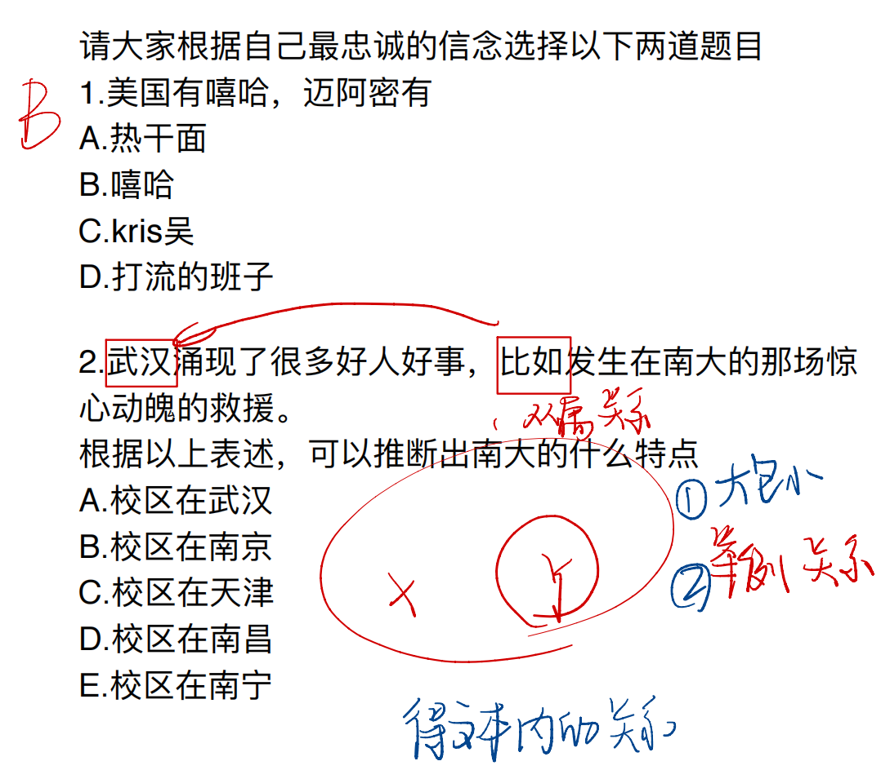
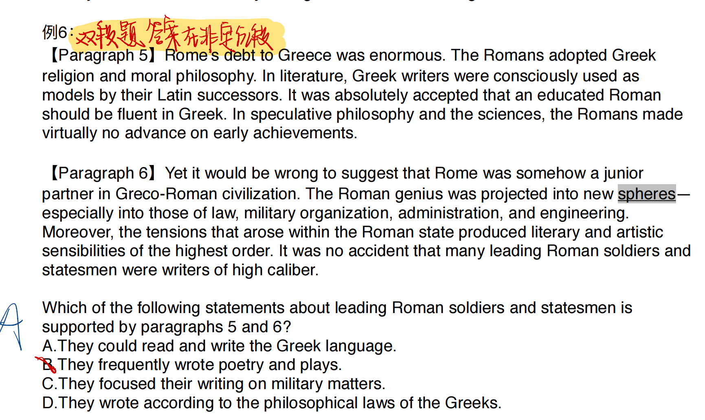
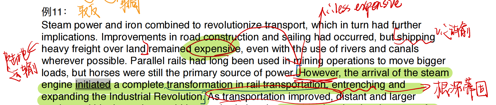

## 1. 否定事实题

::: info 错误原因

- 与原文矛盾
- 原文根本没提及

:::

::: warning 一不要

不要跳读！！！！

:::

### 1.1 例题

The city of Teotihuacán, which lay about 50 kilometers northeast of modern-day Mexico City, began its growth by 200-100 B.C. At its height, between about A.D. 150 and 700, it probably had a population of more than 125,000 people and covered at least 20 square kilometers. It had over 2,000 apartment complexes, a great market, a large number of industrial workshops, an administrative==行政的== center, a number of massive religious edifices, and a regular grid pattern of streets and buildings. Clearly, much planning and central control were involved in the expansion and ordering of this great metropolis. Moreover, the city had economic and perhaps religious contacts with most parts of Mesoamerica (modern Central America and Mexico).

In paragraph 1, each of the following is mentioned as a feature of the city of Teotihuacán between A.D. 150 and 700 EXCEPT

A. regularly arranged streets

B. several administrative centers spread across the city

C. many manufacturing workshops

D. apartment complexes

选 B  [ 而不是 C ]

文中只提到了一个行政中心，说许多显然不对。

manufacturing 和 industrial 某种语义上可以一致。

The earliest ceramics were fired to earthenware temperatures, but==这里的 but 是让步转折，最早的依然是低温烧制的瓷器== as early as the fifteenth century B.C., high-temperature stonewares were being made with glazed surfaces. During the Six Dynasties period (AD 265-589), kilns in north China were producing high-fired ceramics of good quality. Whitewares produced in Hebei and Henan provinces from the seventh to the tenth centuries evolved into the highly prized porcelains of the Song dynasty (AD. 960-1279), long regarded as one of the high points in the history of China's ceramic industry. The tradition of religious sculpture extends over most historical periods but is less clearly delineated than that of stonewares or porcelains, for it embraces the old custom of earthenware burial ceramics with later religious images and architectural ornament. Ceramic products also include leadglazed tomb models of the Han dynasty, three-color lead-glazed vessels and figures of the Tang dynasty, and Ming three-color temple ornaments, in which the motifs were outlined in a raised trail of slip—as well as the many burial ceramics produced in imitation of vessels made in materials of higher intrinsic value.

Paragraph 3 supports all of the following concerning the history of the ceramic 

industry in China EXCEPT:

A. The earliest high-fired ceramics were of poor quality.

B. Ceramics produced during the Tang and Ming dynasties sometimes incorporated 

multiple colors.

C. Earthenware ceramics were produced in China before stonewares were.

D. The Song dynasty period was notable for the production of high quality porcelain 

ceramics.

### 1.2 判断技巧

#### 标志 1

::: important 定位技巧

密集排列处易出答案！（大量分号，逗号）

:::

Location was an important factor for all four countries. ==All had immediate access to the sea, and this had important implications for a significant international resource, fish, as well as for cheap transport, merchant marines, and the shipbuilding industry.== Each took advantage of these opportunities in its own way. The people of the Netherlands, with a long tradition of fisheries and mercantile shipping, had difficulty in developing good harbors suitable for steamships: eventually they did so at Rotterdam and Amsterdam, with exceptional results for transit trade with Germany and central Europe and for the processing of overseas foodstuffs and raw materials (sugar, tobacco, chocolate, grain, and eventually oil). Denmark also had an admirable commercial history, particularly with respect to traffic through the Sound (the strait separating Denmark and Sweden). In 1857, in return for a payment of 63 million kronor from other commercial nations, Denmark abolished the Sound toll dues the fees it had collected since 1497 for the use of the Sound. This, along with other policy shifts toward free trade, resulted in a significant increase in traffic through the Sound and in the port of Copenhagen.

According to paragraph 4, because of their location, the Netherlands and the Scandinavian countries had all of the following advantages when they began to industrialize EXCEPT

A. low-cost transportation of goods

B. access to fish

C. shipbuilding industries

D. military control of the sea

很容易找到 ABC，选 D

#### 标志 2

::: important 定位技巧

递进处易出答案。（标了序号1234，或者出现 one/thus/furthermore…）

:::

It is archaeologist Steven Mithen's thesis, brilliantly developed in his book *The Prehistory* *of the Mind* (1996), that approximately 40,000 years ago the human mind developed cognitive fluidity, that is, the integration of the specializations of the mind: technical, natural history (geared to understanding the behavior and distribution of natural resources), social intelligence, and the linguistic capacity. Cognitive fluidity explains the appearance of art, religion, and sophisticated speech. Once humans possessed such a mind, they were able to find an imaginative solution to a situation of severe economic crisis such as the farming dilemma described earlier. Mithen proposes the existence of four mental elements to account for the emergence of farming: (1) the ability to develop tools that could be used intensively to harvest and process plant resources; (2) the tendency to use plants and animals as the medium to acquire social prestige and power; (3) the tendency to develop "social relationships" with animals structurally similar to those developed with people—specifically, the ability to think of animals as people (anthropomorphism) and of people as animals (totemism); and (4) the tendency to manipulate plants and animals.

According to paragraph 5, Steven Mithen believes that all of the following contributed to the emergence of farming EXCEPT 

A. the development of a mind flexible enough to come up with solutions to complex problems

B. the tendency to use plants and animals to acquire power

C. the tendency to emphasize the differences between animals and people

D. the ability to make tools that could be used for the large-scale harvesting of plants

选 C

> A 选项出现在第二排（不要只找递进部分哦！）

In addition to exploring the possible antecedents of theater, scholars have also theorized about the motives that led people to develop theater. Why did theater develop, and why was it valued after it ceased to fulfill the function of ritual? Most answers fall back on the theories about the human mind and basic human needs. ==One==, set forth by Aristotle in the fourth century B.C., sees humans as naturally imitative—as taking pleasure in imitating persons, things, and actions and in seeing such imitations. ==Another==, advanced in the twentieth century, suggests that humans have a gift for fantasy, through which they seek to reshape reality into more satisfying forms than those encountered in daily life. ==Thus==, fantasy or fiction (of which drama is one form) permits people to objectify their anxieties and fears, confront them, and fulfill their hopes in fiction if not fact. The theater, ==then==, is one tool whereby people define and understand their world or escape from unpleasant realities.

All of following are mentioned in paragraph 5 as possible reasons that led societies to develop theater EXCEPT

A. Theater allows people to face that they are afraid of.

B. Theater gives an opportunity to imagine a better reality.

C. Theater is a way to enjoy imitating other people.

D. Theater provides people the opportunity to better understand the human mind.

 选 D （递进词用亮黄色标出了）

## 2. 推断题

::: info

标志是题干中出现 infer imply

托福推断题的本质是==语义改写==，而不是真的让你推断什么信息出来。

:::

### 同义推断

While many programs designed for preschoolers focus primarily on social and emotional factors, some are geared mainly toward promoting cognitive gains and preparing preschoolers for the formal instruction they will experience when they start kindergarten. In the United States, the best-known program designed to promote future academic success is Head Start. Established in the 1960s when the United States declared the War on ==Poverty==, the program has served over 13 million children and their families. The program, which stresses parental involvement, was designed to serve the "whole child", including children's physical health, self-confidence, social responsibility, and social and emotional development.

It can be inferred from paragraph 2 that the Head Start program was designed to serve children who

A. come from families that do not have a lot of money    

B. are not doing very well in kindergarten

C. were born in the 1950s

D. need programs that focus primarily on social and emotional factors

选 A 对应文中的 Poverty

The Navajo, a Native American people living in the southwestern United States, live in small scattered settlements. In many respects, such as education, occupation, and leisure activities, their life is like that of other groups that contribute to the diverse social fabric of North American culture in the twenty-first century. At the same time, they have retained some traditional cultural practices that are associated with particular art forms. For example, the most important traditional Navajo rituals include the production of large floor paintings. These are actually made by pouring thin, finely controlled streams of colored sands or pulverized vegetable and mineral substances, pollen, and flowers in precise patterns on the ground.The largest of these paintings may be up to 5.5 meters in diameter and cover the entire floor of a room. Working from the inside of the design outward, the Navajo artist and his assistants will sift the black, white, bluish-gray, orange, and red materials through their fingers to create the finely detailed imagery. The paintings and chants used in the ceremonies are directed by well-trained artists and singers who enlist the aid of spirits who are impersonated by masked performers. These complex paintings serve as The ==twenty-four known Navajo chants can be represented by up to 500 sand paintings==. memory aids to guide the singers during the performance of the ritual songs, which can ==last up to nine days==.

What can be concluded from paragraph 1 about the Navajo ritual chants==唱诗班==?

A. There is a large number of them.

B. Each of them corresponds to a particular sand painting.

C. They are difficult to remember.

D. They do not take long to perform.

段落中提到：

- **“These complex paintings serve as memory aids to guide the singers during the performance of the ritual songs, which can last up to nine days.”**
- 翻译：这些复杂的画作用作记忆辅助工具，以在仪式歌曲表演中为歌手提供指导，这些歌曲表演可能持续长达九天。
- 这表明 **仪式歌曲是复杂的且难以记忆**，因此需要借助这些画作来帮助记忆。因此选C

错误选项分析：

- **A. There is a large number of them.**
    文中提到：“The twenty-four known Navajo chants…” （已知有24种仪式歌曲），并不算数量特别多，无法支持该选项。
- **B. Each of them corresponds to a particular sand painting.**
    文中提到“the twenty-four chants can be represented by up to 500 sand paintings”，表明一个歌曲可能对应多个画作，而非一一对应。
- **D. They do not take long to perform.**

The Venetian Council finally allowed round ships to enter the trade that was previously reserved for merchant galleys, thus reducing transport cost by one third. Prices of spices delivered by ship from the eastern Mediterranean came to equal those of spices transported by Portuguese vessels, but the increase in quantity with both routes in operation drove the price far down. Gradually, Venice’s role as a storage and distribution center for spices and silk, dyes cotton, and gold decayed==腐朽==, and by the early seventeenth century ==Venice had lost its monopoly（垄断） in markets such as France and southern Germany==.

Which of the following is true from paragraph 6 about the Venetian Council’s decision concerning the use of round ships?

A. It resulted in a return to profitable in luxury goods for Venetian merchants.

B. Ultimately it did not restore==恢复== the superiority==优势== in the spice trade that Venice had enjoyed earlier.

C. It eventually enabled Venetian merchants to increase the quantity and price of the spices they sold in Europe.

D. It means a long-awaited improvement in the fortunes of the shipbuilding industry in Venice.

### 下义推断

::: tip 判断信号

1. 大包小
2. 举例

:::

#### 大包小例子

Another major discovery was made in Egypt in 1989. Several skeletons of another early whale, *Basilosaurus,* were found in sediments left by the Tethys Sea and now exposed in the Sahara desert. This whale lived around 40 million years ago, 12 million years after Pakicetus. Many incomplete skeletons were found but they included, for the first time in an archaeocyte, a complete hind leg that features a foot with three tiny toes. Such legs would have been far too small to have supported the 50-foot-long *Basilosaurus* on land. ==*Basilosaurus* was undoubtedly a fully marine whale== with possibly nonfunctional, or vestigial, hind legs

 It can be inferred that *Basilosaurus* bred and gave birth in which of the following locations 

A. On land

B. Both on land and at sea

C. In shallow water

D. In a marine environment

选 D

- “Basilosaurus was undoubtedly a fully marine whale with possibly nonfunctional, or vestigial, hind legs.”
- 翻译：Basilosaurus 无疑是完全的海洋鲸类，其后肢可能是无功能的或退化的。

这表明它的生存环境完全在海洋中，暗示其繁殖和分娩也在海洋中进行。

#### 举例例子

Even the kind of stability defined as simple lack of change is not always associated with maximum diversity. At least in temperate zones, maximum diversity is often found in midsuccessional stages, not in the climax community. Once a redwood forest matures, for example, the kinds of species and the number of individuals growing on the forest floor are reduced. In general, diversity, by itself, does not ensure stability. Mathematical models of ecosystems likewise suggest that diversity does not guarantee ecosystem stability—just the opposite, in fact. A more complicated system is, in general, more likely than a simple system to break down. A fifteen-speed racing bicycle is more likely to break down than a child’s tricycle.

Which of the following can be inferred from paragraph 5 about redwood forests?

A. They become less stable as they mature.

B. They support many species when they reach climax.

C. They are found in temperate zones.

D. They have reduced diversity during mid-successional stages.

选 C

- “At least in temperate zones, maximum diversity is often found in mid-successional stages, not in the climax community. Once a redwood forest matures, for example, the kinds of species and the number of individuals growing on the forest floor are reduced.”

- 翻译：至少在温带地区，最大生物多样性通常出现在演替的中期阶段，而不是在顶级群落。一旦红杉森林成熟，生长在森林地面的物种种类和个体数量都会减少。

这明确说明红杉森林位于**温带地区（temperate zones）**，因此可以推断出答案为 **C**。

::: tip 

:::

### 反义推断

#### 时间对比取非

before, after, prior to, eventually, finally, until, in the end 

==This was before the steam locomotive, and canal building was at its height==. The companies building the canals to transport coal needed surveyors to help them find the coal deposits worth mining as well as to determine the best courses for the canals. This job gave Smith an opportunity to study the fresh rock outcrops created by the newly dug canal. He later worked on similar jobs across the length and breadth of England, all the while studying the newly revealed strata and collecting all the fossils he could find. Smith used mail coaches to travel as much as 10,000 miles per year. In 1815 he published the first modern geological map, “A Map of the Strata of England and Wales with a Part of Scotland,”a map so meticulously researched that it can still be used today.

Which of the following can be inferred from paragraph 2 about canal building?

A. Canals were built primarily in the south of England rather than in other regions.

B. Canal building decreased after the steam locomotive was invented.

C. Canal building made it difficult to study rock strata which often became damaged in the process.

D. Canal builders hired surveyors like Smith to examine exposed rock strata.

选 B 

#### 普通程度取非

With question such as these clearly before them, the scientists aboard the Glomar Challenger processed to the Mediterranean to search for the answers. On August 23, 1970, they recovered a sample. The sample consisted of pebbles of hardened sediment that had once been soft, deep-sea mud, as well as granules of gypsum and fragments of volcanic rock. Not a single pebble was found that might have indicated that the pebbles came from the nearby continent. In the days following, samples of solid gypsum were repeatedly brought on deck as drilling operations penetrated（渗透；深入） the seafloor. Furthermore, the gypsum was found to possess（具有） peculiarities of composition and structure that suggested ==it had formed on desert flats==. ==Sediment above and below the gypsum layer contained tiny marine fossils==, indicating open-ocean conditions. As they drilled into the central and deepest part of the Mediterranean basin, the scientists took solid, shiny, crystalline salt from the core barrel. Interbedded with the salt were thin layers of what appeared to be windblown silt.

Which of the following can be inferred from paragraph 3 about the solid gypsum layer?

A. It did not contain any marine fossil.  上下含，本身不含。

B. It had formed in open-ocean conditions.

C. It had once been soft, deep-sea mud.

D. It contained sediment from nearby deserts

不选 B，而选 A

**A. 它不含任何海洋化石。**

- 这个选项是正确的，因为在文章中明确提到，固体石膏层“上面和下面的沉积物中含有微小的海洋化石，表明这是开放海洋条件”，但并没有提到石膏本身含有海洋化石。因此，固体石膏层不包含任何海洋化石。

**B. 它是在开放海洋条件下形成的。**

- 这个选项是错误的，因为文章中说的是石膏层本身具有“在沙漠平原上形成”的特征，表明它是在干旱环境下形成的，而不是在开放海洋条件下。文章明确指出，石膏层的成分和结构表明它是在沙漠平原上形成的，而不是海洋环境。

**C. 它曾是软的深海泥。**

- 这个选项也是错误的。文章中提到“样本包括曾经是软的深海泥的硬化沉积物颗粒”，但这描述的是一种与石膏层不同的沉积物，而不是指石膏层本身。因此，石膏层并没有曾经是软的深海泥。

**D. 它包含来自附近沙漠的沉积物。**

- 这个选项也是不正确的。虽然文中提到与石膏层交错的盐层中有风吹来的细沙沉积，但没有说明这些沉积物来自附近的沙漠。因此，不能直接推断石膏层包含来自附近沙漠的沉积物。

#### 让步取非

Steam power and iron combined to revolutionize transport, which in turn had further implications. Improvements in road construction and sailing had occurred, but shipping==n. 运输== heavy freight over land==陆地运输== remained expensive, even with the use of rivers and canals wherever possible. Parallel rails had long been used in mining operations to move bigger loads, but horses were still the primary source of power. However, the arrival of the steam engine initiated a complete transformation in rail transportation, entrenching and expanding the Industrial Revolution. ==As transportation improved==, distant and larger markets within the nation could be reached, thereby encouraging the development of larger factories to keep pace with increasing sales. Greater productivity and rising demands provided entrepreneurs with profits that could be reinvested to take advantage of new technologies to further expand capacity, or to seek alternative investment opportunities. Also, the availability of jobs in railway construction attracted many rural laborers ==accustomed to 习惯于== seasonal and temporary employment. When the work was completed, many moved to other construction jobs or to factory work in cities and towns, where they became part of an expanding working class.

Paragraph 4 implies which of the following about the transformation in rail transportation?

A. Because railway construction employed mostly rural laborers, unemployment increased among urban workers.

B. It resulted in more trade within the country, but less trade with markets that could be reached only by ocean shipping.

C. It made shipping freight overland to distant markets less expensive.

D. It resulted in higher wages for factory workers.

不，正确答案不是 **B**，而是 **C**：它使得通过铁路运输货物到遥远市场的成本更低。让我们逐一分析每个选项，解释为什么选B不正确以及C为何正确。

**选项分析**：

**A. 因为铁路建设主要雇佣了农村劳动力，城市工人失业增加。**

- 这个选项是错误的。文中提到铁路建设吸引了很多农村劳动力，尤其是那些习惯于季节性和临时工作的劳动力，这表明他们是从农村来到城市，而不是导致城市工人失业。所以没有提到城市工人失业的问题。

**B. 它使得国内贸易增加，但与只能通过海运到达的市场的贸易减少。**

- 这个选项是错误的，因为文中并没有提到铁路建设对海运贸易的影响。相反，段落着重讲述铁路带来的好处，特别是它如何使远离市场的地区能通过铁路得到联系，从而扩大国内市场的规模。并没有提到铁路对海运的影响。

**C. 它使得通过铁路运输货物到遥远市场的成本更低。**

- 这个选项是正确的。文中提到，尽管道路和航运得到了改善，但通过陆地运输重货仍然很昂贵。而蒸汽机的引入完全改变了铁路运输，使得远距离和更大的市场能够通过更便宜、更高效的铁路运输来接入。因此，可以推断铁路运输使得通过铁路运送货物的成本减少了。

**D. 它导致了工厂工人工资的提高。**

- 这个选项并没有在段落中得到支持。文中提到铁路建设吸引了大量劳动力，尤其是来自农村的劳动力，而不是提到工厂工人的工资。虽然铁路建设和工厂发展密切相关，但段落没有明确表示工厂工人因此获得了更高的工资。

**结论**：

正确的答案是 **C**，因为段落强调铁路运输如何促进了更广泛的市场连接，并降低了远程市场的运输成本。而 **B** 选项并没有文中支持的内容，无法作为正确答案。

