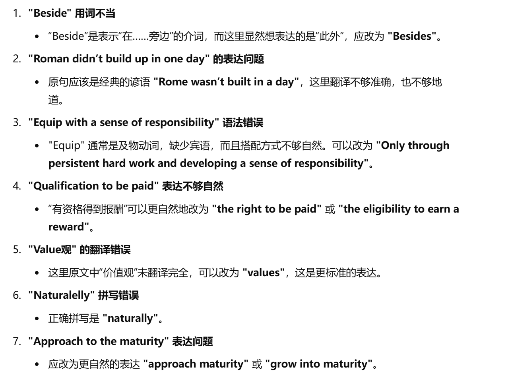

## **Passage 96**

>  **A big party with many people or a small party just with family?**

### 1.中文

一生中有不少值得庆祝的重要事件。每当此类特殊场合来临时，人们会制定出很多计划。举办生日或毕业派对是很有趣的。对于这些有意义的聚会的规模（人们有不同看法），有些人喜欢组织多人参加的大型派对，而有的人则更偏向举行小型家庭聚会。我认为，无论这些个人事件有多么重要，聚会应该越简单越好。

第一，组织大型派对会浪费过多的钱财与精力，而且众口难调。在聚会开始之前，主人需要处理很多琐事，包括发送邀请函、选择宽阔场地、购买大量食材、装饰场地以及准备活动与节目。所有这些必定要付出昂贵的代价，而且很耗费时间。宾客抵达的时候，情况会更加棘手。主人需要招待所有人，并同时负责烹饪、餐桌等。派对结束后，还得继续辛苦地做清理工作。

第二，每个人都应该对自己的私生活保持低调。完全没有必要让一大群人参与到这些私事之中。对于大多数普通百姓来说，生日庆祝和毕业派对并非旨在维系名人公众形象的社交和商业场合。这些特殊场合应该注重简约。邀请很多客人还会让人感觉主人过于自大。过分强调公众形象的人不易被自己的群体所接受。

其实，人生大事应该与最亲近的人一起庆祝，包括家人和密友。的确，具有纪念意义的时刻理应是无拘无束、舒适且无他人干扰的。在生日或毕业时，来自亲人的真诚祝福是个人收到的最珍贵的礼物。与他们一起共进美餐并自由地交谈，这些虽然看起来很平凡，却能带来值得永久珍惜的巨大幸福与美好回忆。

在我看来，为诸如生日或毕业之类的事情费工夫组织大型聚会庆祝的确毫无必要。这些有纪念意义的时刻应该与亲人共度，而不应过于公开化。尽管让很多宾客到来看起来是个不错的主意，但对于大多数普通人来说，举行简单的聚会通常是更佳选择。

### 2. 第一段 自他翻译对照

#### 2.1自翻

There are plenties of important events which should be celebrated in our lives. When it is coming to the particular situation which people often made many plans for. Organizing a birthday party or a graduation party is pretty funny. About the 规模 of those meaningful parties(people have different opinions), some people like to celebrate in a big party with a lot of people while other prefer to small family parties. In my perspective, no matter how important the personal incidents are, the gathering should be as simple as it can be.

#### 2.2 他翻

There are many important events in life that deserve to be celebrated. Whenever such special occasions arise, people will have a lot of plans to make. Holding a birthday or graduation party could be fun. Regarding the scale of these meaningful get-togethers,  some people are in favor of organizing larger parties with many people being invited. Other people, however, would rather hold smaller ones with in the family. I think it is a good idea to keep these personal events as simple as possible no matter how significant they may be.

#### 2.3 不地道表达纠错

- 每当此类特殊场合来临时：

    自：When it is coming to the particular situation

    他：Whenever such special occasions arise

    - 显然，这里的场合（生日，毕业，升娃等等）用 occasion （场合，时机，机会）比 situation合适的多

    - arise（出现，产生，发生）也更加生动形象

- 举办生日或毕业派对是有趣的

    自：Organizing … partied could be fun

    他：Holding … is pretty fun

    - 举行派对这种非正式活动，用 hold 更加地道。
    - could be 这样的表达更加顺滑。

- 对于这些有意义的聚会的规模

    - 规模：scale
    - 非正式聚会：get-togethers

- 而有的人则更偏向举行小型家庭聚会

    自：others prefer to small family parties

    他：Other people, however, would rather hold smaller ones with in the family

    - would rather 宁愿；宁可 —— 固定表达。

- 无论这些个人事件有多么重要，聚会应该越简单越好

    自： no matter how important the personal incidents are, the gathering should be as simple as it can be.

    他： it is a good idea to keep these personal events as simple as possible no matter how significant they may be.

    - as simple as possible 比 as simple as it can be 更地道
    - 不是 incident ！这个更多是“意外”的意思。

#### 2.4 自翻语法错误

**"When it is coming to the particular situation which people often made many plans for."**

- 错误：时态和结构问题。这里的时态应该是“when it comes to”，而不是“when it is coming to”。另外，"which people often made many plans for" 中的“made”用的是过去时，应该改为一般现在时“make”，因为描述的是一个普遍事实。
- 修正：`When it comes to particular situations that people often make plans for.`

**"Organizing a birthday party or a graduation party is pretty funny."**

- 错误：“funny”用词不当。在这个上下文中，应该用“fun”而不是“funny”。“Funny”意味着“好笑的”或“滑稽的”，而这里应表示“有趣的”。
- 修正：`Organizing a birthday party or a graduation party is pretty fun.`

**"About the 规模 of those meaningful parties(people have different opinions),"**

- 错误：中英文混杂使用，“规模”没有翻译为英文。此外，句子结构不自然，可以简化。
- 修正：`Regarding the scale of these meaningful parties (opinions differ among people),`

**"while other prefer to small family parties."**

- 错误：“other”应该是“others”，并且“prefer to”结构错误，应该是“prefer small family parties”，不需要“to”。
- 修正：`while others prefer small family parties.`

**"no matter how important the personal incidents are"**

- 错误：“incidents”一般指的是不好的事件（如事故等），这里应使用“events”更为恰当。
- 修正：`no matter how important the personal events are`

### 3. 第二段

#### 3.1 自翻

Firstly, organizing big parties will waste too many money and energy, by the way, it is hard to satisfy people’s various need. Before the party starts, the holder need to handle a lot of things, including sending the invitation letter*（就是 invitations 就可以了）*, choosing a wide place of the party, purchasing thousands of food ingredients, decorating the place and preparing the activities and shows. All of this thing must be paid expensively（直接就是 expensive ！又被直译迷惑了！） and time consuming. When the guests arrive, the situation would turn to be more complex. The master need to take care（entertain） of everyone, and to cook, to put the table（等这个字没翻译！） at the meantime. When the part ends, they have to do the cleaning work hardly.

#### 3.2 他翻

In the first place, organizing a large party might be a waste of money and take too much energy. What's more, it is **exceptionally**  difficult to satisfy everyone. Before the parties held, the host has to address many detailed matters,including **sending out** invitations, selecting a large space, purchasing **huge quantities of** food, **decorating** the venue and preparing activities or performances. All these will definitely prove both expensive and time consuming. The situation could be challenging with many guests arriving. The host will need to entertain all of them **whilst** he is also in charge of the cooking, **setting the table** and all the other tasks. After the party the hard work continues as the host cleans up the **mess**.

#### 3.3 不地道表达纠错

- 主人：host
- 设法处理，解决：address
- 发送：send out （固定搭配）
- 大量：huge quantities of
- 聚集地点；会场：venue

- 宾客抵达的时候，情况会更加棘手。

    自：When the guests arrive, the situation would turn to be more complex. 

    他：The situation could be challenging with many guests arriving.

- 同时：whilst

- 招待：entertain

- 负责：in charge of

- 布置餐桌：set the table（不是 put the table ，太土了！）

- 还得继续辛苦地做清理工作。

    他：After the party the hard work continues as the host cleans up the **mess**.

### 4. 第三段

#### 4.1 自翻

Secondly, everyone is supposed to keep low-pitched with private things. There is complete no need to let a crowd of people in these private things.  For most of  , celebrating birthdays and graduation parties do not intended to social and business (场合) to (维系) the public (形象) of celebrities. Those special things should be simple. Inviting too many guests may make the host to be looked (过于自大). The people who (过分强调) public (形象) are not easy to be (接纳) by their own group.

#### 4.2 他翻

In the second place, everyone ought to remain modest in his private life. It is absolutely unnecessary to have a large number of people join in these personal events. For most ordinary people, birthday celebrations and graduation parties are not social and commercial occasions which mostly aim at **keeping up** a celebrity's public image. These special occasions ought to be spent in a simple manner. Inviting a crowd of people may give others the impression that the person **attaches too much importance to** himself. Those who overemphasize their importance in public might not be well accepted by the **community**.

#### 4.3 表达的积累和纠错

- 社交或商业场合: social or commercial occasions
- 旨在：aim at
- 公众形象： public image
- 维系；保持；维持：keep up
- should be 可以替换成 ought to be
- 给人感觉… ：give others the impression …
- 过于自大：attach too much importance to oneself
- 过分强调：overemphasize 
- 群体；集体：community
- manner = way

### 5. 第四段

#### 5.1 自翻

In fact, the huge events in life should be celebrated with the closest people, including families and best friends. Indeed, meaningful moments should be ,comfortable and  . When the birthday or graduation, the valuable gifts you ever gotten are gentle blessing from families. Having delicious food and conversation with them, which seems ordinary, can bring huge happiness and good memories that worth be valued permanently.

#### 5.2 他翻

Actually, major events in one's life should be celebrated with the closest people, including the family and intimate friends. Indeed, this memorable time is destined to be **carefree** and comfortable, without interference from others. On birthdays or graduation days, the sincere wishes from loved ones are the most precious gifts one could receive. Having a delicious meal together and chatting freely are simple things to do, but they can bring great happiness and memories that will be cherished forever.

#### 5.3 表达积累与纠错

- 至交，知己：intimate
- memorable = meaningful
- 无忧无虑的；不负责任的：carefree
- 干涉，介入：interference

- 在…的日子里：On (birthdays or graduation) days
- 真诚的：sincere 
- 宝贵的：precious
- 收到（礼物）：receive
- 巨大的：huge great
- 珍视；爱护：cherish

### 6. 第五段

#### 6.1 自翻

In my opinion, it is meaningless to spend our energy in organizing big parties to celebrate things like birthday or graduation. Those memorable moments should be experience with families, but not to be over-public. Although having a lot of guests arrived seems like a great idea, but for most ordinary people, holding simple parties usually is the better choice.

#### 6.2 他翻

In my opinion, there is definitely no need to **take the** **trouble to** organize a big party to celebrate such events as birthdays or a graduation. These memorable moments should be shared with loved ones instead of **going public**. Although it might seem like a good idea to have a large number of guests, a simple party is usually a better choice for most ordinary people.

#### 6.3 纠错和积累

语序问题：

1. 尽管让很多宾客到来看起来是个不错的主意。

    Although having a lot of guests arrived seems like a great idea

    Although it might seem like a good idea to have a large number of guests

- 费力做： take the trouble to…
- 公开：go public

### 7. 可替换的表达

worth  ——> deserve

come ——> arise 来临

about ——> regarding 关于，至于

like ——> in favor of

meaningful ——> significant

prefer to do ——> would rather do

specially ——> exceptionally 特别的，格外

handle ——> address 处理

send Invitation ——> send out invitation

a lot of ——> huge quantities of  ——> a large number of ——> a crowd of

place ——> venue 场地，聚集地点

will be  ——> could be 

款待：entertain

at the meantime ——> whilst 同时

清理工作：clean up the mess

should be ——> ought to be

保持低调：remain modest

旨在：aim at

公众形象：public image

simple——> spend in  a simple manner 以一种简单的方式

自大：attach too much importance to…

理应是：destine to be

无拘无束的：carefree

不被他人打扰：without interference form others

value ——> cherish 珍视，爱护

absolutely/completely ——> definitely

费力：take trouble to

## Passage 62

> **Is university education the most important factor in a person's success?**

### 1. 中文

在大学里度过的那几年宝贵的时光值得终生珍藏，这是人们普遍认同的。毋庸置疑，高等教育是通往辉煌成功漫漫路途中至关重要的阶段。然而，获得大学学位仅仅代表学业初有成果，以及性格刚刚开始成熟。因此，我更愿意认为大学教育仅仅是通向成功的基石，而不是最重要的因素。

首先，我们不能否认高等教育对个人发展的重要。这是一段特殊的时期，在此之后，年轻人就将踏入社会并最终使自己成为合格且有责任感的社会成员了。因此，所有在这座象牙塔里积累的知识、技能以及宝贵生活经验将对一个人未来为成功的拼搏产生深远影响。具体来说，大学教育与初级教育不同，初级教育的重点大都在课本里的最基础理论之上，而大学教育则提供给学生更多将所学知识应用于实践的机会，并且引导其实事求是。导师允许学生进行独立的思考，并且给予他们更多抒发自己个人见解的自由。最终，由于具备了在大学中掌握的专业技能，毕业生会在最终踏入崭新人生阶段时更有信心。

然而，认为大学教育是个人成功最重要的因素就未免过于绝对了。其他关键的因素也应得到重视。世界上有很多名人虽然并没有大学学位，却获得了惊人的成功。其中，全球首富比尔·盖茨应当成为我们关注的焦点。他在1973年进入哈佛大学，然而却在2年后退学并创办了微软公司。微软以其操作系统占领了个人电脑市场并在信息技术行业掀起了浪潮。他辉煌的成功与很多内在素质有很大关系，包括智慧、坚强的意志、自信、创新力以及最重要的一点，那就是不懈的努力。不言而喻，这些重要的品质是每位成功人才都必备的。

的确，教育是可持续一生的进程，每个阶段都有其独特的意义。一个人的教育从呱呱坠地之时开始。父母可视为给孩子提供启蒙教育的首位老师。之后，在幼儿和小学接受正规的教育，此时老师帮助孩子们理解常识，并且指引他们学习最基础的理论。当一个人到了上中学的年龄时，就可以获得更丰富的知识，掌握更多的技能。毋庸置疑，初级教育为迎接崭新的大学生活做了准备。即便大学毕业之后，教育依然在工作岗位上继续进行。正如一句格言所述，“活到老，学到老。”因此，不仅大学教育，其他阶段的教育也同样是使一个人成功的重要因素。

总之，能够有机会接受高等教育为人生注入了无穷的快乐，如此有意义的经历也为将来的成功铺平了道路。然而，如果忽视了其他因素的话，获得大学文凭对于达到目标是远远不够的。一个人只有通过坚持不懈的努力以及大学毕业后继续保持的学习意志才能最终收获成功。

### 2.第一段

#### 2.1 自翻

It is agreeable that the couple years in university deserved to be cherished forever. Undoubtedly, (高等教育) is a crucial stage of the bright way to bright success. However, getting a (学位) only a signal of primary outcome of the study, and the beginning of a mature personality.  As a result, I’d rather believe that college education is the fundamental of success, but not the most important part.

#### 2.2 他翻

As is vastly acknowledged, the precious years spent in the university deserve a person's lifelong cherishment. Higher education doubtlessly **constitutes** a crucial stage during the long journey toward shining success. In spite of this, receiving a college degree only **symbolizes** one's primary academic achievement and the early **maturity** of his personality. Therefore, I would rather prefer to regard university education as a stepping stone toward success rather than the most important factor.

#### 2.3 可修改表达

这是人们普遍认同的：As is vastly acknowledged

高等教育：Higher education

构成；组成：constitute

尽管如此：In spite of

大学学历：college degree

象征，标志：symbolize

学业的：academic

刚刚成熟：early maturity of …

因此：Therefore

我更…而不… ：I would rather do … rather than do…  or  prefer to do… rather than do…

因素：factor

获得：receive

把…看作…: regard … as …

### 3. 第二段

#### 3.1 自翻

First, we can not delay the importance of higher education in development of a person. This is a special period,  the young is going to be in the society and make himself or herself a (合格) and responsible social member after that. Therefore, all the knowledge, skills, valuable experience in life accumulated in this (象牙塔) will make a great difference in the struggle for success of one person in future. To be more specific, university education is different from primary education that the key points of primary education most are in the most basic theories in the textbooks while the university offer opportunities that apply the knowledge one’s have learned in real life to students and lead the students to be (实事求是). Professors admit that students consider the question in an independent way and giving them sufficient freedom in (抒发) their own perspective. Finally, because of (具备了) the (专业) skills in colleges, the graduates will be more confident in stepping in a new stage of life. 

#### 3.2 他翻

In the first place, we shall never deny the important role higher learning plays in a person's self-development. It is a special period of time before a young adult enters the society and finally turns himself into a **qualified** and responsible social member. Thus, all the knowledge, skills **along with** the precious life experience accumulated inside this **ivory tower** would produce far-reaching influences on a person's future endeavors toward success. To illustrate, unlike **preliminary education** that emphasizes largely on the most fundamental theories in the textbooks, university education provides more opportunities for the students to put what has been learned into practice and guides them to seek truth from the facts. Tutors are allowing independent thinking and give their students more freedom to express personal opinions. Finally, **equipped with** specialized skills **grasped** in the university, graduates would have greater confidence to begin the next stage of life.

#### 3.3 替换表达

否认：deny

个人发展：self-development

…对…很重要：play a important role in 

…在…之后：… happen before …

进入社会：enter the society

合格的：qualified

因此：Thus

在象牙塔（指学校）中获得的：accumulated inside this ivory tower

有着长远深刻的影响：produce far-reaching influences on

与…不同的是: unlike …, …

初等教育：preliminary education

给 sb 提供 sth ：provide sth for sb

把知识应用于实践：put knowledge into practice

实事求是：seek truth from the facts

抒发，表达观点：express opinions

具备：equipped with

掌握：grasp

专业的：specialized

### 4. 第三段

#### 4.1 自翻

Nevertheless, it is doubtable that thinking university education is the most significant factor of individual success. Others should be highlighted. There are abundant celebrities don’t have a university degree but success impressively. Among them, Bill Gates ought to be the focus we concentrated.  He went to 哈佛 but quit the school two years later and build up the Microsoft. Microsoft and its operation system occupied personal computer market and blow waves in informational and technical (行业). His brilliant success have great deal with his inner qualities including wisdom, strong heart, confidence, innovation and the most important one  which is insistently hard-working. Without any word, the essential qualities is actually every successful people （具备).

#### 4.2 他翻

Nevertheless, it is too absolute to define university education as the most important factor in a person's success. Other crucial elements should also be stressed. The world today is filled with **eminent** figures who have never received a university degree but become **astoundingly** successful. Among them, Bill Gates, the richest man on earth, should be brought into the **limelight**. He entered Harvard in 1973 but quit school two years later to set up Microsoft, which has **taken** the IT industry **by storm** and dominates the PC market with its operating systems. His brilliant success owes much to his inner qualities, including wisdom, a strong will, self-confidence, creativity and above all, his everlasting diligence. Evidently, all these critical qualities could be found in each successful talent.

#### 4.3 替换表达

- 把…视作…：define/consider/regard … as…
- 重视；强调：stress
- 卓越的，杰出的：eminent；prominent ；distinguish。
- 杰出的人物：eminent figures
- abundant 一般用来修饰不可数名词， 一般不直接修饰可数名词的复数形式，改为 an abundant of
- 令人惊奇的：astoundingly 
- sb. 成为关注的焦点：be brought into the limelight
- 哈佛：Harvard
- 建立：set up（强调开始建立的这个动作）；build up（强调慢慢建立的过程）
- dominate: 支配，
- 征服，攻占：take … by storm
- 行业：market industry
- 得益于；归功于: … owes to …
- 坚定地意志：strong will
- 创造力：creativity
- 坚持不懈的努力：everlasting diligence = persistent effort
- 不言而喻的：Evidently
- 表示 sb. 具备什么品质：possess，show，be characterized by

### 5. 第四段

#### 5.1 自翻

Indeed, education is an endless journey whose every phase has its unique meaning. The education of a person start from the ==(这里的 the 不要，因为 birth 是泛指)==birth. Parents would be the first teacher==(这里teachers要加s)== who provide with ==(这里不要with)==starting education for their children.  After that, they will take==(“take formal education”用法不太自然，通常“receive”更恰当。)== formal education in kindergarten and elementary school when teachers help them to understand normal knowledge, and lead them to study the most fundamental theories. A person could obtain more abundant knowledge, get more skills when he comes to the age for junior school==(“reaches the age for junior school”更自然)==.  Undoubtedly, junior education is a prevision==(“prevision”使用不当。可以改为“preparation”来表示“准备”。)== for the new life in university. Even if people graduate from universities, education is still lasting during the enterprise life. As the words says, “Keeping studying until the death”.   Since, either university education or other stage of education are essential factor==s== for one’s success.

#### 5.2 他翻

Indeed, education is a life-long process and every stage possesses its unique significance. Ever since one's birth, his education has begun. Parents could be considered as the first teachers who render enlightening knowledge to their child. Later, formal education is received from the **kindergarten** and the primary school. During this period,teachers help children **comprehend** common sense and lead them to learn the most basic theories. As soon as a person arrives at the high school age, richer knowledge could be gained and more skills could be grasped. Doubtlessly, preliminary education prepares a person for the new stage of life in the university. Even when one graduates from the university, education is still to be continued **at work**. Just as the old saying goes, "You're never too old to learn". As a result, not only university education, but also education in other periods, could be equally important factors that make a person succeed.

#### 5.3 替换表达

- **意义：**significance = mean

- **process** 作名词有：进程，过程，流程，程序的意思。这里着重强调教育是一直进行的一个东西，可以用 process 。

- **possess** 拥有，同义替换 have

- **Ever since**，自那时起；自从。后接完成时。可替换为 Since then；From that time on

- **consider as** = regard as = deem as

- **"Render"** ：这里做提供的意思。同义词为 provide。render sth. to sb.

    ::: code-tabs

    @tab 中文意思

    动词：

    1. 使成为
    2. 呈现
    3. 渲染
    4. 提供
    5. 交付
    6. 翻译
    7. 报答

    @tab 中文意思对应的同义词

    Make（使成为）

    Present（呈现）

    Provide（提供）

    Deliver（交付）

    Translate（翻译）

    Depict（描绘）

    Perform（表演，呈现）

    Produce（产生)

    :::

- **enlightening**：“启蒙教育”

    形容词：

    1. 启发性的
    2. 使人领悟的
    3. 有教育意义的

- **comprehend：**

    动词：

    1. 理解
    2. 领会
    3. 包含
    4. 包括

- **常识**：common sense

- **到了该…的年纪：**arrive at the … age

- **获得：** **acquire = gain = obtain**

- junior school 一般不指中学，指小学或初中。

- **preliminary：**

    形容词：

    1. 初步的
    2. 预备的
    3. 开端的
    4. 基础的

- **at work：**在工作时

- **Just as an old saying goes:**
- **后面接原因的词语：hence、so、consequently、as a result、therefore**

### 6. 第五段

#### 6.1 自翻

In one word==（没这个表达。改成In short）==, having the opportunity to receive high==er== education brings life with endless happiness==（bring endless happiness to life)==, such ==a== meaningful experiment pave the road==(用 way 更恰当)== to one’s success. However, just acquiring the degree of the university==（直接就是 university degree）== isn’t enough to access to the goal if we ignore other factors==（while ignoring other factor）==. A person can achieve success ultimately only through (坚持不懈的努力) ==（persistent effort）==and keeping the will of learning ==（应该改为“maintaining a willingness to learn”）== after graduation from university.

#### 6.2 他翻

To conclude, the opportunity to receive higher education instills endless happiness into a person's life. Such a meaningful experience also paves the way to his success in the future. Nevertheless, if other important factors are neglected, obtaining a university **diploma** is far from enough to reach the target. Only through unremitting efforts and the **iron determination** to learn even after graduation could it be possible for a person to become successful at last.

#### 6.3 替换表达

- **"Instill" , 动词**
    1. 灌输
    2. 注入
    3. 逐渐培养
    4. 逐步灌输

- 表转折：**Nevertheless**

- **"Neglect"** ：

    动词，名词：

    1. 忽视
    2. 忽略
    3. 疏忽
    4. 漠视
    5. 不重视

- **obtain 的近义词:**

    Acquire（获得，取得）

    Gain（得到，获取）

    Secure（获得，争取到）

    Attain（达到，取得）

    Receive（接受，收到）

    Procure（获得，采购）

- **diploma ：**文凭，毕业证书

- **"Unremitting"** 的中文意思按词性分组如下：

    1. 不懈的
    2. 坚持不懈的
    3. 不间断的
    4. 持续不断的

    其近义词：

    Persistent（持久的，执着的）

    Continuous（连续的，不间断的）

    Relentless（不懈的，不停的）

    Incessant（不停的，不断的）

    Steadfast（坚定的，不动摇的）

-  **iron determination**：钢铁般的意志

## Passage 36

> **Is it a good method to give the same grade to all the members who do the same project together?**

### 1. 第一段

学校教育的建立带来了评分制的普及，评分制是一种最常用的评价学生表现和能力的方法。如今，任务型教学标志着教育界一个光辉的进步，其中就涉及小组协作。在一个小组内，每个成员都有自己的任务，任何一个人的贡献都不应被低估。毫无疑问，教育工作者给每个成员相同的分数是公平合理的。

####  自翻

The erection of school education bring wide-spread of grading system which is the most common way to evaluate the ability and representation of a student. Nowadays, (任务型) teaching which includes team work is a sign of the brilliant development of the education. In one group, every members has his own assignments, every contribution shall never be (低估). Doubtlessly, educational workers give every member a equal score is fair and reasonable.

#### 他翻

The erection of school education brought forth ==向前，自…以后，副词== the general adoption==普及== of grades, a most commonly-used method to assess==评价，估价== the performance==表现== and abilities of students. The task-based learning and teaching, which involve coherent==连续的，一致的== efforts of a group, marks a brilliant step forward in the field pf education. In a team, each member is assigned to fulfill his/her own duty and every contribution ought not to be underestimated ==低估==.  Without doubt, it is fair and appropriated==合理的== for educators==教育工作者== to give each group member the same mark at the moment when the evaluation==评价== is committed==承认，委托，交付，犯罪==.

### 第二段

为证实我的观点，首先有必要强调团队协作的价值。团队协作是一个小组的成员为达到共同目标一起工作时所付出的协同努力。当团队协作糟糕的时候，小组成员有效率地完成任务很困难，并且通常为模糊的目标而挣扎。而当团队如运转良好的机器时，所有成员的心会连结在一起。正如一首著名歌曲的歌词，“团结就是力量”。的确，团队协作对于任何伟大事业的成功都是至关重要的。每个成员所起的指定作用都是不容轻视的。因此，为了鼓励团队协作，评判者给整个小组相同的分数是最合理的决定。

#### 自翻

To prove my perspective, firstly, it is necessary to emphasize the value of the team work. Team work is constituted by  (协作的） effort of the members of the team to reach the same goal. When the cooperation is bad, it is very hard for members to complete the assignments effectively, and usually struggle in (模糊的) goal. But as a team works like a good-operating machine, all members heart will connect with others. As a famous (歌词) going, “Combination is energy.” Indeed, team work is crucial for great success of any great career. Every member’s roles that (起指定作用) shall never be (轻视). Thus, to encourage team work, it is the most reasonable decision for the evaluator to give the same score to the whole group.

#### 他翻

In order to testify==证实== my standpoint, I would firstly place emphasis on the value of teamwork. Teamwork is a collaborative==协作的== effort by members of the group working together to achieve common==共同的== goals. When the teamwork breaks down, members of the team will find it is difficult to complete tasks effectively and often ==struggle with== obscure==模糊的，隐藏的，使模糊，使隐藏== objective==目标，客观的，公正的==. When a team operates like a well-oiled==运转良好的，熟练的== machine, it will connect the hearts of all members. As is shown in the lyrics==歌词== of a famous song, “unity is paramount strength.” Truthfully, teamwork is essential to any success of any great ==cause==. Each member plays an assigned part that should never be looked down upon. Thus giving the entire group the same grade is the most appropriate decision on part of the assessors to encourage teamwork.

### 第三段

除此之外，分数的均等会增强小组成员的责任感。在某种程度上，使每个人都发挥作用有助于消除偏见与抵触情绪，而这些对项目的进展和结果都是有害的。正是这种共同的责任搭建起了团队的坚固基础。有了责任感，就能鼓舞每个成员的士气。我的教授曾经为一个重点研究项目做评判。已定的评分规则提倡给每位参与者打出不同的分数。令他失望的是，由于那些被分配到非核心任务的人失去了责任感和热情，这个项目最终未达到理想的目标。

#### 自翻

Except from this, the even grade will strength the responsibilities of members of groups. In suspicious extent, it is helpful for everyone to （发挥作用） to decrease bias and (抵触) emotion which is harmful to the process and outcomes of (项目) . It is the common responsibilities that builds up the foundation of the teamwork. As the responsibility exits, (士气) of members can be (鼓舞). My professor used to assess a important (研究项目). Given grading (规则)  encourages to grade (参与者) differently. To his disappoint, because people who were assigned to not core task lost their responsibilities and  (热情), the (项目) didn’t reach (理想的) goal ultimately.

#### 他翻

Besides, the equality in grade may cultivate the group members' stronger sense of responsibility. To some degree==在某种程度上==,making each one count==发挥作用== helps **eliminate**==消除== prejudices==偏见== and undesirable==不良的== moods that are **destructive** to the progress and result of the project==项目~=program==. It is the associated==这样的== responsibility that builds up a solid==坚固的== **infrastructure**==基础设施、基础建设、公共设施、基础结构== of a group. Where there is responsibility, there is **inspirational morale** ==鼓舞士气== in each member. My professor used to act as the judge of a key research project==研究项目==. The settled==给定的== rules of assessment advocate==提倡、主张、支持== difference of grades for every participant==参与者==. To his great disappointment,this program didn't reach its satisfactory destination==理想的目标== due to the loss of responsibility and enthusiasm==热情== in those who were assigned unimportant tasks.

> **process**（过程、处理）：
>
> - 强调一个具体的步骤、流程或方法，通常指的是系统性的操作或事件的进展。
> - 更加具体，可以是固定的步骤或任务。
>
> **progress**（进展、进步）：
>
> - 强调向目标的前进或改进，通常指的是整体的发展情况。
> - 更加抽象，侧重结果的积极变化。

> where there is … there is … 有了，就有了 …

### 第四段

然而，我们还应提高意识，避免“滥竽充数”现象的滋生。如果所有小组成员都获得相同的分数，也有一种潜在的可能性，那就是某些成员会拒绝全身心地投入。正如那则著名的中国寓言所讲述的，一些人也许在装模作样地作贡献。此类不诚实的行为对团队质量同样有害，因此必须严格制止。

#### 自翻

However, we should remind ourselves to avoiding the increasing of the ‘滥竽充数’ phenomena.  There is a sort of potential probability if all members acquire the same score, some members will refuse to donate with full energy. （==There is a potential probability that if all members receive the same score, some members might refuse to contribute with full effort.==） As a famous Chinese saying goes, someon may be acting like they are 奉献. Since these unhonest behaviour are harmful to the quality of a team and must be strictly 制止.==disallow，halt，bar==

#### 他翻

However, awareness ought to be aroused to avoid the phenomenon of **filling a post without real qualifications**. If equal grade is given to all group members, there is a hidden possibility that certain members might refuse to contribute==贡献== wholeheartedly. Just as what is depicted in the famous Chinese fable, some players might pretend to make contributions **in disguise**. Such **dishonest** behavior is also destructive to the quality of a group and must be strictly avoided.

#### 积累

==arouse awareness== 引起意识 唤起警觉 激发关注

==filling a post without real qualifications== 滥竽充数

donate 常指捐赠钱等

depict 描述，表现，描绘

==in disguise 假装的==

### 第五段

总而言之，分数不仅仅可以用来评价学生的表现，还能提醒他们某些价值有多重要。只要团队协作得以保证，责任感得以加强，为所有成员打相同的分数无疑是教育学生的一个有效方法。

#### 自翻

In summary, score not only can evaluate the performance of students, but also remind them the importance of some value. Only the team work is guaranteed, the==a== sense of responsibility is strenghthened, give==ing== the same score to all members undoubtly is a effective way to students’ education.

#### 他翻

In summary, marks are used not just to evaluate the performance of students, but also to remind them the importance of certain values. As long as teamwork is ensured and a strong sense of responsibility is strengthened, giving all group members the same grade is by all means an effective method to educate students.

#### 积累

certain 代替 some 更高级

As long as 只要

==by all means== 毫无疑问的

## Passage 14

### 第一段

进入成年期标志着一个崭新人生阶段的开始。同时，这也意味着即将遭遇在金色童年时期未曾出现过的无数挑战。在这样的现实面前，很多有责任感的家长试图帮助他们十几岁的孩子尽早适应未来的挑战。其中有些家长鼓励他们的孩子去做兼职。我认为这是可以达到此目的的一个好办法。

#### 自翻

Entering to the age as an adult indicates a begginning of a new stage of life. Meanwhile, this means they will encounter countless challenges that never happened in the golden childhood period. In the fact of this, many parents with a sense of responsibility try to help their teenager children to 适应 future challenges as earlier as possible. Some of them encourage their children to take a part time job. I consider this as a great manner to acheive their goals.

#### 他翻

Stepping into **adulthood** marks the beginning of a **brand newstage** of one's life. It also **denotes** numerous encounters with challenges that may have never **shown up** during the golden years of childhood. In the face of such a reality, many responsible parents attempt to help their teenage children **adapt to** future challenges as early as possible. Some of these children are encouraged to take part-time jobs. From my point of view, it could be a suitable way to meet that need.

#### 积累

- 步入成年：Stepping into **adulthood**

- 标志：marks
    - 虽然两者在某些情况下（如指示某种迹象或意义）可以互换使用，但 **"mark"** 更强调物理标记或具有象征性的表示，而 **"indicate"** 强调通过迹象、行为或信息来表达某种意思。

- 全新的阶段：brand new stage
    - **"Brand new"** means completely new, unused, or fresh, emphasizing something that is entirely new or hasn't been used before.
- denote 表示、指代、象征，作“意味着”的意思时 ~= mean
- happen ~= show up
- 在这样的现实面前: in the face of such reality
- try 可以替换成 attempt
- teenage 形容词
- 拓：二十几岁的人：people in their twenties
- 适应：adapt to
- as early as possible 不需要用比较级
- From my point of view 我认为

### 第二段

#### 中文

首先，在兼职工作过程中，青少年将获得学习更多东西的机会，而且还能为他们将来的事业积累经验。无论他们从事的是哪方面的工作，都可以从中掌握一些实用的知识和技能。如果他们大学毕业后进入相关领域工作的话，这些无疑是很有用也很有价值的。有足够的实例来证明这一点。上中学时，我的朋友凯特利用暑假假期在一个服装店里做兼职销售员。这段有趣的经历教给她如何与顾客讨价还价，以及如何与他人巧妙地交流。现在，她已经成为一位成功的跨国服装公司的销售经理了。从某种程度上讲，那份兼职工作使她受益匪浅。

#### 自翻

First, during the part-time job, teenager will receive chances to learn more and also can accumulate experience for their future carrer. Whatever the aspects they are working on, they could grasp some practical knowledge and skills. If they enter related regions to work after graduating from college, the experiences are doubtless very useful and valuable. We have abundant instances to testify this point. During the high school, my friend Kate used the summer vacation to be a part-time saler in a cloth store. The interesting encounter taught her how to bargain with customers, and how to converse with others 巧妙地. Now, she has been a successful saling manager in a 跨国 custom company. 从某种程度上讲, the part-time job benefited her a lot.

#### 他翻

First of all, during the course of working part-time, teenagers will have the opportunity to learn more and accumulate experiences for their future careers. No matter what type of job they are engaged in, they could gain some practical knowledge and skills, which will prove useful and valuable if they are employed in a related field after graduating from college. There is enough evidence to testify to this. During a summer vacation in high school, my friend Kate took up a part-time job as a shop assistant in a clothesshop. Such an interesting experience taught her how to **bargain with** customers and how to communicate with people skillfully. Today, she has made herself a successful sales manager in a **multinational** clothing corporation. In a sense, the part-time job she once took benefited her considerably.

#### 积累

- 过程（课程）：course
- 在 … 的过程中：during the course of doing …
- 事业【拼写错误】：careers ==可数==
- experiences：==可数==
- 无论他们从事的是哪方面的工作： No matter what type of job they are engaged in
- 进入相关领域工作：be employed in a related field
- testify to
- 销售：shop assistant
- 服装店：clothesshop
- 巧妙的：skillful
- 她已经成为了 …：she has made herself …
- 跨国服装公司：**multinational** clothing corporation
- 表程度大的，可替换表达：considerably
- 在某种程度上：In a sense

### 第三段

#### 中文

此外，孩子们也许会逐渐懂得有关挣钱的真相，从而变得更加成熟。一个人对金钱的态度反映了他的价值观。在工作与领薪水的过程中，他们会自然而然地意识到，挣每一分钱都不容易。罗马不是一天建成的。只有通过坚持不懈的勤奋工作，并且拥有责任感，才有资格得到酬劳。的确，理解这个有关工作与报酬的事实标志着一个人思想上的进步，并使其更加接近成熟。

#### 自翻

Beside==s==, children will gradually realize the truth of making money, which makes them more mature. One’s attitude to money reflects one’s 价值观. On the process of working and receiving salary, they will recognize it’s hard to make every penny naturelly. Roman didn’t build up in one day. Only through persistent hard-working and equip with a sense of responsibility, one will have the qualification to be paid. Indeed, understanding the fact regarding  working and paying indicates one’s progress in mental, which make him/her to approach to the maturity. 

#### 他翻

In addition, children may gradually understand the reality of making money, thus becoming more mature. One's attitude toward money reflects his values. During the process of working and receiving payment for it, they will naturally comprehend that not a penny is easily gained. Rome was not built in a day. Only through diligent work, perseverance, and a strong sense of responsibility can a person deserve pay. Indeed, comprehending this fact about work and pay **symbolizes** one's mental progress, which brings him closer to **maturity**. 

#### 积累

- 此外：In addition = beside==s==
- 真相：truth = reality
- to 与 toward 的差别：**to** 强调动作的结果（达到目标），而 **toward** 强调动作的方向
    - One's attitude toward money
- 理解，领会：comprehend
- 薪水：
    - 如果是固定的月薪或年薪，通常用 **Salary**。
    - 如果是按小时或日结算的工资，使用 **Wage** 更合适。
    - 如果想强调“薪水”的整体概念或不限定支付形式，可以用 **Pay** 或 **Income**。

- diligent==勤奋的，刻苦的== work, perseverance==毅力，坚持，恒心==, and a strong sense of responsibility
- 标志着：symbolize

- make sb. to do 太幼儿？试试：
    - **正式场合**：Cause, Enable, Compel, Prompt
    - **情感表达**：Inspire, Motivate, Encourage
    - **中性/普适**：Lead, Urge, Drive
