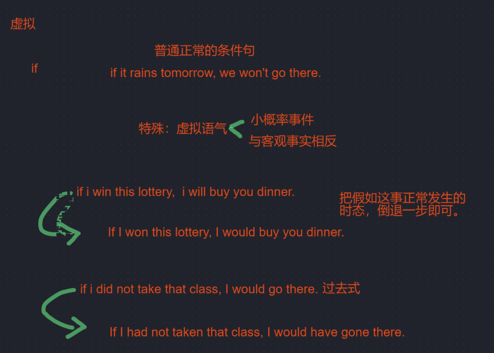

### AD 写作修改习惯

- 表达我同意。。。的观点：
    - I totally agree with the idea of sb. that + 观点
    - sb. made a great point that + 观点
- 表示不同意谁的观点也可以直接说：
    - I disagree with sb.’s suggestion that + 观点

- 两个完整的句子要是想用一个句子说完，有两种方法：
    - SVO，conj + SVO 用 but so and 等连词连接，这样两个句子地位是一样的
    - Although / Because / If + SVO, SVO 这是把一个句子改成了状语从句
    - 两者不可混用
- 举例子的时候前面的名词和后面的名词单复数最好一致：
    - Some [of them]individuals such as a doctor or an engineer 错误
    - Some [of them]individuals such as doctors or engineers
- there here home 是一个副词，前面不用加介词 
    - live in there 错误
    - live there 正确
- In that case 在那种情况下；In this way 以这种方式
- a large number of + 可数名词 a large amount of + 不可数名词 plenty of + 可数不可数
- 花时间/钱做：spend time on sth. / spend time doing sth. / spend money on doing sth. 或者 sth.
- foundation 基础 fundamental 基础的
- hard 可以做副词，勤奋地 ~= diligently 勤奋地 ； hardly 几乎不，副词
- unlike A, B 怎么样怎么样 ：AB 要是同种对象
- Contrary to + 不同意的观点
- 文章中间不要用 I think 了
- 学习知识：Obtain/Acquire knowledge ；Learn knowledge 不太好
- To some extent ~= In some degree

虚拟语气：

- 内容上：
    - 最好两个观点，不需要总结题目中学生的话了。两个观点四六分 或者 五五分。

- 不要用第二人称写作文【you】
- what i mean is 不要出现在作文
- 例子要匹配论证。不要太早举例，先论证，例子每一个场景要匹配论证
- 有时候一些反向观点更好，可以反驳题中学生的逻辑漏洞，有时候更好写，也可以两个都反驳
- 如果要写两个观点，刚开始就要想好，这样才能合理分布文章篇幅
- 刚开始看完教授的提问，自己先想自己的立场和观点和举例，再去看跟你一方学生的观点，这样还能不看反方的观点，你要是同意就正好，不同意还能反驳他。因为两个观点中一个观点太少了不太好
- 先想想中文怎么讲，再翻译，这样语言不会奇怪
- 一定要先想大局，先布局，再写观点举例子
- 对于那种二选一，三选一的题 AD25，当我说我选A，可以说一下为啥B就不行，反驳B，这样就更有话说