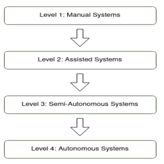
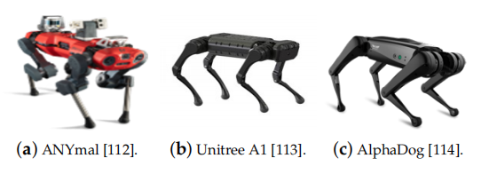
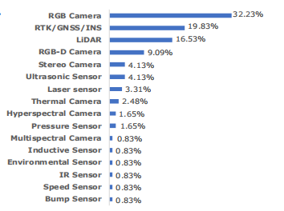
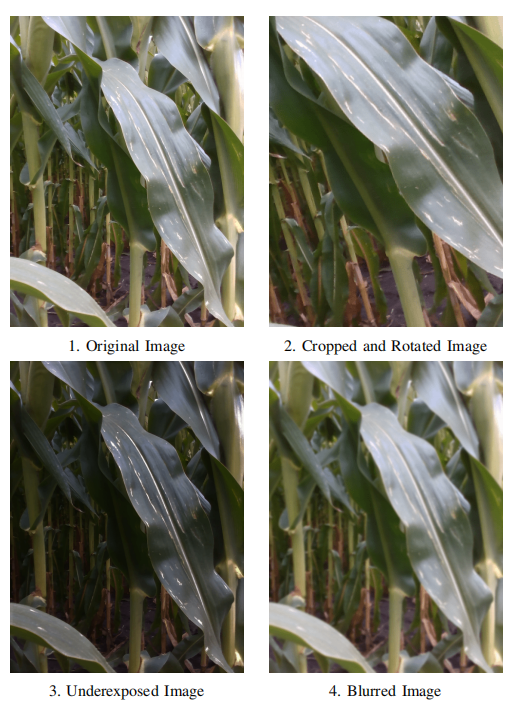
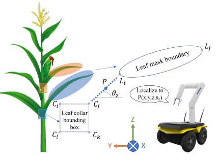
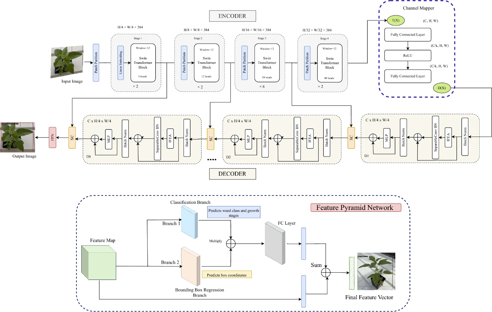
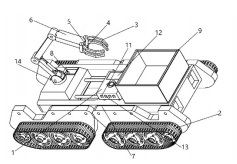
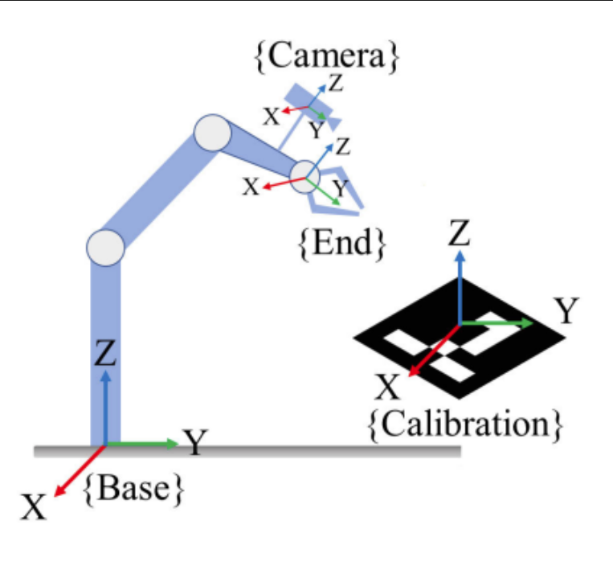

## 1. 基本概念

### 1.1 精准农业

  根据定义，精准农业（PA）可描述为“通过提高单位面积土地单位时间内的正确的决策数量并带来净收益的农业模式”。这一定义具有普适性，既可通过电子设备也可由人工完成决策（转引自[1]）。精准农业不仅致力于提高产量，还力求最大限度减少水、肥料、农药等投入品的使用量（转引自[2]）。精准农业是硬件和软件技术的集合，使农民能够在种植、施肥、病虫害防治和收割等作业方面做出明智的差异化决策。

### 1.2 农业机器人的起源

截至2025年，全球人口已达82亿。另外，全球城市化进程正在改变乡村农业。因此，高效并环保的农业方式格外重要，因为1991年全球耕地面积占比约为39.47%，而到2013年已降至约37.7%，即耕地可用性减少了1.77%。在未来几十年里，人类面临着在提高农业产量的同时减少对环境的影响的挑战。精准农业（PA）正是实现这些目标的有效途径——它通过信息采集与决策技术的整合，能够在精细的地理尺度上精准调控农业生产。随着精准农业概念的提出，农业机械化和农业机器人逐步发展，对农业机器人操作精准度的要求也日益提高。

## 2. 发展历程

根据文献[19]的总结性阐述，把农业机器人划分为四个级别：

​                                                               图片1. 机器人的发展历程

- 第一级：人工系统 —— 完全依赖人力劳动的传统耕作方式，不借助任何技术手段或工具。  
- 第二级：辅助系统——引入用于特定任务的基础机械与技术，减少人工劳动但仍需人力控制与干预。  
- 第三级：半自主系统——采用更先进的技术使机器具备部分自主运行能力，仅需极少人工干预，但仍需持续的人类监督。  
- 第四级：自主系统——完全自动化的系统，整合机器人技术与人工智能，能够独立决策并执行任务，无需人类持续参与。 

## 3. 主要研究方向

 精准农业（PA）凭借机器人系统和电子设备在农业作业中的应用而备受瞩目，这些作业包括：整地、播种、种植、病虫害防治和收获。目前已经获得成功的技术有：柑橘采摘机[(3)]、草莓收获[(4)]和番茄收获机器人[(5)]。 所有机器人均根据以下标准进行评估：运动系统、最终应用场景、是否配备传感器、机械臂和/或计算机视觉算法、研发阶段及所属国家与大洲。 在本文中，将农业机器人技术可归纳为四大研究方向：移动系统、传感器、计算机视觉算法及通信技术（或 loT）[(1)]。

### 3.1 移动系统

传统的农业机器人分为轮式机器人（Wheeled）、履带式机器人（Tracked）、（轮）腿式机器人。实验（Designing Hybrid Mobility, 2023）进一步验证：轮式机器人平均滑移率超过 9.7%，路径偏差范围为 ±6.5～±12 cm；而在相同条件下，履带式机器人的性能明显更优（滑移率不超过 9%，路径偏差在 ±10 cm以内），适合复杂果园与山地环境（[12]）。

​                                                              图片2. 四足机器人

在一些地形比较崎岖的农田中，上图的四足机器人表现比传统机器人更加优异，因为四足机器人不需要持续接触土地，避免被一些地形和土壤卡住，减少人工维护的成本。因此，作为一种面向广泛应用的机器人平台，这类机器人在农业市场遭到抵制的风险降低了。在这一领域，主要研究方向是设计出灵活且能够适应各类农业地形的低成本机器人。

### 3.2 传感器

​                                                    图片3. 常见传感器和使用比例

图三显示，在应用中使用最多、最广泛的传感器是RGB相机。其他几类相机（RGB-D相机、热成像相机、高光谱和多光谱相机）虽然在使用过程中也各有益处，但是因为价格较为昂贵，无法大量投入市场进行实际应用。目前对于传感器的研究方向是开发具有高防护等级（IP65、IP66或IP67）、能在高温高湿环境下工作且成本低廉的传感器，将有助于构建更能适应气候条件变化（日照与降雨）的稳健农业机器人系统（[1]）。但是，依赖 GNSS 的定位存在信号中断和精度不足问题，因此视觉、激光雷达与超声波传感器的融合为导航提供了更稳定可靠的方案。

### 3.3 计算机视觉算法

在搜集的图片中提取各类植物的特征（植被指数，叶绿素荧光特性等等），输入一些机器学习、深度学习、强化学习算法，包括RNN，CNN，SVM，YOLO算法。传统的机器学习算法和深度学习算法各有不足，比如 CNN 只能提取局部特征，RNN（LSTM）容易出现梯度爆炸和梯度消失。随着Transformer兴起，Agent、各类大模型API逐渐在实践中发挥作用，可以使农业机器人进行果蔬采摘，精准施药，杂草检测。

### 3.4 基于物联网的通信技术

物联网在整个系统中担任关键角色：它连接机器人、传感器节点、边缘计算与云平台，为实时导航与传感数据上传提供基础支撑。通信技术的类型有：LPWAN，蜂窝网络与卫星通信，自组网等等。综述研究显示，LoRaWAN 等 LPWAN 通信技术在数据覆盖范围与能耗方面具优势，适合部署于大规模农田与偏远区域；但当机器人需传输高清图像或多传感器融合数据时，4G/5G 移动通信网络在带宽和延迟支持上更有优势（Miller 等，2025；Mohamed Shabeer 等，2025）。在设施农业场景中，通过 ZigBee/WiFi 等自组网结构实现机器人与边缘节点的低时延协同通信，支持视觉或 LiDAR SLAM 导航系统与通信节点协作定位（何勇等，2024）

## 4. 关键技术

### 4.1 机器人技术

- 底盘与驱动：四轮独立转向/驱动（4WIS4WID）、履带/轮腿混合等以适配软土与狭窄行间；DRL与MPC正结合底盘运动学做协同优化。(如3.1小结图示)
- 软体抓取：气动/可变刚度软夹爪、吸附-夹持混合，对易损果蔬（草莓、番茄、小型水果）更安全稳健。
- 一体化末端：切割-吸附-输运集成结构，面向多作物通用采摘。
- 选择性采收：从识别-定位-抓取点规划到失败补救（regrasp/重试策略）的系统化评估。

### 4.2 图像处理

#### 4.2.1 传统图像处理和计算机视觉技术

- 颜色分割：早期方法常利用植物与背景在颜色上的差异进行分割。例如，通过阈值分割或颜色指数提取绿色植被区域，将果实或杂草从土壤背景中分离。然而颜色方法易受光照和目标本身颜色变化影响，当果实与叶片或杂草与作物颜色接近时，纯粹基于颜色的区分效果不佳。[36]

- 形状与边缘检测： 针对形状规则的目标，形态学分析和边缘检测也被应用。
- 纹理分析： 果实和杂草的纹理差异也被用于识别。
- 多特征融合：单一特征在田间复杂环境下稳定性有限，不同特征在功能上相互补充。因此不少研究采用多特征融合提高识别准确率。

#### 4.2.2 传统机器学习方法

- 支持向量机（SVM）： SVM因善于处理小样本和非线性、高维数据而被广泛应用于农作物与杂草分类[36]。许多研究表明，在采用相同特征时，SVM分类性能往往优于其他传统方法[37]。
- KNN：KNN通过测量待测样本与训练集中邻近样本的距离进行分类，算法简单直接。KNN在小数据集上表现突出且对离群点不敏感，但在复杂田间环境下距离度量可能受光照、视角等因素影响，需结合有效特征归一化和选择合适的K值。
- RF随机森林与集成方法：相比单一分类器，RF能更好处理高维特征且不易过拟合。一些研究用RF分类植被类型或病害检测，取得了优于单棵决策树的性能。

#### 4.2.3 深度学习与神经网络方法

- 目标检测网络：主流的目标检测算法，如R-CNN系列，YOLO、SSD、视觉Transformer架构等已被引入农业场景。
- 语义分割与实例分割：利用深度卷积网络（全卷积网络，U-Net）进行语义分割。深度学习方法在目标密集、背景复杂的条件下非常实用，缺点在于计算量过大，模型太过复杂。

#### 4.2.4 多模态传感器融合

- RGB-D相机与立体视觉：深度信息可提供目标的三维位置和形状特征，辅助识别与定位。采摘机器人常使用RGB-D相机获取果实空间坐标。然而在户外强光下，消费级RGB-D相机的点云精度会下降。比如Yoshida等首先用2D图像检测果实位置，再取出对应的点云进行球体拟合，以精确估计水果中心三维坐标，提高了室外深度定位的准确性。[38]
- 多光谱和高光谱成像：植物在不同波段的光反射特性存在差异，可用于区分作物与杂草以及评估果实成熟度等[36]。

### 4.3 导航

在农业机器人导航领域，以往科学家也提出了各种各样的因地制宜的导航策略，比如说 Mwitta 和 Rains（2024）提出了一种 GPS 与视觉导航相结合的方法，作为农业机器人在棉花地中实现自主导航的方案，将深度学习和GPS深度结合（[8]）；Aghi 等（2021）提出利用边缘设备和轻量级语义分割算法，仅以 RGB‑D 摄像头为输入，自动分割与识别葡萄行结构，并通过语义地图生成平顺控制轨迹，引导机器人精确导航（[9]）；

#### 4.3.1 APOM

在本小点中，依据文献（[10]）重点介绍一种多传感器融合的局部导航策略，融合了 3D 视觉、LiDAR 和超声波方法，其导航偏差平均仅为 7.6 cm，警报触发率低至 0.22–2.2%，具有较强的鲁棒性。

作者提出了“**增强感知占据模型（Augmented Perception Occupancy Model, APOM）**”，将来自三种传感器的空间感知数据统一转换为**占据概率图**，形成一套**融合后的导航感知层**。基本原理是融合视觉（初步识别行间区域和障碍物）、LiDAR（精准测距与边界校正）、超声波（补充近距障碍警报），并综合信息更新“占据地图”，生成路径决策。作者构建了一个融合后的导航感知层，通过 **“占据概率图”** 的方式整合感知结果，形成一套用于路径规划的融合地图，具备：

- 空间感知和数据统一处理能力；
- 较高的鲁棒性（误差仅7.6cm，误报率低至0.22-2.2%）；
- 可实时更新“占据地图”，支持路径优化决策。

#### 4.3.2 IoT + 视觉导航

在本小点中，根据文献（[11]）介绍一种导航系统，由三层子系统组成：1）仅配备单目相机执行图像采集的地面机器人车辆层；2）负责图像特征数据边缘计算与通信的边缘节点层；3）统筹全局管理与深度计算的云平台层。

地面机器人子系统（Ground-Level Robot Vehicles Layer），它主要通过具有单目摄像头的农用机器人在田间行驶，持续采集地面图像帧。它的主要作用有：获取第一手农田图像数据；便于之后在边缘节点进行特征提取与导航路径重建；提高系统的灵活性与实时性；图像通过无线方式传输至边缘节点，减少机器人计算负担。

边缘节点子系统（Edge Node Layer）负责接收来自机器人采集的图像，进行特征提取、边缘计算并用 Mesh-SLAM 算法处理，将图像序列转换为地图。这样，多台机器人可以在一台边缘节点子系统上同时进行SLAM建图，使即时图像信息数据快速发挥作用。系统还可以实现 Mesh-SLAM 帧间更新，并过滤无效点云数据以减小数据量。

云端子系统（Cloud Layer）负责提供整个系统的深度计算支持，整合多个边缘节点的 SLAM 建图结果，生成全局三维农田地图。这样系统可以与物联网结合，实现模块化管理与低成本扩展。

## 5. 技术难点

### 5.1 机器人技术

- 对多样地形的适应性不强：农田通常存在松软土壤、斜坡、不规则作物行、积水区域等复杂地面结构。传统轮式或履带式平台在这些环境下易陷、打滑。
- 末端执行器造成果实损伤：对于易损果蔬（如草莓、番茄），传统刚性抓手常造成损伤。软体抓取、顺应控制虽是方向，但成熟度仍有限。
- 高成本难以规模化：开发与部署成本高（如特殊结构机体、传感器与执行器），导致普及率低，尤其中小规模农场难以承受[7]。

### 5.2 图像识别

- 非结构化的果园环境： 田间场景光照多变、作物种类多样、杂草与背景易混淆，导致视觉模型对新场景鲁棒性不足。
- 数据集不足且标注成本高：跨季节、不同生长条件、不同生长阶段、不同区域果实的形态多变，模型训练难以泛用。
- 背景杂乱：果实遮挡、杂草重叠、叶片遮挡等导致 CNN 检测误判或漏检明显增多。

### 5.3 导航

- 依靠GPS信号稳定：果树林或棚室内 GPS 更容易失效，LiDAR 在密植环境中回波噪声大，影响SLAM与路径规划性能。

- 导航与控制的一体化集成尚未成熟：许多系统依赖离线规划或云计算，存在延迟；本地实时规划能力受制于计算能力和算法效率。

    

## 6. 未来发展趋势

### 6.1 导航

在障碍检测、导航这方面，现有的方法还需更具有泛化性和鲁棒性。未来导航的发展可能会偏向多传感器融合增强鲁棒性（比如GNSS + LiDAR + 作物行导视觉）；对GPS的依赖可能会降低，依赖视觉识别实现行间定位导航，弥补室内GPS信号的不足；或利用SLAM 实现实时定位与地图构建，配合多机器人协调作业和云端数据共享，推动整体导航智能化和网络化发展。

比如在文献[16]中提出了一种多传感器融合，基于分层代价地图的2D LiDAR障碍物检测与避障系统，利用分层代价，使用低成本二维LiDAR进行障碍探测。方案成本较低精度也比较稳定。

在文献[17]中提出了依赖视觉识别的导航，针对果园复杂环境设计YOLOv8n加强模型，融合 Ghost Module 与 SE 模块可区分“Real”（影响导航的障碍，如树干、行人）和“Fake”（高草、枝条等不影响导航），从而提高导航决策精准度。

### 6.2 视觉检测作物

目前视觉检测亦有自己的发展趋势，比如AI视觉驱动，利用AI进行精确作业；比如虚拟孪生与深度学习驱动优化，将强化学习与数字孪生结合，可在虚拟环境中优化农业决策（如任务规划、资源管理），未来可能用于机器人任务规划与策略学习。

Cropformer 也是目前运用比较广泛的跨场景自监督与微调结合的分类框架，利用Transformer 与 CNN 混合进行自监督预训练。但是该方法偏重分类任务，对于复杂干扰需补充数据进行实地评估[18]。

## 7. 研究团队最新进展举例

### 7.1 叶片检测

文献[20]中提出一种可以对农作物叶片进行检测与分割，以此确定植物是否存在早期疾病。 该项目将RGB-D相机的深度帧与RGB图像融合处理，用于训练Mask R-CNN和YOLOv5模型，并估算机器人物理采样所需的叶片定位信息。所有模型均在相同验证数据集上进行性能评估。此外，该项目创新性地提出了叶片姿态估计算法，显著提升了农业机器人物理采样模块的鲁棒性。

该项目的另一个核心是构建数据集，玉米叶片图片进行裁剪、倾斜、改变曝光度和添加高斯模糊以增加数据集的多样性，使模型能识别在不同自然条件下的叶片。如下图所示，叶片图片在搜集过程中倾向角度趋于一致，因为玉米叶片本身具有垂直悬挂的特性。

​                                                               图片 7. 玉米叶片数据集

实验的创新之处在于：

- 根据启发式规则来选择植株上最适合采样的叶片位置——位于植株中间水平朝向叶片。实验先用 Mask R-CNN 进行叶片检测，YOLOv5进行叶颈检测，**将目标检测和物理采样动作**结合，为模型提供精准的目标定位支持。

- 在Mask R-CNN中融入深度图信息，与RGB图像共同使用。这种RGB+Depth提高了模型的泛化性和精度，效果优于纯RGB输入。

​                                                                       图片 8. 叶颈边框

如图片8所示，叶颈边界框坐标记为($C_i$, $C_j$, $C_k$, $C_l$)，从左上角开始顺时针标注；叶片掩膜左右端点记为($L_i$, $L_j$)。通过计算$L_i$, $L_j$与$C_i$...$C_l$的差值获得叶片端点与叶颈边界框的距离，最小值代表叶片与叶颈最近边缘的连线距离。选择该线段中点P作为抓取点，既能最大化采样面积，又可避免因过于靠近茎秆导致的采样风险。

实验提出的深度学习结合叶片分割与叶颈检测的创新方法，能够最大化物理采样过程中叶片抓取与采样的成功率。

### 7.2 集成功能分配和操作事件序列图以支持人机协调

人机交互在机器人迅猛发展的今天至关重要，好的人机交互使得机器人功能可以被最大化利用。相反，人类与机器人之间的交互复杂性可能导致效率低下、错误或安全问题。根据文献[22]的阐述，该项目设计了一个全新的框架，将功能分配框架与操作事件序列图集成，更好的捕捉人机交互指令和过程。

以往，功能分配框架，即 Function Allocation Framework 用于识别哪些任务该由人类执行，哪些任务有机器人执行；操作事件序列图则负责捕捉指令、任务的时间顺序和依赖关系。该项目提出将两者结合。另外，该项目还用到了抽象层级，用于将大的任务逐层拆解成小任务。

#### 7.2.1 功能分配

| **物理功能**         | FA1    | FA2    | FA3    | FA4           | FA5           | FA6           | FA7  |
| -------------------- | ------ | ------ | ------ | ------------- | ------------- | ------------- | ---- |
| 识别果串             | 操作员 | RDTS   | 操作员 | 操作员 / RDTS | 操作员 / RDTS | 操作员 / RDTS | RDTS |
| 估算果串负载         | 操作员 | 操作员 | 操作员 | 操作员        | RDTS          | RDTS          | RDTS |
| 确定疏果后的目标负载 | 操作员 | 操作员 | 操作员 | 操作员        | 操作员        | RDTS          | RDTS |
| 确定修剪位置         | 操作员 | 操作员 | 操作员 | 操作员        | 操作员        | RDTS          | RDTS |
| 接近果串             | 操作员 | 操作员 | 操作员 | 操作员 / RDTS | RDTS          | RDTS          | RDTS |
| 抓取 / 释放果串      | 操作员 | 操作员 | 操作员 | 操作员 / RDTS | RDTS          | RDTS          | RDTS |
| 移动到修剪位置       | 操作员 | 操作员 | 操作员 | 操作员 / RDTS | RDTS          | RDTS          | RDTS |
| 修剪果串             | 操作员 | 操作员 | 操作员 | 操作员 / RDTS | RDTS          | RDTS          | RDTS |
| 从果串撤离           | 操作员 | 操作员 | 操作员 | 操作员 / RDTS | RDTS          | RDTS          | RDTS |

​                                                              表 1. 功能分配框架

如上表所示，举例说明，通过FA5至FA7系统，人类与机器人系统可进行疏果决策及执行相关信息的交互与共享。在FA5环节中，机器人疏果决策系统（RDTS）会对果实负载量进行估算。疏果剪切位置的确定则分配给配备FA6的RDTS系统。确定理想坐果量属于FA7工作范畴。

最初设想的是一个全自动化系统，如FA7所示。由于资源限制和算法限制，最终降级选择了FA6方案。

#### 7.2.2 操作事件序列图

由四个板块组成：

- 机械臂控制单元
- 视觉处理单元，涉及到计算机视觉技术
- 运动控制单元，实现机械臂的控制和果蔬的切割
- 果实负载单元，估算果穗的负载

在此模块中，一列分配给人类操作员，其他部分由上述四个单元协同合作完成。

### 7.3 WeedSwin分层视觉Transformer

根据参考文献[39]，创新提出了一种分层模型架构，并构建了高质量数据集，为后续研究提供学术支持。

#### 7.3.1 时序数据集构建

- Alpha Weed Dataset (AWD)：包含 203,567 张图像；

- Beta Weed Dataset (BWD)：包含 120,341 张图像；
     两套数据集涵盖 16 种常见田间杂草，覆盖从 BBCH 阶段 11（嫩叶展开）到阶段 60（首花开放）的 11 个生长周。

#### 7.3.2 WeedSwin Transformer

专为杂草识别设计的层级 Vision Transformer：采用 Swin Transformer 为主干，支持多尺度特征融合与精细空间建模；架构优化包括 Channel Mapper、多层编码—解码模块、FPN 等模块组合，可高效处理复杂形态和重叠植物。

## 8. 企业发展现状

### 8.1 多功能机器人

根据文献[21]中的项目内容，研发团队旨在开发一种多任务机器人，涵盖播种、土壤湿度监测、施肥、自然灾害预测、作物健康监测等功能，在实际场景中具有实用性。

**方法论**：

- 该项目使用了决策树算法和遗传算法作为主要的机器学习方法。
    - 分类树是一种树形结构分类器，内部节点代表分类规则，叶子节点表示分类结果。所以在决策过程中，判断依据是机器人在农田中收集分析的数据，采用CART算法。
    - 遗传算法多用于图像处理，在农业中，遗传算法可以诊断由蛋白质或RNA变异引起的疾病。
- Arduino UNO SMD R3 是一种微控制器板，负责分发控制程序到机器人的各部分，故可以执行多项任务，如干旱预测、疾病检测等等。
- 树莓派 Raspberry Pi 2 B 型是一个微处理器，将程序片段分配给各硬件组件。
- HC-05 蓝牙模块，蓝牙的运用主要是方便农民远程操控机器人。
- DHT11 传感器与 Arduino UNO 连接，用于获取温度与湿度信息，以预测天气。
- 此外，还有土壤干旱传感器、病害检测传感器、摄像头等等，方便机器人执行各种各样的农业任务。

### 8.2 不使用除草剂的除草机器人

文献[23]中设计了一种除草机器人，可以精准拔出并带走杂草，并且使用了高精度机器视觉系统。机器人测试地点位于乌兹别克斯坦吉扎克地区"Alisher va Umid"农场5公顷的冬小麦田。该设备可实时接收摄像头视频流并通过OpenCV库进行处理，也是农业机器人发展的大趋势。当确认存在杂草时，图像会被传送至Vision神经网络模块进行种类判定。若确认为杂草，计算机会发出指令启动机械臂执行除草作业；若为农作物则不发出指令，机器人继续行进。

​                                                               图片 9. 机器人组件

 1 – 控制单元；2 – 履带；3 – 杂草抓取机械手手指；4 – 杂草识别高清摄像头；5 – 真空泵；6 – 杂草抓取机械手安装座；7 – 机身；8 – 杂草抓取机械手控制装置；9 – 杂草收集容器；10 – 超声波传感器；11 – GPS导航设备；12 – 带图形处理器的计算机；13 – 陀螺仪传感器；14 – 地形分析高清摄像头；15 – 电池。

该机器人并不使用除草剂，其除草处理的生物效率达到54.9%（而采用传统除草剂处理方法的效率为86.8%）。该机器人的目的是放弃除草剂来降低生产成本、环保，农场有机会获得有机农场的认证，但是就农作物损失而言，除草剂仍然更胜一筹。该机器人的出现给除草机器人带来另一种可能性，也符合了有机农业、精准农业发展的大趋势。

## 9. 采摘机器人

第2节介绍了基于视觉控制的总体背景。第3节展示了采摘机器人的代表性视觉方案。第4节讨论了用于水果靶区识别的各类方法。第5节综述了眼手协调技术。第6节呈现了若干果蔬采摘机器人实例。第7节探讨了采摘机器人面临的挑战与未来发展趋势。第8节得出最终结论。

### 9.1 基本概念

果蔬机器人属于农业机器人的范畴，通常由五大部件组成：采摘机械臂、末端执行器、机器视觉系统、控制系统及行走系统。果蔬采摘机器人集感知、决策与执行功能于一体，能够在复杂的农业环境中完成作物的识别、定位、抓取等任务。其研究涉及农业工程、计算机视觉、人工智能、机械设计与控制等多学科交叉，具有很强的综合性与技术挑战性。

### 9.2 发展历程

#### 9.2.1 机械臂

最开始由人工采摘果蔬，此环节投入占比高达 35%-45%，并且在采摘过程中还可能导致果实破损。果蔬机器人可能在一定程度上减少资金投入、果实浪费。采摘机器人历经气动震动、冲击震动和机械振动等阶段，基本确定了机械振动的高效地位[24]。

#### 9.2.2 计算机视觉

利用视觉信息控制机械臂的技术称为基于视觉的控制，这一技术始于Shirai和Inoue（1973年）的开创性工作。自1990年以来，随着个人计算机算力的发展，视觉控制领域的研究热度高涨。此后，采摘机器人的视觉控制技术进入了快速发展期[25]。

#### 9.2.3 传感器

根据成像原理，用于目标识别的传感器分为二维传感器和三维传感器，现阶段三维传感更受欢迎，因为可以更详细地采集果实的三维信息。

最开始，采摘机器人使用单目相机、双目相机，但因为相机采集的图像受光照、图像复杂度影响，在实际场景中效率较低。Zhang等（2015年）基于近红外线阵结构光三维重建技术，开发了新型苹果果梗识别系统。研究者报告称，该系统对100个样本的总体识别准确率达97.5%。但是该方法对于数据的采集过于密集，在实际应用中受到限制。后来研究人员又将光谱成像、热成像方案（叶片散热较快、果实温度较高），均取得了不错的成效。

### 9.3 主要研究方向和关键技术

#### 9.3.1 末端执行器（机械臂）

这是采摘机器人的核心运动部件，其运用种类主要通过果实的形状等特征来确定，主要类型有剪刀式、吸附式、指夹式、多功能（复合）式、全包围式执行器等等。比如吸附式比较适合草莓、蓝莓等轻型果实，包裹式则更适合大型果实的采摘。

#### 9.3.2 识别果实方法论

采摘机器人与其他农业机器人一样，通过传感器和摄像头对果实进行定位识别。但是由于果园的非结构化环境，识别板块容易受到环境因素的影响。下面介绍几种视觉识别方法。

- 单特征分析方法：比如果实的色彩、形状、纹理，是很容易将果实跟背景区分的特征。如果以颜色入手进行辨别，则该特征对光照较为敏感；如果以形状特征入手进行辨别，该特征不被光照所影响，但有些果实形状复杂、容易被遮挡，导致识别效率不高；如果以纹理特征入手进行辨别，可以有效处理果实颜色不均、形状不明的情况，但对传感器和摄像头拍下图片的质量敏感。
- 多特征融合分析法：Yin等（2009a,b）提出融合番茄形状特征与颜色特征的成熟番茄识别方法，通过从Lab*色彩空间提取颜色特征，结合激光测距传感器获取的形状特征，使番茄采摘机器人的识别定位系统能够处理果实重叠与遮挡情况。Zhao 等（2005）提出结合纹理边缘检测与颜色特征分析的树上苹果识别方法，实验表明其正确识别率达90%（引自文献[25]）
- 图案识别：通过统计特征和机器学习分类器对果实进行识别。
    - 贝叶斯分类器：是各类分类器中分类错误概率最低或平均风险最小的分类器，简单快速；
    - KNN聚类算法：简单的分类算法之一，属于监督式机器学习算法；
    - Adaboost：通过弱分类器组合成的强分类器训练时间过长，成功率不高；
    - SVM支持向量机：前馈神经网络，未训练样本需要重新计算，增加识别时间。
- 前沿方法：
    - EGSS模块用于特征提取，增强梯度流于干扰抑制，MCAttention多通道注意力机制提高细粒度，用轻量级模型减少算力开销（Yang 等，Nature Scientific Reports，2024）[26]
    - 使用YOLOv5架构训练检测苹果的模型，标注数据集循环训练。（Jiang 等，2024）[27]
    - 使用 HSV 通道构建了一个先进、轻量级、一步式全卷积检测网络，称为“单次检测 (SSD)“（Alaaudeen 等，Scientific Reports，2024）[28]

#### 9.3.3  路径规划

- 全局路径规划：比如在 APF 中加入与目标点的**相对距离调节**以避免远距离吸引过强的问题，再结合 FMT* 采样搜索，并使用三阶 B‑样条对路径进行平滑处理[29]；比如Zimmermann 等提出的一个多层次规划架构：地图创建 → 拓扑图提取 → 高层 mission 路径选取 → 下层 A* 细化[30]

- 局部路径规划：局部路径规划着重于在完全未知或部分可知环境信息的基础上，考虑机器人当前的局部环境信息，使机器人具备良好的避障能力，并通过传感器检测机器人的工作环境，获取障碍物位置及几何属性等信息[24]。比如Zhang 等（2023） 提出一种改进人工势场的局部路径规划策略，使用椭圆形排斥势场替代传统圆形范围限定障碍感知范围；在吸引力函数中引入距离因子，防止因远距离过强的吸引力导致机器人陷入俘获陷阱或迷失方向[31]。。

### 9.4 技术难点

- 根据文献25的综述内容，果实识别成功率低与手眼协调效率不足仍是制约采摘机器人性能的主要因素。因此，有必要对该研究领域进行系统性梳理，以推动采摘机器人视觉控制技术的进一步发展。

- 与工业机器人面对的简单、重复、明确且先验可知的任务不同，采摘机器人需要面对的是不确定且多变的环境。在室外环境中，果实形态光照、天气、温度等室外因素影响较大；室内环境中，种植密度较高，枝叶也可能将果实遮挡，这又对机器人的避障能力有一定要求。
- 采摘机器人对于集成能力的要求较高，视觉系统、采摘臂，行走装置需要协同运作，对于各个单元的能力要求较高。

### 9.5 未来发展趋势

- 建立结构化的果园环境，避免机器人在避障、果实识别、采摘环节受阻；并且结构化果园可以间接减少投资，主要表现在采摘效率变高、机械臂自由度降低等方面。
- 优化末端执行器，使机器人可以更轻松的采摘果实；
- 最小化光照等环境因素对识别系统的影响，使模型学习各个时间段的果实形态，延长采摘时间；

### 9.6 最新研究成果

#### 9.6.1 TDPPL-Net：面向采摘机器人的轻量化模型

##### 基于YOLOv5的模型改进

文献[32]提出了一项基于YOLOv5的轻量化实时番茄检测与采摘点定位一体化网络模型(TDPPL-Net)。

- 首先，将Backbone中的BottleneckCSP和CBS替换为由Ghost Conv与Ghost Bottleneck组成的四组轻量化下采样模块。华为诺亚方舟实验室提出的轻量级GhostNet将传统卷积拆分为两个步伐：一部分真实卷积+一部分cheap operation，抽取特征，但通道数变少，计算量减小。

    - 先用$1 \times 1$的标准卷积生成 $m$ 个主特征图（$m < c'$）
    - 然后通过cheap运算（如深度可分离卷积）为每个特征图生成$s-1$个相似图（Ghost）

    得到总共$m + m(s-1) = m \cdot s \approx c'$个特征图。

    - 压缩比是参数量的缩小程度：
        $$
        r_c = \frac{c \cdot k \cdot k \cdot c'}{c \cdot k \cdot k \cdot m + m \cdot k \cdot k \cdot (s - 1)} = \frac{c \cdot c'}{m \cdot (c + s - 1)}
        $$
        同样由于$c' \approx m \cdot s$，得：
        $$
        r_c \approx \frac{s}{c + s - 1} \approx r_s
        $$

- 其次，采用空间金字塔池化快速结构（SPPF），并将特征金字塔网络与路径聚合网络（FPN+PAN）中的卷积层替换为深度可分离卷积以降低计算量。
    - SPPF采用单一5×5卷积核替代原5×5、9×9、13×13最大池化操作，且每次池化输出将作为下一次池化的输入。
    - 在Neck部分FPN+PAN组成的特征融合网络的常规卷积替换为深度可分离卷积，节省运算成本。
- 最后以边界框中心作为采摘点，结合英特尔实感D435相机获取深度信息，经手眼标定后转换为机械臂坐标系下的三维坐标。

​                                                            图片 10. 手眼标定结构图

- 这样，该模型的体积减小到YOLOv5的大约40%，参数量比YOLOv5减少59.84%，计算量（FLOPs）降低58.49%，平均精度也达到了93.36%，在低性能设备上速度加快[31]。

##### 样本预处理

该项目收集了1664张番茄图像，涵盖单果、多果、顺光、逆光、枝条遮挡、叶片遮挡及果实重叠等自然生长状态[32]，在处理阶段，研究人员对原始图像实施了多种增强处理，有亮度变化、镜像、添加高斯噪声等等。样本总量扩展到23296张。

#### 9.6.2 Gazebo仿真环境开发+自主视觉引导

文献[33]中介绍了一个系统，该系统在Gazebo机器人仿真环境中完成开发。此外，研究团队设计并开发了虚拟棉花农场作为机器人操作系统（ROS 1）功能包，导航系统通过地图坐标和RGB-D深度相机实现辅助定位，同时ROS导航算法采用经过训练的YOLOv8n-seg模型进行实例分割。该模型在场景分割任务中取得了85.2%的平均精度（mAP）、88.9%的召回率和93.0%的精确度。基于GPS的导航方案以（5×10^-6）°的阈值实现了100%的任务完成率（CR）；基于地图的导航方案则以0.25米的阈值达到96.7%的完成率。

该研究致力于开发仿真环境，使得机器人在虚拟训练中能进行自主导航来实现棉花的全自动采摘。该策略结合了GPS路径点、3D雷达传感器以及RGB-D相机的具体功能。

1. 仿真环境的搭建：
    - 使用ROS Noetic + Gazebo 11
    - 可视化工具采用RViz，以监控机器人状态。

2. 虚拟棉田构建：
    - 使用Blender和CGTrader生成逼真的3D棉花模型。
    - 植株具有碰撞体积，训练机器人的避障能力。

3. 机器人视觉感知系统：
    - 前向的摄像头负责场景分割（使用YOLOv8n模型实现），辅助自主导航。
    - 左右侧的摄像头负责棉桃识别（同上模型）

4. 采摘机器人开发：
    - Husky A200移动机器人 + UR5e机械臂 + RealSense RGB-D相机 + Velodyne 3D LiDAR；
    - 加装视觉RTK以提升定位精度，尤其在GNSS受限区域；

5. 导航控制：分为地铁导航和GPS导航；
    - 地图导航生成2D地图，成功率（CR）= 96.7%，平均误差 AE = 0.137m。
    - GPS导航使用GPS + RTK定位，转为UTM + map frame，CR = 100%, AE = 0m。
    - 视觉辅助定位，保证每帧动态调整机器人的姿态保持在行中间，转弯控制精度达 ±5°。

### 9.7 商业应用

- 比如尼尔·夏普在2024年5月16日在escatec上的报道指出，在加州多个草莓农场中，来自“The Advanced Farm”公司的十台机器人正在稳定作业，每台机器每小时可以采摘约50公斤草莓[34]。
- 比如zhu等团队开发了双臂苹果采摘机器人，在两个商业果园进行测试；采摘成功率达 80.7% 和 79.7%，平均采摘周期 5.97 秒，比单臂方案提升效率约 28%[35]。

## 参考文献

[1] Oliveira L. F. P., Moreira A. P., Silva M. F. 农业机器人的进展：现状综述与未来挑战[J]. *Robotics*, 2021, 10(2):52. DOI:10.3390/robotics10020052.

[2] Dutta A., Roy S., Kreidl O. P., Bölöni L. 多机器人信息收集用于精准农业：现状、范围与挑战[J]. *IEEE Access*, 2021, 9:165730–165751. DOI:10.1109/ACCESS.2021.3130900

[3] Aloisio C. 等. 下一代图像引导柑橘采摘机器人[C]// 国际实用机器人应用技术会议（TePRA）. IEEE, 2012:37–41.

[4] F. Qingchun, et al. “Study on strawberry robotic harvesting system”. Int. Conf. on Computer Science and Automation Engineering  (CSAE), IEEE, vol. 1, pp. 320-324. 2012 

[5] W. Jun 等. 番茄采摘机器人的设计与协同仿真[C]// 第31届中国控制会议（CCC）. 2012:5105-5108.

[6] Arakeri M. P., Vijaya Kumar B. P., Barsaiya S., Sairam H. V. 计算机视觉驱动的精准农业机器人除草控制系统[C]// *2017 年计算、通信与信息学国际会议（ICACCI）*. IEEE, 2017:1201–1205. DOI:10.1109/ICACCI.2017.8126005.

[7] Cheng C., Fu J., Su H., Ren L. 农业机器人最新进展：优势与挑战[J]. *Machines*, 2023, 11(1):48. DOI:10.3390/machines11010048.

[8] Mwitta C., Rains G. C. 基于 GPS 与视觉导航融合的棉花地农业机器人自主导航策略[J]. *Frontiers in Robotics and AI*, 2024, 11:1359887. DOI:10.3389/frobt.2024.1359887.

[9] Aghi D., Cerrato S., Mazzia V., Chiaberge M. 基于深度语义分割的葡萄园边缘自主导航[J/预印本]. *arXiv:2107.00700*, 2021.

[10] Rovira-Más F., Saiz-Rubio V., Cuenca-Cuenca A. 面向农业机器人导航的增强感知策略[J]. *IEEE Sensors Journal*, 2020, 21(10):11712–11727. DOI:10.1109/JSEN.2020.3016081.

[11] 赵伟, 王璇, 祁博钊, Troy Runge. 基于物联网与计算机视觉的农业地面测绘与导航[J]. *IEEE Access*, 2020, 8:231649–231660. DOI:10.1109/ACCESS.2020.3043662.

[12] 吴彤, 刘东岳, 李曦芸. 面向农业机器人的混合移动设计：车轮式与履带式系统在变地形中的性能分析[J]. *Machines*, 2025, 13(7):572. DOI:10.3390/machines13070572.

[13] Miller A., Chen Y., Zhao T., 等. LoRaWAN 在农业中的应用研究：覆盖和能量优化策略[J]. *Sensors*, 2025, 25(8):1047–1060.

[14] Mohamed Shabeer T., Ali H., Rehman A., 等. 智慧农业中可信且经济高效的 IoT 连接：比较研究[J]. *IEEE Access*, 2025, 13:87654–87672.

[15] 何勇, 王敏, 陈超. 设施农业机器人关键导航技术研究进展[J]. *智慧农业*, 2024, 6(4):52–60.

[16] Ospina R., Itakura K. 一种基于分层代价地图的机器人拖拉机障碍物检测与避障系统[J]. *Smart Agricultural Technology*, 2025, 11:Article 100973. DOI:10.1016/j.atech.2025.100973.

[17] Syed T. N., Zhou J., Lakhiar I. A., Marinello F., Gemechu T. T., Rottok L. T., Jiang Z. 面向农业机器人导航的实时卷积神经网络障碍物分类系统：真实与虚假障碍物的区分[J]. *Agriculture*, 2025, 15(8):827. DOI:10.3390/agriculture15080827.

[18] 王恒斌, 常婉秋, 姚瑜, 等. Cropformer：一种用于多场景作物分类的新型广义深度学习分类方法[J]. *植物科学前沿*, 2023, 13:1130659.

[19]  Singh S., Vaishnav R., Gautam S., Banerjee S. 农业机器人：应用、挑战与未来展望综述[J]. 巴拉特电子有限公司中央研究实验室, 加济阿巴德, 印度, 2023.

[20] Deb A., Kim K., Cappelleri D. J. 基于深度学习的 P-AgBot 机器人物理采样中叶片检测方法[C]// 2023 IEEE/RSJ 国际智能机器人与系统会议（IROS）, 美国底特律, 2023:10月1-5日.

[21] Ramani D. R., P. Rachna, G. Pavan, Reddy R., Huzaifa M. Agrobot：基于物联网和机器学习的农业机器人[C]// 2023 年第三届智能与数据智能国际会议（ICSMDI）, 印度班加罗尔, IEEE, 2023:497-500. DOI:10.1109/ICSMDI57622.2023.00094.

[22] Salzer Y., Saraf N., Bechar A., Cohen Y., Schmilovitch Z’., Berman S., Yovel Y., Sadowsky A., Bass E. J. 集成功能分配与操作事件序列图以支持人机协同：一种机器人枣果修剪系统的案例研究[J]. *Journal of Cognitive Engineering and Decision Making*, 2024, 18(1):52–68. DOI:10.1177/15553434231199727.

[23] Seitov S., Li M., Khujamkulova K., Zakirova S. 农业机器人在除草控制中的应用[C]// *Application of the Agricultural Robot for Weed Control*, 国际会议论文, 2025.

[24] Xu X., Wang Y., Jiang Y. 果蔬采摘机器人研究进展综述[J]. *Journal of Electrical Engineering & Technology*, 2024, 19:773–789. DOI:10.1007/s42835-023-01596-8.

[25] Zhao Y., Gong L., Huang Y., Liu C. A review of key techniques of vision-based control for harvesting robot[J]. *Computers and Electronics in Agriculture*, 2016, 127:311–323. DOI:10.1016/j.compag.2016.06.022.

[26] 杨晓尧, 赵文阳, 王勇, 晏伟奇, 李彦强. 果园环境下轻量高效的果实检测深度学习模型研究[J]. *Scientific Reports*, 2024, 14(1):26086. DOI:10.1038/s41598-024-76662-w.

[27] 蒋子越, 尹博, 鲁博云. 果园环境下用于机器人采摘系统的苹果精确检测与定位[J]. *arXiv/IEEE AIPMV 会议论文集*, 2024. DOI:arXiv:2405.06260 或 10.1109/AIPMV62663.2024.10692278.

[28] Alaaudeen K. M., Selvarajan S., Manoharan H., Jhaveri R. H., 等. 基于深度视觉的果实检测与抓取预测智能采摘系统研究[J]. *Scientific Reports*, 2024, 14(1):2820. DOI:10.1038/s41598-024-52743-8.

[29] 张亚莉, 莫振杰, 田昊鑫, 兰玉彬, 王林琳. 基于改进 APF-FMT* 的农业机器人路径规划算法[J]. *华南农业大学学报*, 2024, 45(3):408–415. DOI:10.7671/j.issn.1001-411X.202305030.

[30] Schönegg T., Tuna T., Yang F., Waibel G., Mattamala M., Zimmermann S., 等. 果园与葡萄园中自主车辆的全局路径规划方法[C]// *RoMoCo 2024 会议论文集*, 2024:1–8.

[31] 张伟, 曾一峰, 王涛, 等. 基于椭圆排斥场约束的果园机器人局部路径规划方法[J]. *植物科学前沿*, 2023, 14:1184352. DOI:10.3389/fpls.2023.1184352.

[32] 宋成元, 王凯, 王超, 田妍妍, 魏欣洁, 李崔建, 安麒麟, 宋健. TDPPL-Net: 一种基于 YOLOv5 的轻量级实时番茄检测与采摘点定位模型[J]. *IEEE Access*, 2023:11. DOI:10.1109/ACCESS.2023.3260222.

[33] Thayananthan T., Zhang X., Huang Y., Chen J., Wijewardane N. K., Martins V. S., Chesser G. D., Goodin C. T. CottonSim：基于 Gazebo 的自主视觉引导棉花采摘机器人系统开发[J/OL]. *arXiv:2505.05317*, 2025-05-08.

[34] Sharp N. 收获技术：我们如何构建更好的农业机器人？[EB/OL]. *ESCATEC Blog*, 2024-05-16.

[35] 黄景顺, 林海涛, 王天宇, 蒋玉刚, 萨向阳, 等. 只需估计一次：用于机器人抓取的统一、单阶段、实时类别级铰接物体 6D 姿态估计[J/OL]. *arXiv*, 2025-06-06.

[36] 吴章楠, 陈亚军, 赵波, 康小兵, 丁媛媛. 基于计算机视觉的杂草检测方法综述[J]. *传感器*, 2021, 21(11):3647. DOI:10.3390/s21113647.

[37] 萧风, 王海滨, 李耀祥, 曹颖, 吕小萌, 徐光飞. 基于数字图像处理和传统机器学习的果蔬采摘机器人目标检测与识别技术：概述与综述[J]. *Agronomy*, 2023, 13(3):639. DOI:10.3390/agronomy13030639.

[38] Yoshida T., Kawahara T., Fukao T. 基于 RGB-D 相机的采摘机器人果实识别方法[J]. *ROBOMECH Journal*, 2022, 9:15. DOI:10.1186/s40648-022-00230-y.

[39] Islam T., Sarker T. T., Ahmed K. R., Rankrape C. B., Gage K. WeedSwin 分层视觉转换器，采用 SAM-2 进行多阶段杂草检测和分类[J]. *Scientific Reports*, 2025, 15:23274. DOI:10.1038/s41598-025-05092-z.
