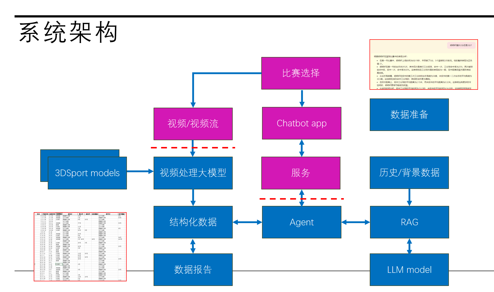

## 1. 大模型架构

这个架构图是一个基于大模型的系统框架，结合了视频处理、聊天机器人和数据分析功能。下面我将逐步说明每个部分的作用、顺序、基本原理和实现方法：

### 1.1 **3D Sport Models**

- **目的**: 输入 3D 运动模型，用于视频分析和数据提取。
- **基本原理**: 3D运动模型是用来检测和提取运动对象的空间信息（如位置、姿态等）。
- **实现方法**: 通常采用深度学习模型（如Pose Estimation算法）对视频中的人体或物体进行关键点检测和轨迹跟踪。

### 1.2 **视频/视频流**

- **目的**: 接收实时视频流或预处理好的视频文件，作为输入。
- **基本原理**: 视频流是动态数据，分帧后可用于后续处理。
- **实现方法**: 通过 OpenCV 等工具进行帧分解和预处理，为后续的视频处理大模型提供数据。

### 1.3 **视频处理大模型**

- **目的**: 对视频流进行深度分析，提取关键信息。
- **基本原理**: 使用深度神经网络（如卷积神经网络或 Transformer）对视频帧进行分析。
- **实现方法**: 例如，采用预训练的模型（如 YOLO、DeepLab）提取特征，结合 3DSport 模型分析运动轨迹。

### 1.4 **结构化数据**

- **目的**: 将视频分析结果转化为结构化数据（如 JSON 或表格形式）。
- **基本原理**: 通过视频分析得到的特征和轨迹信息，进行格式化处理，方便后续分析。
- **实现方法**: 编写数据处理脚本（如 Python Pandas）将分析结果存储为标准数据格式。

### 1.5 **数据报告**

- **目的**: 将结构化数据生成最终报告，供用户查看。
- **基本原理**: 数据可视化和统计分析。
- **实现方法**: 使用工具（如 Matplotlib、Tableau）将分析结果以图表、表格形式展示。

### 1.6 **比赛选择 & Chatbot App**

- **目的**: 提供用户交互界面，可选择比赛或提问聊天机器人。
- **基本原理**: 比赛选择通过菜单选择；Chatbot App 利用自然语言处理（NLP）回答问题。
- 实现方法:
    - 比赛选择通过简单的用户界面开发（如HTML/JS）。
    - Chatbot App 调用大语言模型（如OpenAI API）生成对话内容。

### 1.7 **服务**

- **目的**: 将核心功能模块（视频处理、数据分析、聊天功能）整合为服务。
- **基本原理**: 通过 API 调用或微服务架构将不同功能模块连接。
- **实现方法**: 使用框架（如Flask、FastAPI）部署后端服务。

### 1.8 **历史/背景数据**

- **目的**: 提供系统分析的上下文信息。
- **基本原理**: 基于历史数据的存储和检索。
- **实现方法**: 使用数据库（如SQL或NoSQL）保存和查询用户数据或历史比赛记录。

### 1.9 **RAG（Retrieval-Augmented Generation）**

- **目的**: 提升大模型的回答准确性，通过检索增强生成能力。
- **基本原理**: 将检索到的相关文档作为输入，辅助大语言模型生成更精准的回答。
- **实现方法**: 结合向量检索技术（如FAISS）和LLM模型，查询历史数据并生成答案。

### 1.10 **LLM Model**

- **目的**: 提供智能回答和语言生成能力。
- **基本原理**: 利用预训练的大规模语言模型，通过深度学习生成自然语言输出。
- **实现方法**: 使用GPT等模型，输入用户问题和上下文，输出答案。

### 总结顺序

1. **数据输入与视频处理**: 视频流经过大模型处理，生成结构化数据。
2. **数据分析与展示**: 数据转化为用户可读的报告。
3. **用户交互**: 通过比赛选择和Chatbot App进行反馈。
4. **历史增强**: 利用历史数据和RAG技术为模型提供上下文，改进回答。

