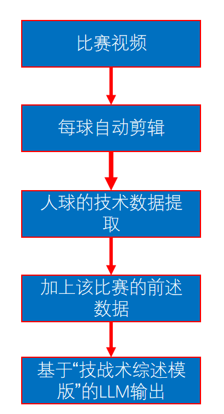
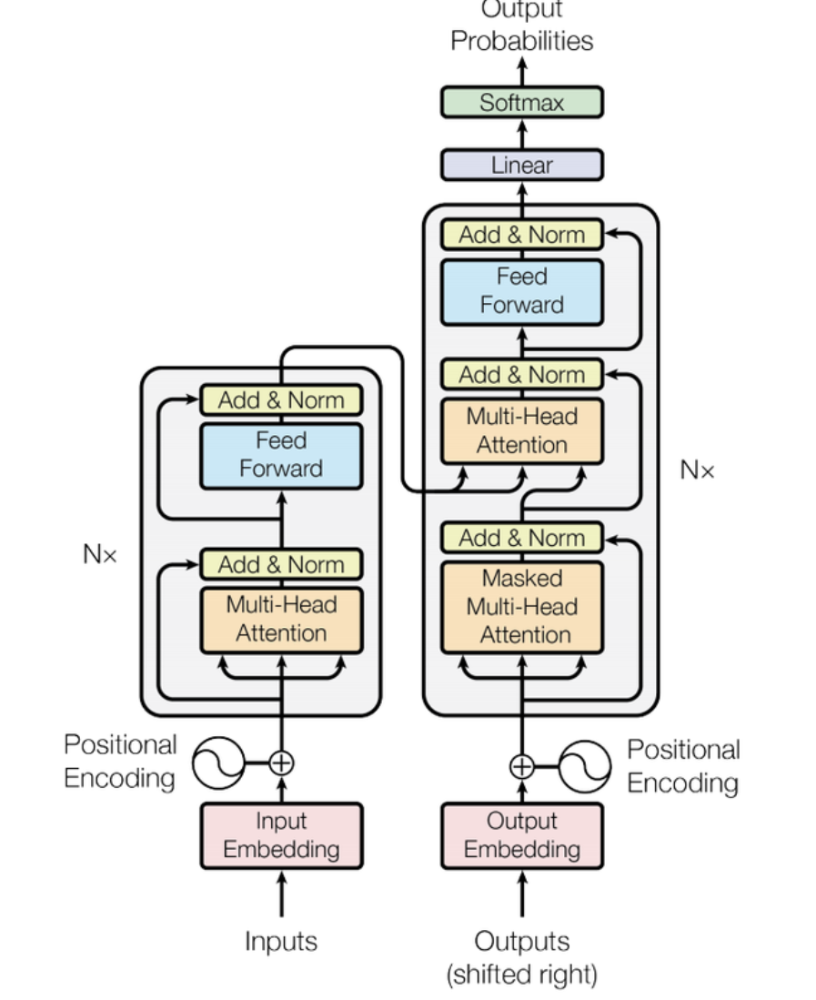

## 0. 项目实现目标/需求

该项目针对体育赛事直播领域对高质量、个性化和实时性需求，研发基于大模型的体育视觉传播平台，结合视频识别与分析、实时数据处理和生成式人工智能技术，实现赛事内容的智能化分析与个性化生成。平台的核心功能包括图像识别、实时数据分析（如精彩瞬间、技战术分析、运动员表现等）以及内容生成（如赛事总结、预测等），通过高效模型优化和数据驱动提升赛事内容的商业价值和观众体验。

## 1. 模型架构

::: details from gpt

### 1.视频/视频流

#### 1.1 **3D Sport Models**

- **目的**: 输入 3D 运动模型，用于视频分析和数据提取。
- **基本原理**: 3D 运动模型是用来检测和提取运动对象的空间信息（如位置、姿态等）。
- **实现方法**: 通常采用深度学习模型（如Pose Estimation算法）对视频中的人体或物体进行关键点检测和轨迹跟踪。

#### 1.2 **视频处理大模型**

- **目的**: 对视频流进行深度分析，提取关键信息。
- **基本原理**: 使用深度神经网络（如卷积神经网络或 Transformer）对视频帧进行分析。
- **实现方法**: 例如，采用预训练的模型（如 YOLO、DeepLab）提取特征，结合 3DSport 模型分析运动轨迹。

#### 1.3 **结构化数据**

- **目的**: 将视频分析结果转化为结构化数据（如 JSON 或表格形式）。
- **基本原理**: 通过视频分析得到的特征和轨迹信息，进行格式化处理，方便后续分析。
- **实现方法**: 编写数据处理脚本（如 Python Pandas）将分析结果存储为标准数据格式。

> **历史/背景数据**
>
> - **目的**: 提供系统分析的上下文信息。
> - **基本原理**: 基于历史数据的存储和检索。
> - **实现方法**: 使用数据库（如SQL或NoSQL）保存和查询用户数据或历史比赛记录。

#### 1.4 **数据报告**

- **目的**: 将结构化数据生成最终报告，供用户查看。
- **基本原理**: 数据可视化和统计分析。
- **实现方法**: 使用工具（如 Matplotlib、Tableau）将分析结果以图表、表格形式展示。

### 2. **Chatbot App**

- **目的**: 提问聊天机器人。
- **基本原理**: Chatbot App 利用自然语言处理（NLP）回答问题。
- 实现方法:
    - Chatbot App 调用大语言模型（如OpenAI API）生成对话内容。

> **RAG（Retrieval-Augmented Generation）**
>
> - **目的**: 提升大模型的回答准确性，通过检索增强生成能力。
> - **基本原理**: 将检索到的相关文档作为输入，辅助大语言模型生成更精准的回答。
> - **实现方法**: 结合向量检索技术（如FAISS）和LLM模型，查询历史数据并生成答案。
>
> **LLM Model**
>
> - **目的**: 提供智能回答和语言生成能力。
> - **基本原理**: 利用预训练的大规模语言模型，通过深度学习生成自然语言输出。
> - **实现方法**: 使用GPT等模型，输入用户问题和上下文，输出答案。

:::

## 2. 模型功能、目标（细分）

**技术板块的需求、技术方案，数据需求**

### **2.1 比赛结果预测**

- **需求**：根据实时比赛数据，预测双方的胜率，比如 "A队60%，B队40%"。
- **技术方案**：通过历史比赛数据和实时数据，使用贝叶斯网络等模型计算获胜概率。
- **数据需求**：类似水平比赛的历史数据和当前比赛的实时进展数据。

### **2.2 精彩瞬间捕捉**

- **需求**：从比赛中提取关键的“精彩瞬间”，如关键得分或制胜回合。
- **技术方案**：根据定义的评分规则，用算法分析视频，自动筛选出“高光时刻”。
- **数据需求**：需要转播解说描述、观众投票和关键时刻的样本数据。

### **2.3 技战术分析**

- **需求**：总结比赛技战术，生成包含文字和图表的分析报告。
- **技术方案**：视频中提取技术动作（如发球、跑位），结合大模型生成技战术总结。
- **数据需求**：至少100场比赛的技战术描述样本和相关比赛视频数据。

### **2.4 报道内容生成**

- **需求**：根据整场比赛数据，生成包含文字和图表的综合性报道内容。
- **技术方案**：通过视频自动剪辑，提取技术数据（如落点、跑位等），结合大模型生成总结内容。
- **数据需求**：准备不少于100场比赛的技术分析样本，用于训练和测试生成模型。

### **2.5 问答机器人**

- **需求**：根据比赛当前进展，为用户提供比赛相关的文字+图表问答响应。
- **技术方案**：将结构化数据输入总结/问答模型，结合RAG+LLM技术实现问答响应。
- **数据需求**：至少10场比赛的报道问答样本和1000个人工+机器生成的问答示例。

## 3. 研发内容

### 3.1 数据准备

- 赛事视频数据。
- 带标签训练集：目标识别训练集（场地，运动员等）、动作分类标签训练集（肢体运动、击球方式等）
- 多模态大模型知识库：比赛动态、战术、解说知识库等等。

::: important 什么是多模态？

**核心特点：**

1. **多模态融合**：
    - 同时支持文本（文章、描述）、图像（照片、视频帧）、音频（语音、音乐）等模态数据。
    - 比如：看一张图片，生成文字描述；听一段解说，提取关键信息。
2. **大模型驱动**：
    - 使用强大的深度学习模型（如GPT、CLIP、DALL-E）来理解和生成多模态数据。
    - 模型能够根据不同模态数据间的联系，进行推理和预测。
3. **知识存储和检索**：
    - 把多模态数据结构化存储，支持高效检索和跨模态查询。
    - 比如输入一段文字，检索对应的视频片段；或者提供图片，返回相关的文字说明。

:::

### 3.2 视觉多任务处理

#### 3.2.1 目标识别

乒乓球目标识别包括乒乓球、乒乓球桌、乒乓球拍、运动员等。

羽毛球目标识别包括羽毛球、羽毛球场地、羽毛球拍、运动员、等。

#### 3.2.2 动作识别

- **动作类型**：如乒乓球的击球方式（推挡；拉球）、位置（近台）和力量；羽毛球的击球方式（高远球）、位置（中场）和力量（轻击）等等。
- **目的**：动作识别通过分析羽毛球或乒乓球比赛中的关键动作（如发球、回球、扣杀、拉球等），实现技术统计、战术分析和精彩瞬间提取。它能精准捕捉选手的技术特点和比赛节奏，为训练指导、赛事直播解说以及战术研究提供数据支持，同时提升观众体验和内容价值。

#### 3.2.3 场景识别

- **场景类型**：系统能够分析比赛环境和整体态势，识别比赛阶段（开局、相持、赛末）、赛场态势（双方优劣势分析）、战术意图（进攻、防守、控制类型）以及比赛节奏（快、中、慢）等。

- **目的**：通过实时分析比赛的局面变化，提供精准的技术支持和内容生成，为比赛直播和回顾提供更智能的辅助。

#### 3.2.4 事件识别

- **事件类型**：发球接发球事件、回合事件、得分事件、无效球事件等。事件识别模型的输出不仅包括事件的类型，还包含事件发生的确切时间和运动员位置信息。
- **目的**：事件识别结果对于赛事直播的赛事精彩回放的制作以及比赛结果的预测提供数据基础。

#### 3.2.5 模型微调

::: info 为什么要进行模型微调？

1. **适应特定任务需求**：预训练模型虽然具备通用能力，但面对具体任务（如比赛预测、运动员表现分析等），需要微调模型，让它更贴合任务要求。
2. **提升预测效果**：预训练模型的默认状态可能无法在特定任务中达到最优效果，通过微调可以让模型在特定数据集上表现更好。
3. **节省计算资源**：相比从头开始训练，微调可以利用已有的预训练模型，大幅减少训练时间和资源消耗，同时快速提高性能。
4. **应对数据分布差异**：预训练模型通常基于通用数据集，而具体任务的数据分布可能不同。通过微调，可以让模型适应目标任务的数据分布。
5. **学习特定特征**：某些任务可能包含独特的特征（如比赛战术、选手数据等），微调能让模型更好地捕捉这些特征，从而更符合任务需求。

**总结**：微调模型的主要目的是充分利用预训练模型的能力，同时针对具体任务进一步优化，让模型更适应实际应用场景。

:::

### 3.3 体育视觉传播大模型

#### 3.3.1 多模态输出和模型微调

基于一个强大的基础模型，针对具体场景的需要，对自然语言输入和输出进行微调，提升模型在直播场景下的各种任务中的表现，比如回答问题和生成内容等。通过多模式输出模块，可以将语言、视频、图表等不同形式的内容结合起来，提供更全面的结果展示，满足实际应用需求。

::: note

**举例应用：**
在体育赛事直播中，可以基于 CLIP 和 GPT-4 的结合：

- **任务场景：** 比如直播一场足球比赛。
- **实际应用**：
    - CLIP 用于识别视频画面中的精彩瞬间（如进球、犯规等）。
    - GPT-4 微调后，根据识别出的内容生成自然语言解说，比如“第23分钟，某队完成了一记漂亮的头球破门！”。
    - 多模态输出模块将文字解说与实时图像、统计图表等内容结合，为观众提供丰富的视觉传播体验。

:::

#### 3.3.2 构建知识库

- **类型**： 体育基础知识库、直播解说知识库、赛事历史知识库、赛时实时知识库、社交媒体库、技战术知识库等多种体育知识库
- **目的**：自主更新及知识库运营，保障大模型应用场景生成内容的实时性、专业性。

::: note 构建知识库要点

- **知识分类与结构化**：
    - 将不同来源的数据进行分类（如比赛规则归入基础知识库，实时比赛数据归入赛事实时知识库）。
    - 使用知识图谱或关系型数据库，将知识点以逻辑化的方式连接起来，形成层级清晰的知识结构。
- **引入行业垂直模型**
    - 对知识库进行行业细化，例如在体育领域加入特定的解说语料、比赛策略分析模板等。
    - 使用预训练模型微调（如GPT、BERT）来处理体育领域的特定语言和逻辑。
- **实现知识库的动态更新**
    - 搭建自动化更新机制，实时从可靠数据源获取新内容，并对旧内容进行修订。
    - 使用自然语言处理技术，自动提取社交媒体或新闻内容中的有效信息。

:::

#### 3.3.3 智能体框架建设

各个分工明确的智能体进行内容输出，需要协同配合、组合应用来高效服务。简而言之，知识整个模型的核心架构阶段。

##### 1.  **赛事信息识别引擎**

这个引擎就像一个“超级裁判+记者”，能实时看懂比赛、抓住关键点，并把这些信息整理成易懂的形式，供解说员、观众或其他系统使用。技术的核心是“看懂比赛”和“快速生成有用的信息”。

::: info

**核心技术总结：**

- **计算机视觉：** 负责识别比赛中的人、物、事件。
    - YOLO、ViT：识别比赛的关键信息。参照 3.2
- **自然语言处理：** 将识别结果转化为易读的解说内容。
    - LSTM 或时序 Transformer：识别关键事件
- **多模态融合：** 综合视频、传感器和静态信息，生成标准化的数据。
    - SQL 或 NoSQL：可以把数据存储为标准格式，便于读取使用。
- **实时处理：** 确保赛事信息能快速更新，供直播和分析使用。
    - 流处理技术（如Apache Kafka）：快速处理实时比分和动态事件。

:::

##### 2. 视觉识别引擎

> **视觉识别引擎**更聚焦于比赛的“看”和“识别”，通过分析画面获取结构化数据；而**赛事信息识别引擎**则关注赛事全局信息的整合与提炼，涉及多元化的数据来源。两者可以协同合作，视觉识别引擎提供画面数据支持，赛事信息识别引擎进行全局分析与输出。

##### 3. 知识融合引擎 &  语言生成引擎 & 意图理解引擎

- 知识融合引擎：将“碎片化知识”整理成能直接用的内容，确保信息丰富、权威，提升服务的专业性。
- 语言生成引擎：负责将其他模块提取的数据转化为流畅、符合场景的文字内容。
- 意图理解引擎：主要任务是分析用户的输入（文本、语音等），识别用户真正的需求，比如想了解选手数据、观看某场比赛的关键片段，或者查询历史记录。

| **引擎**     | **推荐模型**                    | **主要技术功能**               |
| ------------ | ------------------------------- | ------------------------------ |
| 知识融合引擎 | GPT-4, BERT, FAISS              | 知识提取、语义匹配、信息检索   |
| 语言生成引擎 | GPT-4, T5, CTRL                 | 自然语言生成、场景适应解说     |
| 意图理解引擎 | BERT, Whisper, DialogFlow, Rasa | 意图识别、语音转文本、语义匹配 |

### 3.4 数据管理

建立知识库、数据接入与清洗、历史数据赛事数据与反馈数据转化。

### 3.5 应用场景

- 赛事精彩瞬间分析
- 赛事报道生成
- 赛事结果预测
- 运动员表现分析
- 赛事战术分析
- 赛事回顾
- 赛事周边花絮

## 4. 项目可能的工作线路

### **1. 数据处理与管理线路**

**责任部门：数据工程团队**

 **工作内容：**

- **数据收集与清洗**：收集国际A级赛事直播流、录像数据及互联网公开信息（如社交媒体内容）。
- **数据标注与管理**：对赛事视频进行目标识别标注（如乒乓球、羽毛球的球、球员、动作等），确保数据质量。
- **知识库构建**：搭建多模态的体育知识库，包括赛事历史数据、技战术知识库、解说知识库等。

### **2. 模型研发线路**

**责任部门：算法与模型开发团队**

 **工作内容：**

- **视觉多任务处理模型开发**：实现目标识别、动作分类、事件识别、场景识别等功能。
- **生成式人工智能模型研发**：构建支持技战术分析、赛事回顾、报道生成的生成模型。
- **模型微调与优化**：基于预训练模型，进行实时性、准确性和个性化生成的优化。

### **3. 系统架构与平台建设线路**

**责任部门：系统工程团队**

 **工作内容：**

- **智能体框架设计**：搭建赛事信息识别、视觉识别、知识融合、语言生成、意图理解等核心引擎。
- **多模态输出模块**：整合语言、视频、图表等内容，提供全面的输出能力。
- **大模型应用接口开发**：为上层应用场景（如直播解说、战术分析）提供调用接口。

### **4. 应用场景开发线路**

**责任部门：应用开发与产品团队**

 **工作内容：**

- **直播解说与分析功能**：开发赛事实时解说、战术分析、赛事亮点回顾等功能。
- **用户互动与定制化服务**：支持观众通过交互界面查询赛事预测、运动员表现等。
- **媒体内容生成**：基于模型自动生成赛事报道、社交媒体更新、赛事总结等。

### **5. 测试与示范应用线路**

**责任部门：质量保证团队与示范应用团队**

 **工作内容：**

- **模型测试与评估**：验证模型在真实直播场景下的性能，包括多模态融合、内容生成的准确性。
- **示范应用搭建**：与合作方（如北体传媒、咪咕）对接，完成直播示范应用。
- **用户体验优化**：基于用户反馈不断调整模型和系统功能。

### **总结**

该项目的工作线路围绕**数据、模型、平台、应用和测试**五个核心部分展开，各部门的工作相互配合，最终目标是实现一个能够提供实时、个性化、智能化服务的体育视觉传播大模型平台。这种多线路分工能够确保项目需求被全面覆盖，同时实现高效的技术落地与实际应用。
