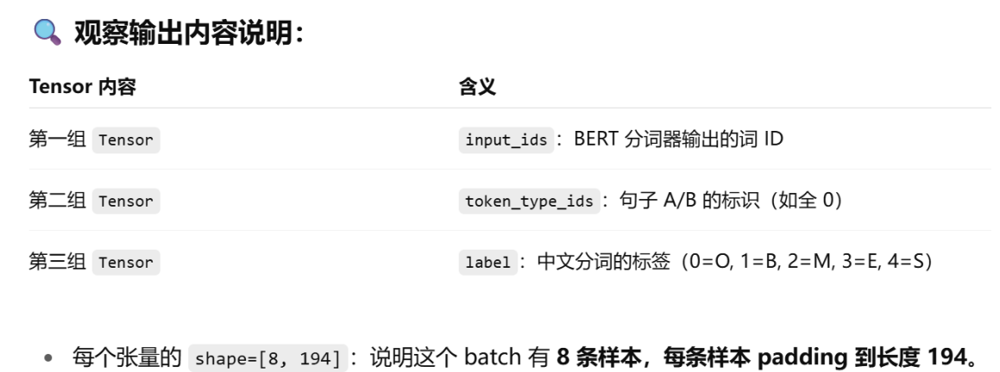

## 自我介绍

 

您好！我叫肖羡月，是中国传媒大学（海南国际学院）智能科学与技术专业的大三学生，系统学习了机器学习、计算机视觉、高级算法、人工智能导论等核课程，打下了坚实的技术基础。

针对**AI图像大数据与识别**这个实习岗位，我认为我具备以下几方面的优势：


**首先，我具备一定的机器学习算法应用能力。**在中文分词模型优化项目中，我基于BERT构建并调参分词模型，把F1分数提升到了98%左右，同时还做了Dropout率的消融实验，探索正则化与模型泛化的关系，锻炼了我对深度学习模型的理解和工程实现能力。另外**在社交媒体用户行为分析项目中**，我结合随机森林、XGBoost和K-means等算法完成了用户画像和互动预测，比较熟悉模型选择和评估。

**其次， 我具备完整的数据处理与建模实践经验**。在“体育视觉传播大模型”与“新闻舆情智能体”等项目中，我负责数据清洗、合并、异常值处理等工作，参与模型微调及初步训练过程，对大规模数据流的处理流程和数据建构逻辑有了一定的思考和理解。

在技能方面，我熟练使用Python、SQL、HTML、Flask、Hive、MySQL、Matplotlib、PyTorch等工具进行软件开发和数据分析，有较好的团队协作意识和自学能力，同时具备一定英语能力，能够胜任跨文化项目。

我期待能够作为AI图像大数据与识别实习生加入团队，结合我的项目经验和技术积累，为团队发展贡献力量。

谢谢！


## 中文分词模型优化：

### 过程和调参

1. Paddlenlp.transform该模块属于 PaddleNLP（百度开源的自然语言处理库），提供了对各种预训练模型（如 BERT、ERNIE、RoBERTa 等）的封装。其功能类似于 Hugging Face 的 transformers 库。
2. 然后token，分词之后进行tagging（SBME）
3. 这样之后你只需要传入 example，其它参数（tokenizer, label2id, max_seq_len）都已经默认绑定。
4. 再使用padding使他们长度一致

5. 封装成batch



① **训练轮数（Epochs）**

```
num_epochs = 3
```

- 表示完整训练集会被遍历 **3 次**
- 如果你发现模型欠拟合（loss 高），可以适当增加轮数

------

② **学习率（learning rate）**

```
learning_rate = 3e-5
```

- 这是你设定的初始学习率，是微调 BERT 时的常用值（10⁻⁵～10⁻⁴ 之间）
- 适合稳定更新预训练模型参数

------

③ **评估和日志步数**

```
eval_steps = 100
log_steps = 10
```

- 每隔 100 个训练 step 评估一次模型指标（如 F1）
- 每 10 步输出一次训练 loss、进度等日志

------

④ **模型保存路径**

```
save_dir = "./checkpoints"
```

- 模型在训练过程中的 checkpoint 会保存在这个目录

------

⑤ **权重衰减（L2 正则化）**

```
weight_decay = 0.01
```

- 用于抑制过拟合，尤其适用于大模型
- 设置了 0.01 的权重衰减系数，典型值（通常设在 0.01～0.1）

------

⑥ **学习率预热（Warmup）比例**

```
warmup_proportion = 0.1
```

- 表示训练前 10% 的 step 使用线性 warm-up，使学习率从 0 慢慢上升至设定值
- 这样避免一开始震荡过大，适合 BERT 这种预训练大模型

------

 ⑦ **参数选择性权重衰减**

```
decay_params = [
    p.name for n, p in model.named_parameters()
    if not any(nd in n for nd in ["bias", "norm"])
]
```

- 你排除了 `"bias"` 和 `"LayerNorm"` 中的参数不进行 `weight_decay`，这是非常合理的：
    - `bias` 和归一化层参数若正则化可能会影响模型性能
- 使用 `apply_decay_param_fun` 精准控制哪些参数加 L2 惩罚

------

 ⑧ **优化器设置**

```
optimizer = paddle.optimizer.AdamW(
    learning_rate=learning_rate,
    parameters=model.parameters(),
    weight_decay=weight_decay,
    apply_decay_param_fun=lambda x: x in decay_params
)
```

- 使用了 `AdamW`，适合 Transformer/BERT 系列
- 可结合 warmup 和学习率调度器使用（你后面可能会定义 `lr_scheduler`）

------

 ⑨ **损失函数**

```
loss_fn = nn.CrossEntropyLoss()
```

- 标准的 token 分类任务损失函数
- 可配合 `ignore_index` 屏蔽 padding label

------

⑩ **评估指标设置**

```
metric = ChunkEvaluator(label_list=label2id.keys())
```

- 使用 `ChunkEvaluator` 评估 NER 分词任务
- 支持输出 `Precision / Recall / F1


### ✅ 面试问题：你是用什么方法做这个项目的？怎么调参？做了哪些消融实验？

**答：**

我这个项目是基于 BERT 的中文分词任务，采用了 BERT + token-level linear 分类器的结构，用 `SBME` 标签进行序列标注。具体做法是将输入文本先用 PaddleNLP 的 `bert-base-chinese` 分词器进行 token 化，然后用一个 `BertForTokenClassification` 模型对每个 token 进行分类。

在调参方面，我使用了：

- 微调学习率 `3e-5`，结合 `AdamW` 优化器；
- 加入 `weight decay = 0.01` 抑制过拟合，并排除了 `bias` 和 `LayerNorm` 参数不参与正则化；
- 设置 `warmup_proportion=0.1` 来缓冲前期训练；
- 使用 `ChunkEvaluator` 评估 `P/R/F1`，并设置了 `eval_steps=100` 进行验证集监控；
- dropout 概率使用了 `0.1` 和 `0.3` 两组对比进行验证。

消融实验方面，我主要做了：

1. **移除 Dropout 层**：观察泛化性能变化，验证其抑制过拟合的效果；
2. **只使用前几层 BERT**：验证浅层特征是否足够；
3. **替换分词器（如 `word` 切分 vs `char` 切分）**：对比 token 粒度对性能的影响；
4. **不做 label padding**：观察 loss 计算是否受影响；
5. **去掉 warmup**：学习曲线震荡更明显，验证 warmup 有助收敛稳定。

这些实验帮助我确认了 dropout 和 warmup 是模型泛化能力的重要因素，最终模型在验证集上达到了较优的 F1 分数。


## 社交媒体用户

在这个项目中，我用 Kaggle 上的社交媒体情绪数据集，通过机器学习对用户互动行为进行了建模和用户画像分析。

**监督学习方面**，我用了随机森林和 XGBoost 两个模型来预测贴文的互动量（点赞和转发数），主要是因为它们对特征重要性有良好的解释能力，且对离散变量友好。
 我做了深入的特征工程，包括提取时间（小时/是否周末）、文本长度、用户历史行为（平均点赞、转发）、平台信息等特征，并通过 one-hot 编码和标准化处理。
 在调参上，我主要调整了 `n_estimators` 和 `max_depth`，并对 XGBoost 启用了 `early_stopping` 来防止过拟合。

**无监督学习方面**，我用 K-means 聚类对用户进行分群，通过 Elbow Method 和 Silhouette Score 来选择聚类数量。虽然最佳聚类数是 2-3，但我使用了 4 类来获得更细粒度的用户画像。特征包括文本长度、点赞数、是否周末发帖等。最后用雷达图展示了各群体的行为差异。

特征重要性分析显示，用户的历史互动行为是最强的预测指标，这也验证了平台“用户影响力驱动分发”的机制。这个项目让我更深入理解了如何将监督与非监督模型结合，用数据驱动的方式刻画用户行为和偏好。

### 1️⃣ **你用随机森林和 XGBoost 做了什么？为什么用这两个模型？它们的区别是什么？**

我用随机森林和 XGBoost 来预测用户帖子的互动数（点赞和转发），任务是典型的回归问题。选择这两个模型主要是因为：

- 都是集成学习方法，对非线性关系建模能力强；
- 对类别型和连续型特征都兼容；
- 都支持特征重要性分析，利于解释模型。

区别在于：

- 随机森林是 **Bagging** 框架，训练多个互相独立的决策树取平均，偏差小但方差大；
- XGBoost 是 **Boosting** 框架，迭代训练新树来修正前面模型的误差，具有更强的拟合能力与收敛速度，调参更加灵活。

### 2️⃣ **你是怎么调参的？有什么技巧？**

我主要调整的超参数包括：

- `n_estimators`（树的数量）；
- `max_depth`（树深）；
- 对 XGBoost 还使用了 `early_stopping_rounds` 以避免过拟合；
- 学习率（XGBoost）设置为默认的 0.3，没有明显波动时未进一步调整。

调参策略：

- 先用较大树深快速拟合看是否欠拟合；
- 使用交叉验证或固定验证集评估；
- 分析特征重要性后剔除无效特征，简化模型。

### 3️⃣ **K-means 聚类是如何用在这个项目中的？聚类的效果如何评估？**

我使用 K-means 聚类来对社交媒体用户进行画像建模。输入特征包括：

- 平均点赞、转发数量；
- 文本长度；
- 是否喜欢在周末发帖等。

为了保证各维度对聚类的影响均衡，先进行了 **标准化处理**。

评估方法：

- 使用 **Elbow 方法** 和 **轮廓系数（Silhouette Score）** 来确定最优聚类数量；
- 聚类结果通过可视化分析，包括 **雷达图** 和 **箱线图**，从内容长度、活跃时间、互动强度等维度描述每一类用户的特征差异。

### 4️⃣ **哪些特征对模型预测最关键？为什么？**

最关键的特征是：

- 用户历史平均点赞数（UserAvgLikes）
- 平均转发数（UserAvgRetweets）

这两个特征的累计重要性达到 97%，说明：

- **历史互动行为高度可预测未来行为**，体现出社交平台的“影响力驱动分发机制”；
- 与此同时，时间（IsWeekend）和文本长度（TextLength）也有次要影响，说明内容和发布时间仍有边际作用。

### 5️⃣ **你做过模型结果的可视化或解释吗？用了什么方法？**

是的。我使用了：

- **特征重要性条形图**：对 Random Forest / XGBoost 输出的 `feature_importances_` 进行可视化，直观展示各特征贡献；
- **预测 vs 实际值散点图**：判断回归误差是否集中，检验模型是否偏差；
- **情绪类型和互动的关系图**：用于理解情绪对传播效果的影响；
- **聚类雷达图 / 箱线图**：用于分析用户群体之间的差异。

### 7️⃣ **项目中有没有遇到模型过拟合？你是怎么处理的？**

有遇到模型拟合度过高的情况，比如在训练集上 R² 接近 1，RMSE 极低。为了防止过拟合，我做了：

- **启用早停机制**（XGBoost `early_stopping_rounds=10`）；
- **设置较小的树深度（max_depth=5）**；
- 进行 **特征选择和降维**；
- 保持训练/验证集 80:20 分割，并使用随机种子固定划分。


## 体育传播大模型

#### 1️⃣ **图像识别数据的清洗与构建**

- 从比赛视频中抽帧，提取出图像数据；
- 过滤掉低质量帧（如模糊、遮挡），剔除无效样本；
- 对视频画面中的 **运动员、球、球拍等目标物体**，协助完成图像标注或验证数据一致性；
- 清洗过程中注意统一图像尺寸、通道数，并处理无标签或错误标签数据，保证模型训练数据干净可靠。

------

#### 2️⃣ **结构化标签对齐与数据融合**

- 将识别结果（如运动员位置、动作类型、事件时间点）格式化为 JSON 或表格格式；
- 融合视频帧识别输出和文本解说、历史比分等多源数据，构建训练样本；
- 处理异常值，比如识别输出坐标超出画面、动作持续时间异常等，通过设阈值、滑窗统计剔除。

------

#### 3️⃣ **数据驱动模型微调准备**

- 为动作识别模型（如用于识别发球、扣杀等）准备带标签的图像序列；
- 对每类动作平衡样本分布，防止模型偏向主流类别；
- 为多模态模型准备图像 + 文本 + 元数据（如时间戳、比分）的联合输入。

### ✅ 面试回答示范：你们图像识别抽取关键帧用了什么技术？

**答：**

我们在图像识别阶段，采用了 **YOLO 系列目标检测模型**（如 YOLOv5 / YOLOv8）来对视频帧中的关键目标进行实时检测，例如运动员、球拍、球、赛场元素等。

针对体育视频，我们的处理流程大致如下：

1. **视频抽帧**：首先用 OpenCV 以固定帧率（如 5fps 或 10fps）从直播视频中提取图像帧；
2. **帧级目标检测**：对每一帧图像输入 YOLO 模型，检测是否包含有效目标（如运动员或球）；
3. **动作判断/目标过滤**：
    - 若帧中无目标或目标置信度过低（如置信度 < 0.5），自动丢弃；
    - 若连续帧中目标框变化剧烈，认为是发生了关键动作（如击球），保留关键帧；
4. **关键帧选取**：
    - 利用目标检测 + 位置变化（例如球员位置、球运行轨迹突变）来提取“动作转折点帧”；
    - 部分场景我们也通过“事件识别模型”辅助判断（如识别“得分瞬间”）。

通过这种方式，我们实现了 **从原始视频中自动抽取高价值帧**，为后续的动作识别、事件分类、技术分析等任务提供干净、有效的输入。

### ✅ **1. 图像、文本、元数据是否都能转化为向量，写入向量数据库？**

**是的，可以，而且这是构建多模态大模型应用的关键一步。**

在你参与的“体育视觉传播大模型”项目中，图像、文本、元数据可以统一向量化后写入向量数据库（如 FAISS、Milvus、Weaviate），用于 **多模态检索、RAG（检索增强生成）**、知识召回等任务：

| 数据类型                   | 转向量方式                                                   | 说明                                    |
| -------------------------- | ------------------------------------------------------------ | --------------------------------------- |
| 图像帧                     | 使用视觉编码器（如 CLIP 的视觉模型、ResNet、ViT）提取图像向量 | 得到图像的语义特征                      |
| 文本描述                   | 使用语言模型（如 BERT、RoBERTa、Sentence-BERT、text-embedding-ada-002）提取文本向量 | 适合直播解说、评论、规则等文本          |
| 元数据（时间、比分、位置） | 结构化编码 + MLP + 拼接向量化 或 数值归一化后直接编码        | 可以与图像/文本拼接组成 joint embedding |


这些向量可以写入向量数据库，用于：

- 相似视频片段召回；
- 多模态问答；
- 比赛事件快速检索；
- 构建“体育知识图谱”中的节点表示。

### ✅ **2. 这个项目可能用什么大模型 API？**

结合你项目中提到的内容（RAG + NLP + 视频分析 + 内容生成 + 问答），可能会用到以下几类大模型或 API：

------

#### 📘 文本生成/问答类大模型 API

| 模型 / API                     | 作用                     | 备注                                 |
| ------------------------------ | ------------------------ | ------------------------------------ |
| **OpenAI GPT-4/GPT-3.5**       | 比赛播报生成、问答、摘要 | 支持多轮对话、多模态（gpt-4-vision） |
| **ChatGLM**                    | 国产 LLM 替代，问答/摘要 | 更适合私有化部署                     |
| **T5 / FLAN-T5 / LLaMA2**      | 报道生成、摘要           | 训练自有内容生成模型时使用           |
| **Baichuan / Qwen / DeepSeek** | 中文赛事内容理解与生成   | 与国内平台兼容性好                   |


------

#### 🖼 图像+文本 多模态大模型

| 模型                              | 功能                 | 场景                                   |
| --------------------------------- | -------------------- | -------------------------------------- |
| **CLIP**（OpenAI）                | 图像编码，图文对齐   | 提取图像语义向量，配合文本进行相似搜索 |
| **BLIP-2 / Flamingo / MiniGPT-4** | 图文问答 / 生成      | 输入图像生成文字、问答                 |
| **GPT-4-Vision API**              | 视觉问答，图片转描述 | 比如“这帧是扣杀动作吗？”               |


## ✅ Flask 是干什么的？

**Flask 是一个轻量级的 Python Web 应用框架**，用于快速搭建后端服务，特别适合做：

| 应用场景        | 说明                                                      |
| --------------- | --------------------------------------------------------- |
| ✅ 接收前端请求  | 接收网页、App、curl 发来的 HTTP 请求（GET、POST 等）      |
| ✅ 返回模型结果  | 用于部署机器学习模型，把预测结果通过接口返回              |
| ✅ 构建 API 接口 | 提供 RESTful API，比如 `/predict`, `/query`, `/upload` 等 |
| ✅ 搭建原型系统  | 非常适合快速搭建演示/测试系统，支持与前端联动             |


## ✅ Hive 的主要作用：

| 功能                 | 说明                                                         |
| -------------------- | ------------------------------------------------------------ |
| ✅ 数据仓库           | 用来存储、管理、分析 PB 级别的结构化数据                     |
| ✅ SQL 查询引擎       | 提供类 SQL 的查询语法（HQL），让不懂 MapReduce 的人也能查询 Hadoop 数据 |
| ✅ 和 Hadoop 集成     | 背后实际运行的是 MapReduce 或 Spark 作业，但你只用写 SQL     |
| ✅ 支持表、分区、视图 | 像传统数据库一样管理数据结构，适合离线数仓分析               |

## ✅ PyTorch 是什么，怎么读，体现在你哪段经历？

### 📖 **怎么读：**

> /ˈpaɪ.tɔːrtʃ/，读作 “派托奇”

### 🧠 **是做什么的？**

PyTorch 是一个**开源的深度学习框架**，由 Facebook 开发，广泛用于：

- 构建神经网络（如 CNN、RNN、BERT）；
- 执行 GPU 加速的模型训练与推理；
- 支持动态图，调试灵活、可扩展性强；
- 学术研究、工业部署都用得非常多。

### 📌 **在你简历中的体现：**

你在以下经历中显然有 PyTorch 实操：

- ✅ **“基于BERT的中文分词模型优化研究”**：你提到了模型微调、GPU加速训练、消融实验等，这些一般是用 PyTorch + HuggingFace 实现；
- ✅ **“体育视觉传播大模型”项目**：涉及视觉识别、模型训练、后端部署，这种项目往往也是基于 PyTorch 实现深度视觉模型如 YOLO、CLIP 等。

------

## ✅ Matplotlib 是什么，怎么读，体现在你哪段经历？

### 📖 **怎么读：**

> /ˈmæt.plə.tlɪb/，读作 “麦特普洛特利布”

### 🧠 **是做什么的？**

Matplotlib 是 Python 中最常用的**科学绘图库**，用于：

- 绘制图表（柱状图、折线图、散点图、热力图等）；
- 可视化模型结果（如 loss 曲线、特征重要性）；
- 辅助数据分析报告生成。

### 📌 **在你简历中的体现：**

- ✅ **“社交媒体用户行为分析项目”**：你提到了可视化分析和特征重要性评估，这些结果一般就是用 Matplotlib（或 Seaborn）画图实现的；
- ✅ 你简历的“计算机能力”也标出了 Matplotlib，合理对应了你做模型分析、情绪传播图、雷达图等工作。

------

### 🧑‍💼 面试中你可以这么说：

> 我在模型训练和数据分析项目中都使用过 PyTorch 和 Matplotlib。比如在中文分词任务中，我基于 PyTorch 微调了 BERT，并在 GPU 上完成训练；在社交媒体行为分析项目中，我用 Matplotlib 绘制了特征重要性条形图、情绪互动散点图和用户聚类雷达图，辅助模型解释和策略制定。


## 会问什么问题？

### ✅ 问题 1：你在“体育视觉传播大模型”项目中提到参与模型微调，请问你们是基于什么模型微调的？为什么需要微调？

**参考回答：**
 我们主要是基于预训练的目标检测模型（比如 YOLO 或 CLIP）进行微调，用于识别体育赛事中的特定对象（如乒乓球、球员、球拍等）。
 之所以进行微调，是因为虽然这些模型在通用数据集上训练过，但在实际比赛画面中存在视角、遮挡、动作模糊等情况，所以需要用我们采集的有标注数据对模型进行微调，提升它在特定场景下的识别准确率。

### ✅ 问题 2：你在项目中提到参与图像数据清洗，具体做了哪些工作？如何判断一帧是否是“有效帧”？

**参考回答：**
 我主要参与了图像帧的筛选与清洗工作，包括：

- 用 OpenCV 对比赛视频进行抽帧；
- 利用 YOLO 对每帧检测是否包含目标（如运动员或球），只保留置信度高的帧；
- 剔除重复帧和模糊帧（通过图像清晰度评估或帧差法）；
- 最后统一图像尺寸并格式化标签文件（如转换成 YOLO 标注格式）。

我们判断“有效帧”主要依据目标置信度、目标完整性和帧间变化等标准。

### ✅ 问题 3：你提到熟悉 PyTorch，在图像模型训练中你一般怎么组织数据集？怎么处理图片和标签？

**参考回答：**
 我会使用 PyTorch 的 `Dataset` 和 `DataLoader` 类来组织图像数据，流程包括：

- 读取图片路径与标签（如 bounding box、类别）；
- 用paddle.vision `transform` 对图像进行 Resize、Normalize归一化、ToTensor转化张量；
- 标签可以是 `.txt` 文件、COCO 格式或其他结构化 json，需要转换成统一格式；
- 如果是检测任务，返回图像 tensor 和对应 bbox对应边界框 标签；如果是分类任务，就返回图像 + 类别 index。

### ✅ 问题 4：你说你用过 Hadoop 和 Hive，在图像识别项目中它们是做什么的？

**参考回答：**
 Hive 和 Hadoop 在我们项目中用于管理和处理大规模结构化数据，比如从图像识别中导出的结构化标签、动作事件、比赛信息等。
 具体做法包括：

- 用 Hive 存储分析后的识别结果（如时间戳 + 动作类型 + 坐标）；
- 通过 HQL 查询选手某场比赛的全部动作序列；
- Hadoop 用来支持数据的离线分布式处理，比如将数百场视频的标签数据统一归档处理。

这对后续的技战术分析和内容生成非常关键。

### ✅ 问题 5：你提到做过可视化，用 Matplotlib 做了哪些图？用在什么场景？

**参考回答：**
 在社交媒体用户分析项目中，我用 Matplotlib 做了如下几种图：

- 条形图：展示不同情绪类型对应的平均互动数；
- 散点图：情绪 vs 点赞数量的分布；
- 雷达图：展示聚类后用户的多维行为特征（如互动量、内容长度、发布时间等）；
- 折线图：训练过程中的 loss 曲线，用于监控模型是否过拟合。

这些图有助于我们理解模型、解释特征，并用于写报告和展示结果。