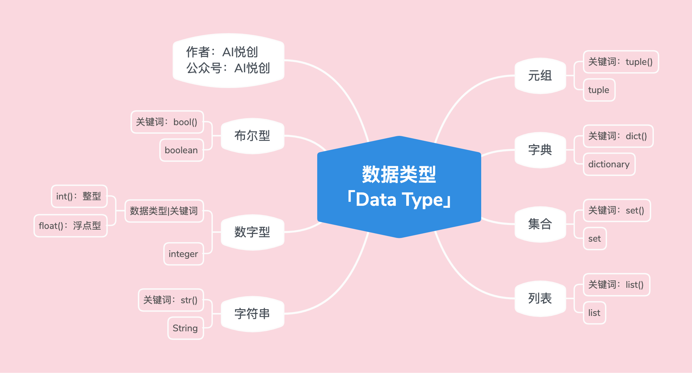

## 1.数字型

### 1.1代码示例

1.整型

```python
int_num = 1
t = type(int_num)
print(int_num)
print("int num type is:>>>", t)
print("直接检测数据类型，并输出:>>>",type(int_num))

#output
1
int num type is:>>> <class 'int'>
直接检测数据类型，并输出:>>> <class 'int'>
```

2.浮点数

```python
float_num = 1.5
t = type(float_num)
print(float_num)
print("int float type is:>>>", t)
print("直接检测数据类型，并输出:>>>",type(float_num))

#output
1.5
float num type is:>>> <class 'float'>
直接检测数据类型，并输出:>>> <class 'float'>
```

## 2.字符串

### 2.1 代码示例

```python
string = "Hello"
t = type(string)
print(string)
print("string type is:>>>", t)
print("直接检测数据类型，并输出:>>>",type(string))

#output
Hello
string type is:>>> <class 'str'>
直接检测数据类型，并输出:>>> <class 'str'>
```

### 2.2 三大特性

1.有序性

​      1.从左到右，下标是从0开始

​      2.从右到左，下标是从-1开始

​      3.引号里出现的都要算一个下标

2.不可变性

​      1.字符串被创建出来后就不允许被改变；

​      2.我们说的不可变，指在代码运行的过程中，不能有对字符串的修改，添加，删除之类的操作

3.任意字符：

​      1.键盘上可以输入的字符，都可以是字符串的元素

​      2.字符放到字符串里，都将成为字符串类型。也就是：里面的每一个元素都可以称为：子字符；

## 3.列表

### 3.1 代码示例

```python
lst = ["Hello LCY", 1, 1.1, ("look", "book", 11), [12, "汉堡包"], True, False]
t = type(lst)

print(lst)
print("lst type is:>>>", t)

print("直接诶监测数据类型，并输出：>>>", type(lst))

#output
['Hello LCY', 1, 1.1, ('look', 'book', 11), [12, '汉堡包'], True, False]
lst type is:>>> <class 'list'>
直接诶监测数据类型，并输出：>>> <class 'list'>
```

### 3.2 三大特性

1.有序性

​      1.从左到右，下标是从0开始

​      2.从右到左，下标是从-1开始

​      3.列表里每个元素都要算一个下标

​            1.比如：`lst = ["aiyuechuang",12];`

​            2.`12`是下标1（从左到右），也是-1（从右到左）；

2.可变性：在程序运行·中，列表可以改变[添加，删除，修改]

3.任意数据类型：这里说的任意数据类型，指的是Python中所有数据类型


::: details Python 所拥有的数据类型


:::

## 4.元组

### 4.1 代码示例

```python
tup = (1, 2, 3, 4, "aiyc", 1.1, [1, 2, 3, 4])
t = type(tup)
print(tup)
print("tup type is:>>>", t)
print("直接检测数据类型，并输出:>>>", type(tup))
#output
(1, 2, 3, 4, 'aiyc', 1.1, [1, 2, 3, 4])
tup type is:>>> <class 'tuple'>
直接检测数据类型，并输出:>>> <class 'tuple'>
```

### 4.2三大特性

1.有序性

​      1.从左到右，下标是从0开始

​      2.从右到左，下标是从-1开始

​            1.如`	tup = ("aiyc", 12)`;

​            2.`12`下标可以是1，也可以是-1

2.不可变性

​      1. 元祖被创建出来以后，就不能被改变；

​      2. 我们说的不可变，指在代码运行的过程中，不能有对元组的修改，添加，删除之类的操作

3.任意数据类型：这里说的任意数据类型，指的是Python中所有数据类型

::: details 


:::


## 5.探究 [列表 & 元组]

::: info 为什么🧐有列表后，还需要元组

列表和元组到底用哪一个呢？

:::

1. 如果存储的数据或数量是可变的，比如社交平台上的一个日志功能，是统计一个用户在一周之内看了哪些用户的帖子——那么则用列表更合适。
2. 如果存储的数据和数量不变，比如你有一个系统（软件），需要返回的是一个地点的经纬度，然后直接传给用户查看——那么肯定选用元组更合适。

- **假设**

    - 假设1：现在有一个仓库，你要向仓库添加物品。仓库很大，现有的物品也很多，你不知道还有没有位置可以存放。此时我们是不是需要聘请一个仓库管理员，这样我们就可以直接问仓库管理员：里面还有哪个位置（是否有位置？）仓库管理员会告诉你，并且你可以直接把你的物品，添加进去。

        问题来了，仓库管理员为什么知道仓库是否有位置？——因为仓库管理员会一直跟踪这个仓库的状态；

    - 假设2：现在有一个原子弹的仓库，仓库创建之后，只能存放一个原子弹。那么，我们需要设立一个专门的人员跟踪：原子弹仓库的状态吗？——不需要，此时在聘请一个就显得浪费了。（不然，领导没油水了～hhhhh）

- **Why？**

    - 用户日志📔，是不是会一直变动（记录📝看了哪些帖子），我们是不是需要有一个类似仓库管理员的“人”，来跟踪并且知道：是否有位置（是否有空间/内存），还需要知道在哪里添加。——列表更合适，因为列表可变。「可变意味着：添加、删除、修改」
        - 元组为什么不合适？——因为，你每当需要添加数据的时候，就得重新创建一个新的元组。（就类似于：你创建原子弹的仓库，肯定是刚刚好可以存放一个，那么你想存放两个的时候，只能重新再创建一个仓库。）
    - 经纬度会改变吗？显然是不会的，那么就不需要一个多余的“人”去跟踪状态。——用列表可以吗？可以！但是没必要。「因为我们不需要仓库管理员」用列表有点浪费资源了。元组的功能刚刚好够用。
    - **<span style="color:orange">我们讲究：不浪费，合适就好。</span>**


## 6. 字典

### 6.1 代码示例

```python
d = {"name": "aiyc", "age": 18, 1:"int", 1.1: 1, "tup":(1,2,3)}
t = type(d)
print(d)
print("d type is:>>>", t)
print("直接检测数据类型，并输出：>>", type(d))
#output
{'name': 'aiyc', 'age': 18, 1: 'int', 1.1: 1, 'tup': (1, 2, 3)}
d type is:>>> <class 'dict'>
直接检测数据类型，并输出：>> <class 'dict'>
```

### 6.2 字典的特性

1.无序性

2.字典的组成： 是由一系列的key 与 value组成。`d = {"key1": "value1", "key2": "value2".....}`

3.key：

​      1.不可变的数据类型，才可以当做字典的key

​      2.比如：字符串，数字， 布尔， 元组

4.value: 任意数据类型（Python中的）

5.可变性：可以添加，修改，删除键对值


## 7.集合

### 7.1 代码示例

```python
set1 = {1, 2, "aiyc", 1.1, "book", (1, 2, 3), False}
t = type(set1)
print(set1)
print("set type is:>>>", t)
print("直接检测数据类型，并输出：>>>", type(set1))
#output
{False, 1, 2, 1.1, 'aiyc', 'book', (1, 2, 3)}
set type is:>>> <class 'set'>
直接检测数据类型，并输出：>>> <class 'set'>
```

### 7.2 集合的特性

1.无序性：集合是没有顺序的

```python
set1 = {1, 2, "aiyc", 1.1, "book", (1, 2, 3), False}
print(set1)
#output
{False, 1, 2, 1.1, 'aiyc', 'book', (1, 2, 3)}
```

::: warning

如果你运行集合很多次，或者其中某一次，集合顺序没有改变，我们也不能说集合是有序的。

Why？你掷骰子，500次都是 6 点，你能说掷骰子是确定性事件吗？——显然是不行的🙅。

:::

2.确定性

      1. 集合里每一个值都是确定的；【也就是需要不可变的数据类型】
      1. 比如：数字型， 字符串， 元组，布尔
      1. 举个例子🌰：列表为什么不行？——列表可变， 所以造成不确定性，故：不行


::: code-tabs

@tab 不可变测试

```python
set1 = {1, 2, "aiyc", 1.1, "book", (1, 2, 3), False}
print(set1)
#output
{False, 1, 2, 1.1, 'aiyc', 'book', (1, 2, 3)}
```

@tab 可变测试

```python
set1 = {1, 2, [1, 2, 3]}
print(set1)

#output
Traceback (most recent call last):
  File "C:\Coder\变量.py", line 1, in <module>
    set1 = {1, 2, [1, 2, 3]}
TypeError: unhashable type: 'list'
```

:::

3.互异性：出现重复的不会报错， 会自动去掉重复的

```python
set1 = {1, 2, 3, 4, 1}
print(set1)
#OUTPUT
{1, 2, 3, 4}
```

4. 可变性： 可以对集合添加，删除数据，但是不能修改输出【:warning:删除是无法指定要删除的元素】


## 8.布尔型

```python
condition = True  #False
print(condition)
print(type(condition))
#output
True
<class 'bool'>
```


## 9. 小测

你好，我是悦创。欢迎来到 Python 核心技术实战，这是你的第一次测试，加油！

1. 以下哪个变量可以做 Python 的变量：C

    A. 01a B. class C. a\_int D. b-int

2. 以下哪个选项不是 Python 的基本数据类型关键字  C

    A. int B.bool C. string D. dict

3. 此题无需在线作答，请在纸上作答后查看答案解析

    语句 `x, y, z = 1, 2, 3` 执行后，变量 y 的值为\_\__\_\_2\_\_\__\_。

4. 此题无需在线作答，请在纸上作答后查看答案解析

    查看变量类型的 Python 内置函数是\_\_\_\_\_type()\_\_\_\_\_\_\_\_\_\_\_。

5. 此题无需在线作答，请在纸上作答后查看答案解析

    请写出该代码的输出结果\_\_\_\_\_'ABC’\_\_\_\_\_\_\_\_。

    ```
    a = 'ABC'
    b = a
    a = 'XYZ'
    print(b)
    ```


