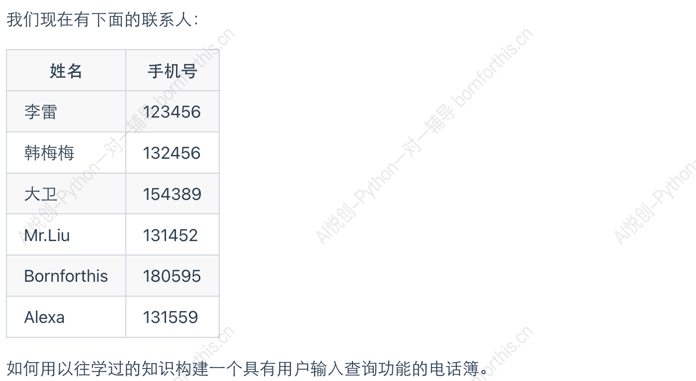
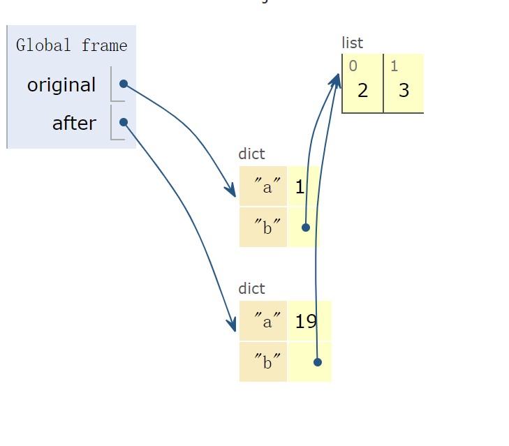
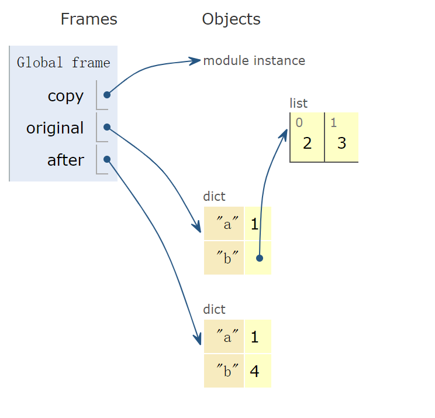

## 如何创建一个电话簿



::: code-tabs

@tab Solution 1:

```python
lst1 = ['李雷', '韩梅梅', '大卫', 'Mr.liu', 'Bornforthis', 'Alexa']
lst2 = ['123456', '132456', '154389', '131452', '180595', '131559']
a = input('请输入你要查询的人的名称：')
num = lst1.index(a)
phone_num = lst2[num]
print(phone_num)
```

@tab Solution 2:

```python
lst1 = ['李雷','123456', '韩梅梅', '132456','大卫', '154389','Mr.liu','131452', 'Bornforthis', '180595','Alexa','131559']
a = input('请输入你要查询的人的名称：')
num = lst1.index(a)
phone_num = lst1[num+1]
print(phone_num)
```

:::

**我们能不能用字典简单快捷地实现这个功能？**

```python
telephone_number = { '李雷':'123456', '韩梅梅': '132456','大卫':'154389','Mr.liu':'131452', 'Bornforthis':'180595','Alexa':'131559'}
search_name = input('Enter your name: ')
phone_num = telephone_number[search_name]
print(phone_num)
```


**引出了我们今天要学习的内容：字典**


## 1. 字典结构

- 用`{}`表示字典

- 字典内每个元素由两个元素组成： key 和 value：`{key1: value1, key2: value2, …}`

- 各项用逗号隔开

```python
telephone_number = { '李雷':'123456', '韩梅梅': '132456','大卫':'154389','Mr.liu':'131452'}
```


- key 和 value 是一一对应的。同一个键只有一个对应的值。
- 键的类型是不可变的。
- value 的类型是任意的。

观察下列代码：

```python
names = {['name']: '李雷', 'numbers': '1234', 'name': 'Shelly', True: 'bool', 2: 'int'}
print(names)
#output
Traceback (most recent call last):
  File "C:\Coder\Lesson\d.py", line 1, in <module>
    names = {['name']: '李雷', 'numbers': '1234', 'name': 'Shelly', True: 'bool', 2: 'int'}
TypeError: unhashable type: 'list'
```

::: info

这里第一个 key ([‘name’])是列表（可变元素），而字典的键是不可变的，所以会报错。

:::


观察下列代码：

```python
names = {'name': '李雷', 'numbers': '1234', 'name': 'Shelly', True: 'bool', 2: 'int'}
print(names)
#output
{'name': 'Shelly', 'numbers': '1234', True: 'bool', 2: 'int'}
```

::: warning 

如果有几个名称类型一模一样的 key 则默认输出最后一个 key 

可以理解为覆盖。

:::


## 2. 字典的创建方法

### 2.1 方法一

根据其他序列创建新字典。

```python
message = [('lilei',98),('hanmeimei',99)]
list_to_list = dict(message)
print(list_to_list)
#output
{'lilei': 98, 'hanmeimei': 99}
```

### 2.2 方法二

根据关键字参数创建新字典

```python
d = dict(lilei = 98, hanmeimei = 99)
print(d)
#output
{'lilei': 98, 'hanmeimei': 99}
```

缺点：key 只能是字符串，不能是数字，元组等等。局限了字典的功能。


## 3. 访问字典数据


```python
grade = {'leon': '98', 'shelly': '99'}
print(grade['leon'])
#output
98
```

但是当 key 不存在时

```python
grade = {'leon': '98', 'shelly': '99', 2: 'int'}
print(grade['Mary'])
#output
Traceback (most recent call last):
  File "C:\Coder\Lesson\d.py", line 2, in <module>
    print(grade['Mary'])
KeyError: 'Mary'
```

会报错。

我们不希望报错，而希望返回空。


### 3.1 .get()

当使用 get 方法时，需要提供一个 key ，方法会返回与该键关联的值。如果键在字典中不存在，get 方法将返回 None，或者你可以指定一个默认值，如果键不存在返回这个默认值。

```python
value = dictionary.get(key, default_value)
```

- key: 你想检索的键
- default_value ：如果键不存在时返回的值。不提供则默认为None。

如下：

```python
grade = {'leon': '98', 'shelly': '99', 2: 'int'}
print(grade.get('Jack', 'ahho'))
#output
ahho
```


## 4. 更新字典数据

字典修改或添加的原则：有则改之，无则加勉 [无则添加]

```python
grade = {'leon': '98', 'shelly': '99', 2: 'int'}
grade['leon'] = '99'
print(grade)
grade['shy'] = 100
print(grade)
#output
{'leon': '99', 'shelly': '99', 2: 'int'}
{'leon': '99', 'shelly': '99', 2: 'int', 'shy': 100}
```


## 5. 字典的删除

元素的删除：

```python
grade = {'leon': '98', 'shelly': '99', 2: 'int'}
del grade['shelly']
print(grade)
#output
{'leon': '98', 2: 'int'}
```

字典的清空（空字典）：

```python
grade = {'leon': '98', 'shelly': '99', 2: 'int'}
grade.clear()
print(grade)
#output
{}
```

字典的消除：

```python
grade = {'leon': '98', 'shelly': '99', 2: 'int'}
del grade
print(grade)
#output
Traceback (most recent call last):
  File "C:\Coder\Lesson\d.py", line 3, in <module>
    print(grade)
NameError: name 'grade' is not defined
```


## 6. 嵌套

将一系列字典存储在列表中，或将列表作为值存储在字典中。

- 字典列表
- 在字典中存储列表
- 在字典中存储字典

::: code-tabs

@tab 字典列表

```python
student1 = {'name1':'John', 'age1':18, 'grade1':99}
student2 = {'name2':'Hank', 'age2':20, 'grade2':100}
student3 = {'name3':'shelly', 'age3':20, 'grade3':120}
students = [student1, student2, student3]
shelly_grade = students[2]['grade3']
print(shelly_grade)
print(students)
#output
120
[{'name1': 'John', 'age1': 18, 'grade1': 99}, {'name2': 'Hank', 'age2': 20, 'grade2': 100}, {'name3': 'shelly', 'age3': 20, 'grade3': 120}]
```


@tab 在字典中存储列表

```python
f_class = {
    'Leon': ['math', 'physics'],
    'shelly': ['biology'],
    'Hank': ['English', 'chemicals']
}
print(f_class)
Leon_favorite = f_class['Leon'][0]
print(Leon_favorite)
#output
{'Leon': ['math', 'physics'], 'shelly': ['biology'], 'Hank': ['English', 'chemicals']}
math
```


@tab 在字典中存储字典

```python
student1 = {"name":'Mike', 'grade': '99', '实验班': True}
print(student1)

class1 = {
    'Mike': {'grade': '99', '试验班': True},
    'Shelly': {'grade': '100', '实验班': False}
}
print(class1)
Shelly = class1['Shelly']['实验班']
print(Shelly)

#output
{'name': 'Mike', 'grade': '99', '实验班': True}
{'Mike': {'grade': '99', '试验班': True}, 'Shelly': {'grade': '100', '实验班': False}}
False
```

:::


## 7. 字典的常见方法

### 7.1 删除字典元素

#### 7.1.1 .pop()

```python
student1 = {"name":'Mike', 'grade': '99', '实验班': True}
print(student1)
student1.pop('实验班')
print(student1)
#output
{'name': 'Mike', 'grade': '99', '实验班': True}
{'name': 'Mike', 'grade': '99'}
```

#### 7.1.2 del

```python
student1 = {"name":'Mike', 'grade': '99', '实验班': True}
print(student1)
del student1['实验班']
print(student1)
#output
{'name': 'Mike', 'grade': '99', '实验班': True}
{'name': 'Mike', 'grade': '99'}
```


### 7.2 .popitem()

用于移除并返回字典中的最后一个键值对。该方法会修改原字典，且删除的是最后插入的键值对。

关键点：

1. 删除最后一项： popitem 从字典中移除并返回最后插入的键对值
2. 返回值：返回一个包含键和值的元组 `(key,value)`

3. 修改原字典：会使原字典发生改变
4. 空字典报错：如果字典为空，调用 popitem 会引发 KeyError 异常

popitem 方法是处理字典中最后插入项的有效工具，特别适用于需要按插入顺序删除和访问键值对的情况。

需要注意的是：如果字典为空，调用此方法会发生异常，因此在使用前最好检查是否为空或使用 try-except进行错误处理。

```python
student1 = {"name":'Mike', 'grade': '99', '实验班': True}
print(student1)
del_val = student1.popitem()
print(del_val)

#output
{'name': 'Mike', 'grade': '99', '实验班': True}
('实验班', True)
{'name': 'Mike', 'grade': '99'}
```


### 7.3 .keys()

返回字典的所有 key 值

```python 
student1 = {"name":'Mike', 'grade': '99', '实验班': True}
print(student1)
print(student1.keys())
print(list(student1.keys()))
#output
{'name': 'Mike', 'grade': '99', '实验班': True}
dict_keys(['name', 'grade', '实验班'])
['name', 'grade', '实验班']
```


### 7.4 .values()

返回字典的所有 value 值

```python
student1 = {"name":'Mike', 'grade': '99', '实验班': True}
print(student1)
print(student1.values())
print(list(student1.values()))
#output
{'name': 'Mike', 'grade': '99', '实验班': True}
dict_values(['Mike', '99', True])
['Mike', '99', True]
```


### 7.5 .items()

```python
student1 = {"name":'Mike', 'grade': '99', '实验班': True}
print(student1)
print(student1.items())
print(list(student1.items()))
#output
{'name': 'Mike', 'grade': '99', '实验班': True}
dict_items([('name', 'Mike'), ('grade', '99'), ('实验班', True)])
[('name', 'Mike'), ('grade', '99'), ('实验班', True)]
```

对比这两种方法：

:::code-tabs 

@tab 创建字典的方法一

```python
message = [('lilei',98),('hanmeimei',99)]
list_to_list = dict(message)
print(list_to_list)
#output
{'lilei': 98, 'hanmeimei': 99}
```

@tab .items()

```python
message = {'lilei': 98, 'hanmeimei': 99}
print(list(message.items()))
#output
[('lilei', 98), ('hanmeimei', 99)]
```

:::

通过输出结果，可发现这两种方法互为逆方法


### 7.6 判断字典是否存在某值

判断 key 在不在字典中

::: code-tabs

@tab 默认情况是判断 key 在不在字典

```python
message = {'lilei': 98, 'hanmeimei': 99}
print('lilei' in message)
#output
True
```

@tab 也可以实现纯粹的判断

```python
message = {'lilei': 98, 'hanmeimei': 99}
print('lilei' in message.keys())
#output
True
```

:::

判断 value 在不在字典中

```python
message = {'lilei': 98, 'hanmeimei': 99}
print(98 in message.values())
#output
True
```


### 7.7 .update()

.update()是字典对象的一个重要方法，它允许你更新字典的内容，通过添加新的键值对或修改现有的键值对。


更新字典：你可以使用另一个字典来更新一个字典。这将添加新的键值对到原始字典中，并覆盖任何现有的键的值。

```python
student1 = {"name":'Mike', 'grade': '99', '实验班': True}
more_info = {'age': 19, 'grade': 100}
student1.update(more_info)
print(student1)
#output
{'name': 'Mike', 'grade': 100, '实验班': True, 'age': 19}
```

也可以使用关键字参数来进行修改

```python
student1 = {"name":'Mike', 'grade': '99', '实验班': True}
student1.update(grade=100, 实验班 = False)
print(student1)
#output
{'name': 'Mike', 'grade': 100, '实验班': False}
```

也可以传递一个可迭代对象，比如元组列表，其中每个元素都是一个键对值。

```python
student1 = {"name":'Mike', 'grade': '99', '实验班': True}
data_list = [('age', 20), ('class', 1), ('gender', 'male')]
student1.update(data_list)
print(student1)
#output
{'name': 'Mike', 'grade': '99', '实验班': True, 'age': 20, 'class': 1, 'gender': 'male'}
```


## 8. 小试牛刀

获取用户输入两组数据：列表、元组

不能使用 eval

对目标字典进行操作。

TODO: 列表数组为 key，元组数据为 Value

`dict1 = {'a': 1, 'b': 2, 'c': 3, 'd': 4, 'e': 5, 'f': 6}`

Eneter your list:>>>a/b/c

Eneter your value:>>>13-14-19

```python
key = input('Enter your list:>>>').replace(' ', '').split('/')
value = input('Enter your value:>>>').replace(' ', '').split('-')
zipped = zip(key, value)
dictionary = dict(zipped)
goal_dic = {'a': 1, 'b': 2, 'c': 3, 'd': 4, 'e': 5, 'f': 6}
dictionary.update(goal_dic)
print(dictionary)
#output
Enter your list:>>>a/b/c
Enter your value:>>>13-14-19
{'a': 1, 'b': 2, 'c': 3, 'd': 4, 'e': 5, 'f': 6}
```


## 9. 字典的排序

### 9.1 sorted()

```python
data = {'a': 1, 'b': 2, 'd': 4, 'c': 3}
sorted_data = sorted(data.items())
print(sorted_data)
#output
[('a', 1), ('b', 2), ('c', 3), ('d', 4)]
```

以字母顺序来排序。

### 9.2 lambda

```python
data = {'a': 5, 'b': 2, 'd': 4, 'c': 3}
sorted_data = sorted(data.items())
print(sorted_data)
#output
[('a', 5), ('b', 2), ('c', 3), ('d', 4)]
```

上面这个例子，我们希望以数字顺序来排序。

**引入lambda。**

以 value 排序：

```python
data = {'a': 5, 'b': 2, 'd': 4, 'c': 3}
sorted_data = sorted(data.items(), key=lambda item: item[1])
print(sorted_data)
#output
[('b', 2), ('c', 3), ('d', 4), ('a', 5)]
```

以 key 排序：

```python
data = {'a': 5, 'b': 2, 'd': 4, 'c': 3}
sorted_data = sorted(data.items(), key=lambda item: item[0])
print(sorted_data)
#output
[('a', 5), ('b', 2), ('c', 3), ('d', 4)]
```


拓展：

```python
lst = [('a', 1, 'c3'), ('b', 2, 'a1'), ('c', 3, 'b2')]
sorted_data = sorted(lst, key=lambda item: item[2])
print(sorted_data)
#output
[('b', 2, 'a1'), ('c', 3, 'b2'), ('a', 1, 'c3')]
```

为什么这里不需要 .items() 了？

根据7.5里面的对比我们发现：

::: important

.items() 可以把字典`{‘a’:1,’b’:2}`的形式转换成元组列表形式`[('a',1),('b',2)]`。而这里已经给的是元组列表的形式了。不需要再用 .items() 进行转换了。

:::

### 9.3 例题

#### 1.

**描述**：给定一个字典，其中键是学生的名字，值是一个元组，包含学生的年龄和他们的成绩。编写一个程序，该程序返回按成绩（grade）从小到大排序的学生名单。

**示例输入**：

```python
students = {
    'Alice': (20, 85), # name: (age, grade)
    'Bob': (22, 90),
    'Charlie': (21, 88)
}
```

**示例输出**：

```python
['Alice', 'Charlie', 'Bob']
```


Solution:

```python
students = {
    'Alice': (20, 85), # name: (age, grade)
    'Bob': (22, 90),
    'Charlie': (21, 88)
}
sorted_data = sorted(students.items(), key=lambda item: item[1][1])
print(list(dict(sorted_data).keys()))
#output
['Alice', 'Charlie', 'Bob']
```


## 10. 字典的深浅拷贝

### 10.1 浅拷贝

```python
original = {'a': 1, 'b': [2, 3]}
after = original.copy()
after['a'] = 19
print(f'After: {after}')
print(f'Original: {original}')
#output
After: {'a': 19, 'b': [2, 3]}
Original: {'a': 1, 'b': [2, 3]}
```




### 10.2 深拷贝

```python
import copy

original = {'a': 1, 'b': [2, 3]}
after = copy.deepcopy(original)
after['b'] = 4
print(f'After: {after}')
print(f'Original: {original}')
#output
After: {'a': 1, 'b': 4}
Original: {'a': 1, 'b': [2, 3]}
```





- **浅拷贝**：复制对象，但不复制对象中的嵌套对象。修改浅拷贝的嵌套对象会影响到原始对象。

- **深拷贝**：递归复制对象及其所有嵌套对象。修改深拷贝的任何部分都不会影响原始对象。

### 10.3 例题

**描述**：给定两个字典，编写一个程序，将这两个字典合并成一个。如果同一个键在两个字典中都有，则它的值应为两个字典中的值相加。假设字典中的值都是整数。

**示例输入**：

```python
dict1 = {'a': 1, 'b': 2, 'c': 3}
dict2 = {'b': 3, 'c': 4, 'd': 5}
```

**示例输出**：

```python
{'a': 1, 'b': 5, 'c': 7, 'd': 5}
```

Solution:

```python
dict1 = {'a': 1, 'b': 2, 'c': 3}
dict2 = {'b': 3, 'c': 4, 'd': 5}
merged_dict = dict1.copy()

for key, value in dict2.items():
    if key in merged_dict:
        merged_dict[key] += value
    else:
        merged_dict[key] = value
print(merged_dict)
print(dict1)
```

