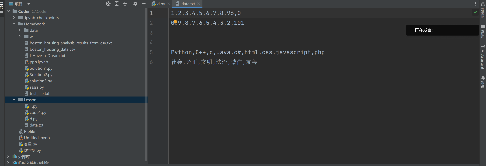
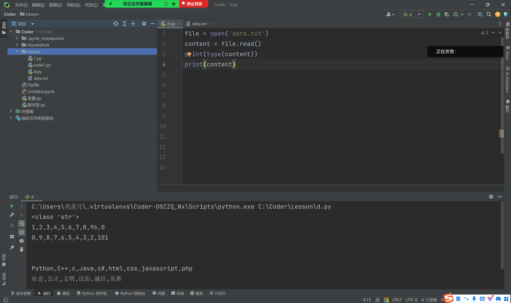
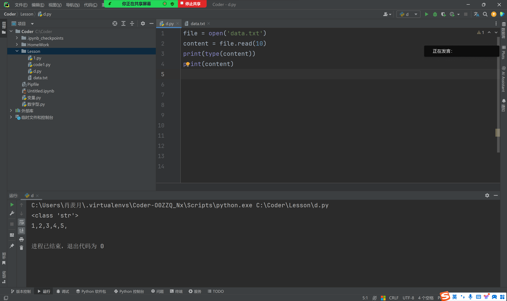
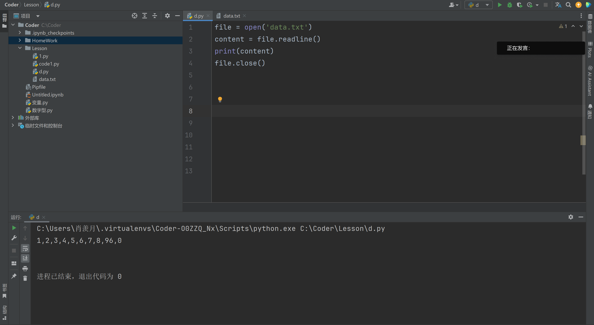
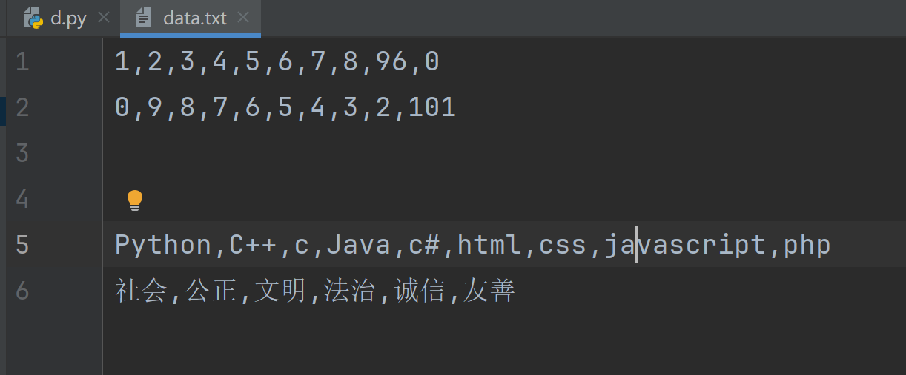
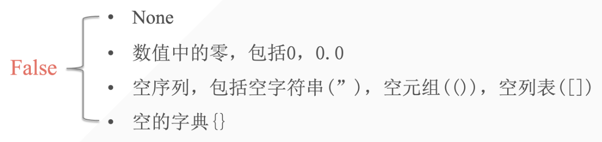

## 1. 文件的基本用法

### 1.1 创建数据

#### 1.1.1 open()



创建一个 .txt 文件来存储数据，如图上所示…



重新创建一个 .py 文件，想要访问刚刚创建的 .txt 文件，方法如上所示。

还可以观察到，print 文件内容问==字符串==类型。


#### 1.1.2 输出文件中所有数字的和

```python
file = open('data.txt')
content = file.read()
lst = content.split(',')
summary = 0
for i in lst:
    if i.isdigit():
        summary += int(i)
    else:
        continue
print(summary)
```

为何要有第三行把字符串转化成列表？


### 1.2 read

#### 1.2.1 可以指定获取字符



还可以用 read 指定获取多少个字符。

#### 1.2.2 缺点

- 读取文件的所有数据，所以读取文件过大时，系统会崩溃
- 读取一些不必要的数据（如分割数据的`‘,’`，空格等等）


### 1.3 close

文件有打开，就要有关闭。不然会影响后续代码而报错。

```python
file = open('data.txt')
content = file.read()
print(content)
file.close()
```

::: info

文件的所有读取操作必须在 `.close()` 前完成

:::

## 2.  文件以行输出

### 2.1 readline

#### 2.1.1 基本代码

**readline：只输出一行代码。**





#### 2.1.2 输出多行

```python
file = open('data.txt')
content = file.readline()
print(content)
content = file.readline()
print(content)
content = file.readline()
print(content)
content = file.readline()
print(content)
content = file.readline()
print(content)
content = file.readline()
print(content)
content = file.readline()
print(content)
content = file.readline()
print(content)
file.close()
```

当我们输出多行，结果会是…..:

```python
1,2,3,4,5,6,7,8,96,0

0,9,8,7,6,5,4,3,2,101


Python,C++,c,Java,c#,html,css,javascript,php

社会,公正,文明,法治,诚信,友善


进程已结束，退出代码为 0
```

为什么会如此多的空行！

- 一个是因为原文件本身，在一行数据结束后面有未填满的空格，`readline` 识别出了新的一行；
- 另一个因为 `print()` 本身有换行的特性

Solution：

```python
file = open('data.txt')
content = file.readline()
print(content, end='')
content = file.readline()
print(content, end='')
content = file.readline()
print(content, end='')
content = file.readline()
print(content, end='')
content = file.readline()
print(content, end='')
content = file.readline()
print(content, end='')
file.close()

#output
1,2,3,4,5,6,7,8,96,0
0,9,8,7,6,5,4,3,2,101


Python,C++,c,Java,c#,html,css,javascript,php
社会,公正,文明,法治,诚信,友善
进程已结束，退出代码为 0
```


### 2.2 循环输出

**Solution 01：**

我们先使用 while 循环：

```python
file = open('data.txt')
while True:
    line = file.readline()
    if not line:
        break
    print(line, end='')
#output
1,2,3,4,5,6,7,8,96,0
0,9,8,7,6,5,4,3,2,101


Python,C++,c,Java,c#,html,css,javascript,php
社会,公正,文明,法治,诚信,友善
```

::: important

在布尔值里面有提到过：

在条件判断里面，如果类型为空，会强制转换成 False。

上面代码中使用一个 if 条件判断：

1. 如果 line 中有值则不为 False 而为 True ，not True = False ，==`if False` 是一个根本不会执行的代码==；
2. 如果 line 中没有值则为 False ，`if not False` 则为 `if True` ，这种情况下执行 if 里面的代码 break。

:::

再使用 for 循环：

```python
file = open('data.txt')
for _ in range(6):
    line = file.readline()
    if not line:
        break
    print(line, end='')
file.close()
```

但我们有时候不知道文件多少行的情况下：

```python
file = open('data.txt')
for line in file:
    line = line.strip()
    print(line)
```


**Solution 02：**

```python
file = open('data.txt')
line = file.readline()
while line:
    print(line, end='')
    line = file.readline()
#output
1,2,3,4,5,6,7,8,96,0
0,9,8,7,6,5,4,3,2,101


Python,C++,c,Java,c#,html,css,javascript,php
社会,公正,文明,法治,诚信,友善
```


