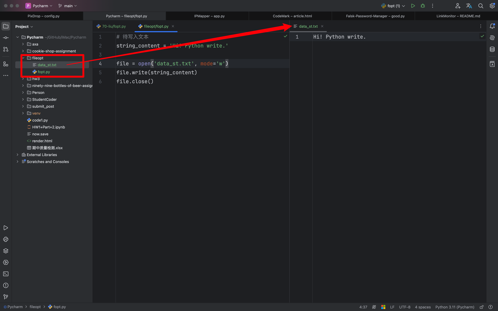
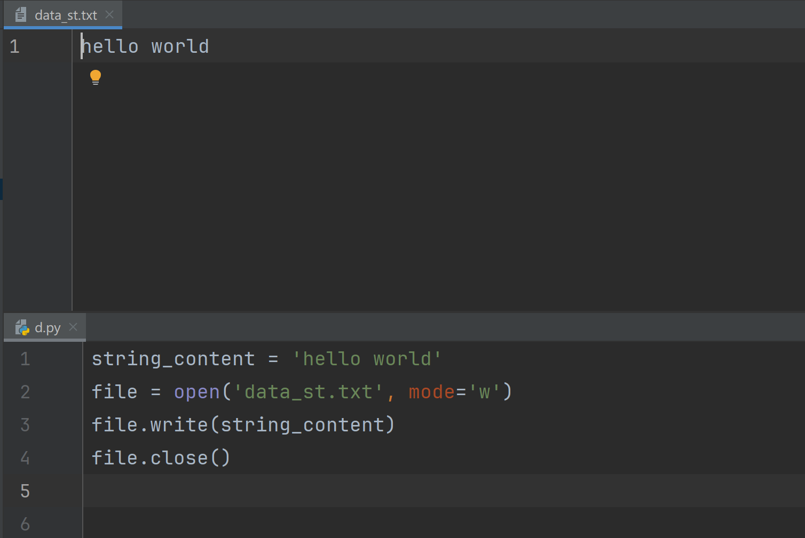
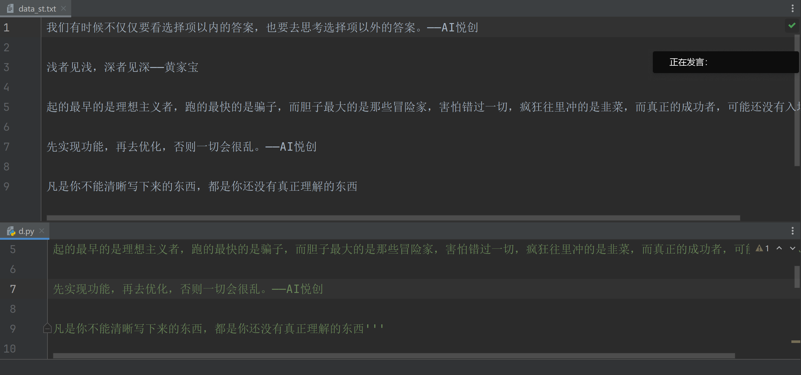
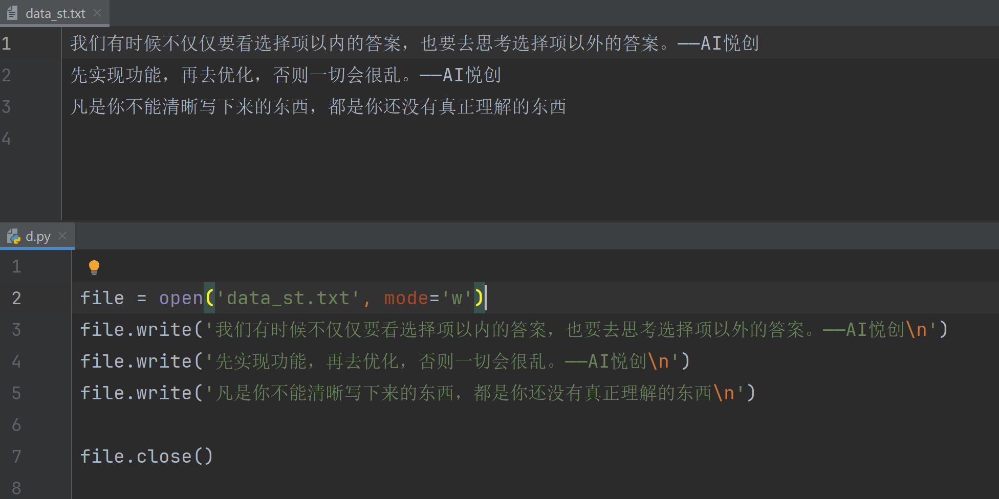
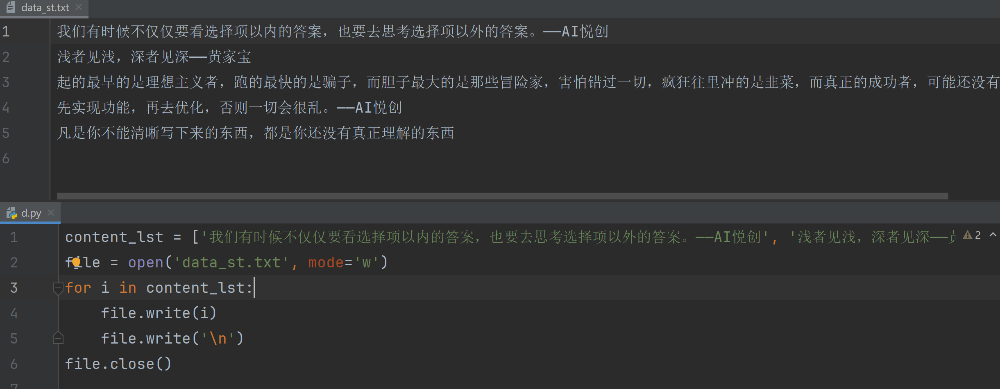
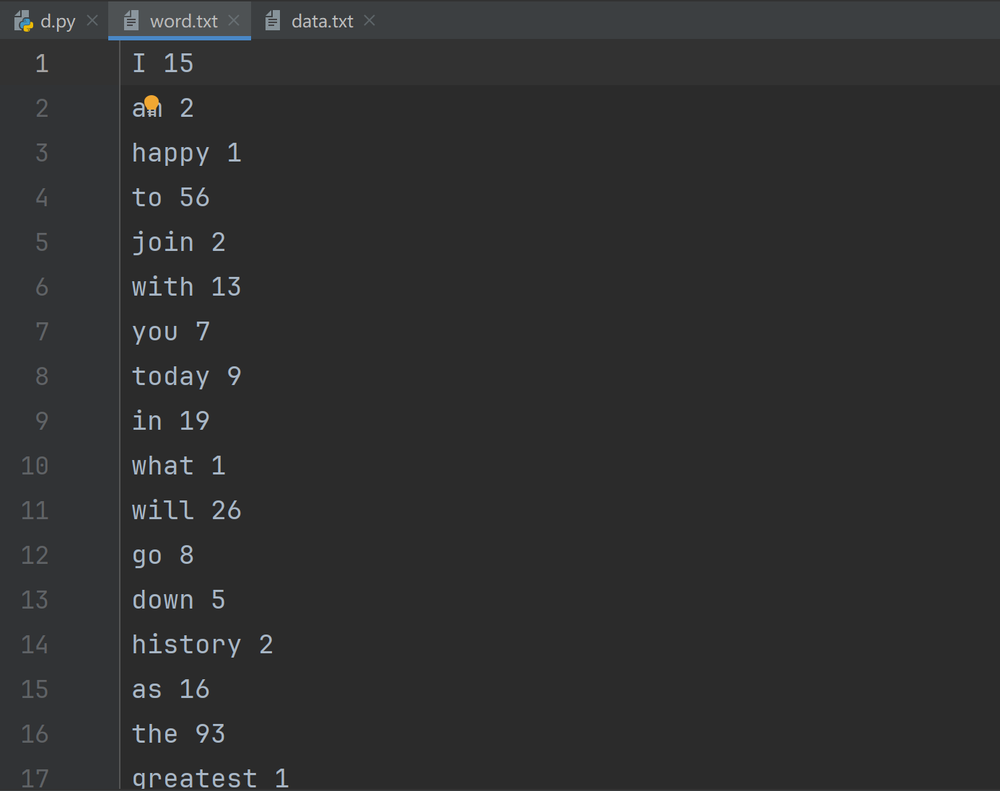
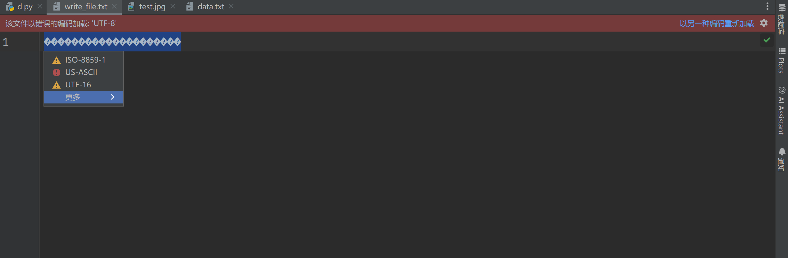
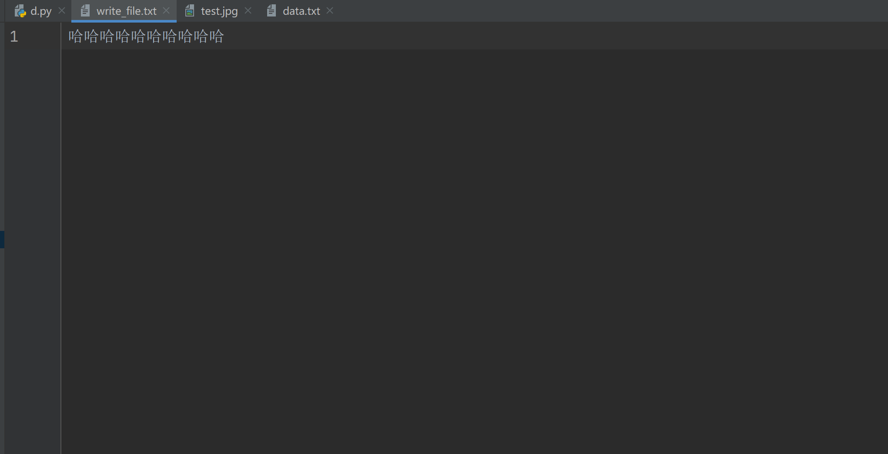
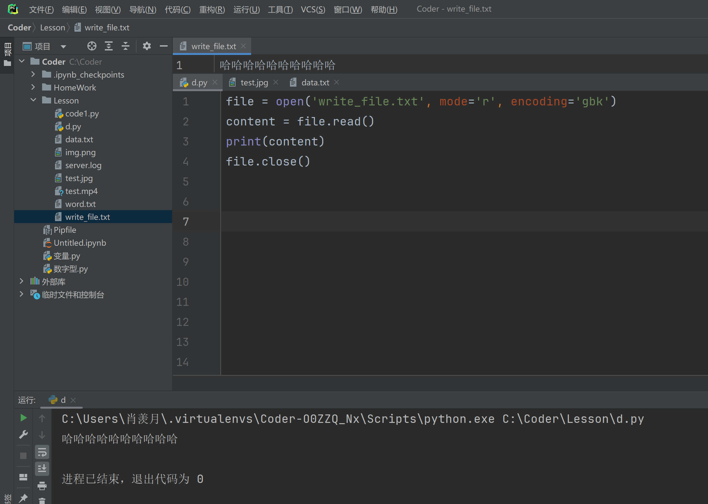

## 1. 文件的基本用法

### 1.1 创建数据

#### 1.1.1 open()


创建一个 .txt 文件来存储数据，如图上所示…


重新创建一个 .py 文件，想要访问刚刚创建的 .txt 文件，方法如上所示。

还可以观察到，print 文件内容问==字符串==类型。


#### 1.1.2 输出文件中所有数字的和

```python
file = open('data.txt')
content = file.read()
lst = content.split(',')
summary = 0
for i in lst:
    if i.isdigit():
        summary += int(i)
    else:
        continue
print(summary)
```

为何要有第三行把字符串转化成列表？


### 1.2 read

#### 1.2.1 可以指定获取字符


还可以用 read 指定获取多少个字符。

#### 1.2.2 优缺点

##### 1.2.2.1 优点

1. **简单易用：** `read()` 方法使用非常简单，不需要复杂的循环或条件语句。只需调用一次 `read()` 方法，即可将整个文件的内容读取到一个字符串中。~~这种简单性使得它非常适合快速读取小文件或配置文件的内容。~~
2. **便于一次性读取和处理（配置）小文件：** 对于较小的文件（例如只有几 KB 到几十 KB 的文件），使用 `read()` 方法可以快速方便地获取文件的所有内容。然后，可以一次性对这些数据进行处理，而无需担心内存占用问题。
3. **适用于不需要逐行处理的场景：** 如果文件的内容是一个整体而不需要逐行处理（例如 JSON、XML、HTML 文件或任何其他格式化文本），`read()` 方法可以一次性读取整个文件内容并直接传递给解析器或处理函数。
4. **方便字符串操作：** 由于 `read()` 返回的是一个字符串，Python 的字符串方法（如 `split()`、`replace()`、`find()` 等）可以直接用于处理文件内容。这样，在读取文件后可以立即进行字符串操作，而不必担心文件内容的逐行处理或分割。
6. **兼容性好：** `read()` 方法适用于各种文件类型（文本文件、二进制文件等），并且兼容所有 Python 版本。
7. **总结：** `read()` 方法在处理小文件时非常高效和方便，适合快速读取和处理文件的所有内容。当文件内容是一个整体且需要一次性处理时，`read()` 方法显得尤为有用。在使用场景中，了解文件大小和处理需求，可以帮助选择合适的文件读取方法。

##### 1.2.2.2 缺点

1. **内存消耗大：** `read()` 方法会将整个文件的内容一次性读取到内存中。如果文件非常大，这会占用大量内存，可能导致内存溢出或系统性能下降。在处理大型文件（例如几百 MB 或更大的文件）时，使用 `read()` 是非常不明智的，因为它会导致程序的内存使用量急剧上升，甚至可能崩溃。

    现如今的数据文件量都很大，所以在实际应用中不推荐使用 `read()`。

    辅助例子🌰：「当你电脑打开很大的文件时，有时候需要好一会才能打开，稍微差点的电脑都有可能卡死～电脑卡死之后，只能强制关闭或者无限期的等待⌛️，但你打开的文件的数据有可能就丢失了。」

2. **缺乏对大型文件的处理控制：** 当使用 `read()` 方法时，程序没有机会在读取文件的过程中对数据进行任何处理。整个文件在读取之前必须被完全加载到内存中，这意味着在大文件场景下，无法分批处理文件内容。

3. **无法逐行处理数据：** `read()` 返回整个文件的内容作为一个字符串。如果文件内容是逐行的记录（例如日志文件或 CSV 文件），那么使用 `read()` 读取后需要手动对字符串进行拆分和处理。而使用其他方法（如 `readline()` 或 `for line in file`）可以逐行读取文件，允许在读取的同时进行处理。

4. **不适合流式读取：** `read()` 不是一种流式读取的方法。流式读取指的是在需要的时候读取文件的部分内容，并进行相应的处理，而不是一次性读取整个文件的内容。这对于需要实时处理大数据文件的应用（如数据分析、日志处理）非常重要。

5. **文件结束符（EOF）处理问题：** 使用 `read()` 读取文件后，如果需要继续重复读取文件或操作文件的指针，需要手动重置文件指针到文件开头或指定位置。否则，再次调用读取方法可能会返回空值或抛出异常。比如我们使用过一遍 `read()`来读取特定文件后，如果我们还想使用 `read()`来再读取一遍这个文件将不成功，因为 `read()`只能成功读取一遍不能重复读取。

### 1.3 close

文件有打开，就要有关闭。不然会影响后续代码而报错。

```python
file = open('data.txt')
content = file.read()
print(content)
file.close()
```

::: info

文件的所有读取操作必须在 `.close()` 前完成

:::

## 2.  文件以行输出

### 2.1 readline

#### 2.1.1 基本代码

**readline：只输出一行代码。**


#### 2.1.2 输出多行

```python
file = open('data.txt')
content = file.readline()
print(content)
content = file.readline()
print(content)
content = file.readline()
print(content)
content = file.readline()
print(content)
content = file.readline()
print(content)
content = file.readline()
print(content)
content = file.readline()
print(content)
content = file.readline()
print(content)
file.close()
```

当我们输出多行，结果会是…..:

```python
1,2,3,4,5,6,7,8,96,0

0,9,8,7,6,5,4,3,2,101


Python,C++,c,Java,c#,html,css,javascript,php

社会,公正,文明,法治,诚信,友善


进程已结束，退出代码为 0
```

为什么会如此多的空行！

- 一个是因为原文件本身，在一行数据结束后面有未填满的空格，`readline` 识别出了新的一行；
- 另一个因为 `print()` 本身有换行的特性

Solution：

```python
file = open('data.txt')
content = file.readline()
print(content, end='')
content = file.readline()
print(content, end='')
content = file.readline()
print(content, end='')
content = file.readline()
print(content, end='')
content = file.readline()
print(content, end='')
content = file.readline()
print(content, end='')
file.close()

#output
1,2,3,4,5,6,7,8,96,0
0,9,8,7,6,5,4,3,2,101


Python,C++,c,Java,c#,html,css,javascript,php
社会,公正,文明,法治,诚信,友善
进程已结束，退出代码为 0
```


#### 2.1.3 readline() 的优缺点

##### 2.1.3.1 优点

1. **逐行读取**：`readline()` 每次只读取一行，这对于大文件特别有用。因为它不会一次性将整个文件加载到内存中，而是逐行处理，节省内存空间。

2. **易于控制**：使用 `readline()` 可以更好地控制读取的内容。你可以逐行读取文件，进行必要的处理或检查条件，决定是否继续读取下一行。

3. **便于处理特定格式的数据**：对于逐行格式化的数据文件（如日志文件、CSV文件等），`readline()` 非常方便，可以按行读取并处理每行数据。

4. **简单易用**：`readline()` 的使用方法非常简单，尤其适合初学者。你只需要调用 `file.readline()` 就能读取文件的一行内容。


##### 2.1.3.2 缺点

1. **速度较慢**：与一次性读取整个文件的方法（如 `readlines()` 或 `read()`）相比，`readline()` 的速度可能较慢，尤其是在需要频繁调用的情况下。这是因为每次调用 `readline()` 都会进行一次 I/O 操作。

2. **容易出现无限循环**：如果在读取文件时没有正确处理结束条件（如到达文件末尾），可能会导致无限循环，特别是在文件内容未知或文件较大时。

3. **不适用于所有场景**：对于需要随机访问文件内容或处理非文本文件的情况，`readline()` 并不合适。它主要用于顺序读取文本文件。

4. **需手动处理换行符**：`readline()` 读取的每一行末尾通常包含一个换行符（`\n`），在处理数据时需要手动去除这些换行符，可能会增加额外的代码和复杂性。

总结来说，`readline()` 适用于逐行读取和处理大文件的场景，能够有效节省内存并提供更好的读取控制，但它可能会导致速度较慢并需要额外处理换行符。根据具体应用场景，选择合适的文件读取方法是非常重要的。


### 2.2 循环输出

**Solution 01：**

我们先使用 while 循环：

```python
file = open('data.txt')
while True:
    line = file.readline()
    if not line:
        break
    print(line, end='')
#output
1,2,3,4,5,6,7,8,96,0
0,9,8,7,6,5,4,3,2,101


Python,C++,c,Java,c#,html,css,javascript,php
社会,公正,文明,法治,诚信,友善
```

::: important

在布尔值里面有提到过：

在条件判断里面，如果类型为空，会强制转换成 False。

上面代码中使用一个 if 条件判断：

1. 如果 line 中有值则不为 False 而为 True ，not True = False ，==`if False` 是一个根本不会执行的代码==；
2. 如果 line 中没有值则为 False ，`if not False` 则为 `if True` ，这种情况下执行 if 里面的代码 break。

:::

再使用 for 循环：

```python
file = open('data.txt')
for _ in range(6):
    line = file.readline()
    if not line:
        break
    print(line, end='')
file.close()
```

但我们有时候不知道文件多少行的情况下：

```python
file = open('data.txt')
for line in file:
    line = line.strip()
    print(line)
```


**Solution 02：**

```python
file = open('data.txt')
line = file.readline()
while line:
    print(line, end='')
    line = file.readline()
#output
1,2,3,4,5,6,7,8,96,0
0,9,8,7,6,5,4,3,2,101


Python,C++,c,Java,c#,html,css,javascript,php
社会,公正,文明,法治,诚信,友善
```


### 2.3 readlines

```python
file = open('data.txt')
content = file.readlines()
print(content)
file.close()
```

输出形式：列表

```python
['1,2,3,4,5,6,7,8,96,0\n', '0,9,8,7,6,5,4,3,2,101\n', '\n', '\n', 'Python,C++,c,Java,c#,html,css,javascript,php\n', '社会,公正,文明,法治,诚信,友善']
```

#### 2.3.1 优缺点

优点：

1. **易于使用**： `readlines`方法使用简单，可以快速的将文本中所有的内容读取到内存中，这对于小型文件或简单的文件处理任务非常方便。
2. **按行处理**：返回列表按行分割文件内容，方便逐行处理文件数据。例如处理csv文件或者日志文件的时候可以逐行进行解析和处理。
3. **代码简介**：相比于使用循环处理读取文件， `readlines`是代码更加简洁，因为它一行就可以读取所有行。

缺点：

1. **高内存消耗**：`readlines`会将文件的所有行一次性加载到内存中，如果内存非常大（几个G）会导致内存消耗过大甚至溢出。因此它不适合处理非常大的文件。
2. **潜在的性能问题**：对于特别大的文件， `readlines`的性能可能比较差，需要花费额外的时间将文件内容加载到内存中并转换为一个列表。

适用场景：

- **适合：** 适合小型文件处理，或者明确知道文件大小不会影响内存的情况下。适合快速读取文件并逐行处理文件数据的简单场景。
- **不适合：**大型文件和内存敏感并不适合 `readlines`。更好的选择是使用 for 循环或者 readline 逐行读取，或者使用 file 对象作为迭代器。

### 2.4 题目

**编程题目：日志文件分析**

**题目描述：**

有一个名为 `server.log` 的日志文件，文件中的每一行记录了服务器的访问日志。每一行的格式如下：

```
<IP地址> - - [<访问日期>] "GET <URL> HTTP/1.1" <状态码> <返回字节数>
```

示例内容：
```
192.168.1.1 - - [28/Aug/2024:10:23:11 +0000] "GET /index.html HTTP/1.1" 200 1043
192.168.1.2 - - [28/Aug/2024:10:24:03 +0000] "GET /about.html HTTP/1.1" 404 0
192.168.1.3 - - [28/Aug/2024:10:25:45 +0000] "GET /contact.html HTTP/1.1" 200 512
192.168.1.1 - - [28/Aug/2024:10:26:50 +0000] "GET /index.html HTTP/1.1" 200 1043
```

请你编写一个Python程序，读取 `server.log` 文件，并完成以下任务：

1. **统计每个IP地址的访问次数**，并将结果按访问次数从高到低排序。
2. **统计返回状态码为404的URL及其出现的次数**，并将结果按出现次数从高到低排序。
3. **计算返回状态码为200的总字节数**。

**输入文件：** `server.log`

**输出要求：**

1. 输出每个IP地址的访问次数，格式如下：
   ```
   IP地址 访问次数
   ```
   
2. 输出状态码为404的URL及其出现的次数，格式如下：
   ```
   URL 出现次数
   ```

3. 输出状态码为200的总字节数，格式如下：
   ```
   总字节数: <字节数>
   ```

**示例输出：**

```
192.168.1.1 2
192.168.1.3 1
192.168.1.2 1

/about.html 1

总字节数: 1555
```

**编程要求：**

- 请使用 `readlines()` 方法读取文件内容。
- 你的程序应具有良好的可读性，并包含适当的注释。

**Solution:**

```python
log_file = 'server.log'
ip_dict = {}
url_404_dict = {}
total_bytes_200 = 0

file = open(log_file)
lines = file.readlines()
file.close()
for line in lines:
    parts = line.split()
    ip_address = parts[0]
    status_code = parts[8]
    url = parts[6]
    bytes_returned = parts[9]
    if ip_address in ip_dict:
        ip_dict[ip_address] += 1
    else:
        ip_dict[ip_address] = 1

    if status_code == '404':
        if url in url_404_dict:
            url_404_dict[url] += 1
        else:
            url_404_dict[url] = 1
    elif status_code == '200':
        total_bytes_200 += int(bytes_returned)

sorted_ip_dict = sorted(ip_dict.items(), key=lambda item: item[1], reverse=True)
sorted_url_404_dict = sorted(url_404_dict.items(), key=lambda item: item[1], reverse=True)
for i in sorted_ip_dict:
    print(i[0], i[1])
for i in sorted_url_404_dict:
    print(i[0], i[1])
print(f'总字节数：{total_bytes_200}')
```


## 3. 模式

```python
file = open('data.txt', mode='r') # 默认是读取
```

::: info

按住 ctrl ，点击 open ，会发生什么？

:::

### 3.1 所有文件模式表

| 模式 | 英文解释                                                     | 中文翻译                             |
| ---- | ------------------------------------------------------------ | ------------------------------------ |
| 'r'  | open for reading (default)                                   | 以读取方式打开（默认）               |
| 'w'  | open for writing, truncating the file first                  | 以写入方式打开，先清空文件           |
| 'x'  | create a new file and open it for writing                    | 创建一个新文件并以写入方式打开       |
| 'a'  | open for writing, appending to the end of the file if it exists | 以写入方式打开，若文件存在则追加内容 |
| 'b'  | binary mode                                                  | 二进制模式                           |
| 't'  | text mode (default)                                          | 文本模式（默认）                     |
| '+'  | open a disk file for updating (reading and writing)          | 打开磁盘文件用于更新（读写）         |

### 3.2 读取模式（r）

以读取模式打开文件，文件必须存在，否则会输出 `FileNotFoundError`

注意：如果在 open 中不标注模式时默认为读取模式。

:::code-tabs

@tab 文件存在并正确读取

```python
file = open('data.txt', mode='r') # 默认是读取
content = file.read()
print(content)
file.close()

#output
1,2,3,4,5,6,7,8,96,0
0,9,8,7,6,5,4,3,2,101


Python,C++,c,Java,c#,html,css,javascript,php
社会,公正,文明,法治,诚信,友善
```

@tab 不写 mode，等价代码

```python
file = open('data.txt') # 默认是读取
content = file.read()
print(content)
file.close()

#output
1,2,3,4,5,6,7,8,96,0
0,9,8,7,6,5,4,3,2,101


Python,C++,c,Java,c#,html,css,javascript,php
社会,公正,文明,法治,诚信,友善
```

@tab 文件不存在而报错

```python
file = open('datas.txt') # 默认是读取
content = file.read()
print(content)
file.close()

#output
Traceback (most recent call last):
  File "C:\Coder\Lesson\d.py", line 1, in <module>
    file = open('datas.txt') # 默认是读取
FileNotFoundError: [Errno 2] No such file or directory: 'datas.txt'
```

:::

### 3.3 写入模式（w）

以写模式打开文件：

- 如果文件不存在，会创建一个新文件；
- 如果文件存在，先清空文件内容，然后写入新内容。

#### 3.3.1 文件不存在的情况

1. 把字符串 `string_content = 'Hi! python write'`写入文件 `data_st.txt`

```python
string_content = 'Hi! Python write.'
file = open('data_st.txt', mode='w')
file.write(string_content)
file.close()

#output
弹出一个新文件 data_st.txt
```

执行上面代码后，会在当前代码的同目录（同路径）下创建文件 `data_st.txt`并写入内容 `HI！Python write`



#### 3.3.2 文件存在的情况

上面已经创建了新文件，并已经写入相应内容。

接下来，我们操作文件 `data_st.txt`并写入新内容。



可以看到， hello world 覆盖了原来的 Hi! Python write.

#### 3.3.3 写入多行内容

1. 待写内容：

```python
我们有时候不仅仅要看选择项以内的答案，也要去思考选择项以外的答案。——AI悦创

浅者见浅，深者见深——黄家宝

起的最早的是理想主义者，跑的最快的是骗子，而胆子最大的是那些冒险家，害怕错过一切，疯狂往里冲的是韭菜，而真正的成功者，可能还没有入场。

先实现功能，再去优化，否则一切会很乱。——AI悦创

凡是你不能清晰写下来的东西，都是你还没有真正理解的东西
```

2. 代码实现：

```python
string_content = '''我们有时候不仅仅要看选择项以内的答案，也要去思考选择项以外的答案。——AI悦创

浅者见浅，深者见深\n——黄家宝

起的最早的是理想主义者，跑的最快的是骗子，而胆子最大的是那些冒险家，害怕错过一切，疯狂往里冲的是韭菜，而真正的成功者，可能还没有入场。

先实现功能，再去优化，否则一切会很乱。——AI悦创

凡是你不能清晰写下来的东西，都是你还没有真正理解的东西'''

file = open('data_st.txt', mode='w')
file.write(string_content)
file.close()
```

output:



3. 或者，我们可以一行一行来写入文件：
    

要使用转义字符 `\n`来实现换行，不然会连成一行存储进文件。

4. 思考：

当你看到一行一行写入时，有可能会想：一行一行写入没必要编写，也没必要学习。但是需要注意的是：上面多行写入，虽然看起来麻烦，且充满了“不必要”，但是在使用循环写入时，就非常有必要注意写入的内容是否有换行等。（也就是，写入的格式是否符合我们的预期）




::: warning

`write`只接受字符串，不接受其他的类型！

:::


#### 3.3.4 题目

读取文件 I have a dream 的内容，并统计每个单词出现的次数。把结果存储到文件（result.txt）当中。

第一列是单词，第二列是单词对应出现的次数。

::: details 先回忆一下~

```python
file = open('data.txt')
content = file.read().replace(',', '').replace('.', '').replace('"', '').replace('!', '').split()
file.close()
word_dict = {}
for i in content:
    if i in word_dict:
        word_dict[i] += 1
    else:
        word_dict[i] = 1

file2 = open('word.txt', mode='w')
for i in word_dict.items():
    file2.write(i[0])
    file2.write(' ')
    file2.write(str(i[1]))
    file2.write('\n')
file2.close()
```

:::

文件呈现效果




### 3.4 追加模式（`a`）

以追加模式打开文件，如果文件不存在，则会创建一个新文件；如果文件存在，写入的内容将追加到文件末尾。

```python
file = open('data.txt', mode='a')
file.write('\n这是追加的新内容')
file.write('\n文件原有内容将被保留')
file.close()
```

### 3.5 读写模式（`r+`）

以读写模式打开，文件必须存在。可同时进行读写操作，但不会自动清空文件内容。

```python
file = open('data.txt', mode='r+')
content = file.read()
print(f'content: {content}')
file.write('\n这时我们用读写模式添加新的内容')
file.close()
```

### 3.6 读写模式（`w+`）

以读写模式打开文件：

- 如果文件不存在，会创建一个新文件
- 如果文件存在，会清空文件内容，适用于需要重新开始读写的场景。

```python
file = open('data.txt', mode='w+')
file.write('\n这时我们添加新内容，原内容会被覆盖。')
file.seek(0)
content = file.read()
print(f'content:{content}')
file.close()
```

### 3.7 二进制模式

除了以上文本模式，Python 还支持二进制模式，如 `rb`， `ab`， `wb`， `rb+`， `wb+`，和 `ab+`。二进制模式主要用于处理非文本，如图片，音频等。

```python
file = open('data.txt', mode='rb')
binary_content = file.read()
print('读取的二进制内容：', binary_content)
file.close()
```

**拓展：**

1. 下载保存网络图片

```python
import requests
url = 'https://blog.bornforthis.cn/img/posts/02-anzhiyu-theme-tag/6315e146a8bbd.webp'
html = requests.get(url)
file = open('test.jpg', 'wb')
file.write(html.content)
```

效果：


2. 下载保存网络视频

```python
import requests
url = 'https://github.com/AndersonHJB/AndersonHJB.github.io/releases/download/V0.0.1/ride_bike_2024_08_31.1.mp4'
html = requests.get(url)
file = open('test.mp4', 'wb')
file.write(html.content)
file.close()
```


## 4. 文件编码问题

### 4.1 编码不一致导致的问题

#### 4.1.1 问题描述

```python
file = open('write_file.txt', mode='a', encoding='gbk')
file.write('哈哈哈哈哈哈哈哈哈哈')
file.close()
```

我们会在文件里得到一些乱码：

```python
��������������������
```

上面的文件结果无法直接阅读。我们称之为乱码。

上面是直接使用 Pycharm 查看写入文件的，我们再试一次Python读取文件看看有没有问题：

```python
file = open('write_file.txt', mode='r')
content = file.read()
print(content)
file.close()
#output
Traceback (most recent call last):
  File "C:\Coder\Lesson\d.py", line 2, in <module>
    content = file.read()
  File "C:\Users\肖羡月\AppData\Local\Programs\Python\Python310\lib\codecs.py", line 322, in decode
    (result, consumed) = self._buffer_decode(data, self.errors, final)
UnicodeDecodeError: 'utf-8' codec can't decode byte 0xb9 in position 0: invalid start byte
```

结果很明显，不能正常读取。

#### 4.1.2 逐一攻破

**为什么不能正常读取？**

::: note

市面上现在有很多编码，例如：ISO8859, GBK2313等等等等。这里因为我们编码是用 `gbk`编码的，而解码用的是默认的 `utf-8`。

:::

**为什么需要编码？**

::: note

在我们输入文本（用人类的语言组成的文本）的时候，计算机想要存储这段文本，就必须翻译成计算机的语言（101010）进行存储。这时我们每一个编码就相当于把人类语言翻译成计算机语言的翻译系统，不同的编码有着不一样的翻译语法。如果我们用一种翻译语法来把人类语言翻译成计算机语言，就只能用同一种翻译语法把计算机语言翻译成人类语言。如果用不同的翻译语法来翻译，就会导致翻译不出原本的人类语言的意思，导致出现乱码。

:::

**怎么将文件正常读取？**

其实文件中就有辨明我们的错误。在之前的代码中我们有表明编码是GBK，所以我们要选择GBK解码：




我们选择 `更多`，再选择 `GBK`



正常显示了。上面的操作，仅仅是让Python以我们存储文件时的编码来显示正确我们的文本。


**怎么正常读取？**




## 5. 小技巧：把输出字符串转化为字典

```python
import json
file = open('practice.json', 'r')
content = file.read()
data = json.loads(content)
print(type(data))
print(data)
file.close()
```


## 6. 练习

**题目：**

读取：`practice.json` 文件内容，巧妙使用 json 库进行解析。按规定格式存储到 `exercise.csv` 文件中。
文件格式参考：
floor,title,created,updated,link,author,avatar
1,逝者如斯,2024-09-06,2024-09-06,https://gavin-chen.top/post/d7050bec.html,南方嘉木,/img/link/21-gavin-chen.top.webp

…

**Solution:**

```python
import json
file = open('practice.json')
content = file.read()
data = json.loads(content)
data_ex = data["article_data"]
file2 = open('exercise.csv', 'w', encoding='utf-8-sig')
file2.write('floor,title,created,updated,link,author,avatar')
for i in data_ex:
    file2.write('\n')
    for i in i.values():
        file2.write(str(i))
        file2.write(',')

file.close()
file2.close()
```

