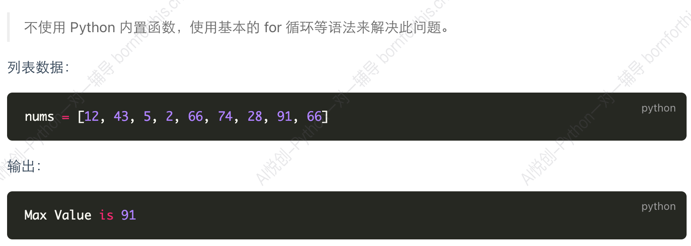

## 1. for 循环——遍历

基本语法：

```python
lst = [1,2,3]
for i in lst:
    print(i)
#output
1
2
3
```

拓展：把列表里的数字都平方一遍，然后再放回列表：

```python
lst = [1, 2, 3, 4, 5, 6, 7, 8, 9]
n = 0
for i in lst:
    lst[n] = i ** 2
    n += 1
print(lst)
#output
[1, 4, 9, 16, 25, 36, 49, 64, 81]
```


## 2. `emerate`

### 2.1 `emerate` 用法

```python
lst = ['shelley','python','java']
"""
enumerate 是 python 中的一个内置函数，非常实用，它用于遍历序列（比如：列表，元组或字符串），
同时获取每个元素的索引和值。这样做可以让循环中的迭代更加直观，也更易于处理。
使用 enumerate 函数可以替代传统的通过索引防问元素的方法。
它返回一个枚举对象，对这个对象生成一系列包含每个元素的索引和值的元组。
"""
fruits = ['apple','banana','cherry']
for index, fruit in enumerate(fruits):
    print(index, fruit)
#output
0 apple
1 banana
2 cherry
```

细化实现步骤：

```python
In [1]: fruit = ['apple','banana','cherry']

In [2]: enumerate(fruit)
Out[2]: <enumerate at 0x183d9b44f00>

In [3]: list(enumerate(fruit))
Out[3]: [(0, 'apple'), (1, 'banana'), (2, 'cherry')]

In [4]: fruit_list = list(enumerate(fruit))

In [5]: for fruits in fruit_list:
   ...:     print(fruits)
   ...:
(0, 'apple')
(1, 'banana')
(2, 'cherry')
```
元组里索引和值的一一映射：
```python
In [6]: index,fruit = (0,'apple')

In [7]: index
Out[7]: 0

In [8]: fruit
Out[8]: 'apple'
```

最终代码写法:

```python
In [10]: fruits = ['apple','banana','cherry']

In [11]: fruits_list = list(enumerate(fruits))

In [12]: for fruits in fruit_list:
    ...:     index,fruit = fruits
    ...:     print(index,fruit)
    ...:
0 apple
1 banana
2 cherry
```

可以从上面看到，`enumerate`的作用就是使索引一起与值显现。


### 2.2 拓展用法

输出这样的形式：

```python
{0: 'apple', 1: 'banana', 2: 'cherry'}
```

Solution:

第一版本：

```python
fruits = ['apple', 'banana', 'cherry']
fruits_list = list(enumerate(fruits))
dictionary = dict(fruits_list)
print(dictionary)
```

想到了字典的两种创建方法：`[(),(),()]`这种形式可以通过 `dict`强制转换成字典形式。

那我们能不能直接把 `enumerate`强制转换成字典？

```python
fruits = ['apple', 'banana', 'cherry']
dictionary = dict(enumerate(fruits))
print(dictionary)
#output
{0: 'apple', 1: 'banana', 2: 'cherry'}
```


::: info

索引可不可以从别的数字开始？

可以。

```python
fruits = ['apple', 'banana', 'cherry']
dictionary = dict(enumerate(fruits,start=1))
print(dictionary)
#output
{1: 'apple', 2: 'banana', 3: 'cherry'}
```

:::


## 3. 课上作业

### Question 01

1.



```python
lst = [10, 43, 5, 66, 2, 0, 99]
maxnum = lst[0]
for i in lst:
    if i > maxnum:
        maxnum = i
print(maxnum)
#output
99
```

**2.输出最大值的下标，并且不能用 `.index()`:**

```python
lst = [10, 43, 5, 66, 2, 100]
max_value = lst[0]
position = 0
for index, value in enumerate(lst):
    if value > max_value:
        max_value = value
        position = index
print(position)
```

**3.有多个最大数值时，返回所有最大值的下标：**

::: code-tabs

@tab 列表存储

```python
nums = [1, 24, 5, 56, 7, 78, 99, 111, 11, 111, 111]
max_value = nums[0]
max_tup = []
for num in nums:
    if num > max_value:
        max_value = num
position = 0
for i in nums:
    if i == max_value:
        max_tup.append(position)
        position += 1
    else:
        position += 1  # 只有在 for 循环中才能这么写
print(tuple(max_tup))
#output
(7, 9, 10)
```

@tab 元组存储

```python
nums = [1, 24, 5, 56, 7, 78, 99, 111, 11, 111, 111]
max_value = nums[0]
max_tup = tuple()
for num in nums:
    if num > max_value:
        max_value = num
position = 0
for i in nums:
    if i == max_value:
        max_tup += (position,)
    position += 1 
print(max_tup)
#output
(7, 9, 10)
```

:::

用一个 for 循环也能实现：

```python
nums = [1, 24, 5, 56, 7, 78, 99, 111, 11, 111, 111]
max_value = nums[0]
max_indices = []
n = 0
for num in nums:
    if max_value < num:
        max_value = num
        max_indices = [n]
    elif num == max_value:
        max_indices.append(n)
    n += 1
max_indices_tuple = tuple(max_indices)
print(max_indices_tuple)
```


### Question 02

编写一个程序，使用 for 循环统计给定字符串中元音字母（a, e, i, o, u）的数量，并输出结果。

**Solution：**

```python
str = input('Enter a string: ').lower()
lst = str.replace('',',').strip(',').split(',')
print(lst)
if not str.isalpha():
    print('Invalid')
else:
    n = 0
    for i in lst:
        if i == 'a' or i == 'e' or i == 'u' or i == 'i' or i == 'o':
           n += 1
    print(n)
```

**答案：**

1. 不忽略大小写

```python
vowels = 'aeiouAEIOU'
str = input('Enter a string: ')
count = 0
for char in str:
    if char in vowels:
        count += 1
print("numer of vowels: ", count)
```

2. 忽略大小写

```python
vowels = 'aeiou'
str = input('Enter a string: ').lower()
count = 0
for char in str:
    if char in vowels:
        count += 1
print("numer of vowels: ", count)
```


### Question 03

编写一个程序，使用 `for` 循环反转一个给定的字符串并输出。例如，输入 `hello`，输出 `olleh`。

@cade-tabs


```python
lst = input('Enter a string: ').replace('',',').strip(',').split(',')
lst.reverse()
string = ''
for num in lst:
    string += num
print(string)
```


## 4. range

**在 Python 中，range 函数是一个非常实用的工具，用于生成一个不可变的数字序列。通常，在循环中用来进行迭代，尤其在 for 循环中。**

### 4.1 基本用法

range 函数可以有三个参数，start，stop，step

- start ：序列开始的值，默认为 0。
- stop：序列结束的值，不包括这个值。
- step ：序列中每个值之间的差（步长），默认为 1。

```python
for i in range(5):  # range(5) 表示 [0,5)
    print(i)
#output
0
1
2
3
4
```

```python
for i in range(2, 5): # 表示 [2,5)
    print(i)
#output
2
3
4
```

```python
for i in range(2, 11, 2):
    print(i)
2
4
6
8
10
```

`range()`只能接受**整数。**

### 4.2 特性和注意事项

- `range`生成一个惰性序列，这意味着它只在需要时才生成数字，这有助于节约内存。

- `range`对象不支持任意切片，但可以强制转换成列表（如：`list(range(10))`）来获得更多操作能力。

- 在 Python 3中，`range`替代了 Python 2中的 xrange ，后者在旧版本中生成大的数字序列，因为它更节省内存。

    `range`这些特性使其在处理循环和其他需要数字序列的场景中非常有用。

### 4.3 用法2

```python
stu_lst = ['Shelley', 'Leon', 'Henry']
for index in range(len(stu_lst)):
    print(stu_lst[index])
#output
Shelley
Leon
Henry
```


### 4.4 示例


#### 求0-100的总和

```python
sum = 0
for i in range(101):
    sum += i
print(sum)
# output
5050
```


#### 获取特定和

获取用户输入一组以空格间隔的数据，第一个整数代表开始，第二个整数代表结束，求出两整数区间的总和。「包含这两个整数」

```python
lst_str = input('Enter two numbers separated by space: ').split(' ')
lst = list(map(int, lst_str))
sta = lst[0]
en = lst[1]
sum = 0
for i in range(sta, en + 1):
    sum += i
print(sum)
```


#### 开始数字大于结束数字，程序停止

上面的程序，需要结束整数大于开始整数才可以执行计算，否则输出提示：输入不合法，程序停止～。

```python
lst_str = input('Enter two numbers separated by space: ').split(' ')
lst = list(map(int, lst_str))
sta = lst[0]
en = lst[1]
sum = 0
if sta > en:
    print('输入不合法，程序停止')
else:
    for i in range(sta, en + 1):
        sum += i
    print(sum)
```


#### 不是纯数字，报错

上面的代码运行后，用户输入不是纯数字，则报错。需要解决不能报错，不是纯数字则输出：输入不合法，需要输入纯数字～。（Invalid input）（只考虑正整数，小数不考虑）

```python
lst_str = input('Enter two numbers separated by space: ')
lst_check = lst_str.replace(' ', '')
if not lst_check.isdigit():
    print('输入不是纯数字，报错。')
else:
    lst = list(map(int,lst_str.split(' ')))
    sta = lst[0]
    en = lst[1]
    sum = 0
    if sta > en:
        print('输入不合法，程序停止')
    else:
        for i in range(sta, en + 1):
            sum += i
        print(sum)
```


#### 输入格式不符合要求，重试

如没有用空格间隔，输入多个数字等。

::: code-tabs

@tab code 01

```python
num_check = False
while not num_check:
    lst_str = input('Enter two numbers separated by space: ').strip()
    if lst_str.count(' ') != 1:
        print('输入空格数目不为1，请重新输入。')
    else:
        lst_check = lst_str.replace(' ', '')
        if not lst_check.isnumeric():
            print('输入不符合要求，请查看是否用空格间隔。')
        else:
            if not lst_check.isdigit():
                print('输入不是纯数字，报错。')
            else:
                lst = list(map(int, lst_str.split(' ')))
                sta = lst[0]
                en = lst[1]
                sum = 0
                if len(lst) != 2: # != 常常用于一些特定条件中，使用不够灵活。
                    print('输入数字个数不符合要求，重新输入。')
                else:
                    if sta > en:
                        print('起始数字大于结束数字，重新输入。')
                    else:
                        for i in range(sta, en + 1):
                            sum += i
                        print(sum)
                        num_check = True
```


@tab code 02

```python
num_check = False
while not num_check:
    lst_str = input('Enter two numbers separated by space: ').strip()
    if lst_str.count(' ') != 1:   # 包含了输入多个数字的情况如：1 2 3，后面就不用再条件判断一次是否个数为2了
        print('输入空格数目不为1，请重新输入。')
    else:
        lst_check = lst_str.replace(' ', '')
        if not lst_check.isnumeric():
            print('输入不符合要求，请查看是否用空格间隔。')
        else:
            if not lst_check.isdigit():
                print('输入不是纯数字，报错。')
            else:
                lst = list(map(int, lst_str.split(' ')))
                sta = lst[0]
                en = lst[1]
                sum = 0
                if sta > en:
                    print('起始数字大于结束数字，重新输入。')
                else:
                    for i in range(sta, en + 1):
                        sum += i
                    print(sum)
                    num_check = True
```

:::

code 02（修改之后代码）分析：

**缺点**：

- 嵌套层数过多，导致逻辑变得复杂；
- 同时使用了 while 与 for 循环；

**优点：**

- 处理了用户可能输入的多种错误数据情况，而产生的报错，并实现错误输入后的重新输入。[试错机会]

**怎么尽可能避免多层嵌套？**

- 利用整组的 `if...elif...elif...else`,只会执行其中一个的特性。

**需要 get 到的点：**

- 程序的开发流程，是一步步实现所要解决的需求和目的，不是一次性完成。先写框架和功能，再一步步 debug，把目标问题一步步拆解，大问题拆解为小问题，一步步解决。

**推荐思考方式：**

- 明确要解决的问题
- 计算区间总和：使用 for 。【关键词：区间，用 range 生成一系列数据】

- 用户重复输入： while 循环。

代码优化后：

```python
num_check = False
while not num_check:
    lst_str = input('Enter two numbers separated by space: ').strip()
    lst_check = lst_str.replace(' ', '')
    if lst_str.count(' ') != 1:   # 包含了输入多个数字的情况如：1 2 3，后面就不用再条件判断一次是否个数为2了
        print('输入空格数目不为1，请重新输入。')
        continue
    elif not lst_check.isnumeric():
        print('输入不符合要求，请查看是否用空格间隔。')
        continue
    elif not lst_check.isdigit():
        print('输入不是纯数字，报错。')
    lst = list(map(int, lst_str.split(' ')))
    sta = lst[0]
    en = lst[1]
    sum = 0
    if sta > en:
        print('起始数字大于结束数字，重新输入。')
        continue
    else:
        for i in range(sta, en + 1):
            sum += i
        print(sum)
        num_check = True
```


## 5. while 和 for

**while 使用场景：**

- 如果不知道一个程序要执行多少次，但已知程序需要在==某种情况下暂停循环==，则推荐使用 while 循环。

**for 使用场景：**

- 如果==明确程序需要执行的次数==，使用 for 循环。

注意：所有的 for 循环都可以写成 while 循环


## 6. continue & break

### 6.1 continue

用于跳过当前循环剩余的部分，并直接进入下一次循环的判断。也就是说，当循环体内遇到 continue 语句时，会跳过该次循环中 continue 之后的代码，并直接进入下一次循环。

```python
for i in range(1, 6):
    if i == 3:
        continue
    print(i)
#output
1
2
4
5
```

### 6.2 break

break 用于立即退出当前正在执行的循环，无论循环条件是否为真。使用 break 可以提前结束循环，常常用于当满足某个条件时不需要继续执行循环体的剩余部分。

注意：循环后代码还是会继续执行的。

```python
for i in range(10):
    print(i)
    if i > 5:
        break
print('哈哈哈哈')
#output
0
1
2
3
4
5
6
哈哈哈哈
```

对比：存在于 while 中的 break。

```python
i = 0
while True:
    print(i)
    i += 1
    if i > 5:
        break
print('hhhh')
#output
0
1
2
3
4
5
hhhh
```


## 7. 循环嵌套

### 7.1 基本用法

在 Python 中，嵌套的 for循环是指一个 for 循环内部包含另一个 for 循环。这种结构通常用于处理多维数据结构，比如列表，元组或字典的组合，或者需要在执行多层次的迭代任务时使用。

基本结构：

```python
for 变量1 in 可迭代对象1:
    for 变量2 in 可迭代对象2:
```

每个 for 循环工作原理如下：

- 外层循环可从可迭代对象1中取出元素赋值给变量1；
- 然后，内层循环开始执行，从可迭代对象2 中逐一取出元素赋值给变量2。
- 对于外层循环的每一个单独的迭代，内层循环都会完整的执行一次。

例子：

::: code-tabs

@tab

```python
matrix = [
    (1, 2),
    (3, 4),
]
for row in matrix:
    print(row)
#output
(1, 2)
(3, 4)
```

@tab

```python
matrix = [
    (1, 2),
    (3, 4),
]
for row in matrix:
    for column in row:
        print(column)
#output
1
2
3
4
```

:::


### 7.2 二维数组的练习

- 把二维数组里每个值都相加

```python
matrix = [
    [1, 2, 3],
    [4, 5, 6],
    [7, 8, 9],
]
sum = 0
for row in matrix:
    for col in row:
        sum += col
print(sum)
#output
45
```

不用嵌套也可以实现：

```python
matrix = [
    [1, 2, 3],
    [4, 5, 6],
    [7, 8, 9],
]
sum1 = 0
for i in matrix:
    sum1 += sum(i)
print(sum1)
```


- 把二维数组里的每列相加

```python
matrix = [
    [1, 2, 3],
    [4, 5, 6],
    [7, 8, 9],
]
colum_sum = [0] * len(matrix[0])  # 初始化几列二维数组的结果
print(colum_sum)
for i in range(len(matrix[0])):  # 遍历每一个元素，使用第一个列表长度为基石。0 1 2
    for j in range(len(matrix)):  # 一共几行
        colum_sum[j] += matrix[j][i]
print('每列的和：', colum_sum)
#output
[0, 0, 0]
每列的和： [6, 15, 24]
```

进一步观察在循环什么？

```python
import time
matrix = [
    [1, 2, 3],
    [4, 5, 6],
    [7, 8, 9],
]
colum_sum = [0] * len(matrix[0])  # 初始化几列二维数组的结果
print(colum_sum)
for i in range(len(matrix[0])):  # 遍历每一个元素，使用第一个列表长度为基石。0 1 2
    for j in range(len(matrix)):  # 一共几行
        print(f'matrix[{j}][{i}]:{matrix[j][i]:}')
        colum_sum[j] += matrix[j][i]
        time.sleep(1)
print('每列的和：', colum_sum)
#output
[0, 0, 0]
matrix[0][0]:1
matrix[1][0]:4
matrix[2][0]:7
matrix[0][1]:2
matrix[1][1]:5
matrix[2][1]:8
matrix[0][2]:3
matrix[1][2]:6
matrix[2][2]:9
每列的和： [6, 15, 24]
```


### 7.3 九九乘法表

第一种方法：

```python
for i in range(1, 10):
    for j in range(1, 10):
        if j <= i:
            print(f'{j} * {i} = {i * j} ',end='\t')
    print()
#output
1 * 1 = 1 	
1 * 2 = 2 	2 * 2 = 4 	
1 * 3 = 3 	2 * 3 = 6 	3 * 3 = 9 	
1 * 4 = 4 	2 * 4 = 8 	3 * 4 = 12 	4 * 4 = 16 	
1 * 5 = 5 	2 * 5 = 10 	3 * 5 = 15 	4 * 5 = 20 	5 * 5 = 25 	
1 * 6 = 6 	2 * 6 = 12 	3 * 6 = 18 	4 * 6 = 24 	5 * 6 = 30 	6 * 6 = 36 	
1 * 7 = 7 	2 * 7 = 14 	3 * 7 = 21 	4 * 7 = 28 	5 * 7 = 35 	6 * 7 = 42 	7 * 7 = 49 	
1 * 8 = 8 	2 * 8 = 16 	3 * 8 = 24 	4 * 8 = 32 	5 * 8 = 40 	6 * 8 = 48 	7 * 8 = 56 	8 * 8 = 64 	
1 * 9 = 9 	2 * 9 = 18 	3 * 9 = 27 	4 * 9 = 36 	5 * 9 = 45 	6 * 9 = 54 	7 * 9 = 63 	8 * 9 = 72 	9 * 9 = 81 	
```

第二种方法：

```python
import time
for i in range(1, 10):
    for j in range(1, i + 1):
        time.sleep(2)
        print(f'{j} * {i} = {i * j} ',end='\t')
    print()
```


::: warning

但是嵌套循环会使代码复杂度增加，尤其是当循环层数增多时，需要注意代码的可读性和性能。

在尽可能的情况下，避免使用多层嵌套，以免造成代码的运行效率降低。

嵌套循环是编程中常见的一个概念，通过适当使用可以解决很多复杂问题，但也要注意对性能的影响。

:::

打印成倒三角：

```python
for i in range(1, 10):
    print("\t\t\t" * (i - 1), end='')   # 算式中总共有3个整型，两个算术运算符，加上后面的一个空格，占位6个，三个制表符
    for j in range(i, 10):
        print(f'{i} * {j} = {i * j}\t', end='')
    print()
#output

```


### 7.4 根据用户输入打印矩形

```python
import time
width = int(input('输入矩形的宽度：'))
height = int(input('输入矩形的高度：'))
for i in range(height):
    for j in range(width):
        print('*', end='')
        time.sleep(2)
    print()
#output
输入矩形的宽度：5
输入矩形的高度：3
*****
*****
*****
```


```python
len = int(input('Enter the length of the rectangle:'))
width = int(input('Enter the width of the rectangle:'))
for i in range(1, width+1):
    print('*', end='')
    for j in range(1, len):
        print('*', end='')
    print()

```


### 7.5 正三角形和菱形的输出

#### 7.5.1 正三角形输出

编写一个程序，使用嵌套的 for 循环输出一个由 * 组成的正三角形。行数由用户输入确定。例如：
输入：行数 = 4

```python
height = int(input("Enter your height in triangle:"))
for i in range(1, height + 1):
    for j in range(height - i):   # 输出每一行前面的空格，为height - 1个
        print(' ', end='')
    for k in range(2 * i - 1):   # 找规律输出每一行的*号数
        print('*', end='')
    print()
#output
Enter your height in triangle:4
   *
  ***
 *****
*******
```


#### 7.5.2 正菱形输出
编写一个程序，使用嵌套的 for 循环输出一个由 * 组成的菱形。行数由用户输入确定。

::: code-tabs

@tab 自己逻辑

```python
height = int(input("Enter your height in triangle:"))
for i in range(1, height * 2):
    if i <= height:
        for j in range(height - i):   # 输出每一行前面的空格，为height - 1个
            print(' ', end='')
        for k in range(2 * i - 1):   # 找规律输出每一行的*号数
            print('*', end='')
    else:
        for t in range(i - height):
            print(' ', end='')
        for f in range(2 * height - 1 - (i - height) * 2):
            print('*', end='')
    print()
#output
Enter your height in triangle:4
   *
  ***
 *****
*******
 *****
  ***
   *
```

@tab 优化代码

```python
rows = int(input("输入行数: "))
for i in range(1, rows + 1):
    for j in range(rows - i):
        print(" ", end="")
    for k in range(2 * i - 1):
        print("*", end="")
    print()
for i in range(rows - 1, 0, -1):
    for j in range(rows - i):
        print(" ", end="")
    for k in range(2 * i - 1):
        print("*", end="")
    print()
```


### 7.6 空心形状的输出

#### 7.6.1 空心矩形

::: code-tabs

@tabs 自己逻辑

```python
length = int(input('Enter the length of the rectangle:'))
width = int(input('Enter the width of the rectangle:'))
for i in range(1, width + 1):
    if i == 1 or i == width:
        for j in range(1, length + 1):
            print('*', end='')
    else:
        for j in range(1, length + 1):
            if j == 1 or j == length:
                print('*', end='')
            else:
                print(' ', end='')
    print()
#output
Enter the length of the rectangle:10
Enter the width of the rectangle:5
**********
*        *
*        *
*        *
**********
```

@tabs 优化代码

```python
length = int(input('Enter the length of the rectangle:'))
width = int(input('Enter the width of the rectangle:'))
for i in range(width):
    for j in range(length):
        if i == 0 or i == width - 1 or j == 0 or j == width -1:
            """观察我们要输出的矩形特点，以上情况输出*，其他情况不输出。"""
            print('*', end='')
        else:
            print(end=' ')
    print()
```

#### 7.6.2 空心菱形

```python
rows = int(input('输入行数：'))
for i in range(1, rows+1):
    for j in range(rows - i):
        print(' ', end='')
    for k in range(2 * i - 1):
        if k == 0 or k == 2 * i - 2:
            print('*', end='')
        else:
            print(' ', end='')
    print()
for i in range(rows-1, 0, -1):
    for j in range(rows - i):
        print(' ', end='')
    for k in range(2 * i -1):
        if k == 0 or k == 2 * i - 2:
            print('*', end='')
        else:
            print(' ', end='')
    print()
#output
输入行数：8
       *
      * *
     *   *
    *     *
   *       *
  *         *
 *           *
*             *
 *           *
  *         *
   *       *
    *     *
     *   *
      * *
       *
```


### 7.7 二维数组遍历
编写一个程序，要求用户输入一个 n×m 的二维数组，**并使用嵌套的 for 循环输出**该二维数组的所有元素。

```python
length = int(input('输出二维数组的长度：'))
width = int(input('输出二维数组的宽度：'))
lst = []
for i in range(1, length + 1):
    lst_ele = []
    for j in range(1, width + 1):
        print(f'输出二维数组中{i}行{j}列的数字：')
        num = int(input())
        lst_ele.append(num)
    lst.append(lst_ele)
print('二维数组的内容是：')
for i in range(length):
    for j in range(width):
        print(lst[i][j], end=' ')
    print()
#output
输出二维数组的长度：2
输出二维数组的宽度：2
输出二维数组中1行1列的数字：
12
输出二维数组中1行2列的数字：
13
输出二维数组中2行1列的数字：
14
输出二维数组中2行2列的数字：
15
二维数组的内容是：
12 13 
14 15 
```

这题如何输出一个二维数组没有想出来：

```python
for i in range(length):
    for j in range(width):
        print(lst[i][j], end=' ')
    print()
```


### 7.8 数字金字塔

编写一个程序，使用嵌套的 for 循环输出一个数字金字塔。行数由用户输入确定，例如：
输入：行数 = 4
输出：
   1
  2 2
 3 3 3
4 4 4 4

```python
height = int(input('请输入金字塔的层高：'))
for i in range(1, height + 1):
    n = 2 * i - 1
    for j in range(height - i):
        print(' ', end='')
    for k in range(1, n + 1):
        if k % 2 == 0:
            print(' ', end='')
        if k % 2 != 0:
            print(i, end='')
    print()
#output
请输入金字塔的层高：8
       1
      2 2
     3 3 3
    4 4 4 4
   5 5 5 5 5
  6 6 6 6 6 6
 7 7 7 7 7 7 7
8 8 8 8 8 8 8 8
```

依旧是前面的空格和后面的数字分开打，后面的一串中又是奇数位有数字而偶数位没有数字。

```python
height = int(input('请输入金字塔的层高：'))
for i in range(1, height + 1):
    for j in range(height - i):
        print(' ', end='')
    for k in range(i):
        print(i, end=' ')
    print()
```

一个i后面跟一个空格这样打印也可以。（优化后代码）


### 7.9 输入：n = 4

输出：
2 3 4 5
3 4 5 6
4 5 6 7
5 6 7 8

```python
size = int(input('Enter size of 数字矩阵：'))
for i in range(1, size+1):
    for j in range(1, size+1):
        print(i+j, end=' ')
    print()
#output
Enter size of 数字矩阵：4
2 3 4 5 
3 4 5 6 
4 5 6 7 
5 6 7 8
```


### 7.10 乘法表的非对角线和
编写一个程序，计算并输出九九乘法表中非对角线元素的和。非对角线元素指 (i != j) 的乘法结果。

```python
summary = 0
for i in range(1, 10):
    for j in range(1, i):
        summary += i * j
print(summary)
#output
870
```

