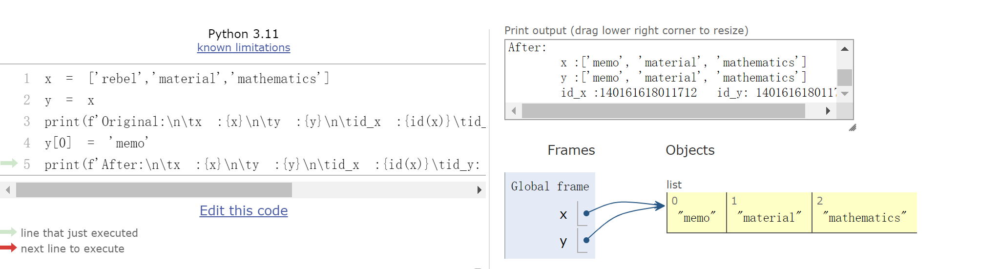
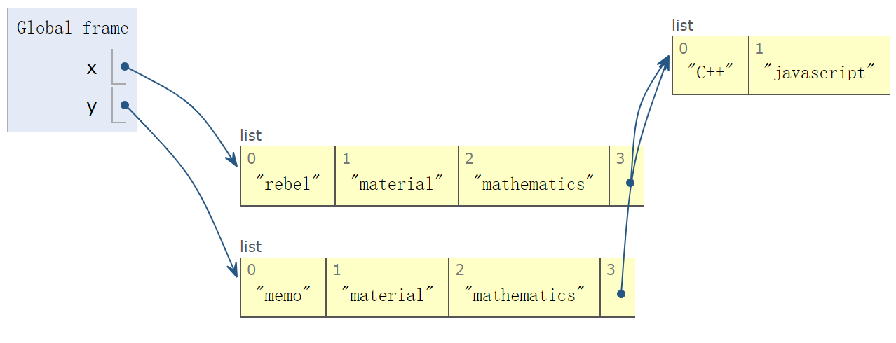
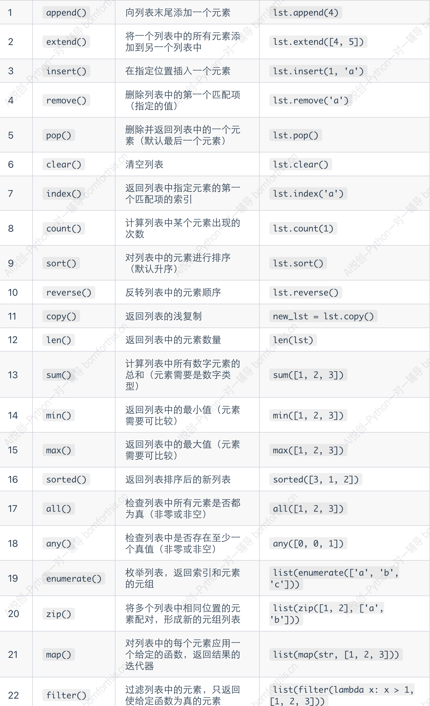
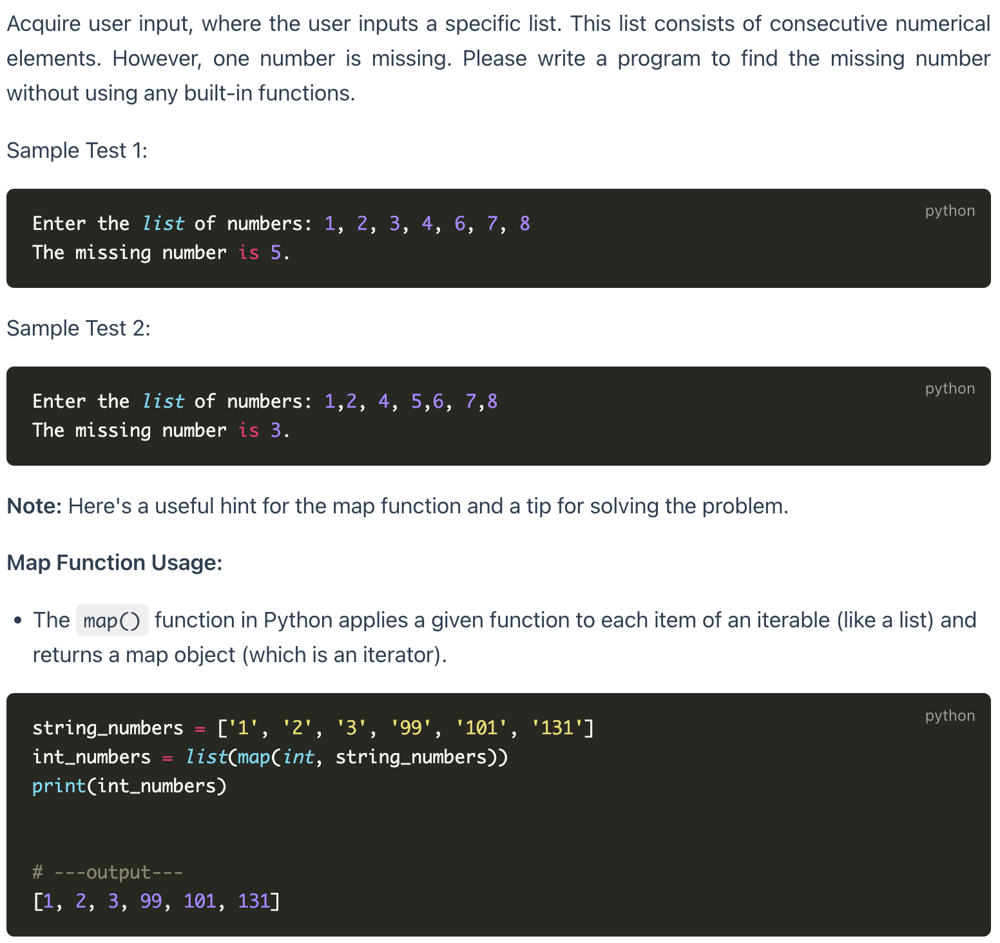

## 1. 列表结构

- 利用中括号表示列表

- 列表内的元素使用逗号隔开

- 注意是英文输入法下的逗号

```python
student = ['lili' , 123, [2,3,4],{"xxy",4.56}]
print(student)
#output
['lili', 123, [2, 3, 4], {4.56, 'xxy'}]
```

列表的可变性：可以修改列表里的内容

- 字符串强制转换成列表

```python
string_to_list = list('Bornforthis')
print(string_to_list)
#output
['B', 'o', 'r', 'n', 'f', 'o', 'r', 't', 'h', 'i', 's']
```

## 2. 获取列表元素

列表下标与字符串一致

### 2.1 提取列表单个元素

```python
#1
lst = [98, 99, 95, 80]
a = lst[-1]
print(a)
#2
lst = [98, 99, 95, 80]
a = lst[3]
print(a)
#3
lst = [98, 99, 95, 80]
a = lst[len(lst)-1]
print(a)
#output
80
```

### 2.2 提取列表连续和特定区间的元素

```python
lst = [98, 99, 95, 80]
print(lst[::-1])
print(lst[0::2])
print(lst[1::2])
print(lst[0::3])
print(lst[1:4])
#output
[80, 95, 99, 98]
[98, 95]
[99, 80]
[98, 80]
[99, 95, 80]
```


## 3. 列表切片赋值


- 来考虑下面这种情况

    

为什么？

首先第一个1指向列表中的数字5，第二个1指切片结尾的后一个位置，则代表这个切片结尾是1前面一个位置也就是0位，0位上是数字1，故第二个1指向的是数字1，像这样：


而数字‘5’和‘1’之间是没有数字的。所以输出为空。

于是我们得到：


相当于是[2,3,4]插进了1和5之间那段空白。


## 3. 获取列表长度和修改列表元素

### 3.1 获取列表长度

```python
student_list = ['John','韩梅梅' ,'马冬梅']
print(len(student_list))
#output
3
```

### 3.2 修改列表元素

可以修改的对象（元素）：

列表，元组，集合[不按集合原本的顺序]，字符串，字典[放进去的是key]

- 单个修改

    ```python
    student_list = ['John','韩梅梅' ,'马冬梅']
    student_list[0] = 'Taurus'
    print(student_list)
    
    ```
- 多个元素修改
```python
numbers = [0,1,2,3,4,5,6,7,8,9,10]
print(numbers)

numbers[1:5] = ['one', 'two', 'three', 'four']
print(numbers)
#output
[0, 1, 2, 3, 4, 5, 6, 7, 8, 9, 10]
[0, 'one', 'two', 'three', 'four', 5, 6, 7, 8, 9, 10]
```

1. 我们考虑下面这种情况：

```python
numbers = [0,1,2,3,4,5,6,7,8,9,10]
print(numbers)

numbers[1:5] = ['one', 'two', 'three', 'four','five']
print(numbers)
#output
[0, 1, 2, 3, 4, 5, 6, 7, 8, 9, 10]
[0, 'one', 'two', 'three', 'four','five', 5, 6, 7, 8, 9, 10]
```

可以发现，numbers[1:5]只是代表这一个区间，这个区间存在着无限个占位，没有数量限制。

2. 那么如果我们添加别的数据类型进去呢？

比方添加一个集合。已知集合具有无序性。

```python
numbers = [0,1,2,3,4,5,6,7,8,9,10]
print(numbers)

numbers[1:5] = {'taurus',3,4,5}
print(numbers)
```

```python
#output
[0, 1, 2, 3, 4, 5, 6, 7, 8, 9, 10]
[0, 4, 3, 'taurus', 5, 5, 6, 7, 8, 9, 10]
```

添加进去的结果是无序的。

那添加一个具有有序性的元组呢？

```python
numbers = [0,1,2,3,4,5,6,7,8,9,10]
print(numbers)

numbers[1:5] = ('taurus',3,4,5)
print(numbers)
```

无论运行多少次，结果都是有序的。

```python
[0, 1, 2, 3, 4, 5, 6, 7, 8, 9, 10]
[0, 'taurus', 3, 4, 5, 5, 6, 7, 8, 9, 10]
```


## 4. 小试牛刀

获取用户输入两个值，一个是要插入的位置，一个是要插入这个位置的值。

给定下面列表


例子：


```python
numbers = [1,2,3,5,6]
a = int(input('Enter position:'))
b = int(input('Enter value:'))
numbers[a:a] = [b]
print(numbers)
#output
[1,2,3,4,5,6]
```


## 5. 在指定位置上插入元素[.insert(index,element)]

.insert(index,element)是列表的一个基本方法，用于在列表指定位置插入一个元素。

它的基本语法是：

```PYTHON
list.insert(index,element)
```

`index`:指定要插入元素的位置。索引从0开始。如果指定索引超出了列表的当前长度【不会报错】，则元素将被添加到列表的末尾。

`element`：这是你想要插入列表的元素。

```python
numbers = [1,2,3,5,6]
a = int(input('Enter position:'))
b = int(input('Enter value:'))
numbers.insert(a,b)
print(numbers)
#output
[1,2,3,4,5,6]
```


## 6. 在指定位置添加元素[.append]

```python
lst = ['John', 'Smith']
print('before:',lst)
lst.append('boogie')
print('after',lst)
#output
before: ['John', 'Smith']
after ['John', 'Smith', 'boogie']

lst = [1,2,3,4,5,6,7,8,9]
print(lst)
lst.append([10,11,12,13,14,15])
print(lst)
#output
[1, 2, 3, 4, 5, 6, 7, 8, 9]
[1, 2, 3, 4, 5, 6, 7, 8, 9, [10, 11, 12, 13, 14, 15]]
```

.append()只能在列表末尾添加

```python
lst = [1,2,3,4,5,6,7,8,9]
print(lst)
lst.extend([10,11,12,13,14,15])
print(lst)
[1, 2, 3, 4, 5, 6, 7, 8, 9]
[1, 2, 3, 4, 5, 6, 7, 8, 9, 10, 11, 12, 13, 14, 15]
```

观察,append()和.extend()添加元素类型的不同


## 6. 删除指定位置的元素（del)

```python
student_list = ['Echo','Leon','Sherry']
del student_list[0]
print(student_list)
#output
['Leon', 'Sherry']

student_list = ['Echo','Leon','Sherry']
del student_list[0:2]
print(student_list)
#output
['Sherry']

student_list = ['Echo','Leon','Sherry']
del student_list
print(student_list)
#output
Traceback (most recent call last):
  File "C:\Coder\Lesson\d.py", line 3, in <module>
    print(student_list)
NameError: name 'student_list' is not defined
//可以看到，不指定位置会把整个变量删掉
```


## 7. 移除最后一个元素[.pop()]

```python
student_list = ['Echo','Leon','Mary']
student_list.pop()
print(student_list)
student_list.pop(0)
print(student_list)
#output
['Echo', 'Leon']
['Leon']
```

pop和del的区别就是，在不指定下标的情况下，pop删除最后一位元素，del删掉整个变量。

相同之处是，他们都可以删除指定位置元素。


## 8. 指定元素本体进行删除[.remove()]

```python
student_list = ['Echo','Leon','Mary']
student_list.remove('Echo')
print(student_list)
#output
['Leon', 'Mary']
```

.remove()与上面两个都不一样，不是指定下标而是元素。

```python
student_list = ['Echo','Leon','Mary','Echo']
student_list.remove('Echo')
print(student_list)
#output
['Leon', 'Mary', 'Echo']
```

多个一样的元素，删除第一个。


## 9. 列表相加

```python
lst1 = [1,2,3,4,5,6,7,8,9]
lst2 = [1,2,3,4,5,6,7,8,9]
print(lst1+lst2)
#output
[1, 2, 3, 4, 5, 6, 7, 8, 9, 1, 2, 3, 4, 5, 6, 7, 8, 9]
```


## 10. 判断列表有没有指定元素（inventory）

```python
inventory = ['moon','in','taurus']
print('moon' in inventory)
print('in' in inventory)
#output
True 
True
```

注意这里inventory只是变量名不是代表内置函数（操作）。

## 11. 元素出现次数[.count(1)]

```python
inventory = ['moon','in','taurus',3,[1,2],3]
print(inventory.count(3))
#output
2
```


## 12. 获取列表指定元素第一次出现的位置[.index()]

```python
inventory = ['moon','in','taurus',3,[1,2],3]
print(inventory.index([1,2]))
#output
4

numbers = [1,2,4,3,2,1]
print(numbers.index(2))
#output
2

numbers = [1,2,4,3,2,1]
print(numbers.index(5))
#output
Traceback (most recent call last):
  File "C:\Coder\Lesson\d.py", line 2, in <module>
    print(numbers.index(5))
ValueError: 5 is not in list
```


## 13. 列表排序[.sort()]

正序：

```python
numbers = [1,2,4,3,2,1]
numbers.sort()
print(numbers)
#output
[1, 1, 2, 2, 3, 4]
```

```python
numbers = ['symbol','motto','versus',1]
numbers.sort()
print(numbers)
#output
['motto', 'symbol', 'versus']
```


不可以这样：（因为是直接修改列表）

```python
numbers = [1,2,4,3,2,1]
print(numbers.sort())
#output
None
```

倒序：

```python
numbers = [1,2,4,3,2,1]
numbers.sort(reverse=True)
print(numbers)
#output
[4, 3, 2, 2, 1, 1]
```

这时要求列表里都是一样的数据类型，否则报错


### 4.1 sorted(list,reverse=False)

`sorted(list,reverse=False/True)`将列表进行小到大排序，排序后原列表不变，返回新列表。reverse默认为False，如果手动设置成True则返回降序排列。

```python
numbers = [3,2,1,7,4,9,0]
new_numbers = sorted(numbers)
print(new_numbers)
#output
[0, 1, 2, 3, 4, 7, 9]
```

.sorted()必须有一个新变量来存储排序后的内容。


### 4.2 [.reverse()]翻转列表

```python
numbers = [3,2,1,7,4,9,0]
numbers.reverse()
print(numbers)
#output
[0, 9, 4, 7, 1, 2, 3]
```

与sort一样，reverse也是一个操作不返回任何值，所以不能直接放进print里面。


## 5. 例题

将一串字符串 '132569874' 转换成列表并将其输出； 对其中偶数下标的元素进行降序排列，奇数下标的元素不变。

```python
str_to_lst = list('132569874')
str_to_lst1 = str_to_lst[0::2]
str_to_lst1.sort(reverse=True)
str_to_lst[0:9:2] = str_to_lst1
print(str_to_lst)
```

```python
str_to_lst = list('132569874')
str_to_lst1 = str_to_lst[0::2]
new_lst = sorted(str_to_lst1, reverse=True)
str_to_lst[0:9:2] = new_lst
print(str_to_lst)
```

- .sort()：一个操作，不返回任何值，只对原变量进行改变；
- sorted（）：返回升（降）排序后的值，故可以用新的变量存储


## 6. 列表的深浅拷贝

### 6.1 浅拷贝

#### 6.1.1 浅拷贝的特性

观察下面这个代码：

```python
x = ['rebel','material','mathematics']
y = x
print(f'Original:\n\tx :{x}\n\ty :{y}\n\tid_x :{id(x)}\tid_y :{id(y)}') # id 用来获取变量的物理地址
y[0] = 'memo'
print(f'After:\n\tx :{x}\n\ty :{y}\n\tid_x :{id(x)}\tid_y: {id(y)}')
```

输出是：

```python
Original:
	x :['rebel', 'material', 'mathematics']
	y :['rebel', 'material', 'mathematics']
	id_x :2545197165824	id_y :2545197165824
After:
	x :['memo', 'material', 'mathematics']
	y :['memo', 'material', 'mathematics']
	id_x :2545197165824	id_y: 2545197165824
```

- 代码里面我们明明只改变了变量y的0号位，**为什么x的0号位跟着一起改变了？**
- 进一步我们可以观察到，**x和y在电脑中存储的物理地址（id）一模一样。**这会不会是问题的原因？

使用[pythontutor](https://pythontutor.com/python-compiler.html#mode=edit)我们可以看到：



x，y实际上指向的是同一个位置。列表有这样的特性。

### 6.1.2  .copy()

怎么解决这个问题?**[.copy()]**

```python
x = ['rebel','material','mathematics']
y = x.copy()
print(f'Original:\n\tx :{x}\n\ty :{y}\n\tid_x :{id(x)}\tid_y :{id(y)}') # id 用来获取变量的物理地址
y[0] = 'memo'
print(f'After:\n\tx :{x}\n\ty :{y}\n\tid_x :{id(x)}\tid_y: {id(y)}')
#output
Original:
	x :['rebel', 'material', 'mathematics']
	y :['rebel', 'material', 'mathematics']
	id_x :1693666290944	id_y :1693669321664
After:
	x :['rebel', 'material', 'mathematics']
	y :['memo', 'material', 'mathematics']
	id_x :1693666290944	id_y: 1693669321664
```


### 6.2 深拷贝

#### 6.2.1 深拷贝的特性

```python
x = ['rebel', 'material', 'mathematics', ['python', 'javascript']]
y = x.copy()
print(
    f'Original:\n\tx :{x}\n\ty :{y}\n\tid:\n\t\tid_x :{id(x)}\n\t\tid_y :{id(y)}\n\t\tid_children x[2]: {id(x[2])}\n\t\tid_children y[3]: {id(y[2])}')  # id 用来获取变量的物理地址
y[0] = 'memo'
print(
    f'After 1:\n\tx :{x}\n\ty :{y}\n\tid:\n\t\tid_x :{id(x)}\n\t\tid_y :{id(y)}\n\t\tid_children x[2]: {id(x[2])}\n\t\tid_children y[3]: {id(y[2])}')
y[3][0] = 'C++'    # 改变子列表（[3])的0号位
print(
    f'After 2:\n\tx :{x}\n\ty :{y}\n\tid:\n\t\tid_x :{id(x)}\n\t\tid_y :{id(y)}\n\t\tid_children x[2]: {id(x[2])}\n\t\tid_children y[3]: {id(y[2])}')
#output
Original:
	x :['rebel', 'material', 'mathematics', ['python', 'javascript']]
	y :['rebel', 'material', 'mathematics', ['python', 'javascript']]
	id:
		id_x :1806360243136
		id_y :1806360197632
		id_children x[2]: 1806357479024
		id_children y[3]: 1806357479024
After 1:
	x :['rebel', 'material', 'mathematics', ['python', 'javascript']]
	y :['memo', 'material', 'mathematics', ['python', 'javascript']]
	id:
		id_x :1806360243136
		id_y :1806360197632
		id_children x[2]: 1806357479024
		id_children y[3]: 1806357479024
After 2:
	x :['rebel', 'material', 'mathematics', ['C++', 'javascript']]
	y :['memo', 'material', 'mathematics', ['C++', 'javascript']]
	id:
		id_x :1806360243136
		id_y :1806360197632
		id_children x[2]: 1806357479024
		id_children y[3]: 1806357479024
```

通过下面的图我们可以进一步观察到，x，y的子列表都指向的是同一个位置。



#### 6.2.2 deepcopy()

```python
from copy import deepcopy

x = ['rebel', 'material', 'mathematics', ['python', 'javascript']]
y = deepcopy(x)
print(
    f'Original:\n\tx :{x}\n\ty :{y}\n\tid:\n\t\tid_x :{id(x)}\n\t\tid_y :{id(y)}\n\t\tid_children x[2]: {id(x[2])}\n\t\tid_children y[3]: {id(y[2])}')    # id 用来获取变量的物理地址
y[0] = 'memo'
print(
    f'After 1:\n\tx :{x}\n\ty :{y}\n\tid:\n\t\tid_x :{id(x)}\n\t\tid_y :{id(y)}\n\t\tid_children x[2]: {id(x[2])}\n\t\tid_children y[3]: {id(y[2])}')
y[3][0] = 'C++'
print(
    f'After 1:\n\tx :{x}\n\ty :{y}\n\tid:\n\t\tid_x :{id(x)}\n\t\tid_y :{id(y)}\n\t\tid_children x[2]: {id(x[2])}\n\t\tid_children y[3]: {id(y[2])}')
#output
Original:
	x :['rebel', 'material', 'mathematics', ['python', 'javascript']]
	y :['rebel', 'material', 'mathematics', ['python', 'javascript']]
	id:
		id_x :2438310389696
		id_y :2438310392960
		id_children x[2]: 2438306431920
		id_children y[3]: 2438306431920
After 1:
	x :['rebel', 'material', 'mathematics', ['python', 'javascript']]
	y :['memo', 'material', 'mathematics', ['python', 'javascript']]
	id:
		id_x :2438310389696
		id_y :2438310392960
		id_children x[2]: 2438306431920
		id_children y[3]: 2438306431920
After 1:
	x :['rebel', 'material', 'mathematics', ['python', 'javascript']]
	y :['memo', 'material', 'mathematics', ['C++', 'javascript']]
	id:
		id_x :2438310389696
		id_y :2438310392960
		id_children x[2]: 2438306431920
		id_children y[3]: 2438306431920
```

使用 deepcopy 能够实现 y 对 x 的深拷贝。

### 6.3 一个特例

在修改整个子列表的时候，我们用浅拷贝 x.copy() 也不会改变原列表的子列表

```python
from copy import deepcopy

x = ['rebel', 'material', 'mathematics', ['python', 'javascript']]
y = x.copy()
print(
    f'Original:\n\tx :{x}\n\ty :{y}\n\tid:\n\t\tid_x :{id(x)}\n\t\tid_y :{id(y)}\n\t\tid_children x[2]: {id(x[2])}\n\t\tid_children y[3]: {id(y[2])}')  # id 用来获取变量的物理地址
y[0] = 'memo'
print(
    f'After 1:\n\tx :{x}\n\ty :{y}\n\tid:\n\t\tid_x :{id(x)}\n\t\tid_y :{id(y)}\n\t\tid_children x[2]: {id(x[2])}\n\t\tid_children y[3]: {id(y[2])}')
y[3] = 'C++'
print(
    f'After 1:\n\tx :{x}\n\ty :{y}\n\tid:\n\t\tid_x :{id(x)}\n\t\tid_y :{id(y)}\n\t\tid_children x[2]: {id(x[2])}\n\t\tid_children y[3]: {id(y[2])}')
#output
Original:
	x :['rebel', 'material', 'mathematics', ['python', 'javascript']]
	y :['rebel', 'material', 'mathematics', ['python', 'javascript']]
	id:
		id_x :1862124627904
		id_y :1862124631168
		id_children x[2]: 1862121063344
		id_children y[3]: 1862121063344
After 1:
	x :['rebel', 'material', 'mathematics', ['python', 'javascript']]
	y :['memo', 'material', 'mathematics', ['python', 'javascript']]
	id:
		id_x :1862124627904
		id_y :1862124631168
		id_children x[2]: 1862121063344
		id_children y[3]: 1862121063344
After 1:
	x :['rebel', 'material', 'mathematics', ['python', 'javascript']]
	y :['memo', 'material', 'mathematics', 'C++']
	id:
		id_x :1862124627904
		id_y :1862124631168
		id_children x[2]: 1862121063344
		id_children y[3]: 1862121063344
```


## 7. 列表常见内置函数表




## 8. 课堂练习

### 8.1 Question 01

题目：给定一个列表，找出列表中的最大值和最小值，并打印它们的位置（索引）。

```python
lst = [1, 2, 3, 4, 5, 6, 7, 8, 9]
lst1 = max(lst)
lst2 = min(lst)
print(lst1, lst.index(lst1))
print(lst2, lst.index(lst2))
#output
9 8
1 0
```


### 8.2 Question 02

题目：给定一个包含重复元素的列表，创建一个新列表，其中包含原列表的每个元素，但去除重复项。

```python
l = [1, 2, 2, 3, 4, 5, 5]
s = set(l)
lst = list(s)
print(lst)
#output
[1, 2, 3, 4, 5]
```


### 8.3 Question 03

题目：给定两个列表，合并这两个列表并按升降序排序。

```python
lst1 = [1, 2, 2, 3, 4, 5, 5]
lst2 = [4, 5, 6, 7, 7, 8, 9]
lst_total = lst1 + lst2
lst_total.sort(reverse=True)
print(lst_total)
lst_total.sort(reverse=False)
print(lst_total)
#output
[9, 8, 7, 7, 6, 5, 5, 5, 4, 4, 3, 2, 2, 1]
[1, 2, 2, 3, 4, 4, 5, 5, 5, 6, 7, 7, 8, 9]
```


### 8.4 Question 04



Solution:

```python
lst_string = input('Enter the list of numbers: ').replace(' ','')
lst = lst_string.split(',')
int_lst = list(map(int, lst))
total_lst = sum(int_lst)
total_fluent = (int_lst[0]+ int_lst[-1]) * (int_lst[-1] - int_lst[0] + 1) / 2
int_miss = total_fluent - total_lst
print('The missing number is' , int_miss)
#output
Enter the list of numbers: 1, 3, 4, 5, 6, 7
The missing number is 2.0
```

遇到的问题：

- 起初，我们输入的是一个字符串，长这样：‘1, 3, 4, 5, 6, 7’

    - 我们要做的是把字符串里多余的元素去掉，再把剩余的数字转换成列表型。（比如字符串`‘1,3,4,5,6,7’`变成列表`[‘1’,’3’,’4’,’5’,’6’,’7’]`）

    - 我们用一个replace把空格消除

    - 再用split，以 `‘,’`为间隔，把字符串拆分成列表。

        附split的用法：

        ```python
        string = "moon in taurus"
        split_string = string.split()
        print("原本的字符串",string)
        print("去掉前后空格的字符串",split_string
        #output
        原本的字符串 moon in taurus
        去掉前后空格的字符串 ['moon', 'in', 'taurus']    #默认空格分割
        ```

- map的作用就是把列表里的字符串型转换成整型。这时我们的列表长这样：`[1,3,4,5,6,7]`

- 用高斯求和，算出缺位的数字，最后进行输出。


