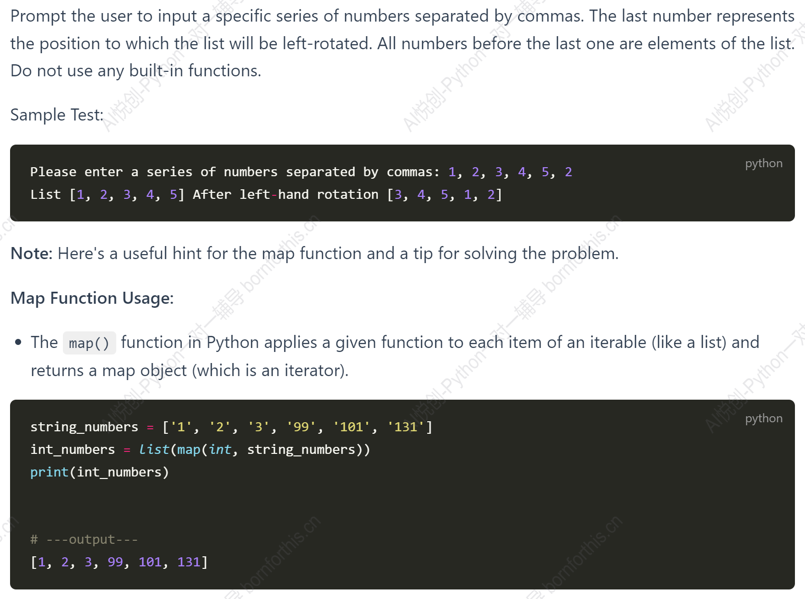
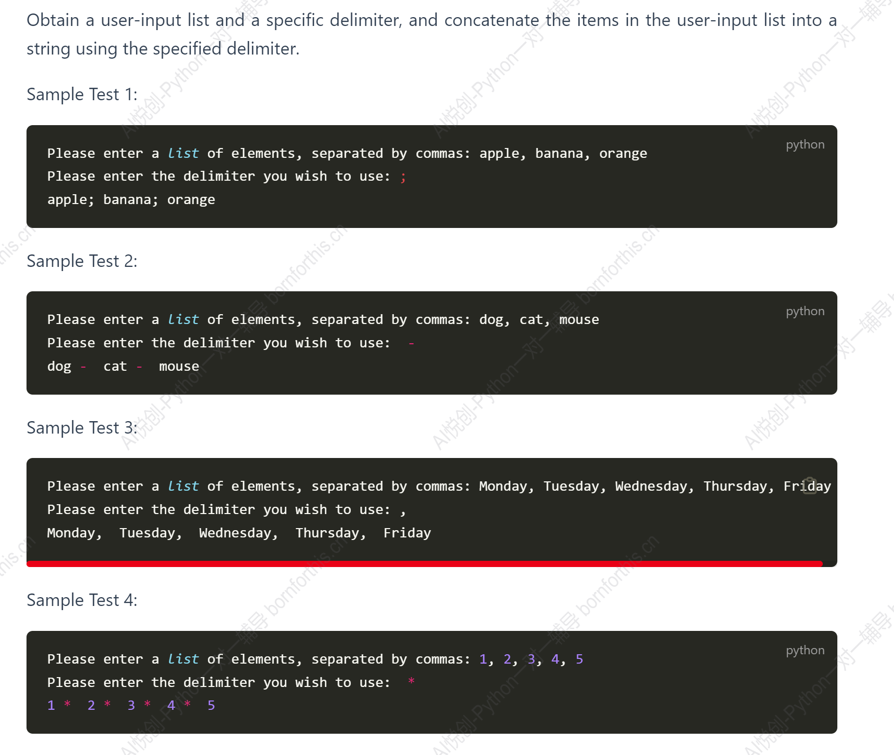
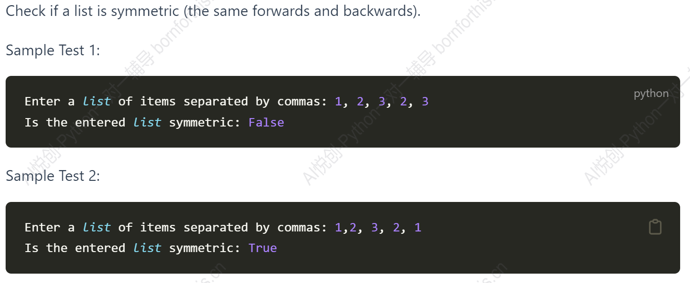
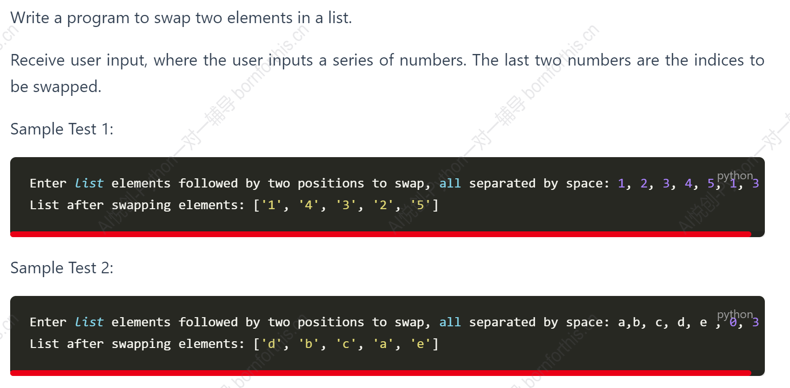

## Question 01



Solution：

```python
string_num = input('Please enter a series of numbers separated by commas:').replace(' ','').split(',')
int_num = list(map(int, string_num))
find_num = int_num.index(int_num[-1])
plus_num = sorted(int_num[:find_num+1],reverse=True)
del int_num[-1]
print('List',int_num)
del int_num[:find_num+1]
int_num.extend(plus_num)
print('After left-hand rotation',int_num)
#output
Please enter a series of numbers separated by commas:1,2,3,4,5,3
List [1, 2, 3, 4, 5]
After left-hand rotation [4, 5, 3, 2, 1]
```

假设输入为`[1,2,3,3,4,5,3]`，上述方法就行不通。

```python
lst = [1,2,3,3,4,5,3]
#我们可以考虑把原列表拆分成两个列表而不是在一个列表里操作
#拆成[1,2,3,3,4,5]和[3]
#降低复杂度
#方法一：pop
position = lst[-1]
lst.pop(-1)
print(lst)

#方法二：列表数据提取
numbers = lst[:len(lst)-1]

#或者
number = lst[:-1]

```


## Question 02

Demonstrate shallow copying of a list and show how it differs from a deep copy.

```python
x = ['rebel', 'material', 'mathematics', ['python', 'javascript']]
y = x.copy()
print(
    f'Original:\n\tx :{x}\n\ty :{y}\n\tid:\n\t\tid_x :{id(x)}\n\t\tid_y :{id(y)}\n\t\tid_children x[2]: {id(x[2])}\n\t\tid_children y[3]: {id(y[2])}')  # id 用来获取变量的物理地址
y[0] = 'memo'
print(
    f'After 1:\n\tx :{x}\n\ty :{y}\n\tid:\n\t\tid_x :{id(x)}\n\t\tid_y :{id(y)}\n\t\tid_children x[2]: {id(x[2])}\n\t\tid_children y[3]: {id(y[2])}')
y[3][0] = 'C++'    # 改变子列表（[3])的0号位
print(
    f'After 2:\n\tx :{x}\n\ty :{y}\n\tid:\n\t\tid_x :{id(x)}\n\t\tid_y :{id(y)}\n\t\tid_children x[2]: {id(x[2])}\n\t\tid_children y[3]: {id(y[2])}')
#output
Original:
	x :['rebel', 'material', 'mathematics', ['python', 'javascript']]
	y :['rebel', 'material', 'mathematics', ['python', 'javascript']]
	id:
		id_x :1806360243136
		id_y :1806360197632
		id_children x[2]: 1806357479024
		id_children y[3]: 1806357479024
After 1:
	x :['rebel', 'material', 'mathematics', ['python', 'javascript']]
	y :['memo', 'material', 'mathematics', ['python', 'javascript']]
	id:
		id_x :1806360243136
		id_y :1806360197632
		id_children x[2]: 1806357479024
		id_children y[3]: 1806357479024
After 2:
	x :['rebel', 'material', 'mathematics', ['C++', 'javascript']]
	y :['memo', 'material', 'mathematics', ['C++', 'javascript']]
	id:
		id_x :1806360243136
		id_y :1806360197632
		id_children x[2]: 1806357479024
		id_children y[3]: 1806357479024
```

With shallow copying, the sublists of both lists are still in the same storage.


## Question 03



Solution：

```python
str = input('Please enter a list of elements, separated by commas:')
tag = input('Please enter the delimiter you wish to use')
str1 = str.replace(',',tag)
print(str1)
#output
Please enter a list of elements, separated by commas:1, 2, 3, 4, 5
Please enter the delimiter you wish to use@
1@ 2@ 3@ 4@ 5
```

 或者：

```python
lst = input('Please enter a list of elements, separated by commas:').replace(' ','').split(',')
tag = input('Please enter the delimiter you wish to use')
new_lst = tag.join(lst)
print(new_lst)
```


## Question 04



Solution:

```python
lst = input('Enter a list of items separated by commas:').replace(' ','').split(',')
lst_num = list(map(int,lst))
lst_reverse = lst_num.copy()
lst_reverse.reverse()#或者lst_reverse = lst[::-1]
print('Is the entered list symmetric:',lst_num == lst_reverse)
```


## Question 05



```python
lst_num = input('Enter a list of items separated by commas:').replace(' ', '').split(',')
a = int(lst_num[-1])
b = int(lst_num[-2])
swap1 = lst_num[a]
swap2 = lst_num[b]
lst_num[a], lst_num[b] = lst_num[b], lst_num[a]
lst_num[:-2]
print('List After swapping elements', lst_num)
```


