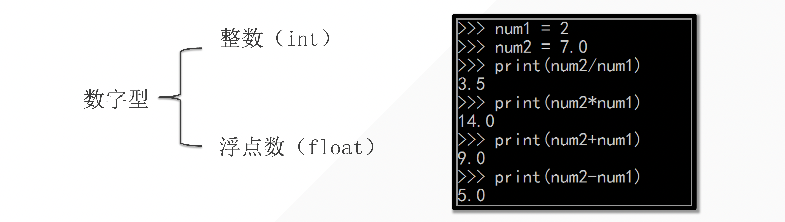

## 1.数字型的特点



```python
In [1]: 1 + 1
Out[1]: 2

In [2]: 1 + 1.0
Out[2]: 2.0

In [3]: 2 - 1
Out[3]: 1

In [4]: 2 - 1.0
Out[4]: 1.0

In [5]: 2 * 2
Out[5]: 4

In [6]: 2 * 2.0
Out[6]: 4.0

In [7]: 9 / 3
Out[7]: 3.0

In [8]: #如果其中有一个元素是浮点数的话, 最后的结果就是浮点数【优先级】

In [9]: #除法涉及精度问题，所以最后得到浮点数
```


## 2. 算术运算符

算术运算符：用于算术运算

| 运算符 | 描述                                   | 例子   |
| ------ | -------------------------------------- | ------ |
| `+`    | 加法运算符                             | 1+1=2  |
| `-`    | 减法运算符                             | 2-1=1  |
| `*`    | 乘法运算符                             | 2*2=4  |
| `/`    | 除法运算符                             | 9/3    |
| `**`   | 指数运算符                             | 2**3   |
| `%`    | 取余运算符                             | 9%2=1  |
| `//`   | 除法取整运算符，计算商并去除其小数部分 | 9//2=4 |


## 3. 小试牛刀：数字变换

假设你有一个两位的整数，我们需要通过以下规则产生两个新的数字：

- 第一个新数字是原数字的两位数中的各个数字的和；
- 第二个新数字是原数字的反转（如原数字为21，反转后的数字为12）。

请你编写 Python 代码，实现以上要求。

**输入：**

一个整数 `num` （10 ≤ num ≤ 99）

**输出：**

两个整数，或者一个错误信息字符串。

**示例：**

假设输入的数字 `num` 为 91，那么你的代码应当输出两个数字：10（9和1的和）和19（91的反转）。

假设输入的数字 `num` 为 26，那么你的代码应当输出两个数字：8（2和6的和）和62（26的反转）。

假设输入的数字 `num` 为 18，那么你的代码应当输出两个数字：9（1和8的和）和81（18的反转）。


```python
num = 89
num1 = num // 10
num2 = num % 10
print(num1 + num2, num2 * 10 + num1)
#output
17 
```

