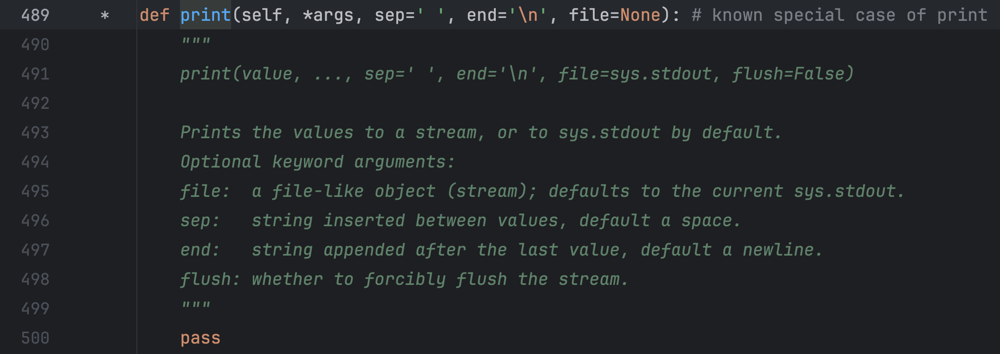
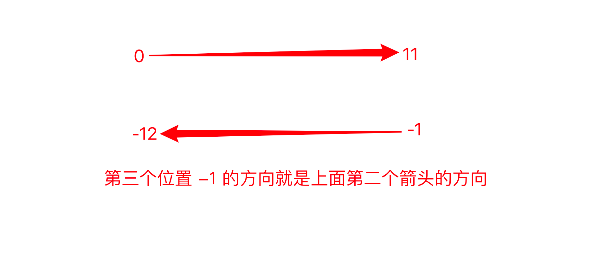
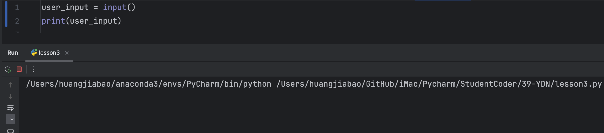
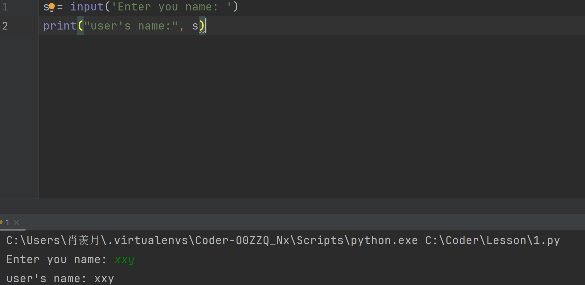

## 1. 字符串的定义

字符串是由字母，数字和特殊字符组成的序列。


## 2. 创建字符串

如何创建字符串？

——使用<span style="color:pink">单引号，双引号</span>和<span style="color:pink">三引号</span>

```python
name = 'shelly'
number = "110"
paragraph = '''hello, shelly!
hello, world'''
paragraph_two = """hello, shelly!
hello, world"""
```

### 2.1**为什么Python同时支持三种创建字符串的方法？**

**原因一：（单双引号混用）**

```python
string = 'I am a coconut'
print(string)
```

但是英文可以缩写如下:

```python
string = 'I'm a coconut'
print(string)
#output
 File "C:\Coder\Lesson\1.py", line 1
    string = 'I'm a coconut'
                           ^
SyntaxError: unterminated string literal (detected at line 1)
```

因为开头是单引号，所以python会寻找下一个出现的单引号进行匹配，而第一次出现的单引号不在字符串末尾，所以导致整个字符串异常。（没有完全包裹字符串内容）

如何解决上述内容？——使用双引号。

```python
string = "I'm a coconut"
print(string)

#output
I'm a coconut
```


**原因二：（三引号可以原样输出多行代码）**

```python
我们有时候不仅仅要看选择项以内的答案，也要去思考选择项以外的答案。——AI悦创

浅者见浅，深者见深——黄家宝

起的最早的是理想主义者，跑的最快的是骗子，而胆子最大的是那些冒险家，害怕错过一切，疯狂往里冲的是韭菜，而真正的成功者，可能还没有入场。

先实现功能，再去优化，否则一切会很乱。——AI悦创

凡是你不能清晰写下来的东西，都是你还没有真正理解的东西
```

我们要将其放入字符串：

```python
string = "我们有时候不仅仅要看选择项以内的答案，也要去思考选择项以外的答案。——AI悦创

浅者见浅，深者见深——黄家宝

起的最早的是理想主义者，跑的最快的是骗子，而胆子最大的是那些冒险家，害怕错过一切，疯狂往里冲的是韭菜，而真正的成功者，可能还没有入场。

先实现功能，再去优化，否则一切会很乱。——AI悦创

凡是你不能清晰写下来的东西，都是你还没有真正理解的东西"
print(string)
#output
File "C:\Coder\Lesson\1.py", line 1
    string = "我们有时候不仅仅要看选择项以内的答案，也要去思考选择项以外的答案。——AI悦创
             ^
SyntaxError: unterminated string literal (detected at line 1)

进程已结束，退出代码为 1
```

多行代码放入双引号，输出会报错。

```python
string = "我们有时候不仅仅要看选择项以内的答案，也要去思考选择项以外的答案。——AI悦创\
\
浅者见浅，深者见深——黄家宝\
\
起的最早的是理想主义者，跑的最快的是骗子，而胆子最大的是那些冒险家，害怕错过一切，疯狂往里冲的是韭菜，而真正的成功者，可能还没有入场。\
\
先实现功能，再去优化，否则一切会很乱。——AI悦创\
\
凡是你不能清晰写下来的东西，都是你还没有真正理解的东西"
print(string)
#output
我们有时候不仅仅要看选择项以内的答案，也要去思考选择项以外的答案。——AI悦创浅者见浅，深者见深——黄家宝起的最早的是理想主义者，跑的最快的是骗子，而胆子最大的是那些冒险家，害怕错过一切，疯狂往里冲的是韭菜，而真正的成功者，可能还没有入场。先实现功能，再去优化，否则一切会很乱。——AI悦创凡是你不能清晰写下来的东西，都是你还没有真正理解的东西

```

还是双引号的情况，行后打\，输出连成一行。

要想原样输出：

```python
string = '''我们有时候不仅仅要看选择项以内的答案，也要去思考选择项以外的答案。——AI悦创

浅者见浅，深者见深——黄家宝

起的最早的是理想主义者，跑的最快的是骗子，而胆子最大的是那些冒险家，害怕错过一切，疯狂往里冲的是韭菜，而真正的成功者，可能还没有入场。

先实现功能，再去优化，否则一切会很乱。——AI悦创

凡是你不能清晰写下来的东西，都是你还没有真正理解的东'''
print(string)

#output
我们有时候不仅仅要看选择项以内的答案，也要去思考选择项以外的答案。——AI悦创

浅者见浅，深者见深——黄家宝

起的最早的是理想主义者，跑的最快的是骗子，而胆子最大的是那些冒险家，害怕错过一切，疯狂往里冲的是韭菜，而真正的成功者，可能还没有入场。

先实现功能，再去优化，否则一切会很乱。——AI悦创

凡是你不能清晰写下来的东西，都是你还没有真正理解的东

进程已结束，退出代码为 0
```

由此发现，三引号可以原样输出。

可以从上面的输出可知，原本什么格式，输出就是什么格式。「原样输出」「三个单引号的效果和上面一样」

- **<span style="color:orange">三个单引号或者三个双引号，实现原样输出。</span>**
- **<span style="color:orange">多行注释</span>**
- **<span style="color:orange">单双三引号混用</span>**（代码略）
- 


## 3.字符串长度

如何获取一个字符串长度——使用 len()

```python
p = "Hello,Coconut!"
print(len(p))
#output
14
```

在获取字符串长度时，从数字1开始数。


## 4.字符串中的字符获取

### 4.1 获取单个字符

输出c

```python
string = "coconut"
#获取单个字符
select = string[0]
print(select)

#output
c
```

三种输出t的方法

```python
string = "coconut"
select = string[-1]
print(select)

string = "coconut"
select = string[6]
print(select)

string = "coconut"
select = string[len(string) - 1]
print(select)
```


### 4.2 提取多个连续的字符串[子字符串]

```python
string = 'coconut'
"""
语法: string = "bornforthis"
select = string[start: end]
PS: end 记得 +1, 因为最后一个不算
"""
select = string[0:6]
print(select)

#output
coconu
```

### 4.3 获取多个不连续字符

```python = "0123456789"
string = 012345678
"""
语法: string = "0123456789"
select = string[start: end: sep]
PS: end 记得 +1
"""
select = string[0:10:2]
print(select)

#output
02468
```

这里我们把[0:10:2]换成[ : :2]，发现输出结果还一样。故可知，默认开头和结尾。


### 4.5 字符串倒序

#### 4.5.1 实现

字符串的第三个位置，控制的是字符提取的方向。默认为正数 1，如果我们改成 -1，则会变成反方向。

::: warning

正负控制方向，数字大小控制步长。

:::

```python
string = "bornforthis"
select = string[::-1]
print(select)

# 输出
sihtrofnrob
```

#### 4.5.2存在的问题

#### 4.5.2 存在的问题

::: info 思考🤔

上面代码 `string[::-1]` 前两位省略了什么数字？尝试填写上去。

:::

```python
string = "bornforthis"
select = string[0:11:-1]
print(select)
```

这样不会得到结果也不会报错。

why？


怎么解决？


#### 4.5.3 解决方法

##### 4.5.3.1 方法一：调换位置

- 能否解决：可以

- 存在什么问题?少一个字母。

    ```python
    string = "bornforthis"
    select = string[11:0:-1]
    print(select)
    #output
    sihtrofnro
    ```

为什么少一个字母？

——存在一个悖论，因为结束是0，但是0+1时是1，1又代表了从左往右数第二个字母。故而+1是无法解决和实现了。

但是，我们可以利用不写结尾，得到最后一个缺失的字符。 string[11::-1]。


#####  4.5.3.2 方法二：重新开始写结尾

想想字符串的有序性，从右到左。

为什么要纠结前面两个空的数字是多少？——为了之后的到某一部分的字符串倒序。

```python
string = "bornforthis"
select = string[-1:-12:-1]
print(select)
#output
sihtrofnrob
```



小试牛刀：获取rofn

```python
string = "bornforthis"
select = string[-5:-9:-1]
print(select)
```


## 5. 字符串的内置方法


### 5.1 .upper（）

将字符串内容全部转成大写。

```python
string = "taurus"
upper_string = string.upper()
print(upper_string)
#output
TAURUS
```


### 5.2 .lower()

将字符串内容全部转成小写。

```python
string = "SHERRY"
lower_string = string.lower()
print(lower_string)
#output
sherry
```


### 5.3 .capitalize()

将字符串首字母，转化成大写。【只对第一个字母大写，其他的不变】

```python
string = "moon in taurus"
capitalize_string = string.capitalize()
print(capitalize_string)
#output
Moon in taurus
```


### 5.4 .title()

将字符串中的每个单词的首字母，转换成大写。

```python
string = "moon in taurus"
title_string = string.title()
print(title_string)
#output
Moon In Taurus

#不管是什么间隔，都会转成首字母大写。
string = "moon-in-taurus"
title_string = string.title()
print(title_string)
#output
Moon-In-Taurus
```


### 5.5 .startswith()

检测字符串是不是以特定字符或单词开头，返回布尔值。

```python
string = "sherry"
startswith_string = string.startswith("s")
print(startswith_string)
#output
True

string = "sherry"
startswith_string = string.startswith("a")
print(startswith_string)
#output
False

string = "sherry"
startswith_string = string.startswith("sw")
print(startswith_string)
#output
False
```


### 5.6 .endswith()

检测字符串是不就是以特定单词或字符结尾，返回布尔值。

```python
string = "taurus"
endswith_string = string.endswith("s")
print(endswith_string)
#output
True

string = "taurus"
endswith_string = string.endswith("us")
print(endswith_string)
#output
True

string = "taurus"
endswith_string = string.endswith("u")
print(endswith_string)
#output
False
```


### 5.7 .count()

计算特定字符或单词在目标字符串中存在的次数

```python
string = "taurus"
count_string = string.count("u")
print(count_string)
#output
2

string = "taurus"
count_string = string.count("au")
print(count_string)
#output
1

string = "taurus"
count_string = string.count("d")
print(count_string)
#output
0
```


### 5.8 .find()

寻找目标字符或单词在特定字符串中，第一次出现的下标。「也就是出现重复，也只是返回第一次出现的下标」如果是查找单词，那么 find() 返回目标单词的第一个字符的下标。

如果，查询的字符或单词不存在，则返回 -1。

```python
string = "taurus"
find_string = string.find("t")
print(find_string)
#output
0

string = "taurus"
find_string = string.find("b")
print(find_string)
#output
-1

string = "moonintaurus"
find_string = string.find("in")
print(find_string)
#output
4

string = "moonintaurus"
find_string = string.find("for")
print(find_string)
#output
-1
```


### 5.9 .index()

寻找目标字符或单词在特定字符串中，第一次出现的下标。如果是查找单词，那么 index() 返回目标单词的第一个字符的下标。

如果，查询的字符或单词不存在，则报错。

```python
string = "moonintaurus"
index_string = string.index("i")
print(index_string)
#output
4

string = "moonintaurus"
index_string = string.index("b")
print(index_string)
#output
Traceback (most recent call last):
  File "C:\Coder\Lesson\1.py", line 2, in <module>
    index_string = string.index("b")
ValueError: substring not found

string = "moonintaurus"
index_string = string.index("moon")
print(index_string)
#output
0

string = "moonintaurus"
index_string = string.index("sza")
print(index_string)
#output
Traceback (most recent call last):
  File "C:\Coder\Lesson\1.py", line 2, in <module>
    index_string = string.index("sza")
ValueError: substring not found
```


### 5.10 .isdigit()

判断字符串是不是纯数字字符串，字符串中但凡有一个字符是非数字，则返回False

```python
string = "20040518"
isdigit_string = string.isdigit()
print(isdigit_string)
#output
True

string = "2004 0518"
isdigit_string = string.isdigit()
print(isdigit_string)
#output
False
```


### 5.11 .isalpha()

判断字符串是不是纯字母字符串，字符串中但凡有一个非字母的，则返回False

```python
string = "taurus"
isalpha_string = string.isalpha()
print(isalpha_string)
#output
True

string = " taurus"
isalpha_string = string.isalpha()
print(isalpha_string)
#output
False
```


### 5.12 .isalnum()

判断字符串是不是纯数字或纯字母、纯数字字母字符串，字符串中但凡出现非数字、字母元素，则返回 False。

```python
string = "1234567"
isalnum_string = string.isalnum()
print(isalnum_string)
#output
True

string = "moon"
isalnum_string = string.isalnum()
print(isalnum_string)
#output
True

string = "moon20040518"
isalnum_string = string.isalnum()
print(isalnum_string)
#output
True

string = "moon 20040518"
isalnum_string = string.isalnum()
print(isalnum_string)
#output
False
```


### 5.13 .isupper()

判断字符串中的字符否全大写，全大写则返回 True，否则返回 False。

```python
string = "MOON"
isupper_string = string.isupper()
print(isupper_string)
#output
True

string = "MOON123[]"
isupper_string = string.isupper()
print(isupper_string)
#output
True

string = "MOOn123[]"
isupper_string = string.isupper()
print(isupper_string)
#output
False

string = "moon123[]"
isupper_string = string.isupper()
print(isupper_string)
#output
False
```


### 5.14 .islower()

判断字符串是不分全小写，全小写则返回 True，否则返回 False。

```python
string = "moon"
islower_string = string.islower()
print(islower_string)
#output
True

string = "moon123#@"
islower_string = string.islower()
print(islower_string)
#output
True

string = "moon123#@IN"
islower_string = string.islower()
print(islower_string)
#output
False
```


### 5.15 .isspace()

判断字符串是否为纯空格，多少个空格都可以。纯空格则返回 True，否则返回 False。

```python
string = "     "
isspace_string = string.isspace()
print(isspace_string)
#output
True

string = ""
isspace_string = string.isspace()
print(isspace_string)
#output
False
```


### 5.16 .strip

默认去掉目标字符串的前后空白字符，如果指定参数，则去掉指定字符。

```python
string = "  moonintaurus   "
strip_string = string.strip()
print("原本的字符串",string)
print("去掉前后空格的字符串",strip_string)
#output
原本的字符串   moonintaurus   
去掉前后空格的字符串 moonintaurus


string = "---moonintaurus---"
strip_string = string.strip("-")
print("原本的字符串",string)
print("去掉前后空格的字符串",strip_string)
#output
原本的字符串 ---moonintaurus---
去掉前后空格的字符串 moonintaurus


string = "--- --moonintaurus-- ---"
strip_string = string.strip("-")
print("原本的字符串",string)
print("去掉前后空格的字符串",strip_string)
#output
原本的字符串 --- --moonintaurus-- ---
去掉前后空格的字符串  --moonintaurus-- #可以看到，只能去掉连续的减号


#如果想要去掉减号和空格呢
string = "--- --moonintaurus-- ---"
strip_string = string.strip("- ")
print("原本的字符串",string)
print("去掉前后空格的字符串",strip_string)
#output
原本的字符串 --- --moonintaurus-- ---
去掉前后空格的字符串 moonintaurus
```


### 5.17 .lstrip()

默认去掉字符串左边的空白字符，如果指定参数，则去掉左边的指定字符。

```python
string = "   moonintaurus-- ---"
lstrip_string = string.lstrip()
print("原本的字符串",string)
print("去掉前后空格的字符串",lstrip_string)
#output
原本的字符串    moonintaurus-- ---
去掉前后空格的字符串 moonintaurus-- ---


string = "-----moonintaurus-----"
lstrip_string = string.lstrip("-")
print("原本的字符串",string)
print("去掉前后空格的字符串",lstrip_string)
#output
原本的字符串 -----moonintaurus-----
去掉前后空格的字符串 moonintaurus-----


string = "--- --moonintaurus-- ---"
lstrip_string = string.lstrip("- ")
print("原本的字符串",string)
print("去掉前后空格的字符串",lstrip_string)
#output
原本的字符串 --- --moonintaurus-- ---
去掉前后空格的字符串 moonintaurus-- ---
```


### 5.18 .rstrip()

默认去掉字符串右边的空白字符，如果指定参数，则去掉右边的指定字符。

```python
string = "   bornforthis   "
rstrip_string = string.rstrip()
print("原本的字符串:", string)
print("去掉右边空白字符后:", rstrip_string)

# ---output---
原本的字符串:    bornforthis   
去掉右边空白字符后:    bornforthis


string = "----bornforthis----"
rstrip_string = string.rstrip('-')
print("原本的字符串:", string)
print("去掉右边 '-' 后:", rstrip_string)

# ---output---
原本的字符串: ----bornforthis----
去掉右边 '-' 后: ----bornforthis


string = "----bornforthis-- --"
rstrip_string = string.rstrip('- ')  # 不分先后顺序
print("原本的字符串:", string)
print("去掉右边 '- ' 后:", rstrip_string)

# ---output---
原本的字符串: ----bornforthis-- --
去掉右边 '- ' 后: ----bornforthis
```


### 5.19 .replace()

.replace(old,new,count)第一个位置传入待替换得旧字符，第二个位置传入要替换的新字符，默认替换全部，count控制替换次数。

```python
string = "   moonintaurus   "
replace_string = string.replace(' ', '*')
print("原本的字符串",string)
print("去掉前后空格的字符串",replace_string)
#output
原本的字符串    moonintaurus   
去掉前后空格的字符串 ***moonintaurus***  #默认全都替换掉


string = "aiaiai"
replace_string = string.replace('ai', 'love',1)  #count不用加引号
print("原本的字符串",string)
print("去掉前后空格的字符串",replace_string)
#output
原本的字符串 aiaiai
去掉前后空格的字符串 loveaiai
```


### 5.20 .split（）

`.split(sep,maxsplit)`以特定字符进行分割，默认空壳分割。 如果传入参数sep ，则以参数进行分割。返回分割后的列表，maxsplit用于控制分割几次。

```PYTHON
string = "moon in taurus"
split_string = string.split()
print("原本的字符串",string)
print("去掉前后空格的字符串",split_string
#output
原本的字符串 moon in taurus
去掉前后空格的字符串 ['moon', 'in', 'taurus']    #默认空格分割


string = "moon-in-taurus"
split_string = string.split('-')    #以-分割
print("原本的字符串",string)
print("去掉前后空格的字符串",split_string)
#output
原本的字符串 moon-in-taurus
去掉前后空格的字符串 ['moon', 'in', 'taurus']

string = "moon-in-taurus"
split_string = string.split('-',1)
print("原本的字符串",string)
print("去掉前后空格的字符串",split_string)     
#output
原本的字符串 moon-in-taurus
去掉前后空格的字符串 ['moon', 'in-taurus']
      
string = 'I   am good at playing piano.'
list_string = string.split(' ')
print(list_string)
#output
['I', '', '', 'am', 'good', 'at', 'playing', 'piano.']
```


### 5.21 .rsplit()

`.rsplit(sep, maxsplit)` 从字符串右边进行分割，也可以传入参数「sep」，进行指定分割。返回分割后的列表。maxsplit 指定分割次数。

```python
string = "moon-in-taurus"
rsplit_string = string.rsplit('-')
print("原本的字符串",string)
print("去掉前后空格的字符串",rsplit_string)
#output
原本的字符串 moon in taurus
去掉前后空格的字符串 ['moon', 'in', 'taurus']  


string = "moon-in-taurus"
rsplit_string = string.rsplit('-',1)
print("原本的字符串",string)
print("去掉前后空格的字符串",rsplit_string
#output
原本的字符串 moon-in-taurus
去掉前后空格的字符串 ['moon-in', 'taurus']
```


### 5.22 .join()

以特定字符是字符串间隔。

```python
string = "moonintaurus"
join_string = '-'.join(string)
print("原本的字符串：",string)
print("加上间隔的字符串：",join_string)
#output
原本的字符串： moonintaurus
加上间隔的字符串： m-o-o-n-i-n-t-a-u-r-u-s
```


## 6. 字符串格式化

```python
string = "Hi Xiaoxianyue,Welcome to Haikou"
print(string)

#---output---
Hi Xiaoxianyue,Welcome to Haikou
```

- 所存在的问题：需要换一个人名或者地区，就需要重新创建一个全新的字符串。
- 我们希望有类似模版，让我们把不同人名，地区填写进去。而不是每个人都从头创建一个新的字符串。

当然可以使用字符串的加法，大过于复杂冗长。

```python
str1 = "Hi "
str2 = ",Welcome to "
str3 = "."
string = str1 + "Billkin" + str2 + "Fuzhou" + str3
print(string)
#output
Hi Billkin,Welcome to Fuzhou.
```

这时存在一个问题：由于Python中不同的数据类型不可以直接相加，除非强制转换类型为字符串。

```python
string = "money is" + 190
print(string)
#output
Traceback (most recent call last):
  File "C:\Coder\Lesson\1.py", line 7, in <module>
    string = "money is" + 190
TypeError: can only concatenate str (not "int") to str


#转换后：
string = "money is " + str(190)
print(string)
#output
money is 190
```

——format 就应运而生。


### 6.1 .format

1.单个花括号{}

```python
string = "Hi {},Welcome to Beijing".format("XiaoXianyue")
print(string)
#output
Hi XiaoXianyue,Welcome to Beijing

template_string = "Hi {},Welcome to Beijing"
print(template_string.format("XiaoXianyue"))
#output
Hi XiaoXianyue,Welcome to Beijing
```


2.一个花括号以上 [按顺序填入]

```python
template_string = "Hi {},Welcome to {}"
print(template_string.format("XiaoXianyue","Beijing"))
#output
Hi XiaoXianyue,Welcome to Beijing

string = "Hi {},Welcome to {}".format("Xiaoxianyue","Beijing")
print(string)
#output
Hi XiaoXianyue,Welcome to Beijing
```


3.多个花括号指定位置

```python
string = "Hi {1},Welcome to {0}".format("Beijing","Xiaoxianyue")
print(string)
#output
Hi XiaoXianyue,Welcome to Beijing


string = "Hi {1},Welcome to {0}"
print(string.format("Beijing","Xiaoxianyue"))
#output
Hi XiaoXianyue,Welcome to Beijing
```


4.参数指定

```python
string = "Hi {name},Welcome to {region}"
print(string.format(region="Beijing",name="Xiaoxianyue"))
#output
Hi XiaoXianyue,Welcome to Beijing

string = "Hi {name},Welcome to {region}"
print(string.format(name="Xiaoxianyue", region="Beijing"))
#output
Hi XiaoXianyue,Welcome to Beijing

template_string = "Hi {name},Welcome to {region}"
new_string = template_string.format(name="Xiaoxianyue", region="Beijing")
print(new_string)
#output
Hi XiaoXianyue,Welcome to Beijing
```


5.保留指定小数位。

```python
string = "my age is {:.3f}".format(19)
print(string)
#output
my age is 19.000

string = "my age is {:.2f}".format(19)
print(string)
#output
my age is 19.00
```


### 6.2 f

1.直接读取变量

```python
name = "Xiaoxianyue"
region = "Beijing"
string = f"hi {name},welcome to {region}"#与format区别：python3.6+，更简洁，省略了format的模版化
print(string)
#output
Hi XiaoXianyue,Welcome to Beijing
```

2.保留指定位小数


```python
age = 19
string = f"My age is {age:.3f}"
print(string)
#output
my age is 19.000
```


### 6.3 %

- %d: 整数
- %s：字符串
- %f：浮点数

1.单个位置传入

```python
string = "My age is %d"
new_s = string %19
print(new_s)

string = "My age is %d"
print(string % 19)

string = "My age is %d" % 19
print(string)

#output
My age is 19
My age is 19
My age is 19
```


2.多个位置传入

```python
string = "My age is %d %s"
new_s = string %(19, "耶耶耶")
print(new_s)

string = "My age is %d %s"
print(string % (19, "耶耶耶"))

string = "My age is %d %s" %(19,"耶耶耶")
print(string)

#output
My age is 19 耶耶耶
My age is 19 耶耶耶
My age is 19 耶耶耶
```


3.保留小数位

```python
string = "My age is %.3f"
new_s = string %(19.8790)
print(new_s)

string = "My age is %.3f"
print(string % (19.12345))

string = "My age is %.3f" %(19.45678)
print(string)

#output
My age is 19.879
My age is 19.123
My age is 19.457
```


### 6.4 f 和 format，% 的优缺点

format 和 % 都像模版，提前做好模版后面有需要试可以直接使用；

而 f 就像在银行当中，柜员边问你边登记，不能提前做好模版。


## 7. 字符串不可变性

字符串是不可变的，不可以改变字符串中的任何元素，如需改变字符串中的元素，则需要新建一个字符串。

```python
s = "Hello World!"
s[0] = "a"
#报错
Traceback (most recent call last):
  File "C:\Coder\Lesson\1.py", line 2, in <module>
    s[0] = "a"
TypeError: 'str' object does not support item assignment

```

除了使用 replace 还可以使用字符串拼接：

```python
s = "Hello World!"
news = "a" + s[1:]
print(news)
#output
aello World!
```


## 8. 字符串转义


| 转义字符 | 含义                               | 例子                     |
| -------- | ---------------------------------- | ------------------------ |
| `\\`     | 反斜杠符号，为了在字符串中得到 `\` | `s = "bor\\nforthis"`    |
| `\b`     | 退格，类似删除键                   | `s = "bornff\borthis"`   |
| `\n`     | 换行                               | `s = "bornfor\nthis"`    |
| `\t`     | 制表符                             | `s = "born\tfor\tthis"`  |
| `r`      | 取消转义「R 和 r」都可以           | `s = r"born\tfor\tthis"` |

示例代码：


```python
s = "moonin\\taurus"
print(s)
#output
moonin\taurus

s = "mooninn\btaurus"
print(s)
#output
moonintaurus

s = "moonin\ntaurus"
print(s)
#output
moonin
taurus

s = "moon\tin\ttaurus"
print(s)
#output
moon	in	taurus    #间隔四个空格

s = r"moon\tin\ttaurus"
print(s)
#output
moon\tin\ttaurus
```


## 9. 字符串的连接

```python
s1 = "xiao"
s2 = "xianyue"
print(s1+s2)
print(s1,s2)
#output
xiaoxianyue
xiao xianyue

s1 = "*-money-"
print(s1 * 10)
#output
*-money-*-money-*-money-*-money-*-money-*-money-*-money-*-money-*-money-*-money-

s1 = "*-money-"
print(s1 * 10,end="*")
#output
*-money-*-money-*-money-*-money-*-money-*-money-*-money-*-money-*-money-*-money-*

```


## 10. 读取用户的输入

### 10.1 input()读取用户的输入

```python
user_input = input()
print(user_input)
```

### 10.2 input()使用输入提示

但是上面的代码，有点小问题：在运行的时候并不能很直观的知道，程序需要我们输入，何况非程序员用户呢？



如何解决？——输入提示

input()函数里面支持我们写入字符串进行提示。

```python
s = input('Enter you name: ')
print("user's name:", s)
#output
Enter you name: xxy
user's name: xxy
```




### 10.3 input 的特点

#### 10.3.1 input（）得到的类型皆为字符串

```python
In [2]: type(input(':>>>'))
:>>>bornforthis
Out[2]: str

In [3]: type(input(':>>>'))
:>>>12
Out[3]: str

In [4]: type(input(':>>>'))
:>>>12.1
Out[4]: str

In [5]: type(input(':>>>'))
:>>>(1, 2, 3, 4)
Out[5]: str

In [6]: type(input(':>>>'))
:>>>[1, 2, 3, 4]  
Out[6]: str

In [7]: type(input(':>>>'))
:>>>{1, 2, 3, 4, 5}
Out[7]: str

In [8]: type(input(':>>>'))
:>>>{'a': 19, 'b': 20}
Out[8]: str

In [9]: type(input(':>>>'))
:>>>True
Out[9]: str

```

通过上面的代码示例，我们可以知道：通过 input() 获取用户输入，得到的数据类型都是字符串。得知 input() 的特点后，如何解决这个问题呢？——用户如何实现：直接输入原有的类型并得到原有的类型。、

#### 10.3.2 方法一：强制类型转化

```python
In [1]: n = int(input('>>>'))
>>>12

In [2]: type(n)
Out[2]: int

#但这种方法存在一些问题

#列表不行
In [7]: s = list(input(':>>>'))
:>>>[1,2,3,4]

In [8]: s  
Out[8]: ['[', '1', ',', '2', ',', '3', ',', '4', ']']

#元组也不行
In [11]: t = tuple(input(':>>>'))
:>>>(1,2,3)

In [12]: t
Out[12]: ('(', '1', ',', '2', ',', '3', ')')

```

- 适合：数字【整数，浮点数】，字符串，布尔型
- 不适合：列表，元组，字典，集合


#### 10.3.3 使用eval()

1. eval()的妙用 

```python
#全部测试：
In [28]: s = eval(input(':>>>'))
:>>>12

In [29]: type(s), s
Out[29]: (int, 12)

In [30]: s = eval(input(':>>>'))
:>>>[1, 2, 3]

In [31]: type(s), s
Out[31]: (list, [1, 2, 3])

In [32]: s = eval(input(':>>>'))
:>>>(1, 2, 3)

In [33]: type(s), s
Out[33]: (tuple, (1, 2, 3))

In [34]: s = eval(input(':>>>'))
:>>>{1, 2, 3}

In [35]: type(s), s
Out[35]: (set, {1, 2, 3})

In [36]: s = eval(input(':>>>'))
:>>>True

In [37]: type(s), s
Out[37]: (bool, True)

In [38]: s = eval(input(':>>>'))
:>>>{'a': 1, 'b': 2}

In [39]: type(s), s
Out[39]: (dict, {'a': 1, 'b': 2})
```


2. eval()伴随着的问题

```python
In [24]: S = eval(input(':>>>'))
:>>>string
---------------------------------------------------------------------------
NameError                                 Traceback (most recent call last)
Cell In[24], line 1
----> 1 S = eval(input(':>>>'))

File <string>:1

NameError: name 'string' is not defined

```

从上面的代码可以得知，eval 大概率实现的是去掉字符串左右两边的引号。「这个地方 eval 或许不是按我说的实现，但是为了让你们更好理解原理，先这样来。」

**所以，为什么会导致上面的报错呢？**

第一步：获取用户输入：s = eval(input(':>>>'))

第二步：这一步骤出现了错误。其中 input 会得到 'string'，而通过 eval 转换之后，去掉了‘’，string就变成了一个“四不像”（严格来说类似于变量）。所以把它读取成了一个变量。但是我们实际上我们在我们之前的代码中，并没有创建 string 这个变量。

第三步：报错，当然没有通过上面的分析也可以大概预料到问题，因为报错很直观：NameError: name 'string' is not defined 。

所以，**解决方法**很直白：

1. 在获取用户输入之前直接提前创建一个叫做 string 的变量；「显然，不是我们想要的」

2. 输入的时，有意加上单引号或者双引号、三引号。bingo！

解决方法具体如下：

```python
In [50]: string = 'hello this string'

In [51]: s = eval(input(':>>>'))
:>>>string

In [52]: s
Out[52]: 'hello this string'

In [53]: num = 12

In [54]: s = eval(input(':>>>'))
:>>>num

In [55]: type(s), s
Out[55]: (int, 12)

In [56]: s = eval(input(':>>>'))
:>>>'string'

In [57]: type(s), s
Out[57]: (str, 'string')
```


3. eval()小技巧。

任务要求：获取用户输入，实现两位的加减乘除。

```python
In [30]: eval(input(':>>>'))
:>>>2-1
Out[30]: 1
```


## 11. 小试牛刀

获取用户输入来看两个整数，得到两个整数的和。

要求：

- 只能使用一个input函数。
- 用户输入格式：num1 num2
- 输出计算结果。

方法一：

```python
num1 = int(input(""))
num2 = int(input(""))
print(num1 + num2)
#output
1
2
3
```

很显然，上面的输出格式并不是我们想要的，并且使用了两个输入函数。

那怎么实现我们想要的输出（两数字在同一行，中间有空格分割），并且只使用一个input函数？

1. 在同一行，说明我们只能定义一个字符串。

2. 那如何把两个输入的字符分隔开？我们前面有记录.split()的功能，把字符串内部用空格分割开。

```python
num = input()
new_n = num.split()
print(int(new_n[0]) + int(new_n[1]))
#output
1 2
3
```


方法二：用eval实现

```python
num = eval(input().replace(" ","+"))
print(num)
#output
1 2
3
```

1. 在之前eval的妙用中，我们可以看到，eval中的输入如果是’1+2‘（带上运算符）的，会直接算出结果。

所以不需要上一步的 print(int(new_n[0]) + int(new_n[1]))此类步骤实现运算。

2. 输入是空格不是加号，我们就要用replace将用户输入的空格变成加号来进行最后的运算。


