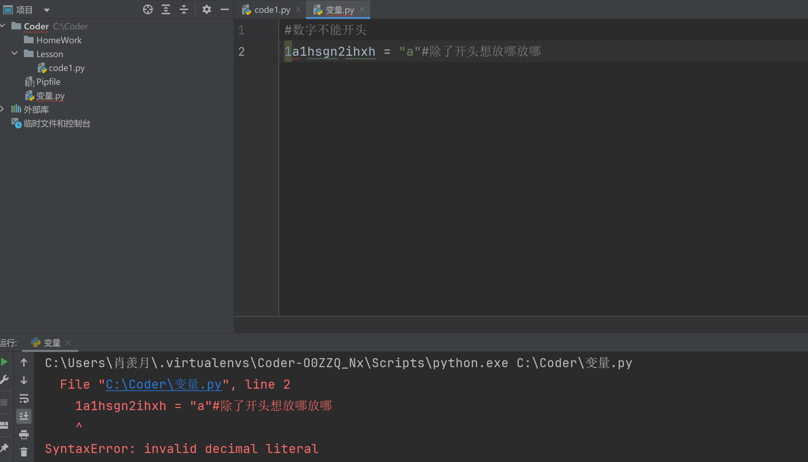
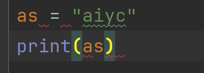
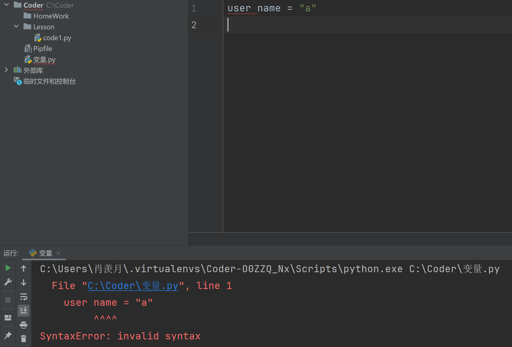

## 1. 如何创建笔记

- 文件取名：文件名不能空格，要用–或_代替

- 自动生成日期：[https://bornforthis.cn/python/#/](https://bornforthis.cn/python/#/)

- 在笔记上创建链接`[链接名称](链接)`

- 标题分级： 二级标题 ##+空格+（标题号）

    三级标题###+空格+（标题号)

    …..以此类推

## 2. 变量

### 2.1 从字面意思理解变量

- 变：变化
- 量：大小

#### 2.1.1 Austin 与 Jaden例子

```python
Austin = "Coke"
Jaden = "juice"
print("Austin", Austin)
print("Jaden", Jaden)
Cup = Austin
Austin = Jaden
Jaden = Cup
print("Austin", Austin)
print("Jaden", Jaden)
```

#### 2.1.2 举个例子🌰（理解变量）

假如，你是班级当中的课代表，每个月需要统计班级中每个学生的月考成绩。月考成绩会每个月一张纸，每张纸上都会依次记录每个学生的成绩越到成绩，例如：

1. 李雷    98分
2. 马冬梅    89分
3. 刘奕彤     96分
4. ......

某一天，老师要看刘奕彤 1月、2月、3月的成绩，这个时候作为课代表的你需要怎么办。——总不能直接把每个月的月考成绩单直接给老师，显然是不合适的。

我们应该把刘奕彤 1月、2月、3月的成绩抄写到单独的一张纸上，接着给老师。

那么，我们为什么不一开始直接为每一个学生分配一个信封呢？（也可以是档案袋）信封在一开始是扁的，当我们放东西（数据）进去之后，是不是鼓起来了？——是不是变化了？是不是有大小了呢？显然是的。

那么信封，是不是在我们当前所处的空间当中开辟空间，来存放数据并且说这是信封。

类似的有：冰箱，不也是在我们当前所处的空间中，开辟空间。

——所以，**<span style="color: orange">变量不就是在计算机的内存当中开辟空间，来存储数据。</span>**

###  2.2  如何创建变量

#### 2.2.1 变量

1. **变量：通过变量名代表或引用某个值。**

- 女娲捏了泥人，泥人没有生命，女娲挥了挥手柳条，赋予给泥人生命。此时，泥人可以代表说是女娲的后人。「变量：泥人，值：女娲」
- 全国人民代表大会，中的人大代表，是由广大人民群众投票选举出来的。他们的权利不是自己获取的，所以他们可以说：我代表的是广大人民群众的意志。「变量：人大代表，值：人民群众」

2. 初始化赋值语句: **变量名 = 表达式**

- 变量名：就是这个空间，我们叫它什么名字；
- 表达式：类似数学表达；

程序的运行逻辑：**从上到下，从右到左，最后才是赋值。**

#### 2.2.2 变量的赋值

```python
x = 1 #1赋值给x
x = x + 1 #x代表1， 所以x + 1 = 2 最后2赋值给x
print(x) #井号注释 快捷键：Ctrl键+/
#变量的覆盖：
name1 = "lilei"
name1 = "xiaoxianyue"
print(name1)
```

### 2.3 变量的输出

#### 2.3.1输出结果换行与不换

```python
#输出结果换行
a = 1
b = 1
c = 1
print(a)
print(b)
print(c)
#输出结果不换行
a = 1
b = 1
c = 1
print(a, b, c) #输出默认以空格间隔
```

#### 2.3.2 end 与 sep

```python
#输出结果怎么手动换行？(end):
a = 1
b = 1
c = 1
print(a, end="\n") #end控制语句的结尾，\n表示 a new line
print(b)
print(c)
#(sep):
a = 1
b = 1
c = 1
print(a, b, c) #输出默认以空格间隔 怎么改空格？
print(a, b, c, sep= "okokok")#sep控制间隔
#end 与 sep可以同时使用
```


### 2.4进阶的赋值方法

#### 2.4.1 同时给多个变量赋予同一个内容

```python
a = b = c = 100
```


#### 2.4.2 同时给多个变量赋予不同的内容

```python
a, b, c = 1, 2, 3
```

##### 2.4.2.1接Austin 与 Jaden的例子

```python
Austin = "Coke"
Jaden = "juice"
print("Austin", Austin)
print("Jaden", Jaden)
Jaden, Austin = Austin, Jaden
print("Austin", Austin)
print("Jaden", Jaden)
```


### 2.5变量命名规则

- 大小写英文，数字和_的结合，且不能用**数字开头**



- 系统关键词不能做变量名使用   获取关键字列表 (在pycharm里运行）: help(‘keywords’)



关键词：

```python
False               class               from                or
None                continue            global              pass
True                def                 if                  raise
and                 del                 import              return
as                  elif                in                  try
assert              else                is                  while
async               except              lambda              with
await               finally             nonlocal            yield
break               for                 not                 
```


怎么解决？：

```python
_as = "aiyc"

As = "aiyc"

aS = "aiyc"

AS = "aiyc"
```


- Python中的变量名区别大小写

```python
n = "A"
N = "a"
print(n)#若变量不区分大小写，输出什么结果？--a
#所以N n不是同一个变量!
```


- 变量名不能包含空格，可以使用下划线来分隔其中的单词



可以：

```python
user_name = "a"
```


- 不要用Python内置函数名做变量名

```python
print = "aiyc"
print(print)#不能用内置函数名
```


### 2.6 练习（加粗体题号错误过）

1. 在 Python 中，变量名可以以数字开始。
    - [ ] 对
    - [x] 错

2. 在Python中，以下哪个变量名是有效的？
    - [ ] 2myVar
    - [x] myVar2
    - [ ] my-var
    - [ ] my var

3. 在Python中，变量名区分大小写。
    - [x] 对
    - [ ] 错

4. 在Python中，`my_var` 和 `myVar` 是同一个变量。
    - [ ] 对
    - [x] 错

5. 变量名可以是Python中的关键字。
    - [ ] 对
    - [x] 错

6. `None` 是Python中的特殊类型，表示没有值或空值。
    - [x] 对
    - [ ] 错

7. 在Python中，以下哪个是有效的变量赋值？
    - [ ] 123abc = "hello"
    - [ ] for = "world"
    - [x] _hidden = "secret"
    - [ ] import = 123

8. 在Python中，一个变量可以同时被赋予多个值。
    - [x] 对
    - [ ] 错

9. 在Python中，以下哪个是多变量赋值？
    - [x] a, b, c = 1, 2, 3
    - [ ] a = 1, b = 2, c = 3
    - [ ] a; b; c = 1; 2; 3
    - [ ] a = 1; b = 2; c = 3;

10. 变量在使用之前必须被赋值。
    - [x] 对
    - [ ] 错

11. Python中变量的类型是静态的，一旦赋值就不能改变。
    - [ ] 对
    - [x] 错

12. 在Python中，以下哪个表示全局变量？
    - [ ] var = "hello"
    - [x] global var
    - [ ] var(global)
    - [ ] def var():

13. 以下哪个表示删除变量？
    - [ ] delete x
    - [x] del x
    - [ ] remove x
    - [ ] destroy x

14. `x = 5` 之后 `y = x`，现在改变 `y` 的值，`x` 的值也会改变。
    - [ ] 对
    - [x] 错

15. **[`x = [1, 2, 3]` 之后 `y = x`，现在改变 `y` 的列表内容，`x` 的内容也会改变。]**
    - [x] 对
    - [ ] 错

16. 在Python中，变量只能存储基本数据类型的值，如整数或字符串。
    - [ ] 对
    - [x] 错


