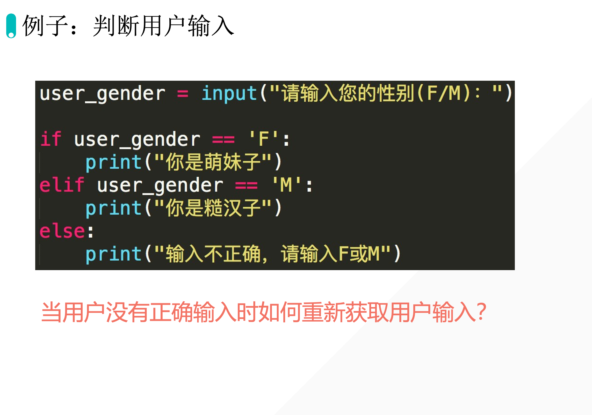

下面的程序允许用户错几次？



1次。

如果在错误的前提下，怎么在输入一次？

```python {7-11}
user_gender = input("Enter your gender(F/M):")
if user_gender == "F":
    print("pink")
elif user_gender == "M":
    print("blue")
else:
    user_gender = input("Enter your gender(F/M)")
    if user_gender == "F":
        print("pink")
    elif user_gender == "M":
        print("blue")
```


## 1. While 循环

### 1.1 3 Question

观察下面代码：

```python
user_answer_correct = False
while not user_answer_correct:
    user_answer = input('Enter your gender: ')
    if user_answer == 'F':
        print('You are a girl student.')
        user_answer_correct = True
    elif user_answer == 'M':
        print('You are a boy student.')
        user_answer_correct = True
    else:
        print('Invalid')
```

while 循环：当满足条件时一直执行里面的代码块。

#### question 01: 

**上面循环的终止条件是什么？**

答：

用户正确输入 ‘F’ 或者‘M’时。

#### question 02：

**为什么一开始需要一个单独的变量 user_answer_correct 来实现？直接 while True 不可以吗？**

答：

观察下面代码：

```python
while not False:
    user_answer = input('Enter your gender: ')
    if user_answer == 'F':
        print('You are a girl student.')

    elif user_answer == 'M':
        print('You are a boy student.')

    else:
        print('Invalid')
```

这个代码会一直循环下去。为什么？==在我们希望循环停止的时候(执行 if 或 `elif` 的时候), 没有办法改变 while 的循环条件==，while循环会一直进行下去。有了变量以后，我们就有办法通过==变量的覆盖==来控制 while 循环条件的改变，从而终止循环。

#### question 03：

**为什么变量要一开始赋值为 False 而不是 True 呢**？

答：

如果赋值为 `True`，输入正确时也返回 `True`。则在输入正确的情况下，循环会一直进行下去。但是我们希望的是在输入错误的情况下循环一直进行下去。所以如果最开始要把 `user_answer_correct`设置成 `True`，则后面 `if` 和 `elif` 之后的 `user_answer_correct`要返回 `False`。

```python
a = True
while a:
    user_answer = input('Enter your gender: ')
    if user_answer == 'F':
        print('You are a girl student.')
        a = False

    elif user_answer == 'M':
        print('You are a boy student.')
        a = False

    else:
        print('Invalid')
```

在逻辑上，用户输入的字符不符合要求了（False 的意思才是输入不符合要求，于是False才会进行下一轮的循环。），用 False 指代会更加的符合逻辑。所以终止循环的条件是应该为 True （表示用户输入对了就不循环了）。


## 3. 循环的输出

```python
i = 1
while i < 10:
    print(i)
    i = i + 1
#output
1
2
3
4
5
6
7
8
9
```


## 4. 课堂练习

编写一个 Python 程序，使用 while 循环来实现一个简单的文本猜数字游戏。游戏的规则如下：程序首先生成一个1到100之间的随机整数，让用户来猜测这个数字是多少。用户每次输入他们的猜测后，程序需要告诉用户猜测是太高了、太低了还是正确。如果用户猜对了数字，程序应打印出用户尝试的次数，并结束循环。用户有机会在放弃前最多猜测10次。如果10次都没猜对，程序应告诉用户正确的数字，并结束。程序要求：使用 while 循环来处理猜测过程。确保程序能够处理非法输入，如非数字输入，应提示用户重新输入有效数字。使用 Python 的 random 模块来生成随机数字。

Solution:

```python
import random

random_num = random.randint(1,100)
n = 0
user_correct = False
while n <= 10 and not user_correct:
    user_num = int(input("Enter a number between 1 and 100"))
    n += 1
    if n == 11:
        print("Sorry,you can't guess")
    elif user_num > random_num:
        print('bigger')

    elif user_num < random_num:
        print('smaller')

    else:
        print('correct')
        user_correct = True
```

优化后代码：

```python
import random

random_num = random.randint(1,100)
guess_count = 0
max_guesses = 10
user_correct = False
while guess_count < max_guesses:
    user_str = input("Enter a number between 1 and 100")
    if not user_str.isdigit():
        print("Please Enter a correct number")
        continue
    user_num = int(user_str)
    guess_count += 1

    if user_num > random_num:
        print('bigger')

    elif user_num < random_num:
        print('smaller')

    else:
        print(f'correct, you guessed {guess_count} times')
        user_correct = True
        break
if user_num != random_num:
    print(f'Sorry, you connot guess')
```


## 5. 课后作业

编写一个 Python 程序，使用 `while` 循环实现一个基础的 ATM 机系统。程序应该具备以下功能：

1. **初始设定：** 程序开始时，要求用户设定初始的账户余额。
2. **交互菜单：** 用户可以通过输入选择查看余额、存款、取款或退出。
3. **存款功能：** 用户选择存款后，输入存款金额并更新余额。
4. **取款功能：** 用户选择取款时，先检查账户余额是否足够，足够则扣除相应金额，不够则提示余额不足。
5. **查看余额：** 允许用户随时查看当前余额。
6. **退出系统：** 用户选择退出时，打印一条消息确认并结束程序。

**程序要求：**

- 使用 `while` 循环处理用户的多次交互直到用户选择退出。
- 确保所有输入均为有效数字，非数字输入时应提示错误并要求重新输入。
- 实现至少一种方式的用户身份验证，比如初始设定一个PIN码，每次操作前需验证。

**运行演示：**

```bash
/Users/huangjiabao/anaconda3/envs/Pycharm/bin/python /Users/huangjiabao/GitHub/iMac/Pycharm/StudentCoder/51-lujiux/code.py 
请设定您的初始账户余额: 9999999
请输入您的PIN码以继续：1314
PIN码错误，请重试。
请输入您的PIN码以继续：1234

欢迎使用ATM机系统
1. 查看余额
2. 存款
3. 取款
4. 退出
请输入您的选择（1-4）：1
您的账户余额为：$9999999.00

欢迎使用ATM机系统
1. 查看余额
2. 存款
3. 取款
4. 退出
请输入您的选择（1-4）：2
请输入存款金额：1
存款成功！您的新余额为：$10000000.00

欢迎使用ATM机系统
1. 查看余额
2. 存款
3. 取款
4. 退出
请输入您的选择（1-4）：3
请输入取款金额：1
取款成功！您的新余额为：$9999999.00

欢迎使用ATM机系统
1. 查看余额
2. 存款
3. 取款
4. 退出
请输入您的选择（1-4）：4
感谢使用我们的ATM服务，再见！

Process finished with exit code 0
```


