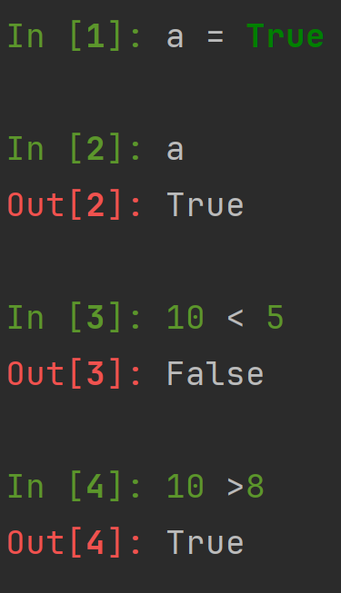
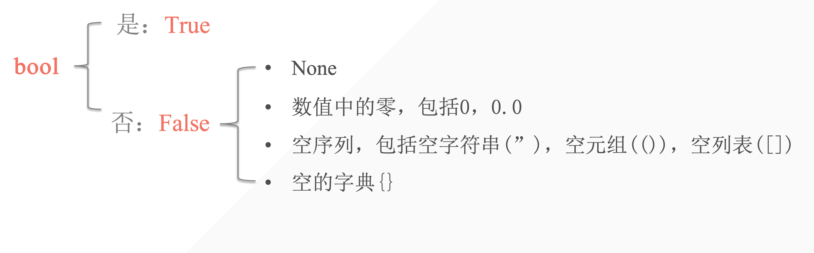
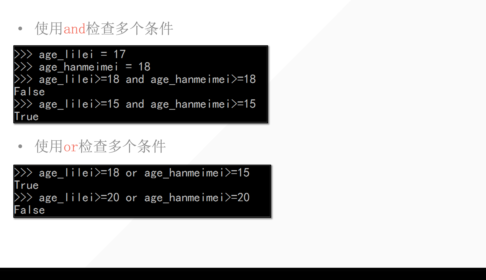

## 1. 简介

意义：表示判断中的是与否。一般用于条件测试中。




两种结果的解释：



- True ：所有的非空

- False：只有强制转换才会是 False ，其余是以上形式。在条件判断中类型为空，也会判断为False。

    


## 2. 逻辑运算符

**用于检测两个或两个以上的条件是否满足。**

逻辑运算只存在于布尔类型中。

| 运算符         | 描述                                                 |
| -------------- | ---------------------------------------------------- |
| and，逻辑“与”  | 当运算符两边的两个运算对象都为 true ，结果为 true    |
| or，逻辑“或”   | 当运算符两边的运算对象其中有一个为 true ，结果为true |
| not， 逻辑“非” | 用于反转运算对象的状态                               |

```python
In [5]: True and False or not False
Out[5]: True

In [6]: True and False or True
Out[6]: True

In [7]: False or False or not False
Out[7]: True
```


## 3. 布尔表达式

| exp         | bool           | value | Return value |
| ----------- | -------------- | ----- | ------------ |
| 3 and 5     | True and True  | True  | 5            |
| 3 or 5      | True or True   | True  | 3            |
| 0 or 5      | False or True  | True  | 5            |
| 3 and not 5 | True and False | False | **False**    |

- 为什么第一行 return 5? ：因为第一个是True不能保证第二个是True，但是返回第二个能说明第一个一定是True。

    

### 3.1 表达式的应用——条件测试

- 检查当前变量是否与一个特定值相等/不相等
- 比较数字的大小
- 检查特定值是否在某序列里


### 3.2 表达式的应用——多条件检查

