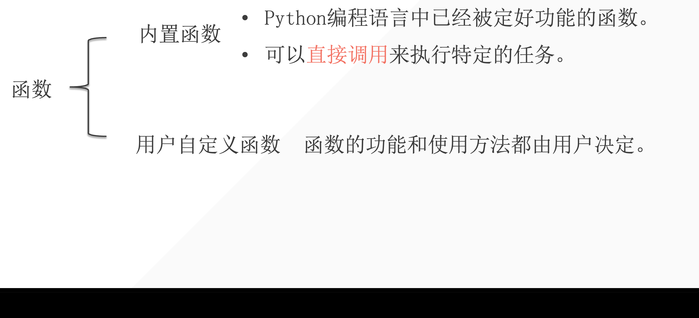
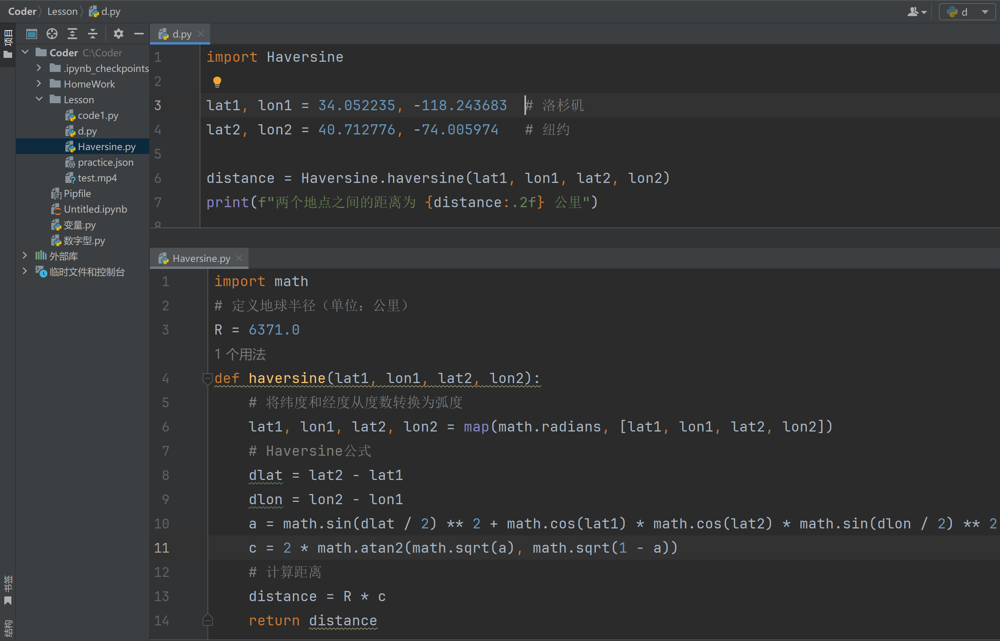
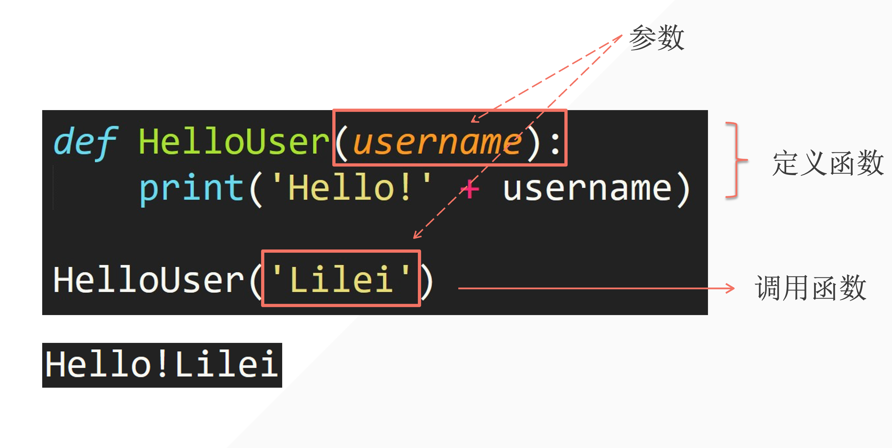

## 1. 前言

### 1.1 函数的定义：

- 一段具有特定功能的、可以重复使用的代码
- 用函数名来表示并通过函数名完成功能调用

### 1.2 使用函数的意义：

- 代码的重复利用；
- 减少程序中的代码重复量，是代码更加容易被理解；
- 让代码更易于维护与更新

### 1.3 函数的优点

通过把一个计算过程写入函数，再不断重复的调用函数，在修改函数代码时只用修改一次便可以影响全局，大大减少了修改代码时的工程量，方便快捷。


### 1.4 分类



#### 1.4.1 常见的内置函数

1. 数据类型强制转换相关函数：

    - `int()`
    - `float()`

    

2. 数字相关函数：

    - `abs()`：返回一个数的绝对值
    - `round()`返回一个浮点数四舍五入后的值

    ```python
    a = abs(-1)
    print(a)
    
    b = int('12')
    c = 13
    print(b+c)
    ```

    

3. 内置库

    除了内置函数以外，Python还有内置的标准函数库。

    当我们把这些额外的函数库导入到我们的程序里时，我们可以用这些函数库中提供的方法。

    访问这些函数时需要以**库名.函数**的方式。

    - 开平方

        ```python
        import math
        
        a = math.sqrt(2)
        print(a)
        ```

    - 随机选取一个数字（整数）

        ```python
        import random
        
        a = random.randint(1,100) # 随机生成一个1~100（包含1和100）的整数
        print(a)
        ```

        


## 2. 用户自定义函数

### 2.1 定义一个函数

> def 是 define 的缩写，表示定义一个函数。

格式：

```python
def 函数名称():
    函数内的语句。
```

**当我们需要这个函数时，直接写“函数名称 + ()” 就可。**

::: warning

函数名称中间不要有空格，可以用下划线代替

:::

### 2.2 适当的使用函数便于协作

有了函数之后可以实现原本不能实现的功能，比如我们写了一个功能很复杂的代码（实现经纬度坐标距离的计算）：

::: code-tabs

@tab 用函数封装起来的代码

```python
import math

# 定义地球半径（单位：公里）
R = 6371.0

def haversine(lat1, lon1, lat2, lon2):
    # 将纬度和经度从度数转换为弧度
    lat1, lon1, lat2, lon2 = map(math.radians, [lat1, lon1, lat2, lon2])
    
    # Haversine公式
    dlat = lat2 - lat1
    dlon = lon2 - lon1
    a = math.sin(dlat / 2)**2 + math.cos(lat1) * math.cos(lat2) * math.sin(dlon / 2)**2
    c = 2 * math.atan2(math.sqrt(a), math.sqrt(1 - a))
    
    # 计算距离
    distance = R * c
    return distance

# 示例：计算洛杉矶到纽约的距离
lat1, lon1 = 34.052235, -118.243683  # 洛杉矶
lat2, lon2 = 40.712776, -74.005974   # 纽约

distance = haversine(lat1, lon1, lat2, lon2)
print(f"两个地点之间的距离为 {distance:.2f} 公里")
```

@tab 不用函数：

```python
import math

# 定义地球半径（单位：公里）
R = 6371.0

# 示例：计算洛杉矶到纽约的距离
lat1, lon1 = 34.052235, -118.243683  # 洛杉矶
lat2, lon2 = 40.712776, -74.005974  # 纽约


# 将纬度和经度从度数转换为弧度
lat1, lon1, lat2, lon2 = map(math.radians, [lat1, lon1, lat2, lon2])

# Haversine公式
dlat = lat2 - lat1
dlon = lon2 - lon1
a = math.sin(dlat / 2) ** 2 + math.cos(lat1) * math.cos(lat2) * math.sin(dlon / 2) ** 2
c = 2 * math.atan2(math.sqrt(a), math.sqrt(1 - a))

    # 计算距离
distance = R * c
print(f"两个地点之间的距离为 {distance:.2f} 公里")
```

:::


使用函数的优点：

如果你要将代码共享给别人，只需要把函数代码保存在文件 `haversine.py`打包好，而别人只需要在 `haversine.py`文件的同路径下创建一个新的文件夹，写入如下代码就可以实现对于函数的调用：

```python
import haversine

lat1, lon1 = 34.052235, -118.243683  # 洛杉矶
lat2, lon2 = 40.712776, -74.005974   # 纽约

distance = haversine(lat1, lon1, lat2, lon2)
print(f"两个地点之间的距离为 {distance:.2f} 公里")
```

完整代码如下：



::: tip

这里是更好地帮助理解函数的作用。

:::


### 2.3 利用参数向函数传递信息

#### 2.3.1 参数调用代码结构



#### 2.3.2 多个参数

```python
def TestGrade(name, grade):
    print(f'{name}的成绩是：{grade}分。')

TestGrade('Lily',99)
```


#### 2.3.3 关键字参数

上面实现了传入多个参数，但如果用户传入的参数位置不对，则导致得到的结果不对或出现报错。

一般发生于：用户不清楚函数具体参数功能或函数参数过多的情况下，则制定关键字参数即可。

1. 参数位置不对的情况

```python
def TestGrade(name, grade):
    print(f'{name}的成绩是：{grade}分。')

TestGrade(99,'Lily')

# output

99的成绩是：Lily分。
```

2. 位置不对的情况下报错

```python
def TestGrade(name, grade):
    print(name + '的成绩是：' + str(grade) + '分。')

TestGrade(99,'Lily')

#output

Traceback (most recent call last):
  File "C:\Coder\Lesson\d.py", line 4, in <module>
    TestGrade(99,'Lily')
  File "C:\Coder\Lesson\d.py", line 2, in TestGrade
    print(name + '的成绩是：' + str(grade) + '分。')
TypeError: unsupported operand type(s) for +: 'int' and 'str'
```


怎么指定关键字让参数的传入不再出错？

==用’=‘符号相连==

```python
def TestGrade(name, grade):
    print(name + '的成绩是：' + str(grade) + '分。')


TestGrade(grade=99, name='Lily')
```


#### 2.3.4 部分关键字参数

如果选择关键词参数指定，则需要指定全部参数。如果只制定一部分参数的话，只能函数前半部分参数可以省略，后半部分不能被省略。

如果指定参数不全则报错：

```python
def TestGrade(name, grade):
    print(name + '的成绩是：' + str(grade) + '分。')


TestGrade(name='李雷', 99)  # 虽然位置是对的，但是没有全部指定是会报错的
```


需要向函数传入多个参数时，只要排在前面的关键词指定一个参数，其后面的所有参数都要被指定。但是其前面的参数指不指定都可以。

通过下面三种情况说明：

```python
def TestGrade(name, grade, classroom):
    print(name + '的成绩是：' + str(grade) + '分。' + '就读于' + classroom + '班。')

TestGrade(name='李雷', grade = 99, classroom = '3')

#output
李雷的成绩是：99分。就读于3班。
```


```python
def TestGrade(name, grade, classroom):
    print(name + '的成绩是：' + str(grade) + '分。' + '就读于' + classroom + '班。')

TestGrade('李雷', grade = 99, classroom = '3')

#output
李雷的成绩是：99分。就读于3班。
```


```python
def TestGrade(name, grade, classroom):
    print(name + '的成绩是：' + str(grade) + '分。' + '就读于' + classroom + '班。')


TestGrade('李雷', grade = 99, '3')

#output
  File "C:\Coder\Lesson\d.py", line 5
    TestGrade('李雷', grade = 99, '3')
                                       ^
SyntaxError: positional argument follows keyword argument
```


### 2.4 返回值——return

在 Python 中，`return`语句用于从函数中返回值并结束函数的执行。他可以返回一个或多个值，或者什么也不返回。在函数的执行过程中，当遇到 `return`语句是，函数将停止执行，并返回特定的值（如果有）。如果函数没有明确使用 `return`语句，函数默认会返回 `None`

#### 2.4.1 语法

```python
def 函数名(参数):
    # 函数体
    return 返回值
```

#### 2.4.2 返回单个值

```python
def add(a, b):
    return a + b

result = add(1, 2)
print(result)
```

在这个例子中，函数 `add`返回两个数的和。当调用 `add(3, 5)`的时候，函数返回 8.

#### 2.4.3 返回多个值

```python
def get_coordinates():
    x = 10
    y = 20
    return x, y

x_coord, y_coord = get_coordinates()
print(x_coord, y_coord)
```

这里， `return` 语句返回了两个值，`x`和 `y`，并将他们分别赋值给 `x_coord`和 `y_coord`

#### 2.4.4 不返回值

```python
def great():
    print("Great")


result = great()
print(result)

#output
Great
None
```

在这个例子中， `great`函数没有 `return`语句，因此它默认返回 `None`。

#### 2.4.5 结束函数执行

```python
def check_number(num):
    if num > 0:
        return 'positive number'
    else:
        return 'negative number'
    print('会不会执行？')

print(check_number(5))
print(check_number(-3))

# output
positive number
negative number
```

我们可以看到，`return`后面的代码都不会被执行。


**总结：** `return`语句可以返回值并结束函数；

- 如果没有指定 `return`，函数会返回 `None`；
- `return`可以返回单个值，多值，甚至什么也不返回。


### 2.5 有无 return 的区别

#### 2.5.1 场景1：函数需要返回计算结果

1. 有 `return`的情况

```python
def add(a, b):
    return a + b

result = add(3, 5)
print(result)
```

- 场景：在需要获取函数计算结果并在后续代码中使用的情况下，必须使用 `return`返回结果。
- 解释：`add`函数返回两个参数的和，调用 `add(3, 5)`返回 8，结果赋值给 `result`，随后可以用于其他操作。

2. 无 `return`的情况

```python
def add_no_return(a, b):
    print(a + b)
    
result = add_no_return(1, 2)
print(result)
```

- 场景：函数只是执行某些操作（例如打印）而不需要返回任何值时，可以不使用 `return`。
- 解释：函数中没有 `return`，因此它执行 `print`后不返回任何值，`result`的值为 `None`


#### 2.5.2 场景2：函数控制流程并根据条件返回值

1. 有 `return`的情况

```python
def check_even_or_odd(num):
    if num % 2 == 0:
        return 'Even'
    return 'Odd'

result = check_even_or_odd(4)
print(result)
```

2. 无`return`的情况

```python
def check_even_or_odd(num):
    if num % 2 == 0:
        print("Even")
    else:
        print('Odd')

result = check_even_or_odd(4)
print(result)
```


#### 2.5.3 复杂逻辑中的提前终止

1. 有 `return`提前终止

    ```python
    def find_first_even(numbers):
        for num in numbers:
            if num % 2 == 0:
                return num
        return None
    
    
    result = find_first_even([1, 2, 3, 4, 5, 6, 7, 8])
    print(result)
    
    # output
    2
    ```

相较于Break，continue，return实现作用会更大。前两个操作对象仅限于当前循环，后者则是直接结束整个函数。


