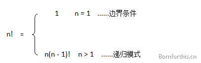

## 1. 递归的定义

### 1.1 图文释义

从前有座山，山里有座庙，庙里有个老和尚，正在给小和尚讲故事！故事是什么呢？『从前有座山，山里有座庙，庙里有个老和尚，正在给小和尚讲故事！故事是什么呢？』……这也许是最经典（口耳相传）的童谣了，充分展现了自然语言的魅力及其无限可能性，可以永远以这种递归的方式继续下去。。。


俄文艺理论家车尔尼雪夫斯基曾说过：
艺术来源于生活，却又高于生活！

生活如此，编程世界亦如此 - 没有生活原形或者现象，何来程序创作的源头和灵感？正因此，Python 中出现了这样一种函数 - 递归函数。

大多数情况下，我们见到的是一个函数调用其他函数。除此之外，==函数还可以自我调用，这种类型的函数被称为递归函数==。

递归的一个视觉效果呈现 - 捧着画框的蒙娜丽莎：


### 1.2 定义和注意事项

递归，在数学和计算科学里，是指在函数定义中调用函数自身的方法。

在使用递归时，需要注意以下几点：

1. 递归是在过程中或函数里调用自身
2. 边界条件：必须有一个明确的递归结束条件，称为递归出口。（确定递归到何时终止，称为递归出口）
3. 递归模式：大问题拆分为小问题，也称为递归体；

::: warning

**注意**：切勿忘记递归出口，避免函数无限调用！

:::


## 2. 典型的算法

### 2.1 阶乘

```bash
n! = 1 x 2 x 3 ... n-2 x n-1
```

也可以用递归的方式定义：

```python
n! = (n-1)! x n
```




其中 `n >= 1`,并且 `0! = 1`

由于简单、清晰、因此常常被做成递归的示例。

**PS** 除阶乘以外，还有很多算法可以用递归处理，例如：斐波那契数列、汉诺塔。

完整代码：

1. 不用递归实现：

    ```python
    def factorial(n):
        fac = 1
        for i in range(1,n+1):
            fac *= i
        return fac
    
    print(factorial(6))
    ```

2. 用递归实现：

    ```python
    def factorial(n):
        if n == 0 or n == 1:
            return 1
        else:
            return n * factorial(n-1)
    
    
    print(factorial(6))
    ```

    理解：

    ```python
    factorial(5)
    5 * factorial(4)
    5 * (4 * factorial(3))
    5 * (4 * (3 * factorial(2)))
    5 * (4 * (3 * (2 * factorial(1))))
    5 * 4 * 3 * 2 * 1
    ```

    

**练习：**

假如这里有 n 个台阶，每次你可以跨 1 个台阶或者 2 个台阶，请问走这 n 个台阶有多少种走法？

```bash
f(n) = f(n-1) + f(n-2)
```

逻辑：

1. 假设第一步走一下，后面要走的步数就是（n - 1)；而假设第一步走两下，后面要走的步数就是（n - 2) 。
2. 第一步走了，开始第二步：同样的情况，第二步走一下，后面要走的步数就是（（n - 1) - 1）或者（（n - 2）- 1）；第二步走两下，后面要走的步数就是（（n - 1) - 2） 或者（（n - 2）- 2）
3. 以此类推，把所有的情况加在一起。


### 2.2 高斯求和：

典型的高斯求和问题，`1+2+3+4+…+99+100`，不使用递归的话，我们可以用循环，这么做：

```python
def sum(n):
    summary = 0
    for i in range(1, n+1)
    summary += i
```

而使用递归：

```python
def solution(n):

    if n == 0:
        return 0
    else:
        return n + solution(n - 1)

print(solution(10))
```

分析一下代码：
● 当 n 小于等于 0 的时候，直接给出和值为 0，这句不能省。
● 当 n 大于 0 时，结果是 n 加上 sum_number(n-1) 。这里的 sum_number(n-1) 又是一次sum_number 函数的调用，不过参数的值变成了 n-1。
● 要得 sum_number(n) 到的值就必须等待 sum_number(n-1) 的值被计算出来，同样要得到sum_number(n-1) 的值必须等待 sum_number(n-2) 的值，如此一路推算下去，直到sum_number(0)，因为 if 语句的存在，它不需要等待 sum_number(-1) 的计算了，而是直接给出结果 0。然后程序一路返回，直到回到最初的 sum_number(n)，并给出最终结果。


## 2.3 斐波那契数列

斐波拉契数列，是这样的一个数列：`0、1、1、2、3、5、8、13、21、......`。

斐波拉契数列的核心思想是：从第三项起，每一项都等于前两项的和，即 `F(N) = F(N - 1) + F(N - 2) (N >= 2)` 并且规定 `F(0) = 0`，`F(1) = 1`

**要求：**利用递归算法获得指定项的斐波拉契数列。

```python
def Fibonacci(n):
    if n == 0:
        return 0
    elif n == 1:
        return 1
    else:
        return Fibonacci(n-1) + Fibonacci(n-2)

if __name__ == '__main__':
    lst = []
    n = 100
    for i in range(n+1):
        lst.append(Fibonacci(i))
    print(lst)
```


### 2.4 递归的优缺点：

- 优点
    1. 递归使代码更简洁优雅
    2. 可以递归把复杂的任务拆成简单的子问题
    3. 使用递归比一些嵌套迭代更容易
    4. 总之：递归函数的优点是定义简单，逻辑清晰；理论上所有递归函数都可以写成循环的方式，只是过于复杂，逻辑不如递归清晰。
- 缺点
    1. 递归的逻辑很难调试、跟进。
    2. 递归的调用代价高昂（效率低），因为会占用大量的内存和时间。

